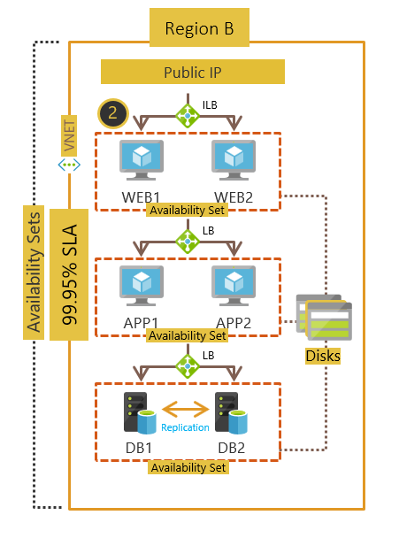
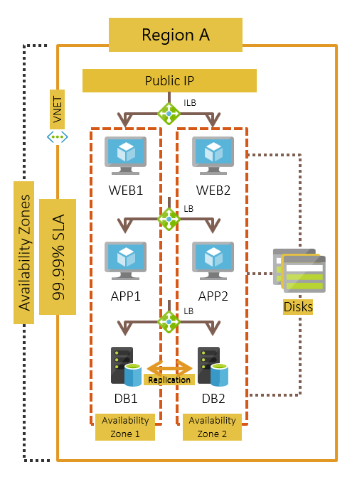
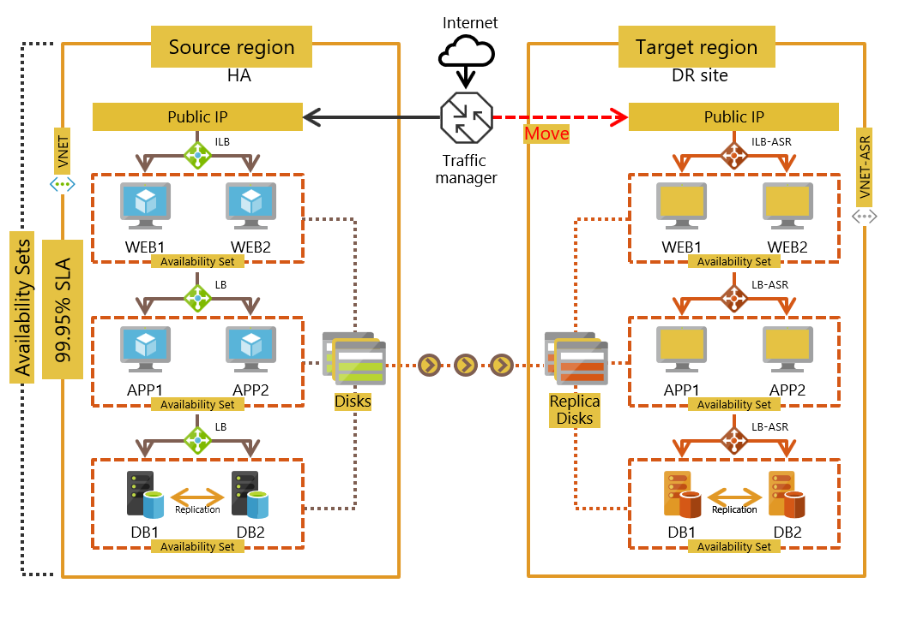
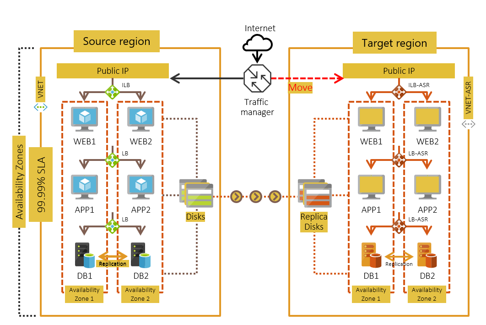
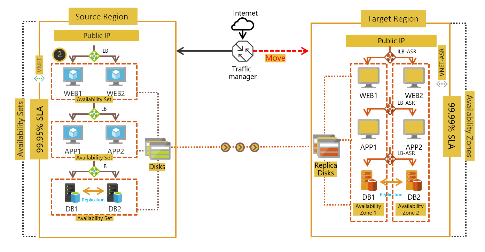

# Move Azure VMs to another region

Azure grows along with the customer base and adds support for new regions with rising demands. New capabilities are also added monthly across services. You may want to move your virtual machines (VMs) to a different region or into Availability Zones to increase availability. 

This document describes different scenarios in which you'd want to move your VMs. It also describes how to configure the architecture in the target region to achieve higher availability.
> [!div class="checklist"]

> * [Why move Azure VMs](#why-would-you-move-azure-vms)
> * [How to move Azure VMs](#how-to-move-azure-vms)
> * [Typical architectures](#typical-architectures-for-a-multi-tier-deployment)
> * [Move VMs as is to a target region](#move-azure-vms-to-another-region)
> * [Move VMs to increase availability](#move-vms-to-increase-availability)

## Why move Azure VMs

You might move VMs for the following reasons:

- You already deployed in one region, and a new region support was added which is closer to the end users of your application or service. In this scenario, you'd want to move your VMs as is to the new region to reduce latency. Use the same approach if you want to consolidate subscriptions or if there are governance or organization rules that require you to move.
- Your VM was deployed as a single instance VM or as part of an availability set. If you want to increase the availability SLAs, you can move your VMs into an Availability Zone.

## How to move Azure VMs

Moving VMs involves the following steps:

1. Verify prerequisites.
2. Prepare the source VMs.
3. Prepare the target region.
4. Copy data to the target region. Use Azure Site Recovery replication technology to copy data from the source VM to the target region.
5. Test the configuration. After the replication is complete, test the configuration by performing a test failover to a non-production network.
6. Perform the move.
7. Discard the resources in the source region.

> [!NOTE]
> Details about these steps are provided in the following sections.

> [!IMPORTANT]
> Currently, Azure Site Recovery supports moving VMs from one region to another but doesn't support moving within a region.

## Typical architectures for a multi-tier deployment

This section describes the most common deployment architectures for a multi-tier application in Azure. The example is a three-tiered application with a public IP. Each of the tiers (web, application, and database) has two VMs each, and they are connected by an Azure Load Balancer to the other tiers. The database tier has SQL Always ON replication between the VMs for high availability.

* **Single instance VMs deployed across various tiers**: Each VM in a tier is configured as a single instance VM and is connected by load balancers to the other tiers. This configuration is the simplest  to adopt.

       
* **VMs in each tier deployed across availability set**: Each VM in a tier is configured in an availability set. [Availability sets](https://docs.microsoft.com/azure/virtual-machines/windows/tutorial-availability-sets) ensure that the VMs you deploy on Azure are distributed across multiple isolated hardware nodes in a cluster. This ensures that if a hardware or software failure within Azure happens, only a subset of your VMs are impacted, and your overall solution remains available and operational.
   
      

* **VMs in each tier deployed across Availability Zone**: Each VM in a tier is configured across [Availability Zones](https://docs.microsoft.com/azure/availability-zones/az-overview). An Availability Zone in an Azure region is a combination of a fault domain and an update domain. For example, if you create three or more VMs across three zones in an Azure region, your VMs are effectively distributed across three fault domains and three update domains. The Azure platform recognizes this distribution across update domains to make sure that VMs in different zones are not updated at the same time.

      

 ## Move VMs as is to a target region

Based on the [architectures](#typical-architectures-for-a-multi-tier-deployment) mentioned earlier, here's what the deployments will look like after you perform the move as is to the target region.

* **Single instance VMs deployed across various tiers** 

     

* **VMs in each tier deployed across availability sets**

     

* **VMs in each tier deployed across Availability Zones**
      

     

## Move VMs to increase availability

* **Single instance VMs deployed across various tiers**

     

* **VMs in each tier deployed across availability sets**: You can configure your VMs in an availability set into separate Availability Zones when you enable replication for your VM by using Azure Site Recovery. The SLA for availability will be 99.9% after you complete the move operation.

     

## Next steps

> [!div class="nextstepaction"]
> * [Move Azure VMs to another region](azure-to-azure-tutorial-migrate.md)

> * [Move Azure VMs into Availability Zones](move-azure-VMs-AVset-Azone.md)

