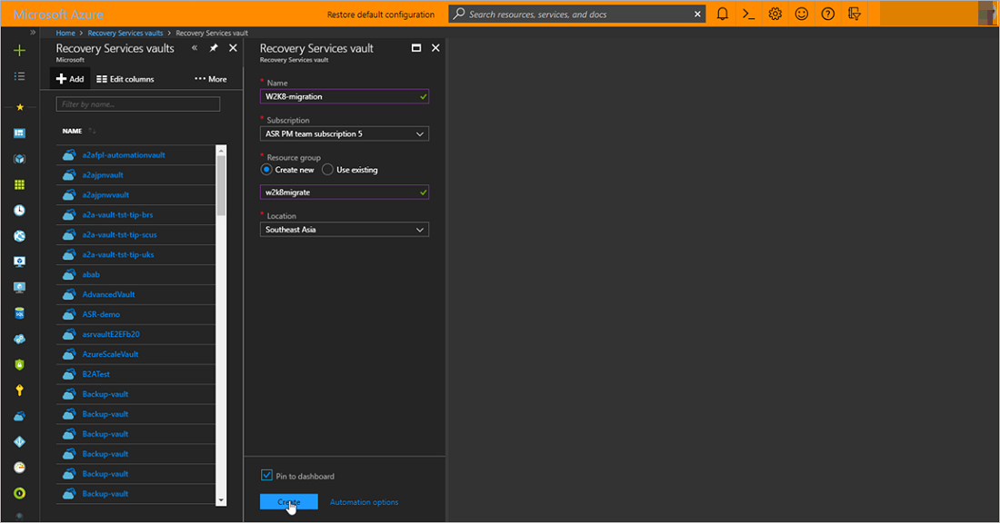
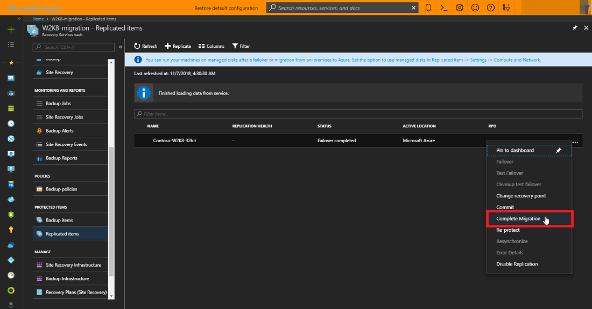

# Migrate servers running Windows Server 2008, 2008 R2 to Azure

This tutorial shows you how to migrate on-premises servers running Windows Server 2008 or 2008 R2 to Azure using Azure Site Recovery. In this tutorial, you learn how to:

> [!div class="checklist"]
> * Prepare your on-premises environment for migration
> * Set up the target environment
> * Set up a replication policy
> * Enable replication
> * Run a test migration to make sure everything's working as expected
> * Failover to Azure and complete the migration

Limitations and known issues while migrating are listed in the last section of this tutorial.

## Supported Operating Systems and environments

|Operating System  | On-premise environment  |
|---------|---------|
|Windows Server 2008 SP2 - 32 bit and 64 bit(IA-32 and x86-64) - Standard - Enterprise - Datacenter   |     VMware VMs, Hyper-V VMs, and Physical Servers    |
|Windows Server 2008 R2 SP1 - 64 bit - Standard - Enterprise - Datacenter     |     VMware VMs, Hyper-V VMs, and Physical Servers|

> [!WARNING]
> - Migration of servers running Server Core is not supported.
> - Ensure that you have the latest service pack and Windows updates installed before migrating.

## Prerequisites

Before you start, it's helpful to review the Azure Site Recovery architecture for [VMware and Physical server migration](vmware-azure-architecture.md) or [Hyper-V virtual machine migration](hyper-v-azure-architecture.md) 

To migrate Hyper-V virtual machines running Windows Server 2008 or Windows Server 2008 R2, follow the steps in the [migrate on-premises machines to Azure](migrate-tutorial-on-premises-azure.md) tutorial.

The rest of this tutorial shows you how you can migrate on-premises VMware virtual machines and Physical servers running Windows Server 2008 or 2008 R2.

Before you get started, perform the following tasks to prepare the Azure subscription and on-premises VMware/Physical environment:

1. [Prepare Azure](tutorial-prepare-azure.md)
2. Prepare on-premises [VMware](vmware-azure-tutorial-prepare-on-premises.md)

## Create a Recovery Services vault

1. Sign in to the [Azure portal](https://portal.azure.com) > **Recovery Services**.
2. Click **Create a resource** > **Monitoring & Management** > **Backup and Site Recovery**.
3. In **Name**, specify the friendly name **W2K8-migration**. If you have more than one
   subscription, select the appropriate one.
4. Create a resource group **w2k8migrate**.
5. Specify an Azure region. To check supported regions, see geographic availability in [Azure Site Recovery Pricing Details](https://azure.microsoft.com/pricing/details/site-recovery/).
6. To quickly access the vault from the dashboard, click **Pin to dashboard** and then click **Create**.

   

The new vault is added to the **Dashboard** under **All resources**, and on the main **Recovery Services vaults** page.

## Prepare your on-premises environment for migration

- Download the Configuration Server installer (Unified Setup) from [https://aka.ms/asr-w2k8-migration-setup](https://aka.ms/asr-w2k8-migration-setup)
- [Set up](physical-azure-disaster-recovery.md#set-up-the-source-environment) the source environment using the installer file downloaded in the previous step.

> [!IMPORTANT]
> Ensure that you use the setup file downloaded in the first step above to install and register the Configuration Server. Do not download the setup file from the Azure portal. The setup file available at [https://aka.ms/asr-w2k8-migration-setup](https://aka.ms/asr-w2k8-migration-setup) is the only version that supports Windows Server 2008 migration.
>
> You cannot use an existing Configuration Server to migrate machines running Windows Server 2008. You'll need to setup a new Configuration Server using the link provided above.

 

## Set up the target environment

Select and verify target resources.

1. Click **Prepare infrastructure** > **Target**, and select the Azure subscription you want to use.
2. Specify the Resource Manager deployment model.
3. Site Recovery checks that you have one or more compatible Azure storage accounts and networks.

## Set up a replication policy

1. To create a new replication policy, click **Site Recovery infrastructure** > **Replication Policies** > **+Replication Policy**.
2. In **Create replication policy**, specify a policy name.
3. In **RPO threshold**, specify the recovery point objective (RPO) limit. An alert is generated if the replication RPO exceeds this limit.
4. In **Recovery point retention**, specify how long (in hours) the retention window is for each recovery point. Replicated VMs can be recovered to any point in a window. Up to 24 hours retention is supported for machines replicated to premium storage, and 72 hours for standard storage.
5. In **App-consistent snapshot frequency**, specify **Off**. Click **OK** to create the policy.

The policy is automatically associated with the configuration server.

> [!WARNING]
> Ensure that you specify **OFF** in the App-consistent snapshot frequency setting of the replication policy. Only crash-consistent recovery points are supported while replicating servers running Windows Server 2008. Specifiying any other value for the App-consistent snapshot frequency will result in false alerts by turning replication health of the server critical due to lack of App-consistent recovery points.

   

## Enable replication

[Enable replication](physical-azure-disaster-recovery.md#enable-replication) for the Windows Server 2008 SP2 / Windows Server 2008 R2 SP1 server to be migrated.

   

## Run a test migration

You can perform a test failover of replicating servers after initial replication completes and the server status turns to **Protected**.

Run a [test failover](tutorial-dr-drill-azure.md) to Azure, to make sure everything's working as expected.

   

## Migrate to Azure

Run a failover for the machines you want to migrate.

1. In **Settings** > **Replicated items** click the machine > **Failover**.
2. In **Failover** select a **Recovery Point** to fail over to. Select the latest recovery point.
3. Select **Shut down machine before beginning failover**. Site Recovery will attempt to shut down the server before triggering the failover. Failover continues even if shutdown fails. You can follow the failover progress on the **Jobs** page.
4. Check that the Azure VM appears in Azure as expected.
5. In **Replicated items**, right-click the VM > **Complete Migration**. This finishes the migration process, stops replication for the VM, and stops Site Recovery billing for the VM.

   

> [!WARNING]
> **Don't cancel a failover in progress**: VM replication is stopped before failover starts. If you cancel a failover in progress, failover stops, but the VM won't replicate again.

## Limitations and known issues

- The Configuration Server, additional process servers, and mobility service used to migrate Windows Server 2008 SP2 servers should be running version 9.18.0.1 of the Azure Site Recovery software. The unified setup for version 9.18.0.1 of the Configuration Server and process server can be downloaded from [https://aka.ms/asr-w2k8-migration-setup](https://aka.ms/asr-w2k8-migration-setup).

- An existing Configuration Server or process server cannot be used to migrate servers running Windows Server 2008 SP2. A new Configuration Server should be provisioned with version 9.18.0.1 of the Azure Site Recovery software. This Configuration Server should only be used for migration of Windows servers to Azure.

- Application consistent recovery points and the multi-VM consistency feature are not supported for replication of servers running Windows Server 2008 SP2. Windows Server 2008 SP2 servers should be migrated to a crash consistent recovery point. Crash consistent recovery points are generated every 5 minutes by default. Using a replication policy with a configured application consistent snapshot frequency will cause replication health to turn critical due to the lack of application consistent recovery points. To avoid false positives, set the application-consistent snapshot frequency in the replication policy to "Off".

- The servers being migrated should have .NET Framework 3.5 Service Pack 1 for the mobility service to work.

- Dynamic disks in a mirrored configuration may be Offline or be shown missing on failed over VMs, and the mirrored set status marked as "Failed redundancy". You can fix the issue by manually reactivating the disks from diskmgmt.msc

- The servers being migrated should have the vmstorfl.sys driver. Failover may fail if the driver is not present in the server being migrated. 
  > [!TIP]
  >Check if the driver is present at "C:\Windows\system32\drivers\vmstorfl.sys" . If the driver is not found, you can workaround the issue by creating a dummy file in place. 
  >
  > Open command prompt (run > cmd) and run the following: "copy nul c:\Windows\system32\drivers\vmstorfl.sys"

