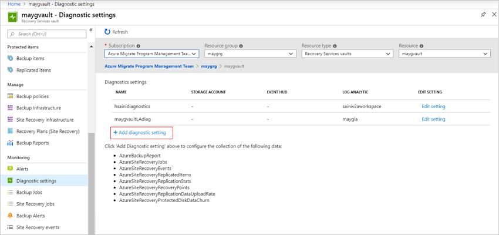
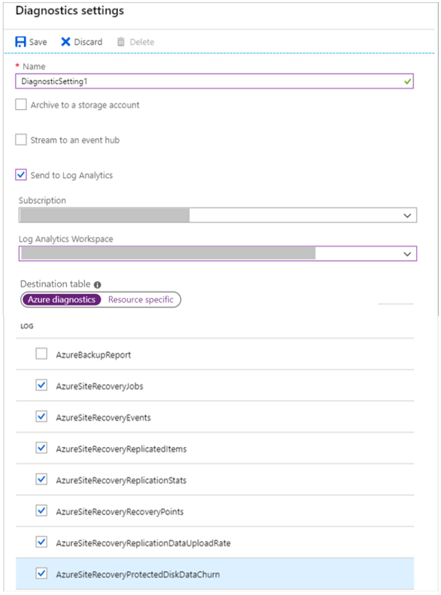

# Monitor Site Recovery with Azure Monitor Logs

This article describes how to monitor machines protected by Azure [Site Recovery](site-recovery-overview.md) using [Azure Monitor logs](../azure-monitor/platform/data-platform-logs.md).

Azure Monitor Logs provide a log data platform that collects activity and diagnostic logs, along with other monitoring data. You use [Log Analytics](../azure-monitor/log-query/log-query-overview.md) to write and test log queries, and to interactively analyze log data. After analyzing log data, you can visualize and query log results, and configure alerts to take actions based on the query results.

For Site Recovery, you can Azure Monitor Logs to help you do the following:

- Monitor Site Recovery, including replication health and the health of protected items, test failover status, Site Recovery events, and disk metrics.
- Set up alerts based on monitoring results.


## Before you start

Before you set up Azure Monitor Logs with Site Recovery, you should have the following in place:

- At least one machine protected in a Recovery Services vault.
- A Log Analytics workspace that can store the Site Recovery logs. [Learn about](../azure-monitor/learn/quick-create-workspace.md) setting up a workspace.
- A basic understanding of how to write, run, and analyze log queries in Log Analytics. [Learn more](../azure-monitor/log-query/get-started-portal.md).

We recommend that you review [common monitoring questions](monitoring-common-questions.md) before you start.

## Configure Site Recovery to send logs

1. In the vault, click **Diagnostic settings** > **Add diagnostic setting**.

    

2. In **Diagnostic settings**, specify a name for log action, and select **Send to Log Analytics**.

    
3. Select the Azure Monitor Logs subscription, and the Log Analytics workspace.
4. From the log list, select all the logs with the prefix **AzureSiteRecovery**. Then click **OK**.

    

The Site Recovery logs start to feed into a table **AzureDiagnostics** in the selected workspace.


## Query the logs - examples

You retrieve data from logs using log queries written with the [Kusto query language](../azure-monitor/log-query/get-started-queries.md). Here are a few examples of common queries you might use for Site Recovery monitoring.

> [!NOTE]
> Some of the examples use **replicationProviderName_s** set to **A2A**. This retrieves Azure VMs that are replicated to a secondary Azure region using Site Recovery. In these examples, you can replace **A2A** with **InMageAzureV2** if you want to retrieve on-premises VMware VMs or physical servers that are replicated to Azure using Site Recovery.


### Query replication health

This query plots a pie chart for current replication health of all protected Azure VMs, broken down into three states: Normal, Warning, or Critical.

```
AzureDiagnostics  
| where replicationProviderName_s == "A2A"   
| where isnotempty(name_s) and isnotnull(name_s)  
| summarize hint.strategy=partitioned arg_max(TimeGenerated, *) by name_s  
| project name_s , replicationHealth_s  
| summarize count() by replicationHealth_s  
| render piechart   
```
### Query Mobility service version

This query plots a pie chart of Azure VMs replicated with Site Recovery, broken down into the versions of the Mobility agent that they're running.

```
AzureDiagnostics  
| where replicationProviderName_s == "A2A"   
| where isnotempty(name_s) and isnotnull(name_s)  
| summarize hint.strategy=partitioned arg_max(TimeGenerated, *) by name_s  
| project name_s , agentVersion_s  
| summarize count() by agentVersion_s  
| render piechart 
```

### Query RPO

This query plots a bar chart of Azure VMs replicated with Site Recovery, broken down by recovery point objectives (RPO): Less than 15 minutes, between 15-30 minutes, more than 30 minutes.

```
| where replicationProviderName_s == "A2A"   
| where isnotempty(name_s) and isnotnull(name_s)  
| extend RPO = case(rpoInSeconds_d <= 900, "<15Min",   
rpoInSeconds_d <= 1800, "15-30Min",   
">30Min")  
| summarize hint.strategy=partitioned arg_max(TimeGenerated, *) by name_s  
| project name_s , RPO  
| summarize Count = count() by RPO  
| render barchart 
```

### Query Site Recovery jobs

This query retrieves all Site Recovery jobs (for all disaster recovery scenarios), triggered in the last 72 hours, and their completion state.

```
AzureDiagnostics   
| where Category == "AzureSiteRecoveryEvents"   
| where TimeGenerated >= ago(72h)   
| project AffectedObject=affectedResourceName_s , VaultName = Resource, Description_s = healthErrors_s , Severity = Level  
```

### Query test failover health

This query plots a pie chart for the test failover health for Azure VMs replicated with Site Recovery.

```
AzureDiagnostics  
| where replicationProviderName_s == "A2A"   
| where isnotempty(name_s) and isnotnull(name_s)  
| where isnotempty(failoverHealth_s) and isnotnull(failoverHealth_s)  
| summarize hint.strategy=partitioned arg_max(TimeGenerated, *) by name_s  
| project name_s , Resource, failoverHealth_s  
| summarize count() by failoverHealth_s  
| render piechart 
```

### Query test failover status
This query plots a table for the test failover status for Azure VMs replicated with Site Recovery.

```
AzureDiagnostics   
| where replicationProviderName_s == "A2A"   
| where isnotempty(name_s) and isnotnull(name_s)   
| where isnotempty(failoverHealth_s) and isnotnull(failoverHealth_s)   
| summarize hint.strategy=partitioned arg_max(TimeGenerated, *) by name_s   
| project VirtualMachine = name_s , VaultName = Resource , TestFailoverStatus = failoverHealth_s 
```

### Query machine RPO

This query plots a trend graph that tracks the RPO for a specific Azure VM (ContosoVM123) for the last 72 hours.

```
AzureDiagnostics   
| where replicationProviderName_s == "A2A"   
| where TimeGenerated > ago(72h)  
| where isnotempty(name_s) and isnotnull(name_s)   
| where name_s == "ContosoVM123"  
| project TimeGenerated, name_s , RPO_in_seconds = rpoInSeconds_d   
| render timechart 
```

### Query data change for a VM

This query plots a trend graph that tracks the data change and upload rate for a specific Azure VM (ContosoVM123). This information is only available for Azure VMs replicated to a secondary Azure region.

```
AzureDiagnostics   
| where Category in ("AzureSiteRecoveryProtectedDiskDataChurn", "AzureSiteRecoveryReplicationDataUploadRate")   
| extend CategoryS = case(Category contains "Churn", "DataChurn",   
Category contains "Upload", "UploadRate", "none")  
| extend InstanceWithType=strcat(CategoryS, "_", InstanceName_s)   
| where TimeGenerated > ago(24h)   
| where InstanceName_s startswith "ContosoVM123"   
| project TimeGenerated , InstanceWithType , Churn_MBps = todouble(Value_s)/1048576   
| render timechart  
```

### Query Azure to Azure disaster recovery

This query plots a summary table for Azure VMs being replicated using Site Recovery, to a secondary Azure region.  It shows VM name, replication and protection status, RPO, test failover status, Mobility agent version, any active replication errors, and the source location.

```
AzureDiagnostics 
| where replicationProviderName_s == "A2A"   
| where isnotempty(name_s) and isnotnull(name_s)   
| summarize hint.strategy=partitioned arg_max(TimeGenerated, *) by name_s   
| project VirtualMachine = name_s , Vault = Resource , ReplicationHealth = replicationHealth_s, Status = protectionState_s, RPO_in_seconds = rpoInSeconds_d, TestFailoverStatus = failoverHealth_s, AgentVersion = agentVersion_s, ReplicationError = replicationHealthErrors_s, SourceLocation = primaryFabricName_s 
```

### Query on-premises to Azure disaster recovery (VMware/physical servers)

This query plots a summary table for VMware VMs and physical servers being replicated to Azure using Site Recovery.  It shows  machine name, replication and protection status, RPO, test failover status, Mobility agent version, any active replication errors, and the relevant process server.

```
AzureDiagnostics  
| where replicationProviderName_s == "InMageAzureV2"   
| where isnotempty(name_s) and isnotnull(name_s)   
| summarize hint.strategy=partitioned arg_max(TimeGenerated, *) by name_s   
| project VirtualMachine = name_s , Vault = Resource , ReplicationHealth = replicationHealth_s, Status = protectionState_s, RPO_in_seconds = rpoInSeconds_d, TestFailoverStatus = failoverHealth_s, AgentVersion = agentVersion_s, ReplicationError = replicationHealthErrors_s, ProcessServer = processServerName_g  
```

## Set up alerts - examples

You can set up Site Recovery alerts based on Azure Monitor data. [Learn more](../azure-monitor/platform/alerts-log#managing-log-alerts-from-the-azure-portal.md) about setting up log alerts on analytics queries. 

> [!NOTE]
> Some of the examples use **replicationProviderName_s** set to **A2A**. This sets alerts for Azure VMs that are replicated to a secondary Azure region using Site Recovery. In these examples, you can replace **A2A** with **InMageAzureV2** if you want to set alerts for on-premises VMware VMs or physical servers that are replicated to Azure using Site Recovery.

### Multiple machines in a critical state

Set up an alert if more than 20 replicated Azure VMs go into a Critical state, and set the alert threshold to 20.

```AzureDiagnostics   
| where replicationProviderName_s == "A2A"   
| where replicationHealth_s == "Critical"  
| where isnotempty(name_s) and isnotnull(name_s)   
| summarize hint.strategy=partitioned arg_max(TimeGenerated, *) by name_s   
| summarize count() 
```

### Single machine in a critical state

Set up an alert if a specific replicated Azure VM goes into a Critical state, and set the alert threshold for the VM to one.

```
AzureDiagnostics   
| where replicationProviderName_s == "A2A"   
| where replicationHealth_s == "Critical"  
| where name_s == "ContosoVM123"  
| where isnotempty(name_s) and isnotnull(name_s)   
| summarize hint.strategy=partitioned arg_max(TimeGenerated, *) by name_s   
| summarize count()  
```

### Multiple machines exceed RPO

Set up an alert if the RPO for more than 20 Azure VMs is more than 30 minutes, and set the alert threshold to 20.
```
AzureDiagnostics   
| where replicationProviderName_s == "A2A"   
| where isnotempty(name_s) and isnotnull(name_s)   
| where rpoInSeconds_d > 1800  
| summarize hint.strategy=partitioned arg_max(TimeGenerated, *) by name_s   
| project name_s , rpoInSeconds_d   
| summarize count()  
```
 
### Single machine exceeds RPO

Set up an alert if the RPO for a single Azure Ms is more than 30 minutes, and set the alert threshold to one.

```
AzureDiagnostics   
| where replicationProviderName_s == "A2A"   
| where isnotempty(name_s) and isnotnull(name_s)   
| where name_s == "ContosoVM123"  
| where rpoInSeconds_d > 1800  
| summarize hint.strategy=partitioned arg_max(TimeGenerated, *) by name_s   
| project name_s , rpoInSeconds_d   
| summarize count()  
```

### Test failover for multiple machines exceeds 90 days

Set up an alert if the last test failover date for more than 20 VMs exceeds 90 days. Set the alert threshold to 20.

```
AzureDiagnostics  
| where replicationProviderName_s == "A2A"   
| where Category == "AzureSiteRecoveryReplicatedItems"  
| where isnotempty(name_s) and isnotnull(name_s)   
| where lastSuccessfulTestFailoverTime_t <= ago(90d)   
| summarize hint.strategy=partitioned arg_max(TimeGenerated, *) by name_s   
| summarize count()  
```

### Test failover for single machine exceeds 90 days

Set up an alert if the last test failover date for a specified Azure VM is older than 90 days. Set the threshold value to one.

```
AzureDiagnostics  
| where replicationProviderName_s == "A2A"   
| where Category == "AzureSiteRecoveryReplicatedItems"  
| where isnotempty(name_s) and isnotnull(name_s)   
| where lastSuccessfulTestFailoverTime_t <= ago(90d)   
| where name_s == "ContosoVM123"  
| summarize hint.strategy=partitioned arg_max(TimeGenerated, *) by name_s   
| summarize count()  
```

### Reprotect job fails

Set up an alert if any reprotect job (for all Site Recovery scenarios) fails during the last day. Set alert frequency to one day.

```
AzureDiagnostics   
| where Category == "AzureSiteRecoveryJobs"   
| where OperationName == "Reprotect"  
| where ResultType == "Failed"  
| where TimeGenerated >= ago(1d)     
| summarize count()  
```


## Next steps

[Learn about](site-recovery-monitor-and-troubleshoot.md) inbuilt Site Recovery monitoring.
