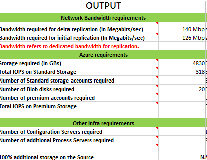
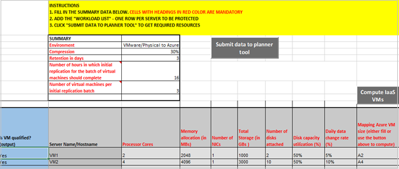
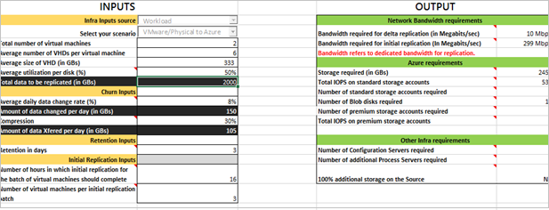

# Plan capacity for protecting Hyper-V VMs with Site Recovery

A new enhanced version of [Azure Site Recovery Deployment Planner for Hyper-V to Azure deployment](site-recovery-hyper-v-deployment-planner.md) is now available. It replaces the old tool. Use the new tool for your deployment planning.
The tool provides the following guidelines:

* VM eligibility assessment, based on the number of disks, disk size, IOPS, churn, and a few VM characteristics
* Network bandwidth need versus RPO assessment
* Azure infrastructure requirements
* On-premises infrastructure requirements
* Initial replication batching guidance
* Estimated total disaster recovery cost to Azure

Azure Site Recovery Capacity Planner helps you determine your capacity requirements when you replicate Hyper-V VMs with Azure Site Recovery.

Use Site Recovery Capacity Planner to analyze your source environment and workloads. It helps you estimate bandwidth needs, the server resources you need for the source location, and the resources (such as VMs and storage) you need in the target location.

You can run the tool in two modes:

* **Quick planning**: Provides network and server projections based on an average number of VMs, disks, storage, and change rate.
* **Detailed planning**: Provides details of each workload at the VM level. Analyze VM compatibility and get network and server projections.

## Before you start

* Gather information about your environment, including VMs, disks per VM, storage per disk.
* Identify your daily change (churn) rate for replicated data. Download the [Hyper-V capacity planning tool](https://www.microsoft.com/download/details.aspx?id=39057) to get the change rate. [Learn more](site-recovery-capacity-planning-for-hyper-v-replication.md) about this tool. We recommend that you run this tool over a week to capture averages.

## Run the Quick Planner
1. Download and open [Site Recovery Capacity Planner](http://aka.ms/asr-capacity-planner-excel). You need to run macros. When you're prompted, make selections to enable editing and content.

2. In the **Select a planner type** list box, select **Quick Planner**.

   

3. On the **Capacity Planner** worksheet, enter the required information. Fill in all the fields circled in red in the following screenshot:

   a. In **Select your scenario**, choose **Hyper-V to Azure** or **VMware/Physical to Azure**.

   b. In **Average daily data change rate (%)**, enter the information you gather by using the [Hyper-V capacity planning tool](site-recovery-capacity-planning-for-hyper-v-replication.md) or [Site Recovery Deployment Planner](./site-recovery-deployment-planner.md).

   c. The **Compression** setting isn't used when you replicate Hyper-V VMs to Azure. For compression, use a third-party appliance, such as Riverbed.

   d. In **Retention in days**, specify in days how long to retain replicas.

   e. In **Number of hours in which initial replication for the batch of virtual machines should complete** and **Number of virtual machines per initial replication batch**, enter settings that are used to compute initial replication requirements. When Site Recovery is deployed, the entire initial data set is uploaded.

   

4. After you enter the values for the source environment, the displayed output includes:

   * **Bandwidth required for delta replication (in Megabits/sec)**: Network bandwidth for delta replication is calculated on the average daily data change rate.
   * **Bandwidth required for initial replication (in Megabits/sec)**: Network bandwidth for initial replication is calculated on the initial replication values you enter.
   * **Storage required (in GBs)**: The total Azure storage required.
   * **Total IOPS on Standard Storage**: The number is calculated based on the 8K IOPS unit size on the total standard storage accounts. For the Quick Planner, the number is calculated based on all the source VM disks and the daily data change rate. For the Detailed Planner, the number is calculated based on the total number of VMs that are mapped to standard Azure VMs and the data change rate on those VMs.
   * **Number of Standard storage accounts required**: The total number of standard storage accounts needed to protect the VMs. A standard storage account can hold up to 20,000 IOPS across all the VMs in standard storage. A maximum of 500 IOPS is supported per disk.
   * **Number of Blob disks required**: The number of disks that are created on Azure storage.
   * **Number of premium accounts required**: The total number of premium storage accounts needed to protect the VMs. A source VM with high IOPS (greater than 20,000) needs a premium storage account. A premium storage account can hold up to 80,000 IOPS.
   * **Total IOPS on Premium Storage**: The number is calculated based on the 256K IOPS unit size on the total premium storage accounts. For the Quick Planner, the number is calculated based on all the source VM disks and the daily data change rate. For the Detailed Planner, the number is calculated based on the total number of VMs that are mapped to premium Azure VMs (DS and GS series) and the data change rate on those VMs.
   * **Number of Configuration Servers required**: Shows how many configuration servers are required for the deployment.
   * **Number of additional Process Servers required**: Shows whether additional process servers are required, in addition to the process server that's running on the configuration server by default.
   * **100% additional storage on the Source**: Shows whether additional storage is required in the source location.

      

## Run the Detailed Planner

1. Download and open [Site Recovery Capacity Planner](http://aka.ms/asr-capacity-planner-excel). You need to run macros. When you're prompted, make selections to enable editing and content.

2. In **Select a planner type**, select **Detailed Planner** from the list box.

   

3. On the **Workload Qualification** worksheet, enter the required information. You must fill in all the marked fields.

   a. In **Processor Cores**, specify the total number of cores on a source server.

   b. In **Memory allocation (in MBs)**, specify the RAM size of a source server.

   c. In **Number of NICs**, specify the number of network adapters on a source server.

   d. In **Total Storage (in GB)**, specify the total size of the VM storage. For example, if the source server has three disks with 500 GB each, total storage size is 1,500 GB.

   e. In **Number of disks attached**, specify the total number of disks of a source server.

   f. In **Disk capacity utilization (%)**, specify the average utilization.

   g. In **Daily data change rate (%)**, specify the daily data change rate of a source server.

   h. In **Mapping Azure VM size**, enter the Azure VM size that you want to map. If you don't want to do this manually, select **Compute IaaS VMs**. If you input a manual setting and then select **Compute IaaS VMs**, the manual setting might be overwritten. The compute process automatically identifies the best match on Azure VM size.

   

4. If you select **Compute IaaS VMs**, here's what it does:

   * Validates the mandatory inputs.
   * Calculates IOPS and suggests the best Azure VM size match for each VM that's eligible for replication to Azure. If an appropriate size Azure VM can't be detected, an error displays. For example, if the number of disks attached is 65, an error displays because the highest size for an Azure VM is 64.
   * Suggests a storage account that can be used for an Azure VM.
   * Calculates the total number of standard storage accounts and premium storage accounts required for the workload. Scroll down to view the Azure storage type and the storage account that can be used for a source server.
   * Completes and sorts the rest of the table based on the required storage type (standard or premium) assigned for a VM and the number of disks attached. For all VMs that meet the requirements for Azure, the column **Is VM qualified?** shows **Yes**. If a VM can't be backed up to Azure, an error displays.

Columns AA to AE are output and provide information for each VM.

### Example
As an example, for six VMs with the values shown in the table, the tool calculates and assigns the best Azure VM match and the Azure storage requirements.

* In the example output, note the following:

  * The first column is a validation column for the VMs, disks, and churn.
  * Two standard storage accounts and one premium storage account are needed for five VMs.
  * VM3 doesn't qualify for protection because one or more disks are more than 1 TB.
  * VM1 and VM2 can use the first standard storage account
  * VM4 can use the second standard storage account.
  * VM5 and VM6 need a premium storage account, and both can use a single account.

    > [!NOTE]
    > IOPS on standard and premium storage are calculated at the VM level and not at disk level. A standard VM can handle up to 500 IOPS per disk. If IOPS for a disk are greater than 500, you need premium storage. If IOPS for a disk are more than 500 but IOPS for the total VM disks are within the support standard Azure VM limits, the planner picks a standard VM and not the DS or GS series. (The Azure VM limits are VM size, number of disks, number of adapters, CPU, and memory.) You need to manually update the mapping Azure size cell with the appropriate DS or GS series VM.

After all the information is entered, select **Submit data to the planner tool** to open Capacity Planner. Workloads are highlighted to show whether they're eligible for protection.

### Submit data in Capacity Planner
1. When you open the **Capacity Planner** worksheet, it's populated based on the settings you specified. The word "Workload" appears in the **Infra inputs source** cell to show that the input is the **Workload Qualification** worksheet.

2. If you want to make changes, you need to modify the **Workload Qualification** worksheet. Then select **Submit data to the planner tool** again.

   

## Next steps
[Learn how to run](site-recovery-capacity-planning-for-hyper-v-replication.md) the capacity planning tool.
