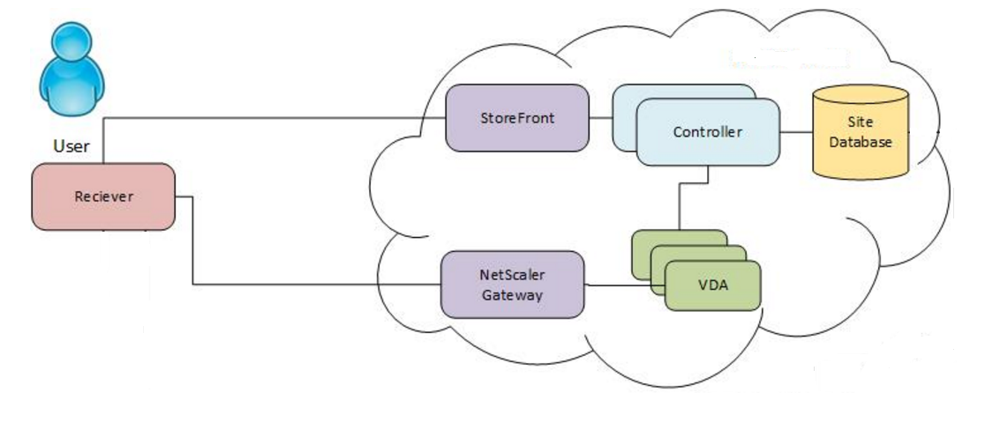
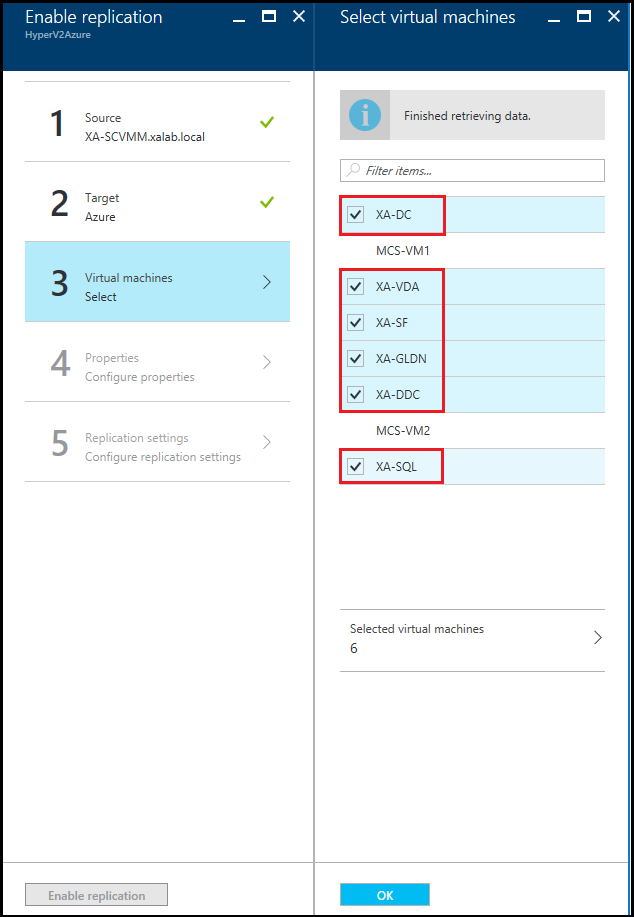
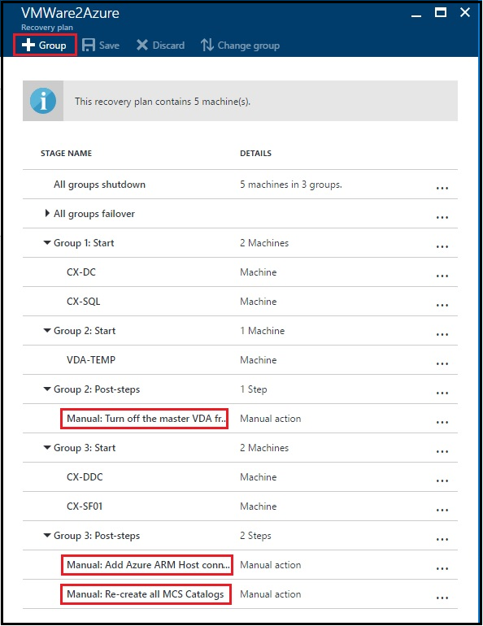
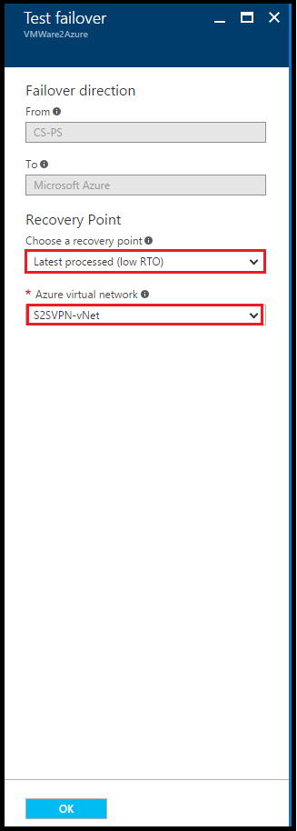

# set up disaster recovery for a multi-tier Citrix XenApp and XenDesktop deployment

Citrix XenDesktop is a desktop virtualization solution that delivers desktops and applications as an ondemand service to any user, anywhere. With FlexCast delivery technology, XenDesktop can quickly and
securely deliver applications and desktops to users.
Today, Citrix XenApp does not provide any disaster recovery capabilities.

A good disaster recovery solution, should allow modeling of recovery plans around the above complex application architectures and also have the ability to add customized steps to handle application mappings between various tiers hence providing a single-click sure shot solution in the event of a disaster leading to a lower RTO.

This document provides step-by-step guidance for building a disaster recovery solution for your on-premises Citrix XenApp deployments on Hyper-V and VMware vSphere platforms. This document also describes how to perform a test failover(disaster recovery drill) and unplanned
failover to Azure using recovery plans, the supported configurations and prerequisites.

## Prerequisites

Before you start, make sure you understand the following:

1. [Replicating a virtual machine to Azure](site-recovery-vmware-to-azure.md)
1. How to [design a recovery network](site-recovery-network-design.md)
1. [Doing a test failover to Azure](site-recovery-test-failover-to-azure.md)
1. [Doing a failover to Azure](site-recovery-failover.md)
1. How to [replicate a domain controller](site-recovery-active-directory.md)
1. How to [replicate SQL Server](site-recovery-sql.md)

## Deployment patterns

A Citrix XenApp and XenDesktop farm typically have the following deployment pattern:

**Deployment pattern**

Citrix XenApp and XenDesktop deployment with AD DNS server, SQL database server, Citrix Delivery Controller, StoreFront server, XenApp Master (VDA), Citrix XenApp License Server

## Site Recovery support

For the purpose of this article, Citrix deployments on VMware virtual machines managed by vSphere 6.0 / System Center VMM 2012 R2 were used to setup DR.

### Source and target

**Scenario** | **To a secondary site** | **To Azure**
--- | --- | ---
**Hyper-V** | Not in scope | Yes
**VMware** | Not in scope | Yes
**Physical server** | Not in scope | Yes

### Versions
Customers can deploy XenApp components as Virtual Machines running on Hyper-V or VMware or as
Physical Servers. Azure Site Recovery can protect both physical and virtual deployments to Azure.
Since XenApp 7.7 or later is supported in Azure, only deployments with these versions can be failed over to Azure for Disaster Recovery or migration.

### Things to keep in mind

1. Protection and recovery of on-premises deployments using Server OS machines to deliver XenApp published apps and XenApp published desktops is supported.

2. Protection and recovery of on-premises deployments using desktop OS machines to deliver Desktop VDI for client virtual desktops, including Windows 10, is not supported. This is because Site Recovery does not support the recovery of machines with desktop OS’es.  Also, some client virtual desktop operating systems (eg. Windows 7) are not yet supported for licensing in Azure. [Learn More](https://azure.microsoft.com/pricing/licensing-faq/) about licensing for client/server desktops in Azure.

3.  Azure Site Recovery cannot replicate and protect existing on-premises MCS or PVS clones.
You need to recreate these clones using Azure RM provisioning from Delivery controller.

4. NetScaler cannot be protected using Azure Site Recovery as NetScaler is based on FreeBSD and Azure Site Recovery does not support protection of FreeBSD OS. You would need to deploy and configure a new NetScaler appliance from Azure Market place after failover to Azure.

## Replicating virtual machines

The following components of the Citrix XenApp deployment need to be protected to enable replication and recovery.

* Protection of AD DNS server
* Protection of SQL database server
* Protection of Citrix Delivery Controller
* Protection of StoreFront server.
* Protection of XenApp Master (VDA)
* Protection of Citrix XenApp License Server

**AD DNS server replication**

Please refer to [Protect Active Directory and DNS with Azure Site Recovery](site-recovery-active-directory.md) on guidance for replicating and configuring a domain controller in Azure.

**SQL database Server replication**

Please refer to [Protect SQL Server with SQL Server disaster recovery and Azure Site Recovery](site-recovery-sql.md) for detailed technical guidance on the recommended options for protecting SQL servers.

Follow [this guidance](site-recovery-vmware-to-azure.md) to start replicating the other component virtual machines to Azure.

**Compute and Network Settings**

After the machines are protected (status shows as “Protected” under Replicated Items), the Compute and Network settings need to be configured.
In Compute and Network > Compute properties, you can specify the Azure VM name and target size.
Modify the name to comply with Azure requirements if you need to. You can also view and add information about the target network, subnet, and IP address that will be assigned to the Azure VM.

Note the following:

* You can set the target IP address. If you don't provide an address, the failed over machine will use DHCP. If you set an address that isn't available at failover, the failover won't work. The same target IP address can be used for test failover if the address is available in the test failover network.

* For the AD/DNS server, retaining the on-premises address lets you specify the same address as the DNS server for the Azure Virtual network.

The number of network adapters is dictated by the size you specify for the target virtual machine, as follows:

*	If the number of network adapters on the source machine is less than or equal to the number of adapters allowed for the target machine size, then the target will have the same number of adapters as the source.
*	If the number of adapters for the source virtual machine exceeds the number allowed for the target size then the target size maximum will be used.
* For example, if a source machine has two network adapters and the target machine size supports four, the target machine will have two adapters. If the source machine has two adapters but the supported target size only supports one then the target machine will have only one adapter.
*	If the virtual machine has multiple network adapters they will all connect to the same network.
*	If the virtual machine has multiple network adapters, then the first one shown in the list becomes the Default network adapter in the Azure virtual machine.

## Creating a recovery plan

After replication is enabled for the XenApp component VMs, the next step is to create a recovery plan.
A recovery plan groups together virtual machines with similar requirements for failover and recovery.  

**Steps to create a recovery plan**

1. Add the XenApp component virtual machines in
the Recovery Plan.
2. Click Recovery Plans -> + Recovery Plan. Provide an intuitive name for the recovery plan.
3. For VMware virtual machines: Select source as VMware process server, target as Microsoft Azure,
and deployment model as Resource Manager and click on Select items.
4. For Hyper-V virtual machines:
Select source as VMM server, target as Microsoft Azure, and deployment model as Resource Manager and
click on Select items and then select the XenApp deployment VMs.

### Adding virtual machines to failover groups

Recovery plans can be customized to add failover groups for specific startup order, scripts or manual actions. The following groups need to be added to the recovery plan.

1. Failover Group1: AD DNS
2. Failover Group2: SQL Server VMs
2. Failover Group3: VDA Master Image VM
3. Failover Group4: Delivery Controller and StoreFront server VMs

### Adding scripts to the recovery plan

Scripts can be run before or after a specific group in a recovery plan. Manual actions can also be included and performed during failover.

The customized recovery plan looks like the below:

1. Failover Group1: AD DNS
2. Failover Group2: SQL Server VMs
3. Failover Group3: VDA Master Image VM

   >[!NOTE] 	
   >Steps 4, 6 and 7 containing manual or script actions are applicable to only an on-premises XenApp >environment with MCS/PVS catalogs.

4. Group 3 Manual or script action: Shut down master VDA VM<!-- missing period -->
The Master VDA VM when failed over to Azure will be in a running state. To create new MCS
catalogs using Azure hosting, the master VDA VM is required to be in Stopped (de allocated)
state. Shutdown the VM from Azure portal.

5. Failover Group4: Delivery Controller and StoreFront server VMs
6. Group3 manual or script action 1:

	***Add Azure RM host connection***

   	Create Azure host connection in Delivery Controller machine to provision new MCS
   catalogs in Azure. Follow the steps as explained in this [article](https://www.citrix.com/blogs/2016/07/21/connecting-to-azure-resource-manager-in-xenapp-xendesktop/).

7. Group3 manual or script action 2:

    ***Re-create MCS Catalogs in Azure***

	The existing MCS or PVS clones on the primary site will not be replicated to Azure. You need to recreate these clones using the replicated master VDA and Azure provisioning from Delivery controller. Follow the steps as explained in this [article](https://www.citrix.com/blogs/2016/09/12/using-xenapp-xendesktop-in-azure-resource-manager/) to create MCS catalogs in Azure.

   >[!NOTE]
   >You can use scripts at [location](https://github.com/Azure/azure-quickstart-templates/tree/master/asr-automation-recovery/scripts) to update the DNS with the new IPs of the failed over >virtual machines or to attach a load balancer on the failed over virtual machine, if needed.

## Doing a test failover

Follow [this guidance](site-recovery-test-failover-to-azure.md) to do a test failover.

## Doing a failover

Follow [this guidance](site-recovery-failover.md) when you are doing a failover.

## Next steps

You can [learn more](https://aka.ms/citrix-xenapp-xendesktop-with-asr) about replicating Citrix XenApp and XenDesktop deployments  in this white paper. Look at the guidance to [replicate other applications](site-recovery-workload.md) using Site Recovery.
