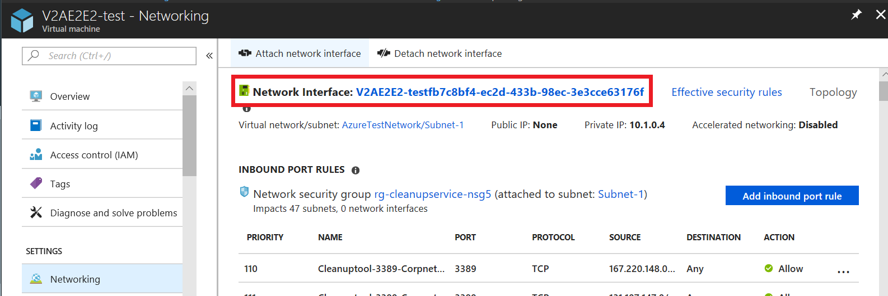
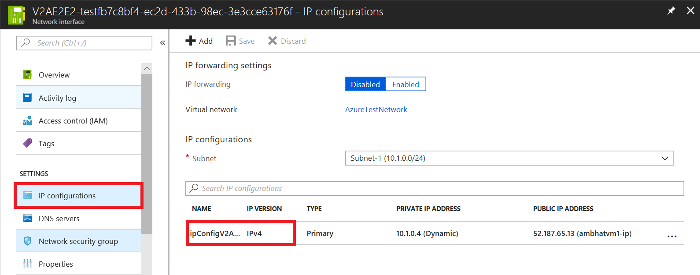
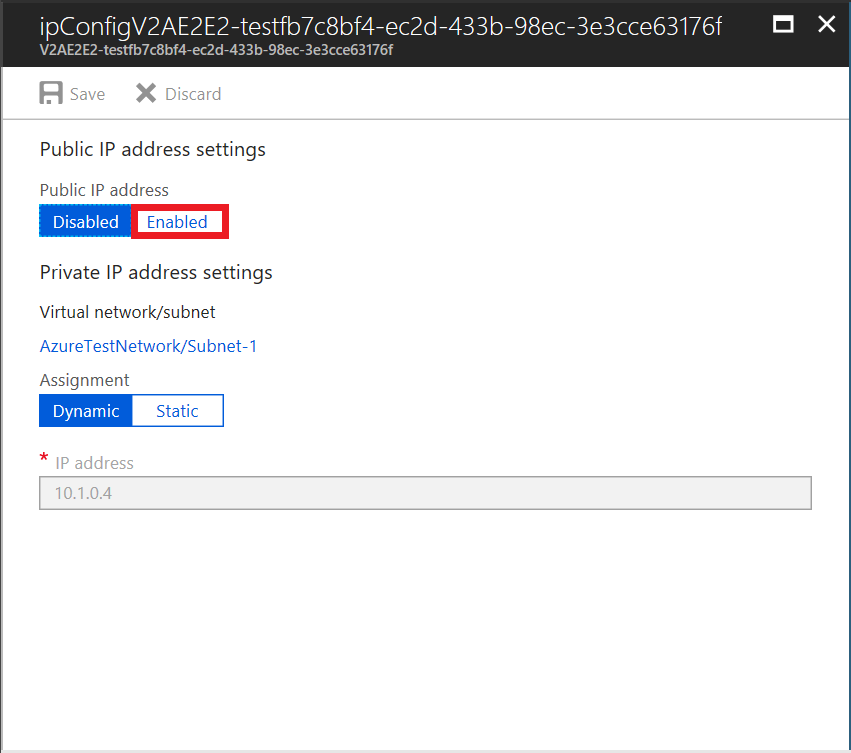

# Troubleshoot errors when failing over VMware VM or physical machine to Azure

You may receive one of the following errors while doing failover of a virtual machine to Azure. To troubleshoot, use the described steps for each error condition.

## Failover failed with Error ID 28031

Site Recovery was not able to create a failed over virtual machine in Azure. It could happen because of one of the following reasons:

* There isn't sufficient quota available to create the virtual machine: You can check the available quota by going to Subscription -> Usage + quotas. You can open a [new support request](https://aka.ms/getazuresupport) to increase the quota.

* You are trying to failover virtual machines of different size families in same availability set. Ensure that you choose same size family for all virtual machines in the same availability set. Change size by going to Compute and Network settings of the virtual machine and then retry failover.

* There is a policy on the subscription that prevents creation of a virtual machine. Change the policy to allow creation of a virtual machine and then retry failover.

## Failover failed with Error ID 28092

Site Recovery was not able to create a network interface for the failed over virtual machine. Make sure you have sufficient quota available to create network interfaces in the subscription. You can check the available quota by going to Subscription -> Usage + quotas. You can open a [new support request](https://aka.ms/getazuresupport) to increase the quota. If you have sufficient quota, then this might be an intermittent issue, try the operation again. If the issue persists even after retries, then leave a comment at the end of this document.  

## Failover failed with Error ID 70038

Site Recovery was not able to create a failed over Classic virtual machine in Azure. It could happen because:

* One of the resources such as a virtual network that is required for the virtual machine to be created doesn't exist. Create the virtual network as provided under Compute and Network settings of the virtual machine or modify the setting to a virtual network that already exists and then retry failover.

## Failover failed with Error ID 170010

Site Recovery was not able to create a failed over virtual machine in Azure. It could happen because an internal activity of hydration failed for the on-premises virtual machine.

To bring up any machine in Azure, the Azure environment requires some of the drivers to be in boot start state and services like DHCP to be in autostart state. Thus, hydration activity, at the time of failover, converts the startup type of **atapi, intelide, storflt, vmbus, and storvsc drivers** to boot start. It also converts the startup type of a few services like DHCP to autostart. This activity can fail due to environment specific issues. 

To manually change the startup type of drivers for **Windows Guest OS**, follow the below steps:

1. [Download](https://download.microsoft.com/download/5/D/6/5D60E67C-2B4F-4C51-B291-A97732F92369/Script-no-hydration.ps1) the no-hydration script and run it as follows. This script checks if VM requires hydration.

    `.\Script-no-hydration.ps1`

    It gives the following result if hydration is required:

        REGISTRY::HKEY_LOCAL_MACHINE\SYSTEM\ControlSet001\services\storvsc           start =  3 expected value =  0

        This system doesn't meet no-hydration requirement.

    In case the VM meets no-hydration requirement, the script will give the result "This system meets no-hydration requirement". In this case, all drivers and services are in the state as required by Azure and hydration on the VM is not required.

2. Run the no-hydration-set script as follows if the VM does not meet no-hydration requirement.

    `.\Script-no-hydration.ps1 -set`
    
    This will convert the startup type of drivers and will give the result like below:
    
        REGISTRY::HKEY_LOCAL_MACHINE\SYSTEM\ControlSet001\services\storvsc           start =  3 expected value =  0 

        Updating registry:  REGISTRY::HKEY_LOCAL_MACHINE\SYSTEM\ControlSet001\services\storvsc   start =  0 

        This system is now no-hydration compatible. 

## Unable to connect/RDP/SSH to the failed over virtual machine due to grayed out Connect button on the virtual machine

If the **Connect** button on the failed over VM in Azure is grayed out and you are not connected to Azure via an Express Route or Site-to-Site VPN connection, then,

1. Go to **Virtual machine** > **Networking**, click on the name of required network interface.  
2. Navigate to **Ip Configurations**, then click on the name field of required IP configuration. 
3. To enable Public IP address, click on **Enable**. 
4. Click on **Configure required settings** > **Create new**. 
5. Enter the name of public address, choose the default options for **SKU** and **assignment**, then click **OK**.
6. Now, to save the changes made, click **Save**.
7. Close the panels and navigate to **Overview** section of virtual machine to connect/RDP.

## Unable to connect/RDP/SSH - VM Connect button available

If the **Connect** button on the failed over VM in Azure is available (not grayed out), then check **Boot diagnostics** on your Virtual Machine and check for errors as listed in [this article](../virtual-machines/windows/boot-diagnostics.md).

1. If the virtual machine has not started, try failing over to an older recovery point.
2. If the application inside the virtual machine is not up, try failing over to an app-consistent recovery point.
3. If the virtual machine is domain joined, then ensure that domain controller is functioning accurately. This can be done by following the below given steps:

    a. Create a new virtual machine in the same network.

    b.  Ensure that it is able to join to the same domain on which the failed over virtual machine is expected to come up.

    c. If the domain controller is **not** functioning accurately, then try logging into the failed over virtual machine using a local administrator account.
4. If you are using a custom DNS server, then ensure that it is reachable. This can be done by following the below given steps:

    a. Create a new virtual machine in the same network and

    b. Check if the virtual machine is able to do name resolution using the custom DNS Server

>[!Note]
>Enabling any setting other than Boot Diagnostics would require Azure VM Agent to be installed in the virtual machine before the failover

## Unable to open serial console after failover of a UEFI based machine into Azure

If you are able to connect to the machine using RDP but cannot open serial console, follow the below steps:

* If the machine OS is Red Hat or Oracle Linux 7.*/8.0, run the following command on the failover Azure VM with root permissions. Reboot the VM after the command.

        grub2-mkconfig -o /boot/efi/EFI/redhat/grub.cfg

* If the machine OS is CentOS 7.*, run the following command on the failover Azure VM with root permissions. Reboot the VM after the command.

        grub2-mkconfig -o /boot/efi/EFI/centos/grub.cfg

## Unexpected shutdown message (Event ID 6008)

When booting up a Windows VM post failover, if you receive an unexpected shutdown message on the recovered VM, it indicates that a VM shutdown state was not captured in the recovery point used for failover. This happens when you recover to a point when the VM had not been fully shut down.

This is normally not a cause for concern and can usually be ignored for unplanned failovers. If the failover is planned, ensure that the VM is properly shut down prior to failover and provide sufficient time for pending replication data on-premises to be sent to Azure. Then use the **Latest** option on the [Failover screen](site-recovery-failover.md#run-a-failover) so that any pending data on Azure is processed into a recovery point, which is then used for VM failover.

## Unable to select the Datastore

This issue is indicated when you are unable to see the datastore in Azure the portal when trying to reprotect the virtual machine that has experienced a failover. This is because the Master target is not recognized as a virtual machine under vCenters added to Azure Site Recovery.

For more information about reprotecting a virtual machine, see [Reprotect and fail back machines to an on-premises site after failover to Azure](vmware-azure-reprotect.md).

To resolve the issue:

Manually create the Master target in the vCenter that manages your source machine. The datastore will be available after the next vCenter discovery and refresh fabric operations.

> [!Note]
> 
> The discovery and refresh fabric operations can take up to 30 minutes to complete. 

## Linux Master Target registration with CS fails with a TLS error 35 

The Azure Site Recovery Master Target registration with the configuration server fails due to the Authenticated Proxy being enabled on the Master Target. 
 
This error is indicated by the following strings in the installation log: 

```
RegisterHostStaticInfo encountered exception config/talwrapper.cpp(107)[post] CurlWrapper Post failed : server : 10.38.229.221, port : 443, phpUrl : request_handler.php, secure : true, ignoreCurlPartialError : false with error: [at curlwrapperlib/curlwrapper.cpp:processCurlResponse:231]   failed to post request: (35) - SSL connect error. 
```

To resolve the issue:
 
1. On the configuration server VM, open a command prompt and verify the proxy settings using the following commands:

    cat /etc/environment 
    echo $http_proxy 
    echo $https_proxy 

2. If the output of the previous commands shows that either the http_proxy or https_proxy settings are defined, use one of the following methods to unblock the Master Target communications with configuration server:
   
   - Download the [PsExec tool](https://aka.ms/PsExec).
   - Use the tool to access the System user context and determine whether the proxy address is configured. 
   - If the proxy is configured, open IE in a system user context using the PsExec tool.
  
     **psexec -s -i "%programfiles%\Internet Explorer\iexplore.exe"**

   - To ensure that the master target server can communicate with the configuration server:
  
     - Modify the proxy settings in Internet Explorer to bypass the Master Target server IP address through the proxy.   
     Or
     - Disable the proxy on Master Target server. 


## Next steps
- Troubleshoot [RDP connection to Windows VM](../virtual-machines/windows/troubleshoot-rdp-connection.md)
- Troubleshoot [SSH connection to Linux VM](../virtual-machines/linux/detailed-troubleshoot-ssh-connection.md)

If you need more help, then post your query on [Microsoft Q&A question page for Site Recovery](/answers/topics/azure-site-recovery.html) or leave a comment at the end of this document. We have an active community that should be able to assist you.
