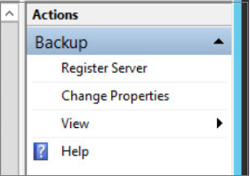
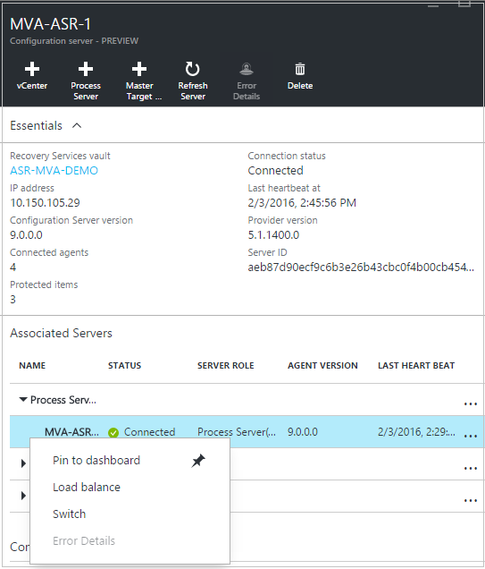
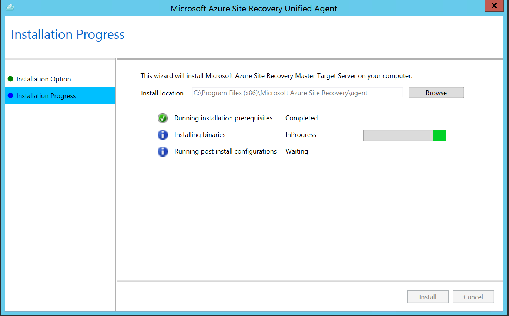
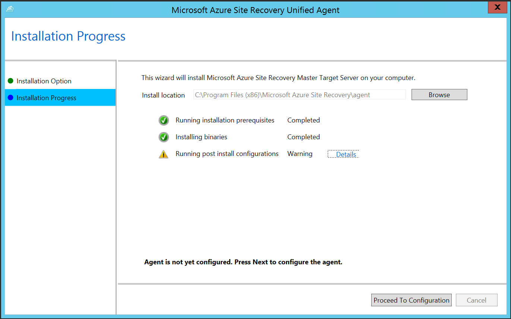

# Plan capacity and scaling for VMware disaster recovery to Azure

Use this article to figure out planning for capacity and scaling, when replicating on-premises VMware VMs and physical servers to Azure with [Azure Site Recovery](site-recovery-overview.md).

## How do I start capacity planning?

To know the Azure Site Recovery Infrastructure requirements, gather information about your replication environment by running the [Azure Site Recovery Deployment Planner](https://aka.ms/asr-deployment-planner-doc) for VMware replication. [Learn more](site-recovery-deployment-planner.md) about this tool. This tool provides a report with complete information on compatible and incompatible VMs, disks per VM, and data churn per disk. The tool also summarizes network bandwidth requirements to meet target RPO, and the Azure infrastructure needed for successful replication and test failover.

## Capacity considerations

**Component** | **Details** |
--- | --- | ---
**Replication** | **Maximum daily change rate:** A protected machine can only use one process server, and a single process server can handle a daily change rate up to 2 TB. Thus 2 TB is the maximum daily data change rate that’s supported for a protected machine.   **Maximum throughput:** A replicated machine can belong to one storage account in Azure. A standard storage account can handle a maximum of 20,000 requests per second, and we recommend that you keep the number of input/output operations per second (IOPS) across a source machine to 20,000. For example, if you have a source machine with 5 disks, and each disk generates 120 IOPS (8K size) on the source machine, then it will be within the Azure per disk IOPS limit of 500. (The number of storage accounts required is equal to the total source machine IOPS, divided by 20,000.)
**Configuration server** | The configuration server should be able to handle the daily change rate capacity across all workloads running on protected machines, and needs sufficient bandwidth to continuously replicate data to Azure Storage.   As a best practice, locate the configuration server on the same network and LAN segment as the machines you want to protect. It can be located on a different network, but machines you want to protect should have layer 3 network visibility to it.   Size recommendations for the configuration server are summarized in the table in the following section.
**Process server** | The first process server is installed by default on the configuration server. You can deploy additional process servers to scale your environment.    The process server receives replication data from protected machines, and optimizes it with caching, compression, and encryption. Then it sends the data to Azure. The process server machine should have sufficient resources to perform these tasks.   The process server uses a disk-based cache. Use a separate cache disk of 600 GB or more to handle data changes stored in the event of a network bottleneck or outage.

## Size recommendations for the configuration server/in-built process server

Each configuration server deployed through [OVF template](vmware-azure-deploy-configuration-server.md#deployment-of-configuration-server-through-ova-template) has an inbuilt process server. Resources of the configuration server, like CPU, memory, free space are utilized at a different rate when inbuilt process server is utilized to protect virtual machines. Hence, the requirements vary when inbuilt process server is utilized.
A configuration server where inbuilt process server is used to protect workload can handle up to 200 virtual machines based on the following configurations

**CPU** | **Memory** | **Cache disk size** | **Data change rate** | **Protected machines**
--- | --- | --- | --- | ---
8 vCPUs (2 sockets * 4 cores \@ 2.5 gigahertz [GHz]) | 16 GB | 300 GB | 500 GB or less | Replicate less than 100 machines.
12 vCPUs (2 sockets * 6 cores \@ 2.5 GHz) | 18 GB | 600 GB | 500 GB to 1 TB | Replicate between 100-150 machines.
16 vCPUs (2 sockets * 8 cores \@ 2.5 GHz) | 32 GB | 1 TB | 1 TB to 2 TB | Replicate between 150-200 machines.
Deploy another Configuration server through [OVF template](vmware-azure-deploy-configuration-server.md#deployment-of-configuration-server-through-ova-template) | | | | Deploy new configuration server if you're replicating more than 200 machines.
Deploy another [process server](vmware-azure-set-up-process-server-scale.md#download-installation-file) | | | >2 TB| Deploy new scale-out process server if overall daily data change rate exceeds 2 TB.

Where:

* Each source machine is configured with 3 disks of 100 GB each.
* We used benchmarking storage of 8 SAS drives of 10 K RPM, with RAID 10, for cache disk measurements.

## Size recommendations for the configuration server

When you are not planning to use the configuration server as a process server, follow the below given configuration to handle up to 650 virtual machines.

**CPU** | **RAM** | **OS disk size** | **Data change rate** | **Protected machines**
--- | --- | --- | --- | ---
24 vCPUs (2 sockets * 12 cores \@ 2.5 gigahertz [GHz])| 32GB | 80GB | Not applicable | Up to 650 VMs

Where, each source machine is configured with 3 disks of 100 GB each.

Since, process server functionality is not utilized, data change rate is not applicable. To maintain above capacity, you can switch your workload from inbuilt process server to another scale-out process by following the guidelines [here](vmware-azure-manage-process-server.md#balance-the-load-on-process-server).

## Size recommendations for the process server

Process server is the component that handles the data replication process in Azure Site Recovery. If the daily change rate is greater than 2 TB, you need to add a scale-out process servers to handle the replication load. To scale out, you can:

* Increase the number of configuration servers by deploying through [OVF template](vmware-azure-deploy-configuration-server.md#deployment-of-configuration-server-through-ova-template). For example, you can protect up to 400 machines with two configuration servers.
* Add [scale-out process servers](vmware-azure-set-up-process-server-scale.md#download-installation-file), and use these to handle replication traffic instead of (or in addition to) the configuration server.

The following table describes a scenario in which:

* You've set up a scale-out process server.
* You've configured protected virtual machines to use the scale-out process server.
* Each protected source machine is configured with three disks of 100 GB each.

**Additional process server** | **Cache disk size** | **Data change rate** | **Protected machines**
--- | --- | --- | ---
4 vCPUs (2 sockets * 2 cores \@ 2.5 GHz), 8 GB memory | 300 GB | 250 GB or less | Replicate 85 or fewer machines.
8 vCPUs (2 sockets * 4 cores \@ 2.5 GHz), 12 GB memory | 600 GB | 250 GB to 1 TB | Replicate between 85-150 machines.
12 vCPUs (2 sockets * 6 cores \@ 2.5 GHz) 24 GB memory | 1 TB | 1 TB to 2 TB | Replicate between 150-225 machines.

The way in which you scale your servers depends on your preference for a scale-up or scale-out model.  You scale up by deploying a few high-end configuration and process servers, or scale out by deploying more servers with fewer resources. For example, if you need to protect 200 machines with overall data change rate daily at 1.5 TB, you could do either of the following:

* Set up single process server with 16 vCPU, 24 GB RAM.
* Set up two process servers (2 x 8 vCPU, 2* 12 GB RAM).

## Control network bandwidth

After you've used the [the Deployment Planner tool](site-recovery-deployment-planner.md) to calculate the bandwidth you need for replication (the initial replication and then delta), you can control the amount of bandwidth used for replication using a couple of options:

* **Throttle bandwidth**: VMware traffic that replicates to Azure goes through a specific process server. You can throttle bandwidth on the machines running as process servers.
* **Influence bandwidth**: You can influence the bandwidth used for replication by using a couple of registry keys:
  * The **HKEY_LOCAL_MACHINE\SOFTWARE\Microsoft\Windows Azure Backup\Replication\UploadThreadsPerVM** registry value specifies the number of threads that are used for data transfer (initial or delta replication) of a disk. A higher value increases the network bandwidth used for replication.
  * The **HKEY_LOCAL_MACHINE\SOFTWARE\Microsoft\Windows Azure Backup\Replication\DownloadThreadsPerVM** specifies the number of threads used for data transfer during failback.

### Throttle bandwidth

1. Open the Azure Backup MMC snap-in on the machine acting as the process server. By default, a shortcut for Backup is available on the desktop, or in the following folder: C:\Program Files\Microsoft Azure Recovery Services Agent\bin.
2. In the snap-in, click **Change Properties**.

    
3. On the **Throttling** tab, select **Enable internet bandwidth usage throttling for backup operations**. Set the limits for work and non-work hours. Valid ranges are from 512 Kbps to 1023 Mbps per second.

    

You can also use the [Set-OBMachineSetting](https://technet.microsoft.com/library/hh770409.aspx) cmdlet to set throttling. Here's a sample:

    $mon = [System.DayOfWeek]::Monday
    $tue = [System.DayOfWeek]::Tuesday
    Set-OBMachineSetting -WorkDay $mon, $tue -StartWorkHour "9:00:00" -EndWorkHour "18:00:00" -WorkHourBandwidth  (512*1024) -NonWorkHourBandwidth (2048*1024)

**Set-OBMachineSetting -NoThrottle** indicates that no throttling is required.

### Influence network bandwidth for a VM

1. In the VM's registry, navigate to **HKEY_LOCAL_MACHINE\SOFTWARE\Microsoft\Windows Azure Backup\Replication**.
   * To influence the bandwidth traffic on a replicating disk, modify the value of **UploadThreadsPerVM**, or create the key if it doesn't exist.
   * To influence the bandwidth for failback traffic from Azure, modify the value of **DownloadThreadsPerVM**.
2. The default value is 4. In an “overprovisioned” network, these registry keys should be changed from the default values. The maximum is 32. Monitor traffic to optimize the value.

## Setup Azure Site Recovery infrastructure to protect more than 500 Virtual machines

Before setting up of Azure Site Recovery infrastructure, we need to access the environment to measure the following factors: compatible virtual machines, daily data change rate, required network bandwidth for desired RPO, number of Azure site recovery components required, time taken to complete the initial replication etc.,

1. To measure these parameters, ensure to run the deployment planner on your environment with the help of guidelines shared [here](site-recovery-deployment-planner.md).
2. Deploy a configuration server with requirements mentioned [here](site-recovery-plan-capacity-vmware.md#size-recommendations-for-the-configuration-server). If your production workload exceeds 650 virtual machines, deploy another configuration server.
3. Based on the measured daily data change rate, deploy [scale-out process servers](vmware-azure-set-up-process-server-scale.md#download-installation-file) with the help of size guidelines stated [here](site-recovery-plan-capacity-vmware.md#size-recommendations-for-the-process-server).
4. If you expect the data change rate for a disk virtual machine would exceed 2 MBps, ensure to [set up a premium storage account](tutorial-prepare-azure.md#create-a-storage-account). Since deployment planner is run for a specific time period, peaks in data change rate during other time periods might not be captured in the report.
5. As per the desired RPO, [set the network bandwidth](site-recovery-plan-capacity-vmware.md#control-network-bandwidth).
6. After the setup of the infrastructure, follow the guidelines published under [How-to section](vmware-azure-set-up-source.md) to enable disaster recovery on your workload.

## Deploy additional process servers

If you have to scale out your deployment beyond 200 source machines, or you have a total daily churn rate of more than 2 TB, you need additional process servers to handle the traffic volume. Follow instructions given on [this article](vmware-azure-set-up-process-server-scale.md) to set up the process server. After setting up the server, you can migrate source machines to use it.

### Migrate machines to use the new process server

1. In **Settings** > **Site Recovery servers**, click the configuration server, and then expand **Process servers**.

    
2. Right-click the process server currently in use, and click **Switch**.

    
3. In **Select target process server**, select the new process server you want to use, and then select the virtual machines that the server will handle. Click the information icon to get information about the server. To help you make load decisions, the average space that's needed to replicate each selected virtual machine to the new process server is displayed. Click the check mark to start replicating to the new process server.

## Deploy additional master target servers

You will need additional master target server during the following scenarios

1. If you are trying to protect a Linux-based virtual machine.
2. If the master target server available on configuration server doesn't have access to the datastore of VM.
3. If the total number of disks on master target server (no. of local disks on server + disks to be protected) exceeds 60 disks.

To add a new master target server for **Linux-based virtual machine**, [click here](vmware-azure-install-linux-master-target.md).

For **Windows-based virtual machine**, follow the below given instructions.

1. Navigate to **Recovery Services Vault** > **Site Recovery Infrastructure** > **Configuration servers**.
2. Click on the required configuration server > **+Master Target Server**.
3. Download the unified set-up and run it on the VM to set up master target server.
4. Choose **Install master target** > **Next**. 
5. Choose default install location > click **Install**. 
6. Click on **Proceed to Configuration** to register master target with configuration server. 
7. Enter the IP address of configuration server & passphrase. [Click here](vmware-azure-manage-configuration-server.md#generate-configuration-server-passphrase) to learn how to generate passphrase.
8. Click **Register** and post registration click **Finish**.
9. Upon successful registration, this server is listed on portal under **Recovery Services Vault** > **Site Recovery Infrastructure** > **Configuration servers** > master target servers of relevant configuration server.

 >[!NOTE]
 >You can also download the latest version of Master target server unified set-up for Windows [here](https://aka.ms/latestmobsvc).

## How do I protect more than 500 Virtual machines through Azure Site Recovery?

## Next steps

Download and run the [Azure Site Recovery Deployment Planner](https://aka.ms/asr-deployment-planner)
