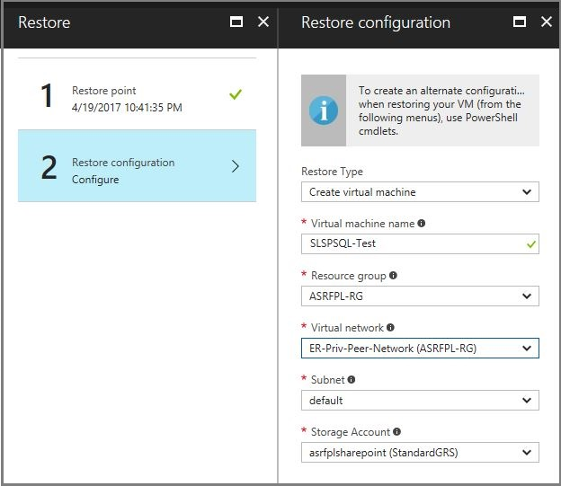
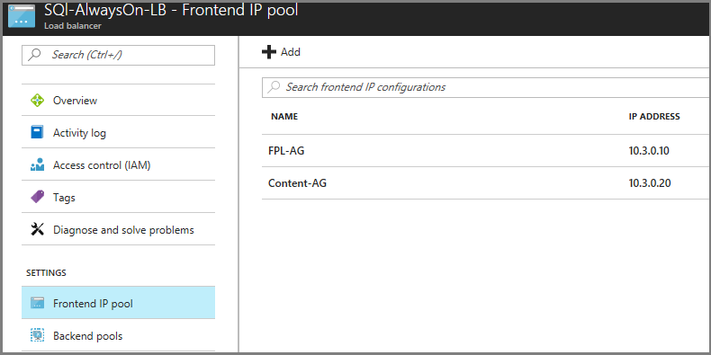

# Set up disaster recovery for SQL Server

This article describes how to protect the SQL Server back end of an application using a combination of SQL Server business continuity and disaster recovery (BCDR) technologies, and [Azure Site Recovery](site-recovery-overview.md).

Before you start, make sure you understand SQL Server disaster recovery capabilities, including failover clustering, Always On availability groups, database mirroring, and log shipping.

## SQL Server deployments

Many workloads use SQL Server as a foundation, and it can be integrated with apps such as SharePoint, Dynamics, and SAP, to implement data services.  SQL Server can be deployed in a number of ways:

* **Standalone SQL Server**: SQL Server and all databases are hosted on a single machine (physical or a virtual). When virtualized, host clustering is used for local high availability. Guest-level high availability isn't implemented.
* **SQL Server Failover Clustering Instances (Always On FCI)**: Two or more nodes running SQL Server instanced with shared disks are configured in a Windows Failover cluster. If a node is down, the cluster can fail SQL Server over to another instance. This setup is typically used to implement high availability at a primary site. This deployment doesn't protect against failure or outage in the shared storage layer. A shared disk can be implemented using iSCSI, fiber channel or shared vhdx.
* **SQL Always On Availability Groups**: Two or more nodes are set up in a shared nothing cluster, with SQL Server databases configured in an availability group, with synchronous replication and automatic failover.

All the above deployment modes are available for Azure IaaS VMs as well. Following are few advanced deployments available in Azure:

* **SQL Database Managed Instances**: A managed instance in Azure SQL Database is a fully managed SQL Server Database Engine Instance hosted in Azure. It is designed for customers looking to migrate a large number of apps from on-premises or IaaS, self-built, or ISV provided environment to fully managed PaaS cloud environment, with as low migration effort as possible.
* **SQL Server PaaS**: Azure SQL Database is a fully managed Platform as a Service (PaaS) Database Engine that handles most of the database management functions such as upgrading, patching, backups, and monitoring without user involvement.
* **Elastic Pools of SQL Database**: SQL Database elastic pools are a simple, cost-effective solution for managing and scaling multiple databases that have varying and unpredictable usage demands.

## Site Recovery support

### Supported scenarios
Site Recovery can protect SQL Server as summarized in the table.

**Scenario** | **To Azure**
--- | --- | ---
**Hyper-V** | Yes
**VMware** | Yes
**Physical server** | Yes
**Azure** | Yes

Azure Site Recovery is application agnostic and hence, any version of SQL server that is supported on an IaaS virtual machine is supported. [Learn more](../virtual-machines/windows/sql/virtual-machines-windows-sql-server-iaas-faq.md).

### SQL Server BCDR technologies

Site Recovery can be integrated with native SQL Server BCDR technologies summarized in the table, to provide a disaster recovery solution.

**Feature** | **Details** | **SQL Server** |
--- | --- | ---
**Always On availability group** | Multiple standalone instances of SQL Server each run in a failover cluster that has multiple nodes.  Databases can be grouped into failover groups that can be copied (mirrored) on SQL Server instances so that no shared storage is needed.  Provides disaster recovery between a primary site and one or more secondary sites. Two nodes can be set up in a shared nothing cluster with SQL Server databases configured in an availability group with synchronous replication and automatic failover. | SQL Server 2017, SQL Server 2016, SQL Server 2014 & SQL Server 2012 Enterprise edition
**Failover clustering (Always On FCI)** | SQL Server leverages Windows failover clustering for high availability of on-premises SQL Server workloads.  Nodes running instances of SQL Server with shared disks are configured in a failover cluster. If an instance is down the cluster fails over to different one.  The cluster doesn't protect against failure or outages in shared storage. The shared disk can be implemented with iSCSI, fiber channel, or shared VHDXs. | SQL Server Enterprise editions  SQL Server Standard edition (limited to two nodes only)
**Database mirroring (high safety mode)** | Protects a single database to a single secondary copy. Available in both high safety (synchronous) and high performance (asynchronous) replication modes. Doesn’t require a failover cluster. | SQL Server 2008 R2 or older (Not supported for SQL Server 2008 nor SQL Server 2008 R2 on an Azure VM)   SQL Server Enterprise all editions
**Standalone SQL Server** | The SQL Server and database are hosted on a single server (physical or virtual). Host clustering is used for high availability if the server is virtual. No guest-level high availability. | Enterprise or Standard edition
**Active Geo-replication** | Active geo-replication is Azure SQL Database feature that allows you to create readable secondary databases of individual databases on a SQL Database server in the same or different data center (region).    Active geo-replication leverages the Always On technology of SQL Server to asynchronously replicate committed transactions on the primary database to a secondary database using snapshot isolation.| Elastic pools, SQL database servers
**Auto-failover groups** | Auto-failover groups is a SQL Database feature that allows you to manage replication and failover of a group of databases on a SQL Database server or all databases in a managed instance to another region.   You can initiate failover manually or you can delegate it to the SQL Database service based on a user-defined policy. The latter option allows you to automatically recover multiple related databases in a secondary region after a catastrophic failure or other unplanned event that results in full or partial loss of the SQL Database service’s availability in the primary region.  | SQL Database Managed Instance, Elastic pools, SQL database servers

## DR recommendations for integration with Azure Site Recovery

The tables below summarize our recommendations for integrating SQL Server BCDR technologies with Site Recovery as per the **availability of a BCDR technology** for your SQL server deployment. Note that all Enterprise versions of SQL server have Always On feature.

**On-premises to Azure**

**Always On** | **FCI (Non-DTC application)** | **Recommendation** |
--- | --- | --- 
Yes |Yes | Always On availability groups
No | Yes | Site Recovery replication with local mirror
No | No | Site recovery replication

[Learn more](../virtual-machines/windows/sql/virtual-machines-windows-sql-high-availability-dr.md#hybrid-it-disaster-recovery-solutions) about the high availability options to recover SQL Server in Azure Virtual Machines.

**Azure to Azure**

**Always On** | **FCI (Non-DTC application)** | **Active Geo-Replication** | **Auto-failover Groups** | **Recommendation**
--- | --- | --- | --- | ---
Yes | Yes | Yes | Yes | Auto-failover groups
Yes | Yes | Yes | No | Active Geo-replication
Yes | Yes | No | No | Always On availability groups
No | Yes | No | No | Always On availability groups
No | Yes | No | No | Site recovery replication

Learn more about the [business continuity](../sql-database/sql-database-business-continuity.md) and [high availability](../sql-database/sql-database-high-availability.md) options to recover SQL Server in Azure Virtual Machines.

## Disaster Recovery Considerations

Any SQL Server deployment typically needs an Active Directory. It also needs connectivity for your application tier.

### Set up Active Directory

Set up Active Directory, in the secondary recovery site, for SQL Server to run properly.

* **Small enterprise**—With a small number of applications, and single domain controller for the on-premises site, if you want to fail over the entire site, we recommend you use Site Recovery replication to replicate the domain controller to the secondary datacenter, or to Azure.
* **Medium to large enterprise**—If you have a large number of applications, an Active Directory forest, and you want to fail over by application or workload, we recommend you set up an additional domain controller in the secondary datacenter, or in Azure. If you're using Always On availability groups to recover to a remote site, we recommend you set up another additional domain controller on the secondary site or in Azure, to use for the recovered SQL Server instance.

The instructions in this article presume that a domain controller is available in the secondary location. [Read more](site-recovery-active-directory.md) about protecting Active Directory with Site Recovery.

### Ensure connectivity with other application tier(s)

Understand how you can design applications for connectivity considerations with a couple of examples:
* [Design an application for cloud disaster recovery](../sql-database/sql-database-designing-cloud-solutions-for-disaster-recovery.md)
* [Elastic pool Disaster Recovery strategies](../sql-database/sql-database-disaster-recovery-strategies-for-applications-with-elastic-pool.md)

## Integrate with Always On, Active-Geo replication or Auto-failover groups for application failover

BCDR technologies Always On, Active-Geo replication and auto-failover groups have secondary replicas of SQL server running in target Azure region. Hence, the first step for your application failover is to make this replica as Primary (assuming you already have a domain controller in secondary). This step may not be necessary if you choose to do an auto-failover. Only after the database failover is completed, you should failover your web or application tiers.

Here's what you need to do:

1. Import scripts into your Azure Automation account. This contains the scripts to failover SQL Availability Group in a [Resource Manager virtual machine](https://raw.githubusercontent.com/Azure/azure-quickstart-templates/master/asr-automation-recovery/scripts/ASR-SQL-FailoverAG.ps1) and a [Classic virtual machine](https://raw.githubusercontent.com/Azure/azure-quickstart-templates/master/asr-automation-recovery/scripts/ASR-SQL-FailoverAGClassic.ps1).

	

1. Add ASR-SQL-FailoverAG as a pre action of the first group of the recovery plan.

1. Follow the instructions available in the script to create an automation variable to provide the name of the availability groups.

### Steps to do a test failover

SQL Always On doesn’t natively support test failover. Therefore, we recommend the following:

1. Set up [Azure Backup](../backup/backup-azure-arm-vms.md) on the virtual machine that hosts the availability group replica in Azure.

1. Before triggering test failover of the recovery plan, recover the virtual machine from the backup taken in the previous step.

	

1. [Force a quorum](https://docs.microsoft.com/sql/sql-server/failover-clusters/windows/force-a-wsfc-cluster-to-start-without-a-quorum#PowerShellProcedure) in the virtual machine restored from backup.

1. Update IP of the listener to an IP available in the test failover network.

	

1. Bring listener online.

	

1. Create a load balancer with one IP created under frontend IP pool corresponding to each availability group listener and with the SQL virtual machine added in the backend pool.

	 

	

1. Do a test failover of the recovery plan.

### Steps to do a failover

Once you have added the script in the recovery plan and validated the recovery plan by doing a test failover, you can do failover of the recovery plan.

## Protect a standalone SQL Server

In this scenario, we recommend that you use Site Recovery replication to protect the SQL Server machine. The exact steps will depend whether SQL Server is a VM or a physical server, and whether you want to replicate to Azure or a secondary on-premises site. Learn about [Site Recovery scenarios](site-recovery-overview.md).

## Protect a SQL Server cluster (standard edition/SQL Server 2008 R2) at on-premises

For a cluster running SQL Server Standard edition, or SQL Server 2008 R2, we recommend you use Site Recovery replication to protect SQL Server.

### On-premises to Azure

Site Recovery doesn't provide guest cluster support when replicating to Azure. SQL Server also doesn't provide a low-cost disaster recovery solution for Standard edition. In this scenario, we recommend you protect the on-premises SQL Server cluster to a standalone SQL Server, and recover it in Azure.

1. Configure an additional standalone SQL Server instance on the on-premises site.
1. Configure the instance to serve as a mirror for the databases you want to protect. Configure mirroring in high safety mode.
1. Configure Site Recovery on the on-premises site, for ([Hyper-V](site-recovery-hyper-v-site-to-azure.md) or [VMware VMs/physical servers)](site-recovery-vmware-to-azure-classic.md).
1. Use Site Recovery replication to replicate the new SQL Server instance to Azure. Since it's a high safety mirror copy, it will be synchronized with the primary cluster, but it will be replicated to Azure using Site Recovery replication.

### Failback considerations

For SQL Server Standard clusters, failback after an unplanned failover requires a SQL server backup and restore, from the mirror instance to the original cluster, with reestablishment of the mirror.

## Next steps
[Learn more](site-recovery-components.md) about Site Recovery architecture.
