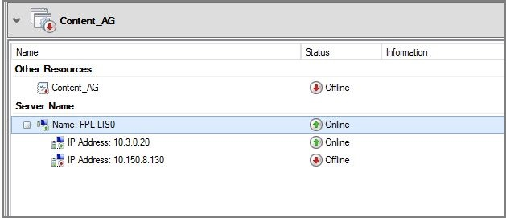
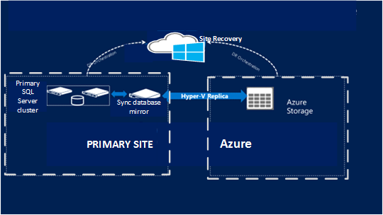

# Set up disaster recovery for SQL Server

This article describes how to protect the SQL Server back end of an application. You do so by using a combination of SQL Server business continuity and disaster recovery (BCDR) technologies and [Azure Site Recovery](site-recovery-overview.md).

Before you start, make sure you understand SQL Server disaster recovery capabilities. These include failover clustering, Always On availability groups, database mirroring, log shipping, active-geo replication, and auto-failover groups.

## Interoperation of BCDR technologies and Site Recovery

Your choice of a BCDR technology to recover SQL Server should be based on your recovery time objective (RTO) and recovery point objective (RPO) needs as per the following table. Site Recovery can be combined with the failover operation of your chosen technology to orchestrate recovery of your entire application.

**Deployment Type** | **BCDR Technology** | **Expected RTO for SQL** | **Expected RPO for SQL** |
--- | --- | --- | ---
SQL Server on Azure infrastructure as a service (IaaS) virtual machine (VM) or at on-premises| **[Always On availability group](https://docs.microsoft.com/sql/database-engine/availability-groups/windows/overview-of-always-on-availability-groups-sql-server?view=sql-server-2017)** | The time taken to make the secondary replica as primary. | Because replication to the secondary replica is asynchronous, there is some data loss.
SQL Server on Azure IaaS VM or at on-premises| **[Failover clustering (Always On FCI)](https://docs.microsoft.com/sql/sql-server/failover-clusters/windows/windows-server-failover-clustering-wsfc-with-sql-server?view=sql-server-2017)** | The time taken to failover between the nodes. | Because failover uses shared storage, the same view of the storage instance is available on failover.
SQL Server on Azure IaaS VM or at on-premises| **[Database mirroring (high-performance mode)](https://docs.microsoft.com/sql/database-engine/database-mirroring/database-mirroring-sql-server?view=sql-server-2017)** | The time taken to force the service, which uses the mirror server as a warm standby server. | Replication is asynchronous. The mirror database might lag somewhat behind the principal database. Although the lag is typically small, it can become substantial if the principal or mirror server's system is under a heavy load.  Log shipping can be a supplement to database mirroring. It is a favorable alternative to asynchronous database mirroring
SQL as platform as a service (PaaS) on Azure  Includes elastic pools and Azure SQL Database servers | **Active Geo-replication** | 30 seconds after it is triggered.  When failover is activated for one of the secondary databases, all other secondary databases are automatically linked to the new primary. | RPO of five seconds.  Active geo-replication uses the Always On technology of SQL Server. It asynchronously replicates committed transactions on the primary database to a secondary database using snapshot isolation.   The secondary data is guaranteed to never have partial transactions.
SQL as PaaS configured with Active geo-replication on Azure  Includes a SQL Database managed instance, elastic pools, and SQL Database servers | **Auto-failover groups** | RTO of one hour. | RPO of five seconds.  Auto-failover groups provide the group semantics on top of active geo-replication. But the same asynchronous replication mechanism is used.
SQL Server on Azure IaaS VM or at on-premises| **Replication with Azure Site Recovery** | Typically less than 15 minutes. Read about the [RTO SLA provided by Site Recovery](https://azure.microsoft.com/support/legal/sla/site-recovery/v1_2/) to learn more. | One hour for application consistency and five minutes for crash consistency.

> [!NOTE]
> A few important considerations when protecting SQL workloads with Site Recovery:
> * Site Recovery is application agnostic. Any version of SQL Server that is deployed on a supported operating system can be protected by Site Recovery. To learn more, see the [support matrix for recovery of replicated machines](vmware-physical-azure-support-matrix.md#replicated-machines).
> * You can choose to use Site Recovery for any deployment at Azure, Hyper-V, VMware, or physical infrastructure. Please follow the guidance on [how to protect a SQL Server cluster with Site Recovery](site-recovery-sql.md#how-to-protect-a-sql-server-cluster) at the end of this article.
> * Ensure that the data change rate observed on the machine is within [Site Recovery limits](vmware-physical-azure-support-matrix.md#churn-limits). The change rate is measured in write bytes per second. For Windows machines, you can view this change rate by selecting the **Performance** tab in Task Manager. Observe the write speed for each disk.
> * Site Recovery supports replication of Failover Cluster Instances on Storage Spaces Direct. To learn more, see [how to enable Storage Spaces Direct replication](azure-to-azure-how-to-enable-replication-s2d-vms.md).
 

## Disaster recovery of an application

Site Recovery orchestrates both the test failover and the failover of your entire application with the help of recovery plans.

There are some prerequisites to ensure your recovery plan is fully customized according to your need. Any SQL Server deployment typically needs a Active Directory deployment. It also needs connectivity for your application tier.

### Step 1: Set up Active Directory

Set up Active Directory in the secondary recovery site for SQL Server to run properly.

* **Small enterprise**: You have a small number of applications and a single domain controller for the on-premises site. If you want to fail over the entire site, we recommend you use Site Recovery replication. This replicates the domain controller to the secondary datacenter or to Azure.
* **Medium to large enterprise**: Where you set up an additional domain controller depends on your needs.

  * You have a large number of applications, an Active Directory forest, and want to fail over by application or workload. We recommend you set up an additional domain controller in the secondary datacenter or in Azure.
  * You're using Always On availability groups to recover to a remote site. We recommend you set up an additional domain controller on the secondary site or in Azure. This domain controller is used for the recovered SQL Server instance.

The instructions in this article assume that a domain controller is available in the secondary location. To learn more, see the procedures for [protecting Active Directory with Site Recovery](site-recovery-active-directory.md).

### Step 2: Ensure connectivity with other application tiers and the web tier

After the database tier is up and running in the target Azure region, ensure that you have connectivity with the application and the web tier. Take the necessary steps in advance to validate connectivity with test failover.

To understand how you can design applications for connectivity considerations, see these examples:

* [Design an application for cloud disaster recovery](../sql-database/sql-database-designing-cloud-solutions-for-disaster-recovery.md)
* [Elastic pool Disaster Recovery strategies](../sql-database/sql-database-disaster-recovery-strategies-for-applications-with-elastic-pool.md)

### Step 3: Interoperate with Always On, Active-Geo replication, or Auto-failover groups

BCDR technologies Always On, Active-Geo replication, and auto-failover groups have secondary replicas of SQL Server running in the target Azure region. The first step for your application failover is to specify a replica as primary. This step assumes you already have a domain controller in the replica. The step may not be necessary if you choose to do an auto-failover. After the database failover is completed, you should failover your web and application tiers.

> [!NOTE]
> If you have protected the SQL machines with Site Recovery, you just need to create a recovery group of these machines and add their failover in the recovery plan.

[Create a recovery plan](site-recovery-create-recovery-plans.md) with application tier and web tier virtual machines. Follow the below steps to add failover of the database tier:

1. Import scripts into your Azure Automation account. This includes the scripts to failover SQL Availability Group in both a [Resource Manager virtual machine](https://raw.githubusercontent.com/Azure/azure-quickstart-templates/master/asr-automation-recovery/scripts/ASR-SQL-FailoverAG.ps1) and a [Classic virtual machine](https://raw.githubusercontent.com/Azure/azure-quickstart-templates/master/asr-automation-recovery/scripts/ASR-SQL-FailoverAGClassic.ps1).

	

1. Add the ASR-SQL-FailoverAG script as a pre-action of the first group of the recovery plan.

1. Follow the instructions available in the script to create an automation variable that provides the name of the availability groups.

### Step 4: Conduct a test failover

Some BCDR technologies like SQL Always On don’t natively support test failover. Therefore, we recommend the following approach *only when interoperating with such technologies*:

1. Set up [Azure Backup](../backup/backup-azure-arm-vms.md) on the VM that hosts the availability group replica in Azure.

1. Before triggering test failover of the recovery plan, recover the VM from the backup taken in the previous step.

	

1. [Force a quorum](https://docs.microsoft.com/sql/sql-server/failover-clusters/windows/force-a-wsfc-cluster-to-start-without-a-quorum#PowerShellProcedure) in the VM that was restored from backup.

1. Update the IP address of the listener to an address available in the test failover network.

	

1. Bring the listener online.

	

1. Create a load balancer. For each availability group listener, create one IP address from the front-end IP pool. Also add the SQL virtual machine to the back-end pool.

	 

	

1. For this recovery plan in subsequent recovery groups, add failover of your application tier followed by your web tier.

1. Do a test failover of the recovery plan to test end-to-end failover of your applications.

## Steps to do a failover

After you add the script in Step 3 and validated it in Step 4, you can do a failover of the recovery plan created in Step 3.

Note that the failover steps for application tiers and web tiers should be the same in both test failover and failover recovery plans.

## How to protect a SQL Server cluster

For a cluster running SQL Server Standard edition or SQL Server 2008 R2, we recommend you use Site Recovery replication to protect SQL Server.

### Azure to Azure and On-premises to Azure

Site Recovery doesn't provide guest cluster support when replicating to an Azure region. SQL Server Standard edition also doesn't provide a low-cost disaster recovery solution. In this scenario, we recommend you protect the SQL Server cluster in a standalone SQL Server instance in the primary location and recover it in the secondary.

1. Configure an additional standalone SQL Server instance on the primary Azure region or at on-premises site.

1. Configure the instance to serve as a mirror for the databases you want to protect. Configure mirroring in high safety mode.

1. Configure Site Recovery on the primary site for [Azure](azure-to-azure-tutorial-enable-replication.md), [Hyper-V](site-recovery-hyper-v-site-to-azure.md), or [VMware VMs and physical servers](site-recovery-vmware-to-azure-classic.md).

1. Use Site Recovery replication to replicate the new SQL Server instance to the secondary site. Since it's a high-safety mirror copy, it will be synchronized with the primary cluster but replicated using Site Recovery replication.

   

### Failback considerations

For SQL Server Standard clusters, failback after an unplanned failover requires a SQL Server backup and restore. This operation is done from the mirror instance to the original cluster with re-establishment of the mirror.

## Frequently Asked Questions

### How does SQL Server get licensed when protected with Site Recovery?
Site Recovery replication for SQL Server is covered under the Software Assurance – Disaster Recovery benefit. This is true for all Site Recovery scenarios: on-premises to Azure disaster recovery and cross-region Azure IaaS disaster recovery. See [Azure Site Recovery pricing](https://azure.microsoft.com/pricing/details/site-recovery/) for more.

### Will Site Recovery support my SQL Server version?
Site Recovery is application agnostic. Any version of SQL Server that is deployed on a supported operating system can be protected by Site Recovery. For more, see the [support matrix for recovery of replicated machines](vmware-physical-azure-support-matrix.md#replicated-machines).

## Next steps

* Learn more about [Site Recovery architecture](site-recovery-components.md).
* For SQL Servers in Azure, learn more about [high availability solutions](../virtual-machines/windows/sql/virtual-machines-windows-sql-high-availability-dr.md#azure-only-high-availability-solutions) for recovery in a secondary Azure region.
* For SQL Database in Azure, learn more about the [business continuity](../sql-database/sql-database-business-continuity.md) and [high availability](../sql-database/sql-database-high-availability.md) options for recovery in a secondary Azure region.
* For SQL server machines at on-premises, learn more about the [high availability options](../virtual-machines/windows/sql/virtual-machines-windows-sql-high-availability-dr.md#hybrid-it-disaster-recovery-solutions) for recovery in Azure Virtual Machines.
