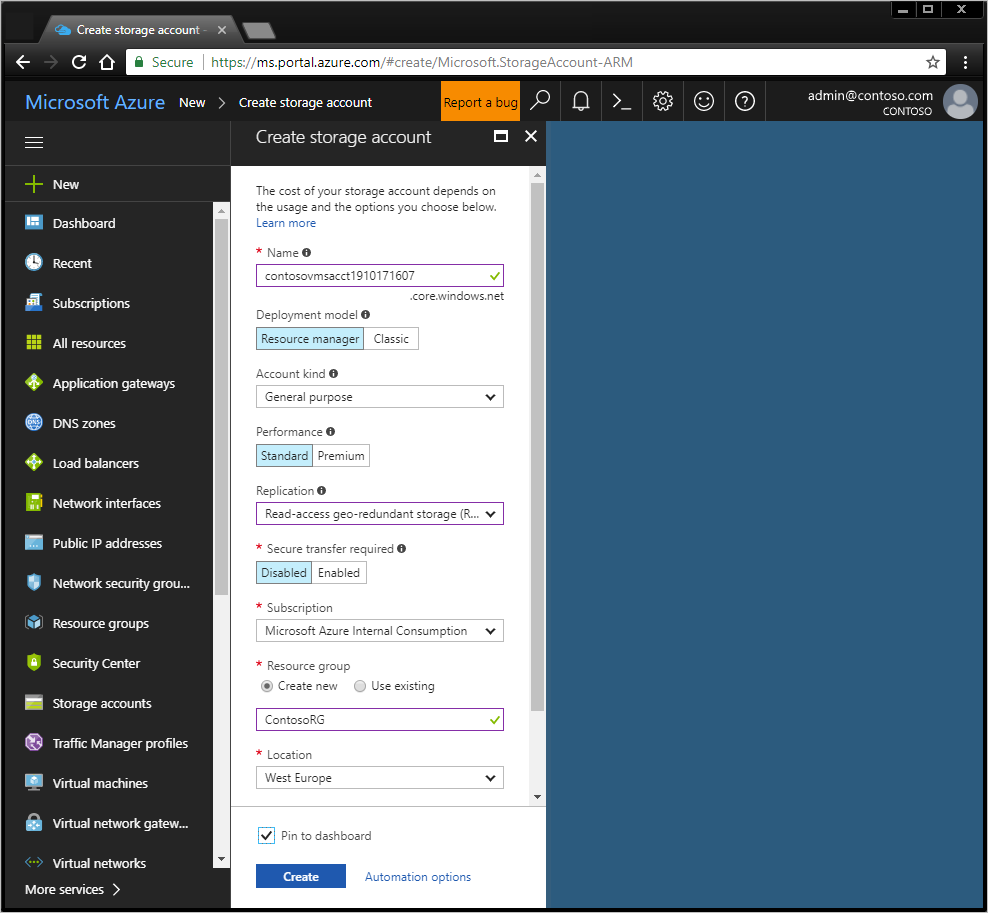

# Prepare Azure resources for replication of on-premises machines

 [Azure Site Recovery](site-recovery-overview.md) contributes to your business continuity and disaster recovery (BCDR) strategy by keeping your business apps up and running during planned and unplanned outages. Site Recovery manages and orchestrates disaster recovery of on-premises machines and Azure virtual machines (VMs), including replication, failover, and recovery.

This article is the first tutorial in a series that shows you how to set up disaster recovery for on-premises VMs. It's relevant whether you're protecting on-premises VMware VMs, Hyper-V VMs, or physical servers.

Tutorials are designed to show you the simplest deployment path for a scenario. They use default options where possible, and don't show all possible settings and paths. 

This article shows you how to prepare Azure components when you want to replicate on-premises VMs (Hyper-V or VMware) or Windows/Linux physical servers to Azure. In this tutorial, you learn how to:

> [!div class="checklist"]
> * Verify that your Azure account has replication permissions.
> * Create an Azure storage account. Images of replicated machines are stored in it.
> * Create a Recovery Services vault. A vault holds metadata and configuration information for VMs, and other replication components.
> * Set up an Azure network. When Azure VMs are created after failover, they're joined to this Azure network.

If you don't have an Azure subscription, create a [free account](https://azure.microsoft.com/pricing/free-trial/) before you begin.

## Sign in to Azure

Sign in to the [Azure portal](http://portal.azure.com).

## Verify account permissions

If you just created your free Azure account, you're the administrator of your subscription. If you're not the subscription administrator, work with the administrator to assign the permissions you need. To enable replication for a new virtual machine, you must have permission to:

- Create a VM in the selected resource group.
- Create a VM in the selected virtual network.
- Write to the selected storage account.

To complete these tasks your account should be assigned the Virtual Machine Contributor built-in role. In addition, to manage Site Recovery operations in a vault, your account should be assigned the Site Recovery Contributor build-in role.

## Create a storage account

Images of replicated machines are held in Azure storage. Azure VMs are created from the storage when you fail over from on-premises to Azure. The storage account must be in the same region as the Recovery Services vault. We're using West Europe in this tutorial.

1. On the [Azure portal](https://portal.azure.com) menu, select **Create a resource** > **Storage** > **Storage account - blob, file, table, queue**.
2. On **Create storage account**, enter a name for the account. For these tutorials, we're using **contosovmsacct1910171607**. The name you select must be unique within Azure and be between 3 and 24 characters, with numbers and lowercase letters only.
3. In **Deployment model**, select **Resource Manager**.
4. In **Account kind**, select **Storage (general purpose v1)**. Don't select blob storage. In **Performance**, select **Standard**. 
5. In **Replication**, select the default **Read-access geo-redundant storage** for storage redundancy. We're leaving **Secure transfer required** as **Disabled**.
6. In **Subscription**, select the subscription in which you want to create the new storage account. 
2. In **Resource group**, enter a new resource group. An Azure resource group is a logical container into which Azure resources are deployed and managed. For these tutorials, we're using **ContosoRG**.
3. In **Location**, select the geographic location for your storage account. 

   

9. Select **Create** to create the storage account.

## Create a Recovery Services vault

1. In the Azure portal, select **Create a resource** > **Storage** > **Backup and Site Recovery (OMS)**.
2. In **Name**, enter a friendly name to identify the vault. For this set of tutorials we're using **ContosoVMVault**.
3. In **Resource group**, we're using **contosoRG**.
4. In **Location**. We're using **West Europe**.
5. To quickly access the vault from the dashboard, select **Pin to dashboard** > **Create**.

   

   The new vault appears on **Dashboard** > **All resources**, and on the main **Recovery Services vaults** page.

## Set up an Azure network

When Azure VMs are created from storage after failover, they're joined to this network.

1. In the [Azure portal](https://portal.azure.com), select **Create a resource** > **Networking** > **Virtual network**.
2. We're leaving **Resource Manager** selected as the deployment model.
3. In **Name**, enter a network name. The name must be unique within the Azure resource group. We're using **ContosoASRnet** in this tutorial.
4. Specify the resource group in which the network will be created. We're using the existing resource group **contosoRG**.
5. In **Address range**, enter the range for the network **10.0.0.0/24**. In this network we're not using a subnet.
6. In **Subscription**, select the subscription in which to create the network.
7. In **Location**, select **West Europe**. The network must be in the same region as the Recovery Services vault.
8. We're leaving the default options of basic DDoS protection, with no service endpoint on the network.
9. Click **Create**.

   

   The virtual network takes a few seconds to create. After it's created, you see it in the Azure portal dashboard.

## Useful links

- [Learn about](https://docs.microsoft.com/azure/virtual-network/virtual-networks-overview) Azure networks.
- [Learn about](https://docs.microsoft.com/azure/storage/common/storage-introduction#types-of-storage-accounts) types of Azure storage.
- - [Learn more](https://docs.microsoft.com/azure/storage/common/storage-redundancy-grs#read-access-geo-redundant-storage) about storage redundancy, and [secure transfer](https://docs.microsoft.com/azure/storage/common/storage-require-secure-transfer) for storage.

## Next steps

> [!div class="nextstepaction"]
> [Prepare the on-premises VMware infrastructure for disaster recovery to Azure](tutorial-prepare-on-premises-vmware.md)
