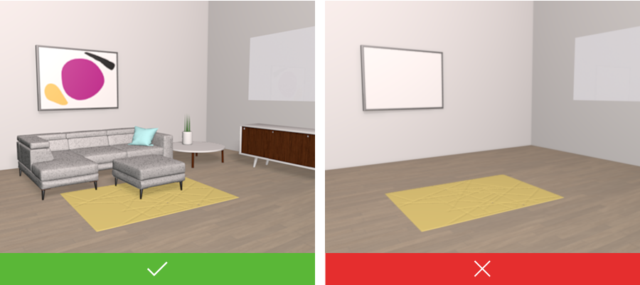
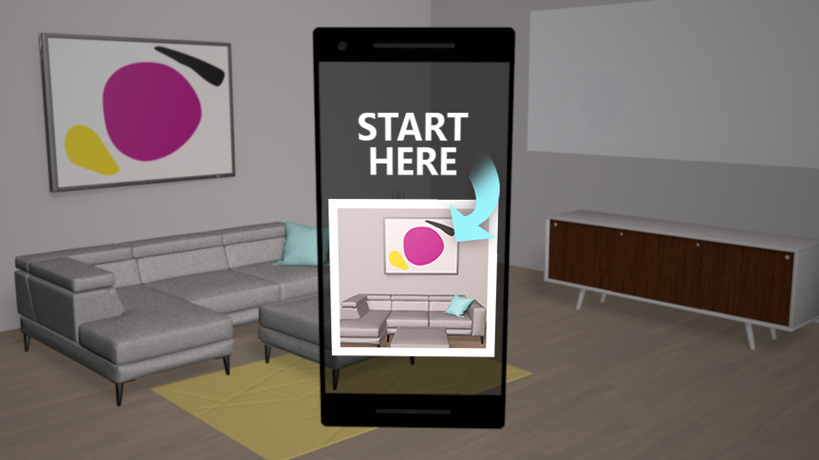
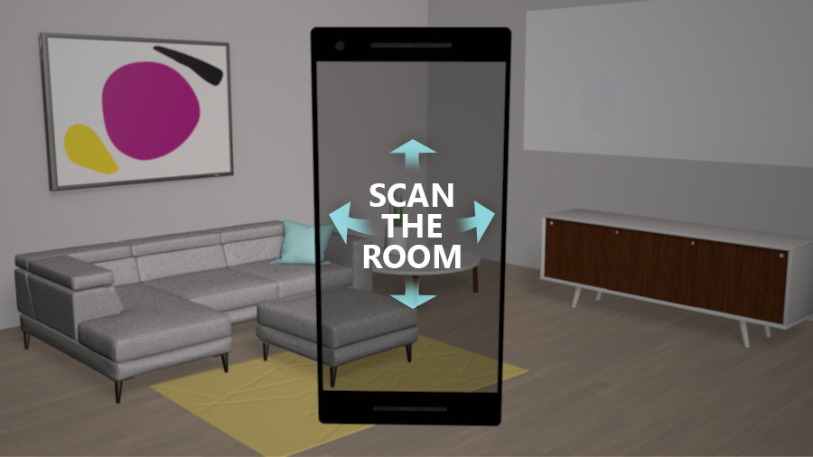

# Guidelines for effective anchor experiences in Azure Spatial Anchors

This article provides guidelines and considerations for creating and locating anchors effectively with Azure Spatial Anchors.

## Creating anchors

Creating good anchors is one of the most impactful aspects of working with Azure Spatial Anchors. It's important to invest the time in either educating or guiding users in your UX how to create good anchors. By investing in anchor creation up front, you enable end users to reliably locate anchors:

- Across different devices
- At various times
- At different lighting conditions
- From the desired perspectives within the space
- Etc.

Below are considerations and guidelines to help you design your anchor creation and location experience.

## Static and dynamic locations

Part of designing the anchor experience will be choosing the locations that participate. Will the locations be static and defined by an administrator of the space? Or will they be dynamic and user-defined?

A retail store manager may want a static in-store experience to entice users to visit. Whereas the developer of a mixed reality board game likely wants to let users choose where to play.

For static locations, you can educate administrators to spend time curating the space with good anchors.

For dynamic locations, you should think about how you educate or guide users in your UX to create good anchors.

## Stable visual features

Visual tracking systems used in mixed reality and augmented reality devices rely on visual features of the environment. To get the most reliable experience:  

- DO create anchors in locations with stable visual features (that is, features that don't change often).

- DON'T create anchors on large blank surfaces with no distinguishing characteristics.

- DON'T create anchors on highly reflective materials.

- DON'T create anchors on surfaces where the only pattern is repeating, such as carpet or wallpaper.

## Consider various viewing perspectives

When creating an anchor, think about the people that will visit later to locate the anchor.

Consider, for example, an anchor in the middle of a room with two doors. You likely want to allow users that enter the room from either door to locate the anchor. When creating the anchor, you will need to scan its position from both doorways. This captures environment data around the anchor from both perspectives so that users can locate the anchor from either door.

In general, when creating an anchor, it should be scanned from the different places or perspectives you expect people to be standing when attempting to locate it.  

If you are placing virtual content on an outdoor sculpture, it makes sense to walk around the sculpture, while looking at it, as you create the anchor.  

On the other hand, if your anchor is in the corner of a room, there is only one direction to approach it from. When creating the anchor, it simply needs to be scanned from this perspective.

## Multiple anchors

Lighting can make a difference in the visual features that are detected. Anchors created in strong natural light might be hard to locate after dark under artificial lighting, and vice versa.  

If you experience this issue, it can help to create two anchors – one in the daylight and another under artificial lighting – at the same spot. Your app can then query for both anchors. If either are located, the app will have a pose for the anchor. 

Similarly, in environments where the visual features change because most objects move, multiple anchors can help. When an anchor becomes too difficult to locate due to significant changes in the environment, you can replace it with a new one. This might be the case, for example, in a retail store where the layout is refreshed every few months.

## Targets and rooms

In many cases, locating an anchor represents an entry-point to your app's unique experience. You'll want to get through this step quickly and reliably so users can enter your experience. Spending time on how users will find your anchors is an important design step. It's helpful to think about this in terms of two broad scenarios: **Targets** and **Rooms**.

### Targets

In the target scenario, the location of an anchor is well known. For example, in a fictional MR painting app, one user places a virtual canvas on the wall. She instructs the other users in the room to point their devices at the same place on the wall to locate the anchor and begin the experience.  

Another example of a target scenario might be a sign stating “scan for deals” while waiting in line at a coffee shop. The coffee shop has previously placed an anchor here. As users scan the sign, they locate the anchor and enter the AR experience for deals on coffee.

In the target scenario, photos can help. If you can show users a photo on their device of the intended target, they can quickly identify what to scan in the real world. For example, you might help your users arrive within the general vicinity of an intended target using GPS. Once the user arrives, your app shows a photo of the target. The user looks around the space, finds the target and proceeds to scan for the anchor.

### Rooms

In the room scenario, users enter a space simply knowing there's an anchor here somewhere. Users scan the space with their device, and quickly locate the anchor.

Achieving this experience typically requires creating well-curated anchors as discussed in [Consider various viewing perspectives](#consider-various-viewing-perspectives) earlier. If the room was scanned from many perspectives when creating the anchor, then users can scan almost anywhere when trying to locate it.

Essentially, the person creating the anchor spends more time scanning the space, so people that come later can scan and locate the anchor quickly. This is an important trade-off you will need to consider for your experience.

The MR painting app discussed earlier is an example that isn't well suited as a room scenario. Here, the user placing the anchor wants the others to join the experience quickly. The users do not want to wait until the room is well-scanned in order to start the experience. Since all users know exactly where to point their device to locate the anchors, this scenario is better treated as a target scenario.

## Effectively locating anchors

Visual tracking systems rely on the visual features of an environment to function. The more visual features are part of a scan, the higher the likelihood of finding an anchor.

There are some general guidelines you can follow to build a user experience that encourages a useful scan of the environment.

First, if the user doesn't locate an anchor within a few seconds, the app should encourage users to move the device so that more perspectives are captured.  The app can also encourage users themselves to move around the environment while scanning for the anchor from more perspectives. The more perspectives from which the device sees the same points the better.

For Target scenarios, ask the user to move around the target, all while viewing it from different perspectives. In other words, ask the user to move their feet to capture the target from new perspectives until the anchor is located.

For Room scenarios, ask the user to slowly scan the room. For example, ask the user to rotate to capture 180 or even 360 degrees of the room. Or ask the user to move to a new perspective in the room. The most meaningful means of scanning is to scan across the room. This captures more visual features of the environment than say scanning a nearby wall. Scanning a nearby wall does not capture as much useful visual features of the environment.

It's not helpful to move the device side-to-side over and over when looking for an anchor. This would simply capture the same points from the same perspective.

## Testing the experience

The above are general guidelines. With Azure Spatial Anchors, you are writing apps that interact with the real-world. As such, it's important to devote time to testing your app's anchor scenarios in real environments. This is especially true for environments that are representative of where you expect your users to use the app.