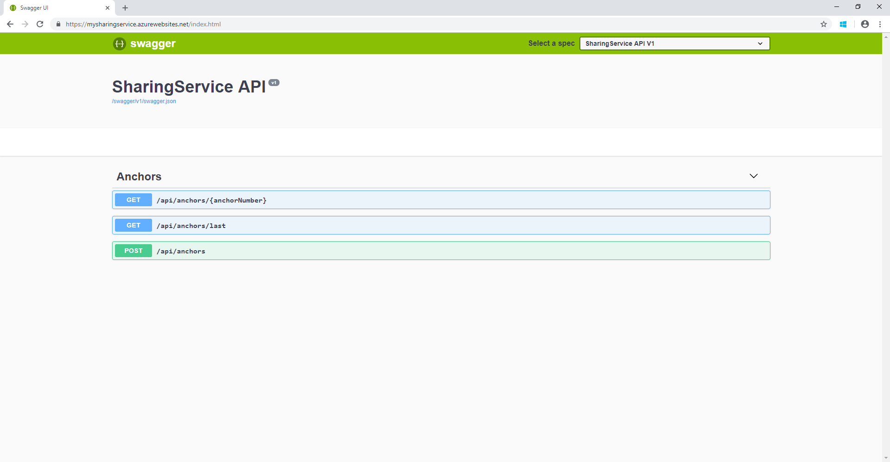

# Tutorial: Sharing Anchors Across Device

[Spatial Anchors](../overview.md) is a cross-platform developer service that allows you to create Mixed Reality experiences
using objects that persist their location across devices over time. This tutorial covers how to share Spatial Anchors that you have created across other devices. When you're finished, you'll have an app that can be deployed to two or more devices, where Spatial Anchors created by one instance can be shared to the others.

You'll learn how to:

> [!div class="checklist"]
> * Deploy an ASP.NET Core Web App in Azure that can be used to share anchors, storing them in memory for a duration of time.
> * Configure the AzureSpatialAnchorsLocalSharedDemo scene within the Unity Sample from our Quickstarts to take advantage of the Sharing Anchors Web App.
> * Deploy and run to one or more devices.

[!INCLUDE [quickstarts-free-trial-note](../../../includes/quickstarts-free-trial-note.md)]

## Prerequisites

To complete this tutorial, make sure you have:

* A Windows machine with <a href="https://www.visualstudio.com/downloads/" target="_blank">Visual Studio 2017</a> installed with the **ASP.NET and web development** workload.
* The [.NET Core 2.2 SDK](https://dotnet.microsoft.com/download).
* One or more devices (iOS or Android) to deploy and run.
  * If using Android:
    * <a href="https://developer.android.com/studio/" target="_blank">Android Studio</a> and <a href="https://unity3d.com/get-unity/download" target="_blank">Unity 2018.2+</a> installed on your Windows machine.
    * An <a href="https://developers.google.com/ar/discover/supported-devices" target="_blank">ARCore capable</a> Android device.
  * If using iOS:
    * A macOS machine with <a href="https://geo.itunes.apple.com/us/app/xcode/id497799835?mt=12" target="_blank">Xcode 9.4+</a>, <a href="https://cocoapods.org" target="_blank">CocoaPods</a> and <a href="https://unity3d.com/get-unity/download" target="_blank">Unity 2018.2+</a> installed.
    * A developer enabled <a href="https://developer.apple.com/documentation/arkit/verifying_device_support_and_user_permission" target="_blank">ARKit compatible</a> iOS device.

[!INCLUDE [Create Spatial Anchors resource](../../../includes/spatial-anchors-get-started-create-resource.md)]

## Deploy your Sharing Anchors Service

Open Visual Studio, and open the project at the `Sharing\SharingServiceSample` folder.

### Launch the publish wizard

In the **Solution Explorer**, right-click the **SharingService** project and select **Publish**.

The publish wizard is automatically launched. Select **App Service** > **Publish** to open the **Create App Service** dialog.

### Sign in to Azure

In the **Create App Service** dialog, click **Add an account**, and sign in to your Azure subscription. If you're already signed in, select the account you want from the dropdown.

> [!NOTE]
> If you're already signed in, don't select **Create** yet.
>

### Create a resource group

[!INCLUDE [resource group intro text](../../../includes/resource-group.md)]

Next to **Resource Group**, select **New**.

Name the resource group **myResourceGroup** and select **OK**.

### Create an App Service plan

[!INCLUDE [app-service-plan](../../../includes/app-service-plan.md)]

Next to **Hosting Plan**, select **New**.

In the **Configure Hosting Plan** dialog, use the settings in the table.

| Setting | Suggested Value | Description |
|-|-|-|
|App Service Plan| MySharingServicePlan | Name of the App Service plan. |
| Location | West US | The datacenter where the web app is hosted. |
| Size | Free | [Pricing tier](https://azure.microsoft.com/pricing/details/app-service/?ref=microsoft.com&utm_source=microsoft.com&utm_medium=docs&utm_campaign=visualstudio) determines hosting features. |

Select **OK**.

### Create and publish the web app

In **App Name**, type a unique app name (valid characters are `a-z`, `0-9`, and `-`), or accept the automatically generated unique name. The URL of the web app is `http://<app_name>.azurewebsites.net`, where `<app_name>` is your app name.

Select **Create** to start creating the Azure resources.

Once the wizard completes, it publishes the ASP.NET Core web app to Azure, and then launches the app in the default browser.

The app name specified in the [create and publish step](#create-and-publish-the-web-app) is used as the URL prefix in the format `http://<app_name>.azurewebsites.net`. Take note of this URL as it will be used later on.

## Open the sample project in Unity

[!INCLUDE [Clone Sample Repo](../../../includes/spatial-anchors-clone-sample-repository.md)]

## To setup for an Android Device

[!INCLUDE [Android Unity Build Settings](../../../includes/spatial-anchors-unity-android-build-settings.md)]

## To setup for an iOS Device

[!INCLUDE [iOS Unity Build Settings](../../../includes/spatial-anchors-unity-ios-build-settings.md)]

## Configure the Spatial Anchors endpoint, account key, and Sharing Service url

In the **Project** pane, navigate to `Assets/AzureSpatialAnchorsPlugin/Examples` and open the `AzureSpatialAnchorsLocalSharedDemo.unity` scene file.

[!INCLUDE [Configure Unity Scene](../../../includes/spatial-anchors-unity-configure-scene.md)]

Also, in the **Inspector** pane, enter the `Sharing Anchors Service url` (from the ASP.NET web app Azure deployment performed earlier) as the value for `Base Sharing Url`, replacing `index.html` with `api/anchors`. So, it should look like: `https://<app_name>.azurewebsites.net/api/anchors`.

Save the scene by selecting **File** -> **Save Scene**.

## To deploy to an Android device

Power on the Android device, sign in, and connect it to the PC using a USB cable.

Open **Build Settings** by selecting **File** -> **Build Settings**.

Click **Build And Run**.

Follow the instructions in the app. You can choose to **Create & Share Anchor** (allowing you to create an Anchor that can be later on located on the same device or a different one) or **Locate Shared Anchor** (if you have previously run the app, either on the same device or a different one, allowing you to locate shared anchors).

## To deploy to an iOS device

Open **Build Settings** by selecting **File** -> **Build Settings**.

[!INCLUDE [Configure Xcode](../../../includes/spatial-anchors-unity-ios-xcode.md)]

Follow the instructions in the app. You can choose to **Create & Share Anchor** (allowing you to create an Anchor that can be later on located on the same device or a different one) or **Locate Shared Anchor** (if you have previously run the app, either on the same device or a different one, allowing you to locate shared anchors).

In Xcode, stop the app by pressing **Stop**.

[!INCLUDE [Clean-up section](../../../includes/clean-up-section-portal.md)]
