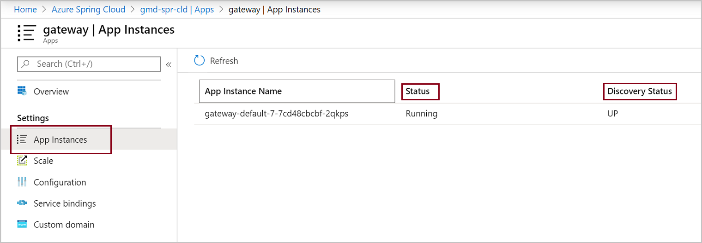

# Understanding app status in Azure Spring Cloud

The Azure Spring Cloud UI delivers information about the status of running applications.  There is an **Apps** option for each resource group in a subscription that displays general status of application types.  For each application type there is display of **Application instances**.

## Apps status
To view general status of an application type, select **Apps** in the left navigation pane of a resource group. The result will be display of the status of the deployed app and its discovery status:
* DeploymentStatus: Whether the app is deployed or its state
* DiscoveryStatus: The registered status of the app in Eureka server, which is the same as the definition in Eureka

 

The Deployment status is reported as one of the following values:

The Discovery status is reported as one of the following values:

## App instances status

To view the status of a specific instance of a deployed app, click the **Name** of the app in the **Apps** UI. The results will display:
* AppInstance.status: Whether the instance is running or its state
* DiscoveryStatus: The registered status of the app instance in Eureka server

 

The instance status is reported as one of the following values:

The discovery status of the instance is reported as one of the following values:

## See also
* [Prepare a Java Spring application for deployment in Azure Spring Cloud](spring-cloud-tutorial-prepare-app-deployment.md)