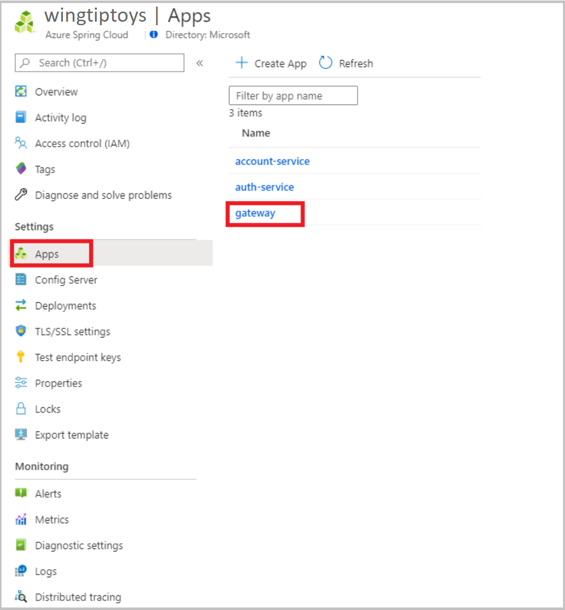
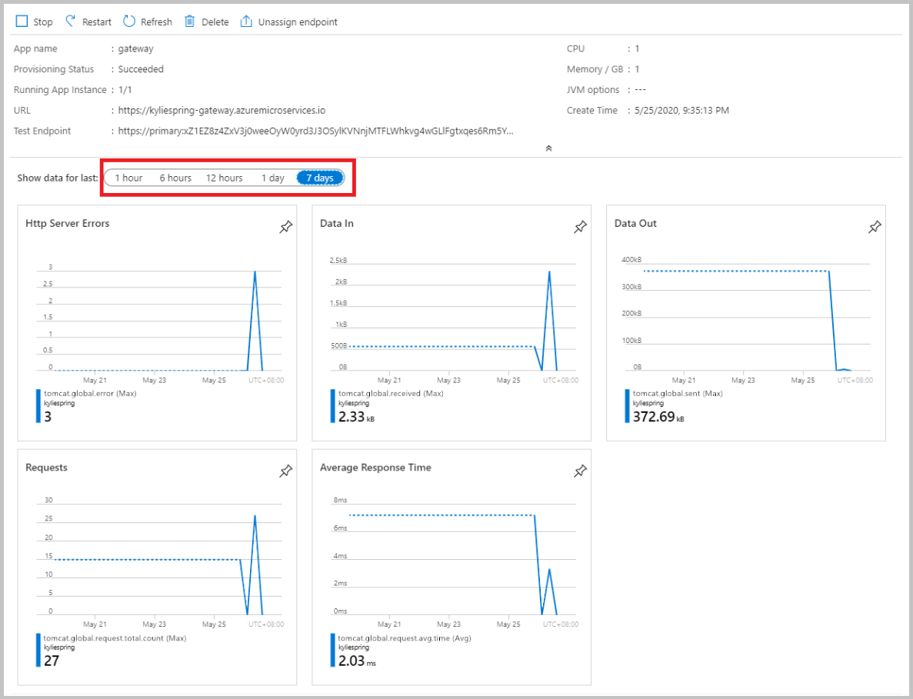

# Metrics for Azure Spring Cloud

Azure Metrics explorer is a component of the Microsoft Azure portal that allows plotting charts, visually correlating trends, and investigating spikes and dips in metrics. Use the metrics explorer to investigate the health and utilization of your resources. 

In Azure Spring Cloud, there are two view point for metrics.
* Charts in each application overview page
* Common metrics page

 

Charts in the application **Overview** provides quick status check for each application. The common **Metrics** page contains all metrics available for reference. You can build your own charts in the common metrics page and pin them in Dashboard.

## Application Overview page
Select an app in **App Management** to find charts in the overview page.  

 

Each application's **Application Overview** page presents a metrics chart that allows you to perform a quick status check of your application.  

 

We provide 5 charts with metrics updated every minute for the following:

* **Http Server Errors**: Error count for HTTP requests to your app.
* **Data In**: Bytes received by your app.
* **Data Out**: Bytes sent to your app.
* **Requests**: Requests received by your app.
* **Average Response Time**: Average response time from your app.

You can select a time range for the chart between 1 hour up to 7 Days.

## Service-level metric queries

Azure Spring Cloud allows you to monitor a variety of application metrics. Review the [guide to getting started](https://docs.microsoft.com/azure/azure-monitor/platform/metrics-getting-started) with Azure Monitor Metrics to learn more about this service.

To review metric data, you will select your metric, your **Aggregation**, and your time range.  These concepts are explained below.

### Aggregation 

Azure polls and updates metrics every minute. Azure provides three ways to aggregate data for a chosen time period:

* **Total**: Sum all metrics as target output.
* **Average**: Use the Average value in the period as target output.
* **Max/Min**: Use the Max/Min value in the period as target output.

### Time range

Select a default time range or define your own.

### Modifying the granularity of your metric query

By default, Azure aggregates metrics for all of an Azure Spring Cloud service's applications. To review metrics at the application or instance level, use the filter function.  
Select **Add filter**, set the property to **App** and select the target application you want to monitor. Optionally, use the **Apply splitting** option to draw separate lines for each app in the chart.

>[!TIP]
> You can build your own charts in metrics page and pin them to your **Dashboard**. Start by naming your chart.  Next, select **Pin to dashboard in the top right corner**. You can now check on your application at your Portal **Dashboard**.