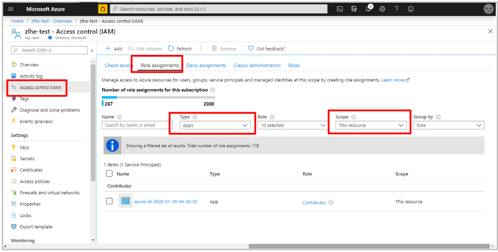
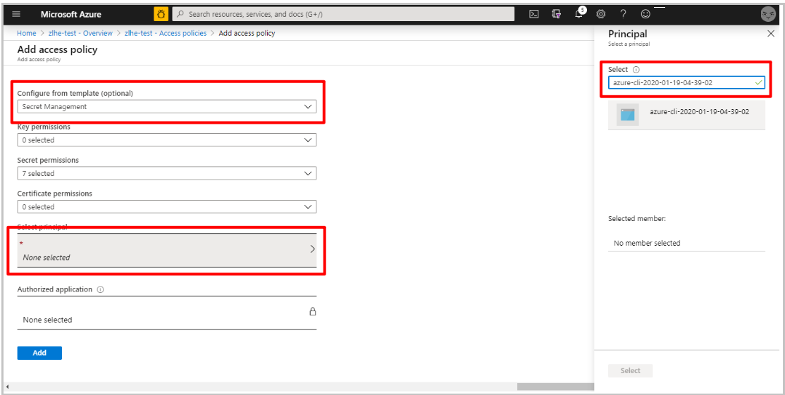
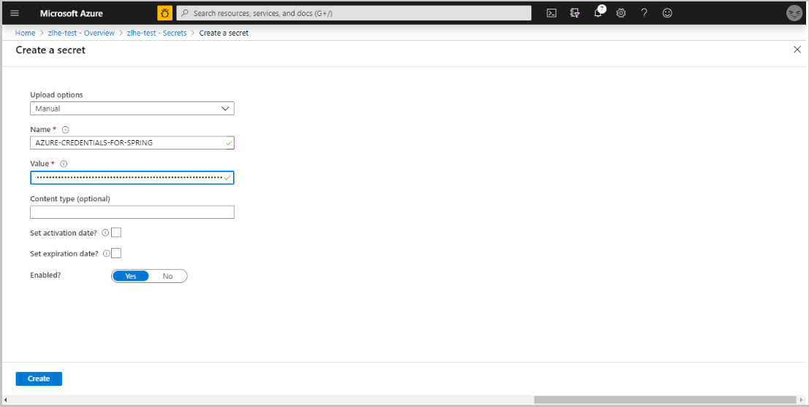

# GitHub Spring Cloud actions using key vault
Key Vault is a secure place to store keys. Enterprise users need to store credentials for CI/CD environments in scope that they control. The key to get credentials in the key vault should be limited to resource scope.  The key to get credentials only has access to the key vault scope, not the entire Azure scope. It's like a key that can only open a strongbox not a master key that can open all doors in a building. It is a way to get a key with another key, but useful in a CICD workflow. 

## Generate Credential to Access to Key Vault
To generate the key to open the strongbox, execute command below on you local machine:
```
az ad sp create-for-rbac --role contributor --scopes /subscriptions/<SUBSCRIPTION_ID>/resourceGroups/<RESOURCE_GROUP>/providers/Microsoft.KeyVault/vaults/<KEY_VAULT> --sdk-auth
```
Note the scope specified by the `--scopes` parameter, which limits the key access to the resource.  It can only access the strongbox.

With results:
```
{
    "clientId": "<GUID>",
    "clientSecret": "<GUID>",
    "subscriptionId": "<GUID>",
    "tenantId": "<GUID>",
    "activeDirectoryEndpointUrl": "https://login.microsoftonline.com",
    "resourceManagerEndpointUrl": "https://management.azure.com/",
    "activeDirectoryGraphResourceId": "https://graph.windows.net/",
    "sqlManagementEndpointUrl": "https://management.core.windows.net:8443/",
    "galleryEndpointUrl": "https://gallery.azure.com/",
    "managementEndpointUrl": "https://management.core.windows.net/"
}
```
Then save the results to GitHub **secrets** as described in[Set up your GitHub repository and authenticate with Azure](./spring-cloud-howto-github-actions.md#set-up-your-github-repository-and-authenticate-with-azure).

## Add Access Policies for the Credential
The credential created above can only get general information about the Key Vault, not the contents it stores.  To get secrets stored in the Key Vault, you need set access policies for the credential.

Go to the **Key Vault** dashboard in Azure Portal, click the **Access control** menu, then open the **Role assignments** tab. Select **Apps** for **Type**, `This resource` for **scope**.  You should see the credential you created in previous step:

 

Copy the credential name, for example, `azure-cli-2020-01-19-04-39-02`. Open the **Access policies** menu, click +Add Access Policy link.  Select `Secret Management` for **Template**, then select **Principal**. Paste the credential name in **Principal**/**Select** input box:

 

 Click the Add button in the **Add access policy** dialog, then click **Save**.

## Generate full-scope Azure Credential
This is the master key to open all doors in the building. The procedure is similar to the first step, but now we change the scope to generate the master key:

```
az ad sp create-for-rbac --role contributor --scopes /subscriptions/<SUBSCRIPTION_ID> --sdk-auth
```

Again, results:
```
{
    "clientId": "<GUID>",
    "clientSecret": "<GUID>",
    "subscriptionId": "<GUID>",
    "tenantId": "<GUID>",
    "activeDirectoryEndpointUrl": "https://login.microsoftonline.com",
    "resourceManagerEndpointUrl": "https://management.azure.com/",
    "activeDirectoryGraphResourceId": "https://graph.windows.net/",
    "sqlManagementEndpointUrl": "https://management.core.windows.net:8443/",
    "galleryEndpointUrl": "https://gallery.azure.com/",
    "managementEndpointUrl": "https://management.core.windows.net/"
}
```
Copy the entire JSON string.  Bo back to **Key Vault** dashboard. Open the **Secrets** menu, then click the **Generate/Import** button. Input the secret name, such as `AZURE-CRENDENTIALS-FOR-SPRING`. Paste the JSON credential string to the **Value** input box. You may notice the value input box is a one-line text feild, rather then a multi-line text area.  You can paste the complete JSON string there.

 

## Combine all credentials in GitHub Actions
Set the credentials used when the CICD pipeline executes:

```
on: [push]

jobs:
  build:
    runs-on: ubuntu-latest
    steps:
    - uses: azure/login@v1
      with:
        creds: ${{ secrets.AZURE_CREDENTIALS }}           # Strongbox key you generated in the first step
    - uses: Azure/get-keyvault-secrets@v1.0
      with:
        keyvault: "zlhe-test"
        secrets: "AZURE-CREDENTIALS-FOR-SPRING"           # Master key to open all doors in the building
      id: keyvaultaction
    - uses: azure/login@v1
      with:
        creds: ${{ steps.keyvaultaction.outputs.AZURE-CREDENTIALS-FOR-SPRING }}
    - name: Azure CLI script
      uses: azure/CLI@v1
      with:
        azcliversion: 2.0.75
        inlineScript: |
          az extension add --name spring-cloud             # Spring CLI commands from here
          az spring-cloud list

```

## Next steps
* [Spring Cloud GitHub Actions](./spring-cloud-howto-github-actions.md)