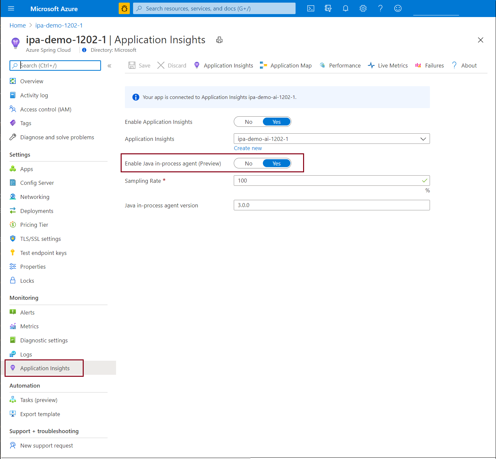
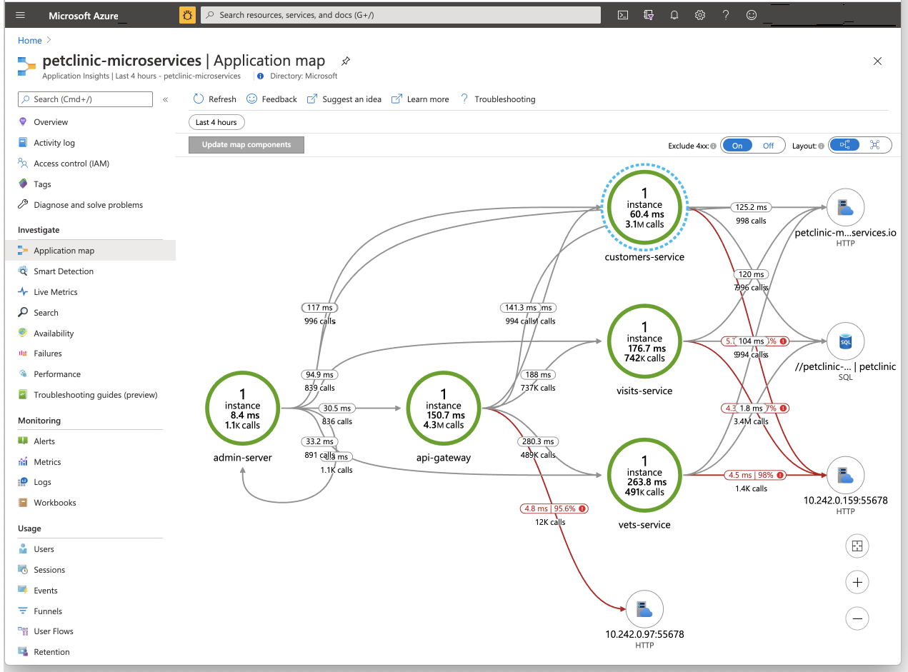
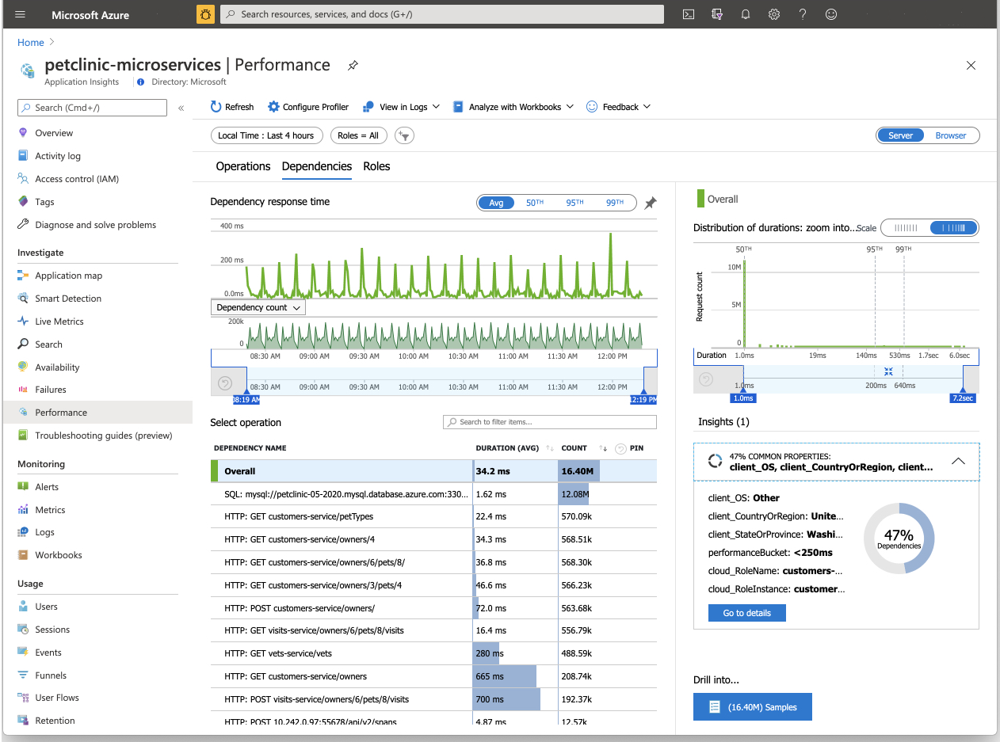
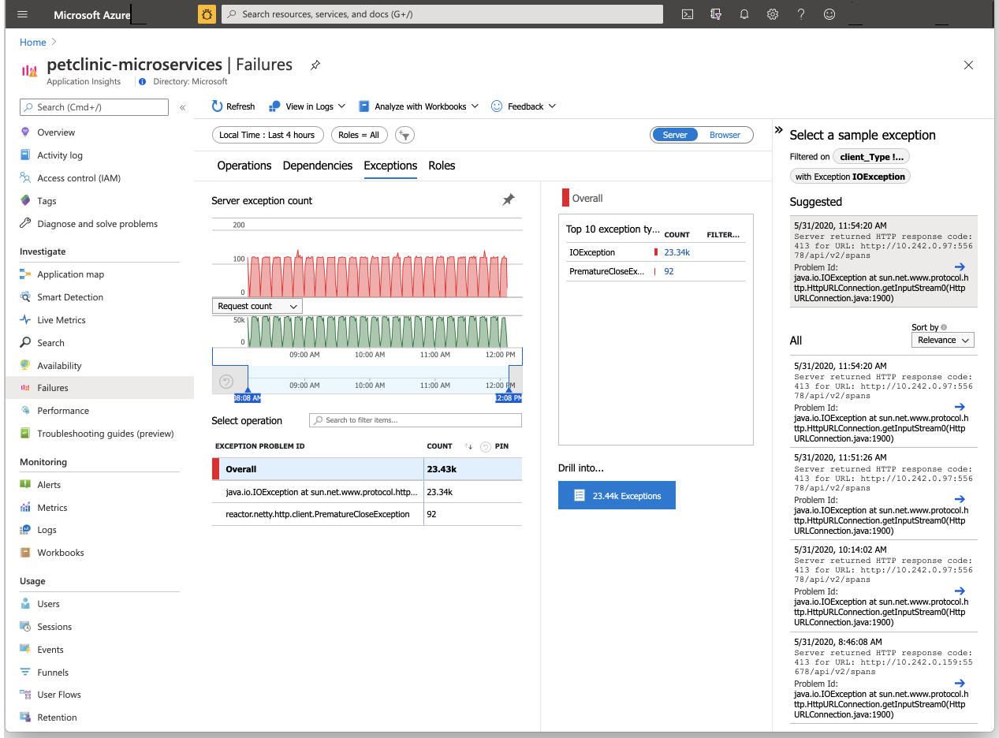
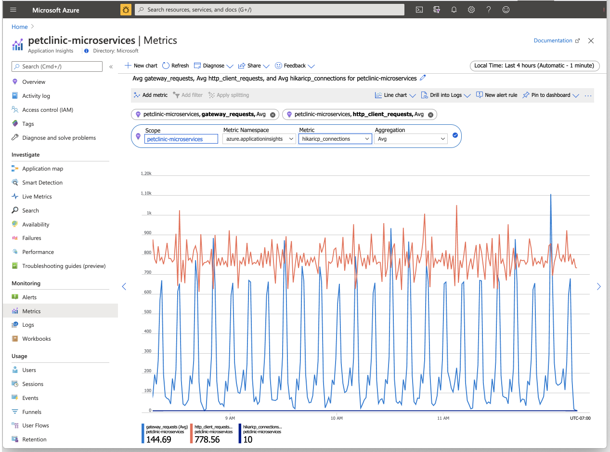

# Application Insights Java In Process Agent (Preview)

This document explains how to monitor apps and microservices using the Application Insights Java agent in Azure Spring Cloud.

With this feature you can:

* Search tracing data with different filters.
* View dependency map of microservices.
* Check request performance.
* Monitoring real-time live metrics.
* Check request failures.
* Check application metrics.

## Prerequisite

Enable the Application Insights Java agent using the following procedures.

## Enable Java in process agent

Enable Java in process agent preview feature using the following procedure.

1. Go to service overview page of your service instance.
2. Click **Application Insights** entry under monitoring blade.
3. Click **Enable Application Insights** button to enable **Application Insights** integration.
4. Select an existing Application Insights or create a new Application Insights.
5. Chick **Enable Java in-process agent** to enable preview Java in-process agent feature. Here you can also customize sampling rate from 0 to 100.
6.  Click **Save** to save the change.

## Portal

1. Go to the **service | Overview** page and select **Application Insights** in the **Monitoring** section. 
2. Click **Enable Application Insights** to enable Application Insights on Azure Spring Cloud.
3. Click **Enable Java in-process agent** to enable Java IPA preview feature. When an IPA preview feature is enabled, you can configure one optional sampling rate (default 10.0%).

  [ ](media/spring-cloud-application-insights/insights-process-agent-0.png)

## Using the Application Insights feature

When the **Application Insights** feature is enabled, you can:

In the left navigation pane, click **Application Insights** to jump to the **Overview** page of Application Insights.

* Click **Application Map** to see the status of calls between applications.

  [ ](media/spring-cloud-application-insights/insights-process-agent-2-map.png)

* Click the link between customers-service and `petclinic` to see more details such as a query from SQL.

* In the left navigation pane, click `Performance` to see the performance data of all applications' operations, as well as dependencies and roles.

  [ ](media/spring-cloud-application-insights/insights-process-agent-4-performance.png)


* In the left navigation pane, click **Failures** to see if something unexpected from your applications.

  [ ](media/spring-cloud-application-insights/insights-process-agent-6-failures.png)

* Finally, you can click **Metrics** in the left navigation pane of the **Application Insights** page and select `customer | azure.applicationInsights` namespace.

  [ ](media/spring-cloud-application-insights/insights-process-agent-5-metrics.png)

## ARM Template
To use the Azure Resource Manager template, copy following content to `azuredeploy.json`.

```json
{
    "$schema": "https://schema.management.azure.com/schemas/2019-04-01/deploymentTemplate.json#",
    "contentVersion": "1.0.0.0",
    "resources": [
        {
            "type": "Microsoft.AppPlatform/Spring",
            "name": "customize this",
            "apiVersion": "2020-07-01",
            "location": "[resourceGroup().location]",
            "resources": [
                {
                    "type": "monitoringSettings",
                    "apiVersion": "2020-11-01-preview",
                    "name": "default",
                    "properties": {
                        "appInsightsInstrumentationKey": "00000000-0000-0000-0000-000000000000",
                        "appInsightsSamplingRate": 88.0
                    },
                    "dependsOn": [
                        "[resourceId('Microsoft.AppPlatform/Spring', 'customize this')]"
                    ]
                }
            ],
            "properties": {}
        }
    ]
}
```

Then apply ARM template with the CLI command:

```
az deployment group create --name "customize this" -g "customize this" --template-file ./azuredeploy.json
```

## See also