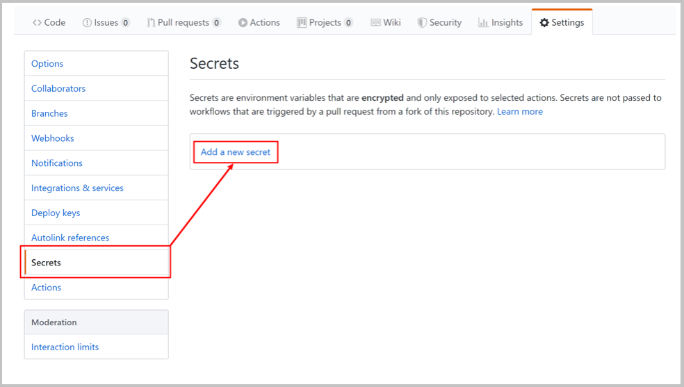
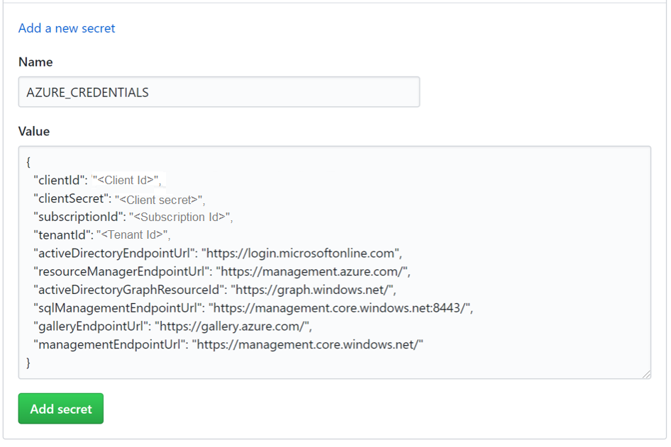
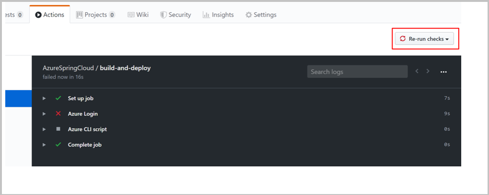

# Azure Spring Cloud CI/CD with GitHub Actions

GitHub Actions support an automated software development lifecycle workflow. With GitHub Actions for Azure Spring Cloud you can create workflows in your repository to build, test, package, release, and deploy to Azure. 

## Prerequisites
This example requires the [Azure CLI](https://docs.microsoft.com/en-us/cli/azure/install-azure-cli?view=azure-cli-latest)

## Set up your GitHub repository and authenticate with Azure
You need an Azure service principle credential to authorize Azure login action. To get an Azure credential, execute the following commands on your local machine:
```
az login
az ad sp create-for-rbac --role contributor --scopes /subscriptions/<SUBSCRIPTION_ID> --sdk-auth 
```
To access to a specific resource group, you can reduce the scope:
```
az ad sp create-for-rbac --role contributor --scopes /subscriptions/<SUBSCRIPTION_ID>/resourceGroups/{RESOURCE_GROUP} --sdk-auth
```
The command should output a JSON object:
```JSON
{
    "clientId": "<GUID>",
    "clientSecret": "<GUID>",
    "subscriptionId": "<GUID>",
    "tenantId": "<GUID>",
    ...
}
```

This example uses the [Piggy Metrics](https://github.com/Azure-Samples/piggymetrics) sample on GitHub.  Fork the sample, open GitHub repository page, and click Settings tab. Open Secrets menu, and click Add a new secret:

 

Set the secret name to AZURE_CREDENTIALS, and its value to the JSON string that you found under the heading *Set up your GitHub repository and authenticate with Azure*.

 

## Provision Azure Spring Cloud service instance
To provision your service instance, run the following commands using the Azure CLI.
```
az extension add --name spring-cloud
az group create --location eastus --name <resource group name>
az spring-cloud create -n <service instance name> -g <resource group name>
az spring-cloud config-server git set -n <service instance name> --uri https://github.com/xxx/piggymetrics --label config
```
## Build the workflow
The workflow can be defined using the following options.

### Prepare for deployment with Azure CLI
The command `az spring-cloud app create` is currently not idempotent.  We recommend this workflow on existing Azure Spring Cloud apps and instances.

Use the following Azure CLI commands for preparation:
```
az configure --defaults group=<service group name>
az configure --defaults spring-cloud=<service instance name>
az spring-cloud app create --name gateway
az spring-cloud app create --name auth-service
az spring-cloud app create --name account-service
```

### Deploy with Azure CLI directly
Create the `.github/workflow/main.yml` file in the repository:

```
name: AzureSpringCloud

env:
  GROUP: <resource group name>
  SERVICE_NAME: <service instance name>

jobs:
  build-and-deploy:
    runs-on: ubuntu-latest
    steps:
    
    - uses: actions/checkout@master
    
    - name: Set up JDK 1.8
      uses: actions/setup-java@v1
      with:
        java-version: 1.8
    
    - name: maven build, clean
      run: |
        mvn clean package -D skipTests
    
    - name: Azure Login
      uses: azure/login@v1
      with:
        creds: ${{ secrets.AZURE_CREDENTIALS }}
      
    - name: Install ASC AZ extension
      run: az extension add --name spring-cloud
   
    - name: Deploy with AZ CLI commands
      run: |
        az configure --defaults group=$GROUP
        az configure --defaults spring-cloud=$SERVICE_NAME
        az spring-cloud app deploy -n gateway --jar-path ${{ github.workspace }}/gateway/target/gateway.jar
        az spring-cloud app deploy -n account-service --jar-path ${{ github.workspace }}/account-service/target/account-service.jar
        az spring-cloud app deploy -n auth-service --jar-path ${{ github.workspace }}/auth-service/target/auth-service.jar
```
### Deploy with Azure CLI action
The az `run` command will use the latest version of Azure CLI. In case of breaking changes, you can also use a specific version of Azure CLI with azure/CLI `action`. This will run all the az command in a new container, therefore note that `env` will not work, and cross action file access may have extra restrictions.

Create the .github/workflow/main.yml file in the repository:
```
name: AzureSpringCloud

jobs:
  build-and-deploy:
    runs-on: ubuntu-latest
    steps:
    
    - uses: actions/checkout@master
    
    - name: Set up JDK 1.8
      uses: actions/setup-java@v1
      with:
        java-version: 1.8
    
    - name: maven build, clean
      run: |
        mvn clean package -D skipTests
        
    - name: Azure Login
      uses: azure/login@v1
      with:
        creds: ${{ secrets.AZURE_CREDENTIALS }}
              
    - name: Azure CLI script
      uses: azure/CLI@v1
      with:
        azcliversion: 2.0.75
        inlineScript: |
          az extension add --name spring-cloud
          az configure --defaults group=<service group name>
          az configure --defaults spring-cloud=<service instance name>
          az spring-cloud app deploy -n gateway --jar-path $GITHUB_WORKSPACE/gateway/target/gateway.jar
          az spring-cloud app deploy -n account-service --jar-path $GITHUB_WORKSPACE/account-service/target/account-service.jar
          az spring-cloud app deploy -n auth-service --jar-path $GITHUB_WORKSPACE/auth-service/target/auth-service.jar
```

## Deploy with Maven Plugin
Another option is to use the [Maven Plugin](https://docs.microsoft.com/azure/spring-cloud/spring-cloud-quickstart-launch-app-maven) for deploying the Jar and updating App settings. The command `mvn azure-spring-cloud:deploy` is idempotent and will automatically create Apps if needed. You don't need to create corresponding apps in advance.

```
name: AzureSpringCloud

jobs:
  build-and-deploy:
    runs-on: ubuntu-latest
    steps:
    
    - uses: actions/checkout@master
    
    - name: Set up JDK 1.8
      uses: actions/setup-java@v1
      with:
        java-version: 1.8
    
    - name: maven build, clean
      run: |
        mvn clean package -D skipTests
        
    # Maven plugin can cosume this authentication method automatically
    - name: Azure Login
      uses: azure/login@v1
      with:
        creds: ${{ secrets.AZURE_CREDENTIALS }}
    
    # Maven deploy, make sure you have correct configurations in your pom.xml
    - name: deploy to Azure Spring Cloud using Maven
      run: |
        mvn azure-spring-cloud:deploy
```

## Run the workflow
GitHub Actions should be enabled automatically after you push `.github/workflow/main.yml` to GitHub. The action will be triggered when you push a new commit. If you create this file in the browser, your action should have already run.

To verify your action has been enabled, click **Actions** tab on the GitHub repository page:

 

If your action runs in error, for example, you haven't set Azure credential, you can re-run checks after fixing the error. On GitHub repository page, click **Actions**, select the specific workflow task, then click Re-run checks button to re-run checks:

 

## Next steps
* [Azure Active Directory service principals](https://docs.microsoft.com/cli/azure/ad/sp?view=azure-cli-latest#az-ad-sp-create-for-rbac)
* [GitHub Actions for Azure](https://github.com/Azure/actions/)
