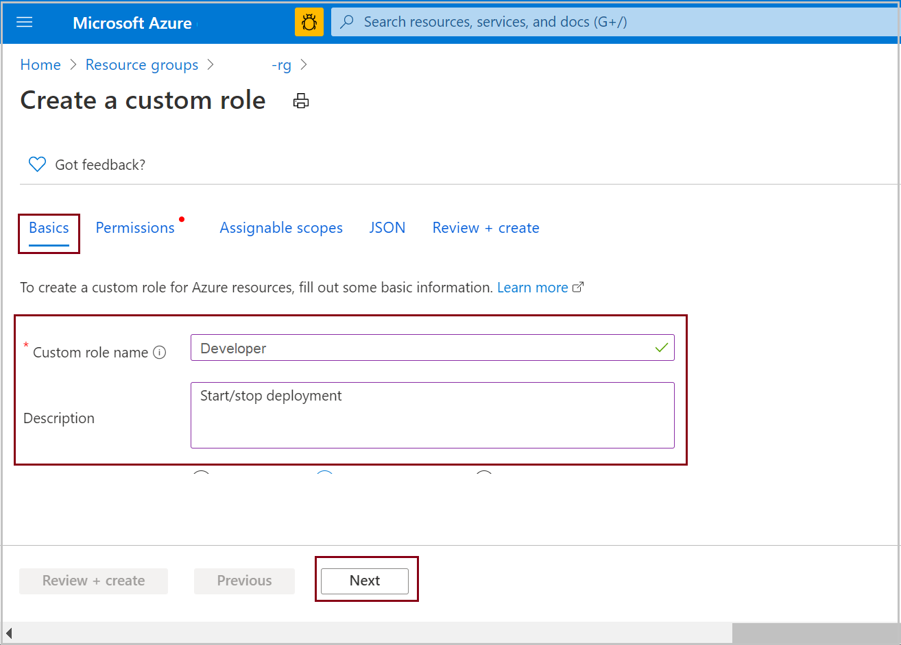
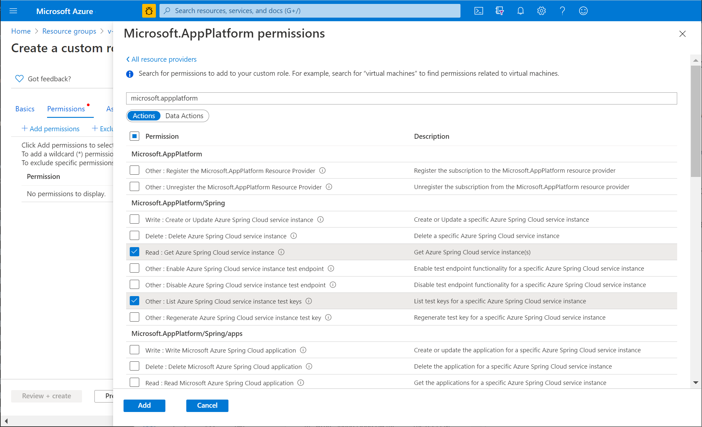

# How to use permissions in Azure Spring Cloud
You can create custom roles to delegate permissions to Azure Spring Cloud resources. Custom roles augment [built-in roles that Azure provides](https://docs.microsoft.com/azure/role-based-access-control/built-in-roles) with various stock permissions.

There are three methods of define a custom permission:
* [Clone a role](https://docs.microsoft.com/azure/role-based-access-control/custom-roles-portal#clone-a-role)
* [Start from scratch](https://docs.microsoft.com/azure/role-based-access-control/custom-roles-portal#start-from-scratch)
* [Start from JSON](https://docs.microsoft.com/azure/role-based-access-control/custom-roles-portal#start-from-json)

These examples will assume you want to create a role with specific permissions for Azure Spring Cloud.

## Navigate subscription and resource group Access control (IAM)

Follow these steps to start defining a role.

1. In the Azure portal, open the subscription and resource group where you want the custom role to be assignable.
1. Open **Access control (IAM)**.
1. Click **+ Add**.
1. Click **Add custom role**.

   

## Define role to deploy, test, and restart apps
This procedure defines a role with permissions to deploy, test, and restart Azure Spring Cloud apps.

1. In the **Create custom role** dialog add role name and description.
1. Click **Next**.

   

1. Click **Add permissions**.

   

1. In the search box, search for *Microsoft.app*.
1. Select *Microsoft Azure Spring Cloud*.

   

1. Select the permissions:

    Under **Microsoft.AppPlatform/Spring**, select:

    *Read : Get Azure Spring Cloud service instance*

    *Other : List Azure Spring Cloud service instance test keys*

    Under **Microsoft.AppPlatform/Spring/apps/deployments**, select: 

    Other : *Start Microsoft Azure Spring Cloud application deployment*

    *Other : Stop Microsoft Azure Spring Cloud application deployment*

   

## See also
[Create or update Azure custom roles using the Azure portal](https://docs.microsoft.com/azure/role-based-access-control/custom-roles-portal)