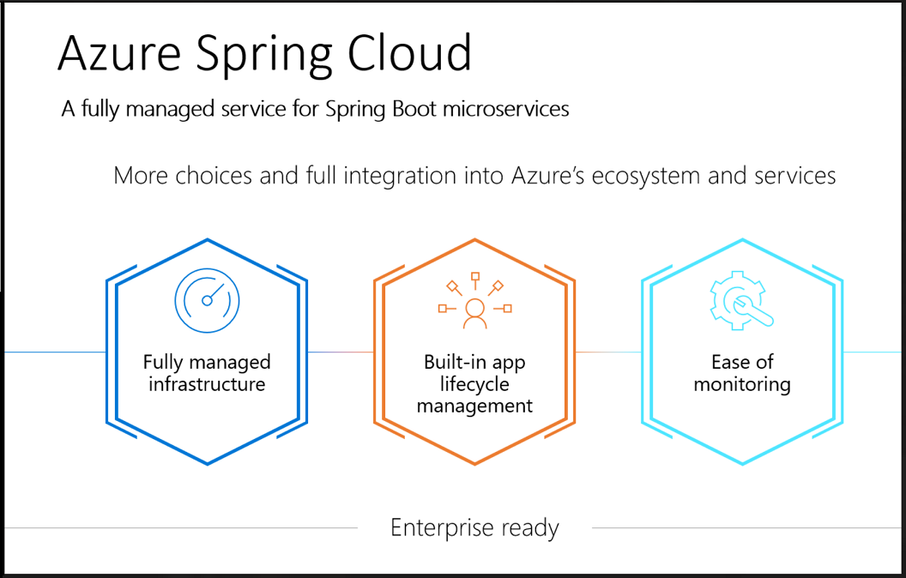

# What is Azure Spring Cloud?

Azure Spring Cloud makes it easy to deploy Spring Boot microservice applications to Azure without any code changes.  The service manages the infrastructure of Spring Cloud applications so developers can focus on their code.  Azure Spring Cloud provides lifecycle management using comprehensive monitoring and diagnostics, configuration management, service discovery, CI/CD integration, blue-green deployments, and more.

## Why use Azure Spring Cloud?

Deployment of applications to Azure Spring Cloud has many benefits.  You can:
* Efficiently migrate existing Spring apps and manage cloud scaling and costs.
* Modernize apps with Spring Cloud patterns to improve agility and speed of delivery.
* Run Java at cloud scale and drive higher usage without complicated infrastructure.
* Develop and deploy rapidly without containerization dependencies.
* Monitor production workloads efficiently and effortlessly.

## Service overview

As part of the Azure ecosystem, Azure Spring Cloud allows easy binding to other Azure services including storage, databases, monitoring, and more.  

> 

* Azure Spring Cloud is a fully managed service for Spring Boot apps that lets you focus on building and running apps that run your business without the hassle of managing infrastructure.

* Simply deploy your JARs or code, and Azure Spring Cloud will automatically wire your apps with Spring service runtime. It comes with built-in app lifecycle.

* Once deployed you can easily monitor app performance, fix errors, and rapidly improve applications. Monitoring is simple.

* Full integration into Azure's ecosystems and services.

* Enterprise ready.

This documentation includes sections that explain how get started and leverage Azure Spring Cloud services.

* Get started
    * **Launch your first app**
    * **Provision an Azure Spring Cloud service**
    * **Set up the configuration server**
    * **Build and deploy apps**
    * **Use logs metrics and tracing**
* How-to
    * **Prepare apps**: Prepare an existing Java Spring application for deployment to Azure Spring Cloud. When configured properly, Azure Spring Cloud provides robust services to monitor, scale, and update Java Spring Cloud applications.
    * **Manage apps**:  Start, stop, and delete your Azure Spring Cloud applications. Change an application's state in Azure Spring Cloud by using either the Azure portal or the Azure CLI.
    * **Monitor apps**: Distributed tracing tools to easily debug and monitor complex issues. Azure Spring Cloud integrates Spring Cloud Sleuth with Azure's Application Insights. This integration provides powerful distributed tracing capability from the Azure portal.
    * **Secure apps**: Azure resources provide an automatically managed identity in Azure Active Directory. You can use this identity to authenticate to any service that supports Azure AD authentication, without having credentials in your code.
    * **Integration with other Azure services**: Instead of manually configuring your Spring Boot applications, you can automatically bind selected Azure services to your applications, for example, binding your application to an Azure Cosmos DB database.
    * **DevOps**: Continuous integration and continuous delivery tools let you quickly deploy updates to existing applications with minimal effort and risk. Azure DevOps helps organize and control these key tasks. 
    * **Troubleshoot**: Azure Spring Cloud diagnostics provide an interactive experience to help troubleshoot apps. No configuration is required. When you find issues, Azure Spring Cloud diagnostics identifies problems and guides you to information that helps troubleshoot and resolve issues.

## Next steps

To get started, complete the [Spring Cloud quickstart](spring-cloud-quickstart.md)

Samples are available on GitHub: [Azure Spring Cloud Samples](https://github.com/Azure-Samples/Azure-Spring-Cloud-Samples/tree/master/).