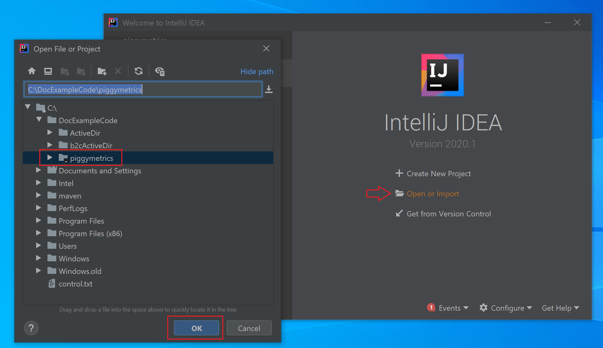
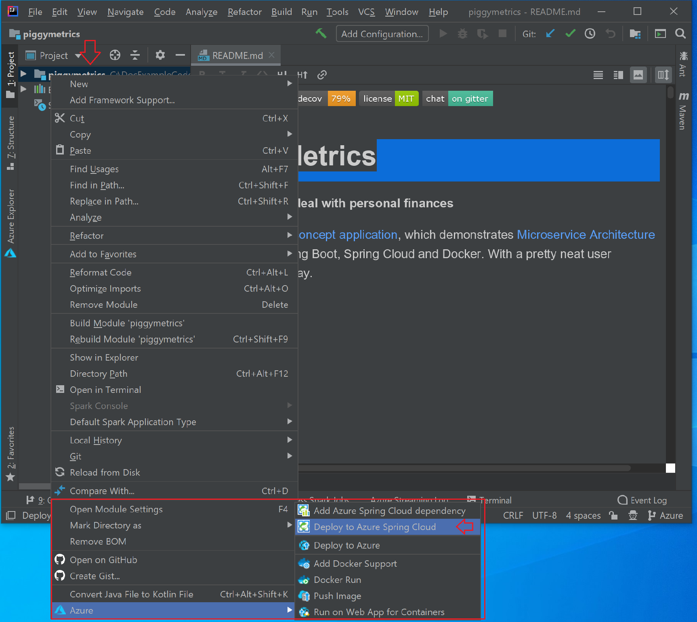
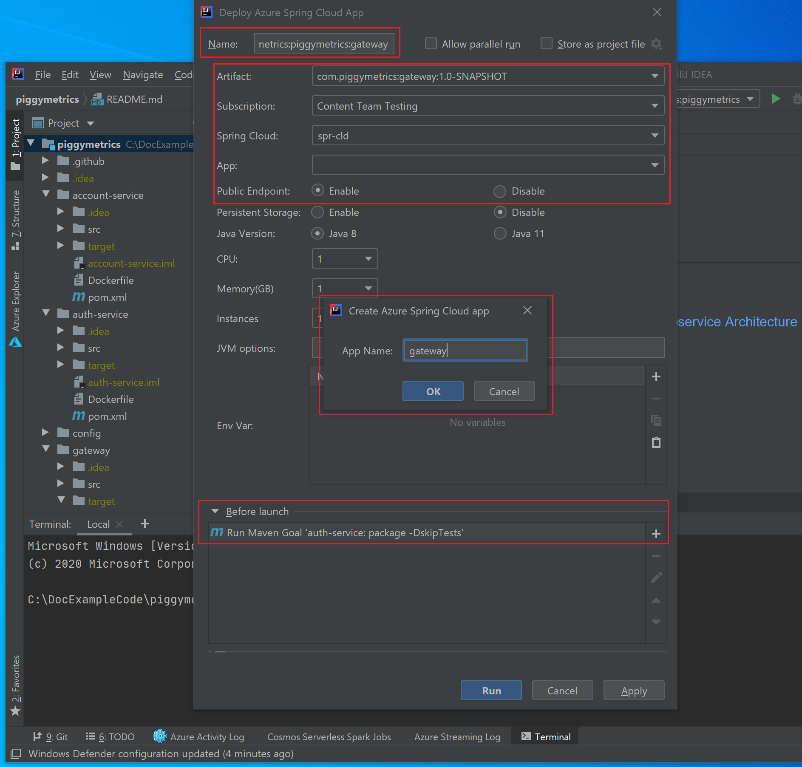
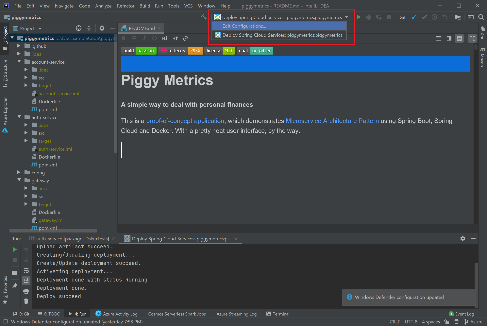
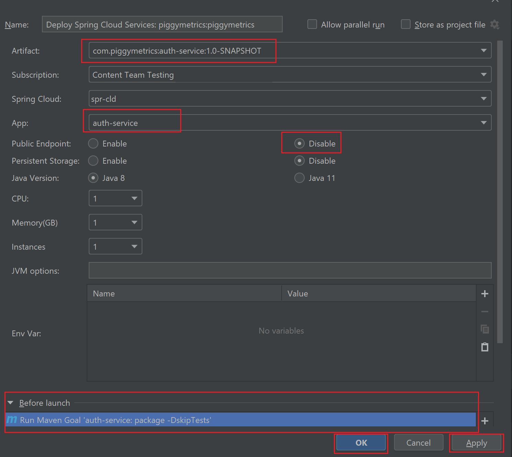

# Build and deploy apps to Azure Spring Cloud
This document illustrates deployment of microservice applications to Azure Spring Cloud using:
* Azure CLI
* Maven
* Intellij

Before deployment using Azure CLI or Maven, complete the examples that [provision an instance of Azure Spring Cloud](spring-cloud-quickstart-provision-service-instance.md) and [set up the config server](spring-cloud-quickstart-setup-config-server.md).

#### [CLI](#tab/Azure-CLI)
## Azure CLI deployment
To use the CLI method of deployment, Install the Azure Spring Cloud extension for the Azure CLI using the following command.

```azurecli
az extension add --name spring-cloud
```
### Build the microservices applications locally

1. Create a new folder and clone the sample app repository to your Azure Cloud account.  

    ```console
        mkdir source-code
        git clone https://github.com/Azure-Samples/piggymetrics
    ```

2. Change directory and build the project.

    ```console
        cd piggymetrics
        mvn clean package -D skipTests
    ```

Compiling the project takes about 5 minutes.  Once completed, you should have individual JAR files for each service in their respective folders.

### Create the microservices

Create Spring Cloud microservices using the JAR files built in the previous step. You will create three microservices: **gateway**, **auth-service**, and **account-service**.

```azurecli
az spring-cloud app create --name gateway
az spring-cloud app create --name auth-service
az spring-cloud app create --name account-service
```

### Deploy applications and set environment variables

We need to actually deploy our applications to Azure. Use the following commands to deploy all three applications:

```azurecli
az spring-cloud app deploy -n gateway --jar-path ./gateway/target/gateway.jar
az spring-cloud app deploy -n account-service --jar-path ./account-service/target/account-service.jar
az spring-cloud app deploy -n auth-service --jar-path ./auth-service/target/auth-service.jar
```

### Assign public endpoint to gateway

We need a way to access the application via a web browser. Our gateway application needs a public facing endpoint.

1. Assign the endpoint using the following command:

```azurecli
az spring-cloud app update -n gateway --is-public true
```

2. Query the **gateway** application for its public IP so you can verify that the application is running:

```azurecli
az spring-cloud app show --name gateway --query properties.url
```

3. Navigate to the URL provided by the previous command to run the PiggyMetrics application.

    

You can also navigate the Azure portal to find the URL. 
1. Navigate to the service
2. Select **Apps**
3. Select **gateway**

    
    
4. Find the URL on the **gateway Overview** page
    

> [!div class="nextstepaction"]
> [I ran into an issue](https://www.research.net/r/javae2e?tutorial=asc-cli-quickstart&step=public-endpoint)

#### [Maven](#tab/Maven)
## Maven deployment
To complete deployment using Maven, [Install Maven 3.0 or later](https://maven.apache.org/download.cgi).  Before deployment, complete the examples that [provision an instance of Azure Spring Cloud](spring-cloud-quickstart-provision-service-instance.md) and [set up the config server](spring-cloud-quickstart-setup-config-server.md).

### Clone and build the sample application repository

1. Launch the [Azure Cloud Shell](https://shell.azure.com).

1. Clone the Git repository by running the following command:

    ```console
    git clone https://github.com/Azure-Samples/PiggyMetrics
    ```
  
1. Change directory and build the project by running the following command:

    ```console
    cd piggymetrics
    mvn clean package -DskipTests
    ```

### Generate configurations and deploy to the Azure Spring Cloud

1. Generate configurations by running the following command in the root folder of PiggyMetrics containing the parent POM:

    ```console
    mvn com.microsoft.azure:azure-spring-cloud-maven-plugin:1.1.0:config
    ```

    a. Select the modules `gateway`,`auth-service`, and `account-service`.

    b. Select your subscription and Azure Spring Cloud service cluster.

    c. In the list of provided projects, enter the number that corresponds with `gateway` to give it public access.
    
    d. Confirm the configuration.

1. The POM now contains the plugin dependencies and configurations. Deploy the apps using the following command:

   ```console
   mvn azure-spring-cloud:deploy
   ```

1. After the deployment has finished, you can access PiggyMetrics by using the URL provided in the output from the preceding command.
1. Navigate to the URL in browser.

    
  

> [!div class="nextstepaction"]
> [I ran into an issue](https://www.research.net/r/javae2e?tutorial=asc-cli-quickstart&step=public-endpoint)

#### [IntelliJ](#tab/IntelliJ)
## IntelliJ deployment
The IntelliJ plug-in for Azure Spring Cloud supports application deployment from the IntelliJ IDEA.  

### Prerequisites
* [JDK 8 Azul Zulu](https://docs.microsoft.com/java/azure/jdk/java-jdk-install?view=azure-java-stable)
* [Maven 3.5.0+](https://maven.apache.org/download.cgi)
* [IntelliJ IDEA, Community/Ultimate Edition, version 2020.1/2019.3](https://www.jetbrains.com/idea/download/#section=windows)

### Install the plug-in
You can add the Azure Toolkit for IntelliJ IDEA 3.35.0 from the IntelliJ **Plugins** UI.

1. Start IntelliJ.  If you have opened a project previously, close the project to show the welcome dialog. Select **Configure** from link lower right, and then click **Plugins** to open the plug-in configuration dialog, and select **Install Plugins from disk**.

    

1. Search for Azure Toolkit for IntelliJ.  Click **Install**.

    

1. Click **Restart IDE**.

### Deployment procedures
The following procedures deploy the Piggymetrics application using the IntelliJ IDEA.  Before deployment, complete the examples to [provision an instance of Azure Spring Cloud](spring-cloud-quickstart-provision-service-instance.md) and [set up the config server](spring-cloud-quickstart-setup-config-server.md).

* Open gs-spring-boot project
* Deploy to Azure Spring Cloud
* Show streaming logs

### Open gs-spring-boot project

1. Download and unzip the source repository for this tutorial, or clone it using Git: `git clone https://github.com/Azure-Samples/piggymetrics` 
1. cd into `piggymetrics`.
1. Open IntelliJ **Welcome** dialog, select **Import Project** to open the import wizard.
1. Select `piggymetric` folder.

    

### Deploy gateway app to Azure Spring Cloud
In order to deploy to Azure you must sign-in with your Azure account, and choose your subscription.  For sign-in details, see [Installation and sign-in](https://docs.microsoft.com/azure/developer/java/toolkit-for-intellij/create-hello-world-web-app#installation-and-sign-in).

1. Right-click your project in IntelliJ project explorer, and select **Azure** -> **Deploy to Azure Spring Cloud**.

    

1. Accept the name for app in the **Name** field. **Name** refers to the configuration, not app name. Users don't usually need to change it.
1. In the **Artifact** textbox, select *com.piggymetrics:gateway:1.0-SNAPSHOT*.
1. In the **Subscription** textbox, verify your subscription.
1. In the **Spring Cloud** textbox, select the instance of Azure Spring Cloud that you created in [Provision Azure Spring Cloud instance](https://docs.microsoft.com/en-us/azure/spring-cloud/spring-cloud-quickstart-provision-service-instance).
1. In the **App:** textbox, select **Create app...**.
1. Enter *gateway*, then click **OK**.


    

1. In the **Before launch** section of the dialog, double click *Run Maven Goal**.
1. In the **Working directory** textbox, navigate to the *piggymetrics/gateway* folder.
1. In the **Command line** textbox, enter *package -DskipTests*.
1. Click **OK**.
1. Start the deployment by clicking **Run** button at the bottom of the **Deploy Azure Spring Cloud app** dialog. 

1. The plug-in will run the command `mvn package` on the `gateway` app and deploy the jar generated by the `package` command.

### Deploy auth-service and account-service apps to Azure Spring Cloud
You will have to edit the previous configuration for both the `auth-service` and the `account-service` apps to deploy them to Azure Spring Cloud.

1. Open the configuration dialog from the IntelliJ menu.

    
 
1. This will show the configuration dialog with the options configured for the `gateway` app.
1. Modify the settings to identify the `auth-service` app.
1. Click **Apply** and then **OK**.

    

1. Build and deploy the `auth-service` from the **Azure/Deploy to Azure Spring Cloud** dialog as for the `gateway` app.
1. Repeat reconfiguration and deployment for the `account-service` app.

### Assign public URL to gateway app

The gateway application needs a public facing endpoint to access the application via a web browser. Open the terminal window from IntelliJ.

1. Assign the endpoint using the following command:

```azurecli
az spring-cloud app update -n gateway --is-public true
```

1. Query the **gateway** application for its public IP so you can verify that the application is running:

```azurecli
az spring-cloud app show --name gateway --query properties.url
```


1. Use the URL returned from the previous command to navigate to the URL in browser.

    
  
> [!div class="nextstepaction"]
> [I ran into an issue](https://www.research.net/r/javae2e?tutorial=asc-cli-quickstart&step=public-endpoint)

---

## Next steps
[Logs, Metrics and Tracing](spring-cloud-quickstart-logs-metrics-tracing.md)
