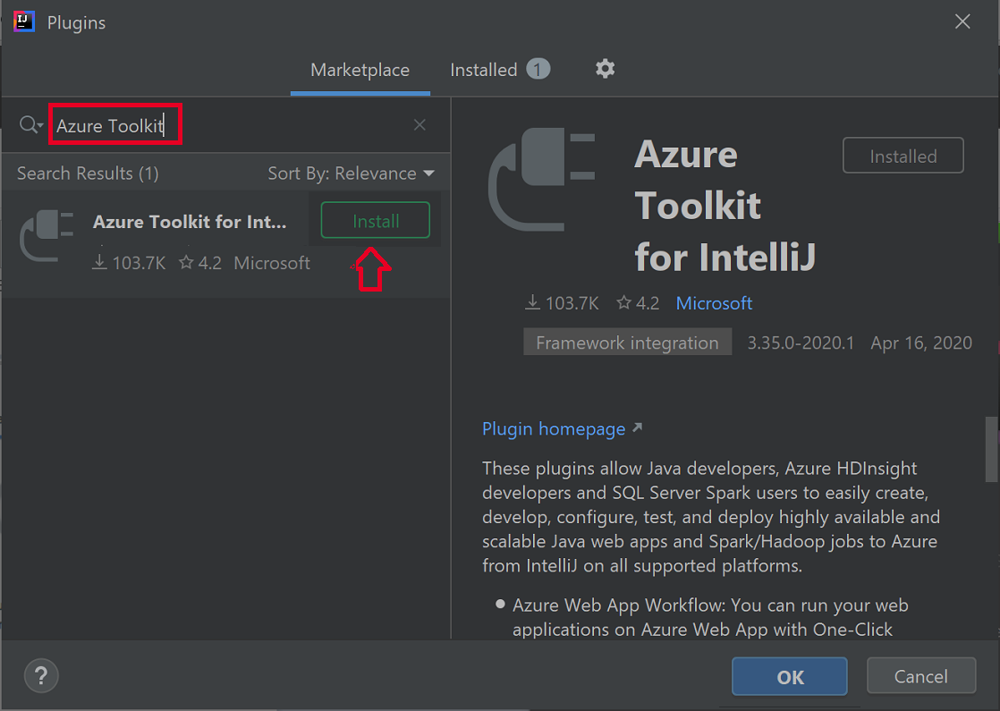
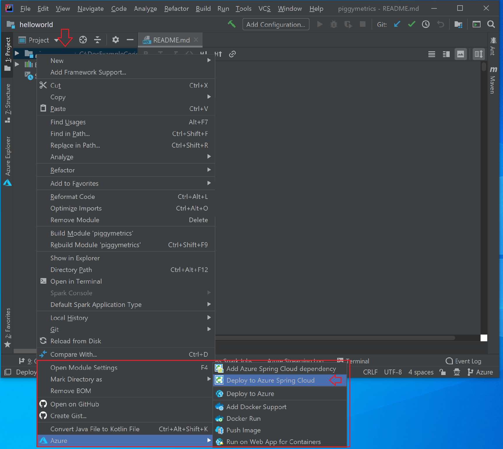
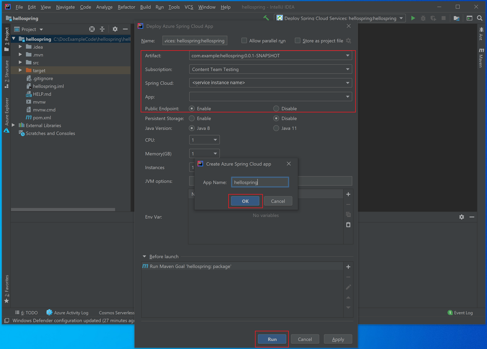

# Quickstart: Deploy your first Azure Spring Cloud application

This quickstart explains how to deploy a Spring Cloud Hello-World application to Azure. Azure Spring Cloud enables Spring Cloud based microservice applications to run on Azure. 

The sample application code used in this tutorial is at the [GitHub samples repository](https://github.com/Azure-Samples/PiggyMetrics). When you've completed this example, the sample application will be accessible online and ready to be managed via the Azure portal.

This quickstart explains how to:

> [!div class="checklist"]
> * Generate a basic Spring Cloud project
> * Provision a service instance
> * Build and deploy the app with public endpoint
> * Stream logs in real time

## Prerequisites

>[!Note]
> Azure Spring Cloud is currently offered as a public preview. Public preview offerings allow customers to experiment with new features prior to their official release.  Public preview features and services are not meant for production use.  For more information about support during previews, please review our [FAQ](https://azure.microsoft.com/support/faq/), or file a [Support request](https://docs.microsoft.com/azure/azure-portal/supportability/how-to-create-azure-support-request).

To complete this quickstart:

1. [Install JDK 8](https://docs.microsoft.com/java/azure/jdk/?view=azure-java-stable)
1. [Sign up for an Azure subscription](https://azure.microsoft.com/free/)
1. (Optional)[Install the Azure CLI version 2.0.67 or higher](https://docs.microsoft.com/cli/azure/install-azure-cli?view=azure-cli-latest)
1. (Optional)[Install the Azure Toolkit for IntelliJ](https://plugins.jetbrains.com/plugin/8053-azure-toolkit-for-intellij/)

## Generate a Spring Cloud helloworld project
>[!TIP]
> To skip the spring boot basics in this section, you can clone our sample repo `git clone https://github.com/yucwan/azure-spring-cloud-helloworld.git` and jump ahead to **Provision a service instance** section.

Start with [Spring Initializr](https://start.spring.io/#!type=maven-project&language=java&platformVersion=2.3.3.RELEASE&packaging=jar&jvmVersion=1.8&groupId=com.example&artifactId=demo&name=demo&description=Demo%20project%20for%20Spring%20Boot&packageName=com.example.demo&dependencies=web,cloud-eureka,actuator,cloud-starter-sleuth,cloud-starter-zipkin) to generate a sample project with recommended dependencies for Azure Spring Cloud. The following image shows the Initializr set up for this sample project.
```url
https://start.spring.io/#!type=maven-project&language=java&platformVersion=2.3.3.RELEASE&packaging=jar&jvmVersion=1.8&groupId=com.example&artifactId=demo&name=demo&description=Demo%20project%20for%20Spring%20Boot&packageName=com.example.demo&dependencies=web,cloud-eureka,actuator,cloud-starter-sleuth,cloud-starter-zipkin
```

  

1. Click **Generate** when all the dependencies are set. Download and unpack the package, then add the following dependency to the application `pom.xml` file.

    ```xml
        <dependency>
            <groupId>com.microsoft.azure</groupId>
            <artifactId>spring-cloud-starter-azure-spring-cloud-client</artifactId>
            <version>2.3.0</version>
        </dependency>
    ```

1. Create a web controller for a simple web application by adding `src/main/java/com/example/springboot/HelloController.java` as follows:

    ```java
    package com.example.demo;
    
    import org.springframework.web.bind.annotation.RestController;
    import org.springframework.web.bind.annotation.RequestMapping;
    
    @RestController
    public class HelloController {
    
    	@RequestMapping("/")
    	public String index() {
    		return "Greetings from Azure Spring Cloud!";
    	}
    
    }
    ```
## Provision an instance of Azure Spring Cloud

The following procedure creates an instance of Azure Spring Cloud using the Azure portal.

1. In a new tab, open the [Azure portal](https://ms.portal.azure.com/). 

2. From the top search box, search for *Azure Spring Cloud*.

3. Select *Azure Spring Cloud* from the results.

    

4. On the Azure Spring Cloud page, click **+ Add**.

    

5. Fill out the form on the Azure Spring Cloud **Create** page.  Consider the following guidelines:
    - **Subscription**: Select the subscription you want to be billed for this resource.  Ensure that this subscription has been added to our allow-list for Azure Spring Cloud.
    - **Resource group**: Creating new resource groups for new resources is a best practice.
    - **Service Details/Name**: Specify the name of your service instance.  The name must be between 4 and 32 characters long and can contain only lowercase letters, numbers, and hyphens.  The first character of the service name must be a letter and the last character must be either a letter or a number.
    - **Location**: Select the location for your service instance. Currently supported locations include East US, West US 2, West Europe, and Southeast Asia.

    

6. Click **Review and create**.

#### [CLI](#tab/Azure-CLI)
## Build and deploy the application
Make sure to execute the following command at the root of the project.

1. Build the project using Maven, for example:

    ```console
    mvn clean package -DskipTests
    ```

1. Install the Azure Spring Cloud extension for the Azure CLI using the following command:

    ```azurecli
    az extension add --name spring-cloud
    ```
1. Create app with public endpoint assigned:

    ```azurecli
    az spring-cloud app create -n demo -s <service instance name> -g <resource group name> --is-public
    ```

1. Deploy the Jar file to the app created:

    ```azurecli
    az spring-cloud app deploy -n demo -s <service instance name> -g <resource group name> --jar-path target\demo-0.0.1-SNAPSHOT.jar
    ```
1. It takes a few minutes to finish deploying the applications. To confirm that they have deployed, go to the **Apps** blade in the Azure portal. You should see status of the application.

## Streaming logs in real time

1. Use the following command to get real time logs from the App.

    ```azurecli
    az spring-cloud app logs -n demo -s <service instance name> -g <resource group name> -f
    ```
    
    **Need a screenshot**
    
2. For advanced logs analytics features, visit **Logs** tab in the menu on [Azure Portal](https://portal.azure.com/). Logs here have a latency of a few minutes.

  

#### [IntelliJ](#tab/IntelliJ)

The IntelliJ plug-in for Azure Spring Cloud supports application deployment from the IntelliJ IDEA.  

### Prerequisites
* [JDK 8 Azul Zulu](https://docs.microsoft.com/java/azure/jdk/java-jdk-install?view=azure-java-stable)
* [Maven 3.5.0+](https://maven.apache.org/download.cgi)
* [IntelliJ IDEA, Community/Ultimate Edition, version 2020.1/2019.3](https://www.jetbrains.com/idea/download/#section=windows)

### Install the plug-in
You can add the Azure Toolkit for IntelliJ IDEA 3.35.0 from the IntelliJ **Plugins** UI.

1. Start IntelliJ.  If you have opened a project previously, close the project to show the welcome dialog. Select **Configure** from link lower right, and then click **Plugins** to open the plug-in configuration dialog, and select **Install Plugins from disk**.

    

1. Search for Azure Toolkit for IntelliJ.  Click **Install**.

    

1. Click **Restart IDE**.

### Deployment procedures
The following procedures deploy the Piggymetrics application using the IntelliJ IDEA.  Before deployment, complete the examples to [provision an instance of Azure Spring Cloud](spring-cloud-quickstart-provision-service-instance.md) and [set up the config server](spring-cloud-quickstart-setup-config-server.md).

* Open gs-spring-boot project
* Deploy to Azure Spring Cloud
* Show streaming logs

### Open helloworld project

1. cd into `helloworld`.
1. Open IntelliJ **Welcome** dialog, select **Import Project** to open the import wizard.
1. Select `helloworld` folder.

    

### Deploy gateway app to Azure Spring Cloud
In order to deploy to Azure you must sign-in with your Azure account, and choose your subscription.  For sign-in details, see [Installation and sign-in](https://docs.microsoft.com/azure/developer/java/toolkit-for-intellij/create-hello-world-web-app#installation-and-sign-in).

1. Right-click your project in IntelliJ project explorer, and select **Azure** -> **Deploy to Azure Spring Cloud**.

    

1. Accept the name for app in the **Name** field. **Name** refers to the configuration, not app name. Users don't usually need to change it.
1. In the **Artifact** textbox, select *demo-0.0.1-SNAPSHOT.jar*.
1. In the **Subscription** textbox, verify your subscription.
1. In the **Spring Cloud** textbox, select the instance of Azure Spring Cloud that you created in [Provision Azure Spring Cloud instance](https://docs.microsoft.com/azure/spring-cloud/spring-cloud-quickstart-provision-service-instance).
1. In the **App:** textbox, select **Create app...**.
1. Enter *helloworld*, then click **OK**.


    

1. In the **Before launch** section of the dialog, double click *Run Maven Goal**.
1. In the **Working directory** textbox, navigate to the *helloworld* folder.
1. In the **Command line** textbox, enter *package -DskipTests*.
1. Click **OK**.
1. Start the deployment by clicking **Run** button at the bottom of the **Deploy Azure Spring Cloud app** dialog. 

1. The plug-in will run the command `mvn package` on the `gateway` app and deploy the jar generated by the `package` command.

---

## Set up logs
With the distributed tracing tools in Azure Spring Cloud, you can debug and monitor complex issues. Azure Spring Cloud integrates [Spring Cloud Sleuth](https://spring.io/projects/spring-cloud-sleuth) with Azure's [Application Insights](https://docs.microsoft.com/azure/azure-monitor/app/app-insights-overview). This integration provides powerful distributed tracing capability from the Azure portal.

#### [CLI](#tab/Azure-CLI)
The following procedures use the Azure CLI to start logging.

To follow these procedures, you need an Azure Spring Cloud service that is already provisioned and running. Complete the [quickstart on deploying an app via the Azure CLI](spring-cloud-quickstart-deploy-apps.md) to provision and run an Azure Spring Cloud service.
    
### Add dependencies

1. Add the following line to the application.properties file:

   ```xml
   spring.zipkin.sender.type = web
   ```

   After this change, the Zipkin sender can send to the web.

1. Skip this step if you followed our [guide to preparing an Azure Spring Cloud application](spring-cloud-tutorial-prepare-app-deployment.md). Otherwise, go to your local development environment and edit your pom.xml file to include the following Spring Cloud Sleuth dependency:

    ```xml
    <dependencyManagement>
        <dependencies>
            <dependency>
                <groupId>org.springframework.cloud</groupId>
                <artifactId>spring-cloud-sleuth</artifactId>
                <version>${spring-cloud-sleuth.version}</version>
                <type>pom</type>
                <scope>import</scope>
            </dependency>
        </dependencies>
    </dependencyManagement>
    <dependencies>
        <dependency>
            <groupId>org.springframework.cloud</groupId>
            <artifactId>spring-cloud-starter-sleuth</artifactId>
        </dependency>
    </dependencies>
    ```

1. Build and deploy again for your Azure Spring Cloud service to reflect these changes.

### Modify the sample rate

You can change the rate at which your telemetry is collected by modifying the sample rate. For example, if you want to sample half as often, open your application.properties file, and change the following line:

```xml
spring.sleuth.sampler.probability=0.5
```

If you have already built and deployed an application, you can modify the sample rate. Do so by adding the previous line as an environment variable in the Azure CLI or the Azure portal.

#### [IntelliJ](#tab/IntelliJ)
## Set up logs following IntelliJ deployment
The following procedure assumes you have completed deployment of an Azure Spring Cloud app using IntelliJ.

### Show streaming logs
To get the logs:
1. Select **Azure Explorer**, then **Spring Cloud**.
1. Right-click the running app.
1. Select **Streaming Logs** from the drop-down list.

    

1. Select instance.

    

1. The streaming log will be visible in the output window.

    
---
## Next steps

In this quickstart, you learned how to:

> [!div class="checklist"]
> * Generate a basic Spring Cloud project
> * Provision a service instance
> * Build and deploy the app with public endpoint
> * Streaming logs in real time

> [!div class="nextstepaction"]
> [Build and Run Microservices](spring-cloud-quickstart-piggymetrics-intro.md)

More samples are available on GitHub: [Azure Spring Cloud Samples](https://github.com/Azure-Samples/Azure-Spring-Cloud-Samples/tree/master/service-binding-cosmosdb-sql).
