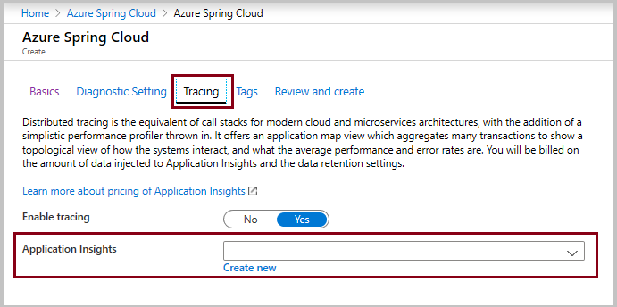
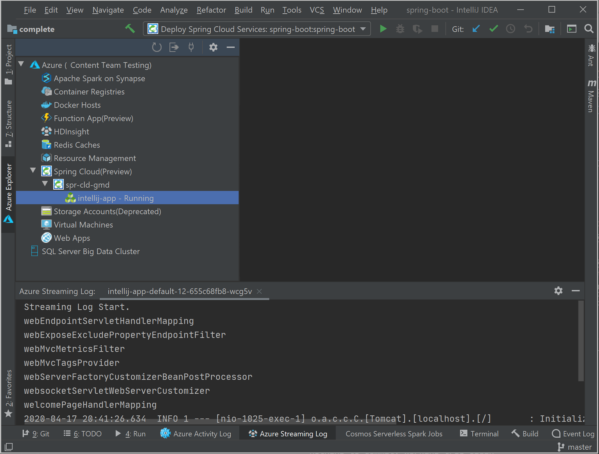

# Quickstart: Set up logs, metrics, and tracing for Azure Spring Cloud apps

[Diagnostic services](diagnostic-services.md)
[Distributed tracing](spring-cloud-tutorial-distributed-tracing.md)
[Stream logs in real time](spring-cloud-howto-log-streaming.md)

## Set up logs following deployment in the Azure portal
This example is based on the procedure [provision Azure Spring Cloud service](spring-cloud-quickstart-provision-service-instance.md#provision-a-service-instance-on-the-azure-portal).

1. Click the **Diagnostic Setting** tab to open the following dialog.

1. You can set **Enable logs** to *yes* or *no* according to your requirements.

    

1. Click the **Tracing** tab.

1. You can set **Enable tracing** to *yes* or *no* according to your requirements.  If you set **Enable tracing** to yes,  also select an existing application insight, or create a new one. Without the **Application Insights** specification there will be a validation error.

    

1. Click **Review and create**.

1. Verify your specifications, and click **Create**.

It takes about 5 minutes for the service to deploy.  Once it is deployed, the **Overview** page for the service instance will appear.

> [!div class="nextstepaction"]
> [I ran into an issue](https://www.research.net/r/javae2e?tutorial=asc-portal-quickstart&step=provision)

## Set up logs following CLI deployment

## Set up logs following IntelliJ deployment
The following procedure assumes you have completed [deployment of an Azure Spring Cloud app using IntelliJ](spring-cloud-quickstart-deploy-apps.md#intellij-deployment).

## Show streaming logs
To get the logs:
1. Select **Azure Explorer**, then **Spring Cloud**.
1. Right-click the running app.
1. Select **Streaming Logs** from the drop-down list.

    

1. Select instance.

    

1. The streaming log will be visible in the output window.

    

## Next steps
* [Diagnostic services](diagnostic-services.md)
* [Distributed tracing](spring-cloud-tutorial-distributed-tracing.md)
* [Stream logs in real time](spring-cloud-howto-log-streaming.md)