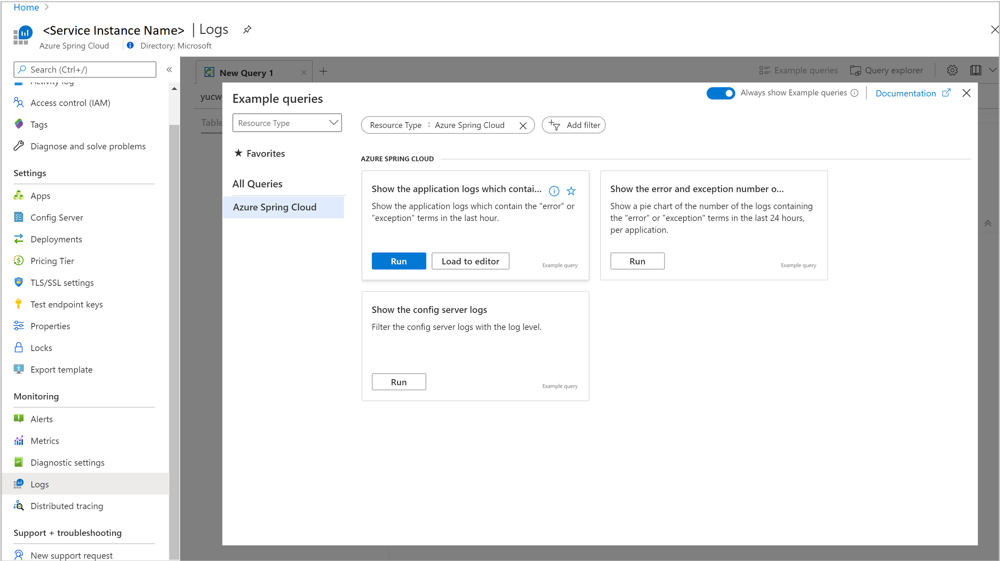
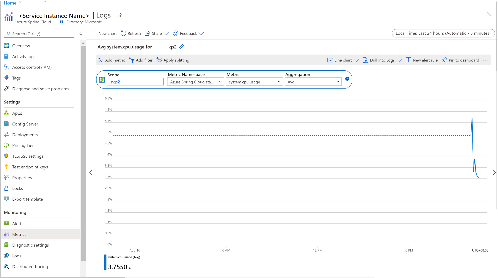
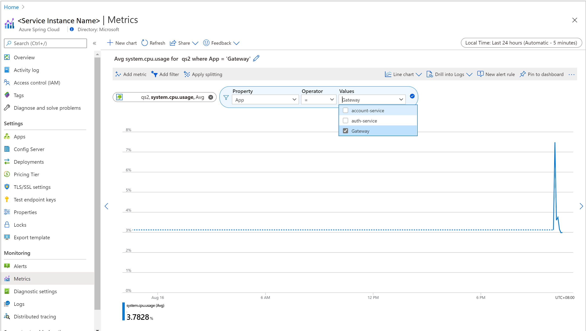
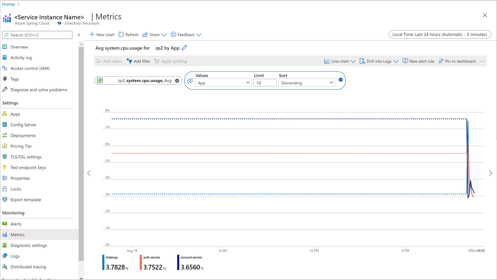
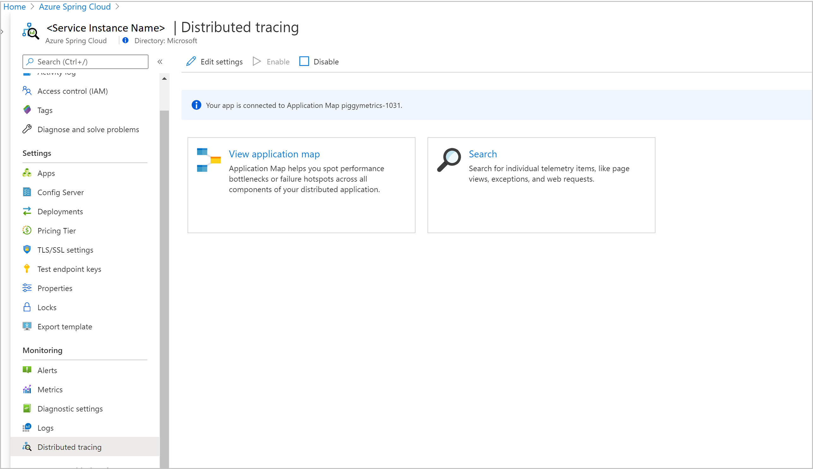
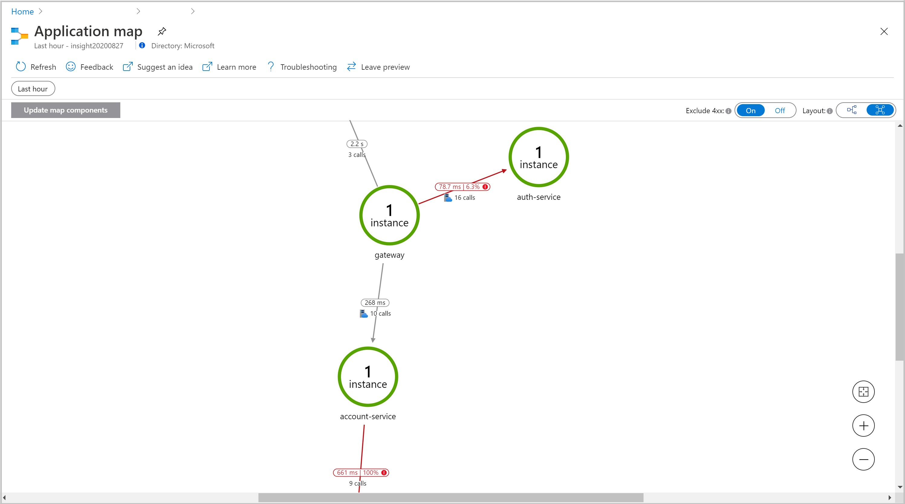
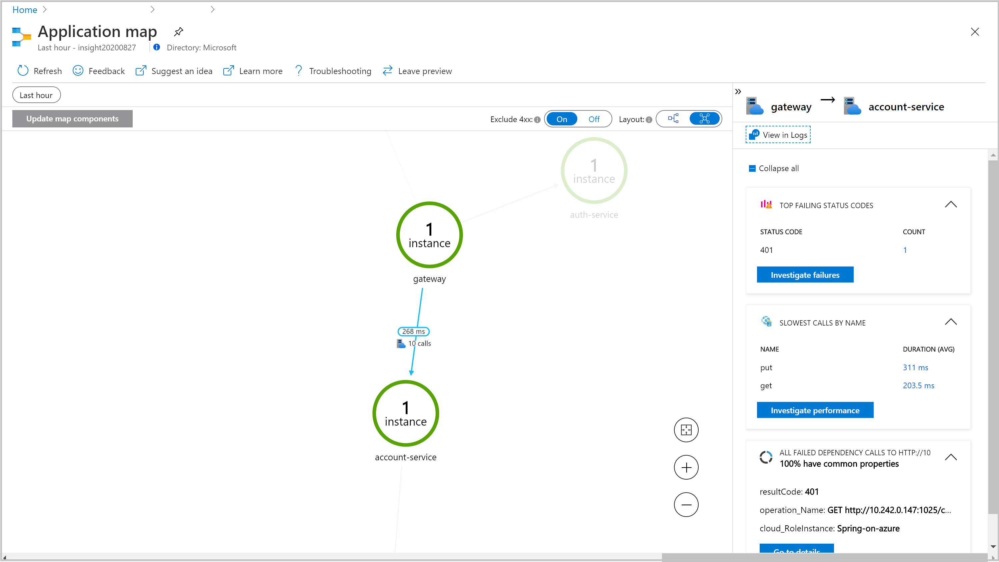
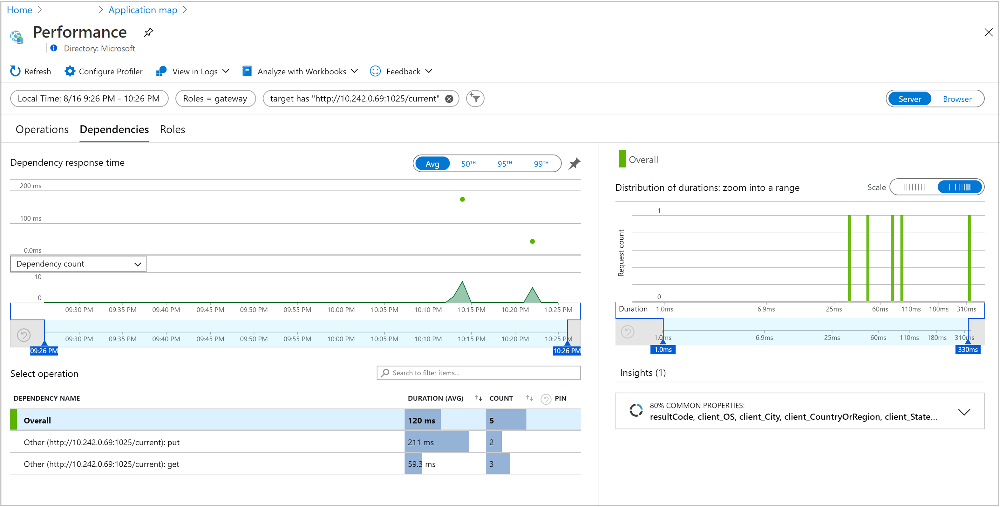

# Quickstart: Monitoring Azure Spring Cloud apps with logs, metrics, and tracing

With the built-in monitoring capability in Azure Spring Cloud, you can easily debug and monitor complex issues. Azure Spring Cloud integrates [Spring Cloud Sleuth](https://spring.io/projects/spring-cloud-sleuth) with Azure's [Application Insights](https://docs.microsoft.com/azure/azure-monitor/app/app-insights-overview). This integration provides powerful logs, metrics and distributed tracing capability from the Azure portal. We will walk you though how to use Log Streaming, Log Analytics, Metrics and Distributed tracing with deployed PiggyMetrics apps.
Please make sure you have complete previous steps: [provision an instance of Azure Spring Cloud](spring-cloud-quickstart-provision-service-instance.md), [set up the config server](spring-cloud-quickstart-setup-config-server.md) and [Build and deploy apps](spring-cloud-quickstart-deploy-apps.md).
## Logs
There are two ways to see logs on Azure Spring Cloud: Log Streaming for real-time logs per app instance and Log Analytics for aggregated logs with advanced query capability.

### Log Streaming

#### [IntelliJ](#tab/IntelliJ)

To get the logs using Azure Toolkit for IntelliJ:
1. Select **Azure Explorer**, then **Spring Cloud**.
1. Right-click the running app.
1. Select **Streaming Logs** from the drop-down list.
    
1. Select **Instance**.
    
1. The streaming log will be visible in the output window.
    

#### [CLI](#tab/Azure-CLI)

You can use log streaming in the Azure CLI with the following command.

```azurecli
az spring-cloud app logs -s <service instance name> -g <resource group name> -n gateway -f

```

You will see logs like

   

>[!TIP]
> Use `az spring-cloud app logs -h` to explore more parameters and log stream functionalities.

---
### Log Analytics

1. Go to the **service Overview** page and select **Logs** in **Monitoring** section. Click **Run** on one of the sample query for Azure Spring Cloud and you will see filtered logs. See [Azure Log Analytics docs](https://docs.microsoft.com/azure/azure-monitor/log-query/get-started-queries) for more guidance on writing queries.

    
    
## Metrics
1. Go to the **service Overview** page and select **Metrics** in **Monitoring** section. Add your first metric by selecting `system.cpu.usage` for **Metric** and `Avg` for **Aggregation** to see the timeline for overall CPU usage.

    
    
1. Click **Add filter** in the toolbar above, select `App=Gateway` to see CPU usage only for the **gateway** app.

    

1. Dismiss the filter created above, click **Apply Splitting** and select `App` for **Values** to see CPU usage by different apps.

    

## Distributed Tracing
1. Go to the **service Overview** page and select **Distributed tracing** in **Monitoring** section. Then click the **View application map** tab on the right.

    

1. You can now see the status of calls between Piggymetrics apps. 

    
    
1. Click the link between **gateway** and **account-service** to see more details like slowest calls by HTTP methods.

    
    
1. Finally, click **Investigate Performance** to explore more powerful built-in performance analysis.

    

## Next steps
> [!div class="nextstepaction"]
> [Diagnostic services](diagnostic-services.md)
> [Distributed tracing](spring-cloud-tutorial-distributed-tracing.md)
> [Stream logs in real time](spring-cloud-howto-log-streaming.md)
