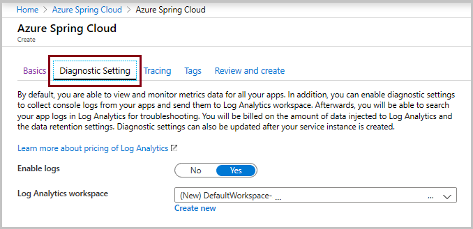

# Quickstart: Set up logs, metrics, and tracing for Azure Spring Cloud apps

With the distributed tracing tools in Azure Spring Cloud, you can debug and monitor complex issues. Azure Spring Cloud integrates [Spring Cloud Sleuth](https://spring.io/projects/spring-cloud-sleuth) with Azure's [Application Insights](https://docs.microsoft.com/azure/azure-monitor/app/app-insights-overview). This integration provides powerful distributed tracing capability from the Azure portal.

## Set up logs following deployment in the Azure portal

This example is based on the procedure [provision Azure Spring Cloud service](spring-cloud-quickstart-provision-service-instance.md#provision-a-service-instance-using-the-azure-portal).

1. Click the **Diagnostic Setting** tab to open the following dialog.

1. You can set **Enable logs** to *yes* or *no* according to your requirements.

    

1. Click the **Tracing** tab.

1. You can set **Enable tracing** to *yes* or *no* according to your requirements.  If you set **Enable tracing** to yes,  also select an existing application insight, or create a new one. Without the **Application Insights** specification there will be a validation error.


    

1. Click **Review and create**.

1. Verify your specifications, and click **Create**.

It takes about 5 minutes for the service to deploy.  Once it is deployed, the **Overview** page for the service instance will appear.

> [!div class="nextstepaction"]
> [I ran into an issue](https://www.research.net/r/javae2e?tutorial=asc-portal-quickstart&step=provision)


## Set up logs following CLI deployment
To follow these procedures, you need an Azure Spring Cloud service that is already provisioned and running. Complete the [quickstart on deploying an app via the Azure CLI](spring-cloud-quickstart-deploy-apps.md#azure-cli-deployment) to provision and run an Azure Spring Cloud service.
    
### Add dependencies

1. Add the following line to the application.properties file:

   ```xml
   spring.zipkin.sender.type = web
   ```

   After this change, the Zipkin sender can send to the web.

1. Skip this step if you followed our [guide to preparing an Azure Spring Cloud application](spring-cloud-tutorial-prepare-app-deployment.md). Otherwise, go to your local development environment and edit your pom.xml file to include the following Spring Cloud Sleuth dependency:

    ```xml
    <dependencyManagement>
        <dependencies>
            <dependency>
                <groupId>org.springframework.cloud</groupId>
                <artifactId>spring-cloud-sleuth</artifactId>
                <version>${spring-cloud-sleuth.version}</version>
                <type>pom</type>
                <scope>import</scope>
            </dependency>
        </dependencies>
    </dependencyManagement>
    <dependencies>
        <dependency>
            <groupId>org.springframework.cloud</groupId>
            <artifactId>spring-cloud-starter-sleuth</artifactId>
        </dependency>
    </dependencies>
    ```

1. Build and deploy again for your Azure Spring Cloud service to reflect these changes.

## Modify the sample rate

You can change the rate at which your telemetry is collected by modifying the sample rate. For example, if you want to sample half as often, open your application.properties file, and change the following line:

```xml
spring.sleuth.sampler.probability=0.5
```

If you have already built and deployed an application, you can modify the sample rate. Do so by adding the previous line as an environment variable in the Azure CLI or the Azure portal.

## Set up logs following IntelliJ deployment
The following procedure assumes you have completed [deployment of an Azure Spring Cloud app using IntelliJ](spring-cloud-quickstart-deploy-apps.md#intellij-deployment).

### Show streaming logs
To get the logs:
1. Select **Azure Explorer**, then **Spring Cloud**.
1. Right-click the running app.
1. Select **Streaming Logs** from the drop-down list.

    

1. Select instance.

    

1. The streaming log will be visible in the output window.

    

## Next steps
* [Diagnostic services](diagnostic-services.md)
* [Distributed tracing](spring-cloud-tutorial-distributed-tracing.md)
* [Stream logs in real time](spring-cloud-howto-log-streaming.md)
With the distributed tracing tools in Azure Spring Cloud, you can easily debug and monitor complex issues. Azure Spring Cloud integrates [Spring Cloud Sleuth](https://spring.io/projects/spring-cloud-sleuth) with Azure's [Application Insights](https://docs.microsoft.com/azure/azure-monitor/app/app-insights-overview). This integration provides powerful distributed tracing capability from the Azure portal.