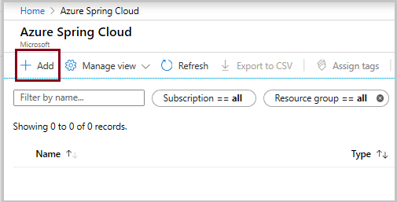

# Quickstart: Provision Azure Spring Cloud service

You can instantiate Azure Spring Cloud using the Azure portal or the Azure CLI.  Both methods are explained in the following procedures.

## Prerequisites

* [Sign up for an Azure subscription](https://azure.microsoft.com/free/)

## Provision an instance of Azure Spring Cloud

#### [Portal](#tab/Azure-portal)

The following procedure creates an instance of Azure Spring Cloud using the Azure portal.

1. In a new tab, open the [Azure portal](https://ms.portal.azure.com/). 

2. From the top search box, search for **Azure Spring Cloud**.

3. Select **Azure Spring Cloud** from the results.

    

4. On the Azure Spring Cloud page, click **+ Add**.

    

5. Fill out the form on the Azure Spring Cloud **Create** page.  Consider the following guidelines:
    - **Subscription**: Select the subscription you want to be billed for this resource.
    - **Resource group**: Creating new resource groups for new resources is a best practice. Note that this will be used in later steps as **\<resource group name\>**.
    - **Service Details/Name**: Specify the **\<service instance name\>**.  The name must be between 4 and 32 characters long and can contain only lowercase letters, numbers, and hyphens.  The first character of the service name must be a letter and the last character must be either a letter or a number.
    - **Location**: Select the location for your service instance.

    

6. Click **Review and create**.

> [!div class="nextstepaction"]
> [I ran into an issue](https://www.research.net/r/javae2e?tutorial=asc-cli-quickstart&step=public-endpoint)

#### [CLI](#tab/Azure-CLI)

The following procedure uses the Azure CLI extension to provision an instance of Azure Spring Cloud.

### Prerequisites
[Install the Azure CLI version 2.0.67 or higher](https://docs.microsoft.com/cli/azure/install-azure-cli?view=azure-cli-latest)

Install the Azure Spring Cloud extension for the Azure CLI using the following command

```azurecli
az extension add --name spring-cloud
```

### Provision a service instance

1. Login to the Azure CLI and choose your active subscription. Be sure to choose the active subscription that is whitelisted for Azure Spring Cloud

    ```azurecli
    az login
    az account list -o table
    az account set --subscription <Name or ID of subscription, skip if you only have 1 subscription>
    ```

1. Prepare a name for your Azure Spring Cloud service.  The name must be between 4 and 32 characters long and can contain only lowercase letters, numbers, and hyphens.  The first character of the service name must be a letter and the last character must be either a letter or a number.

1. Create a resource group to contain your Azure Spring Cloud service.

    ```azurecli
    az group create --location eastus --name <resource group name>
    ```

    Learn more about [Azure Resource Groups](../azure-resource-manager/management/overview.md).

1. Open an Azure CLI window and run the following commands to provision an instance of Azure Spring Cloud.

    ```azurecli
    az spring-cloud create -n <service instance name> -g <resource group name>
    ```

    The service instance will take around five minutes to deploy.
---

## Next steps
> [!div class="nextstepaction"]
> [Set up configuration server](spring-cloud-quickstart-setup-config-server.md)


