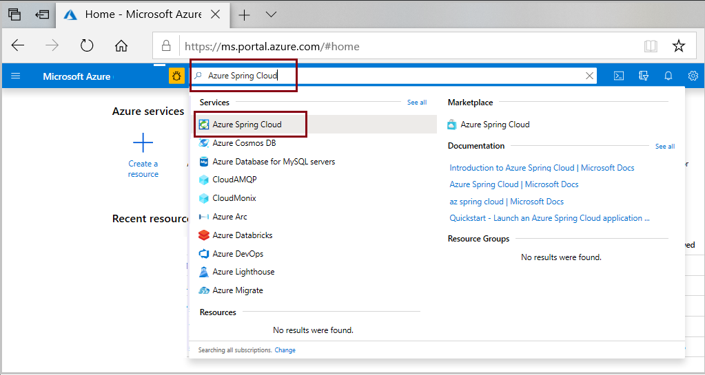
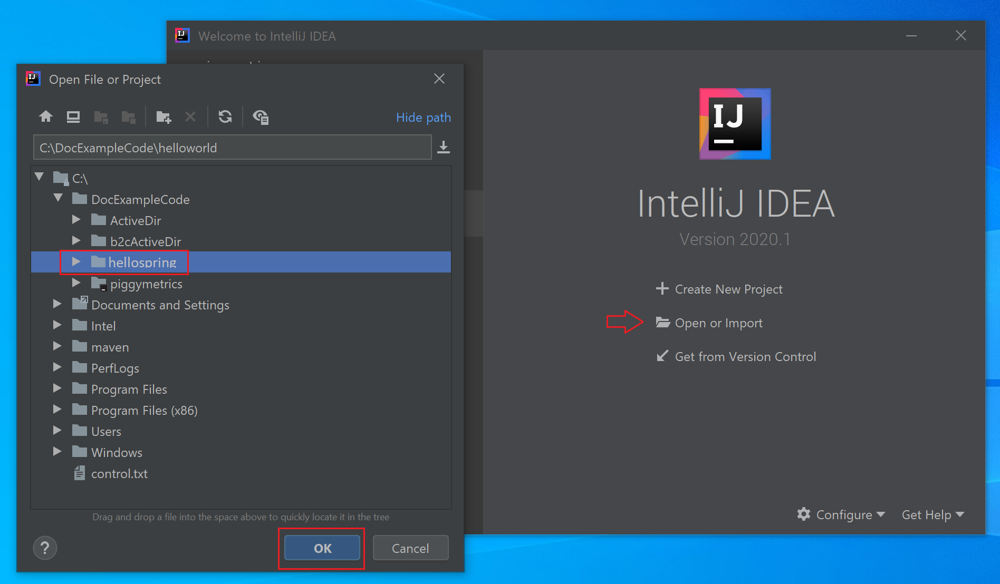
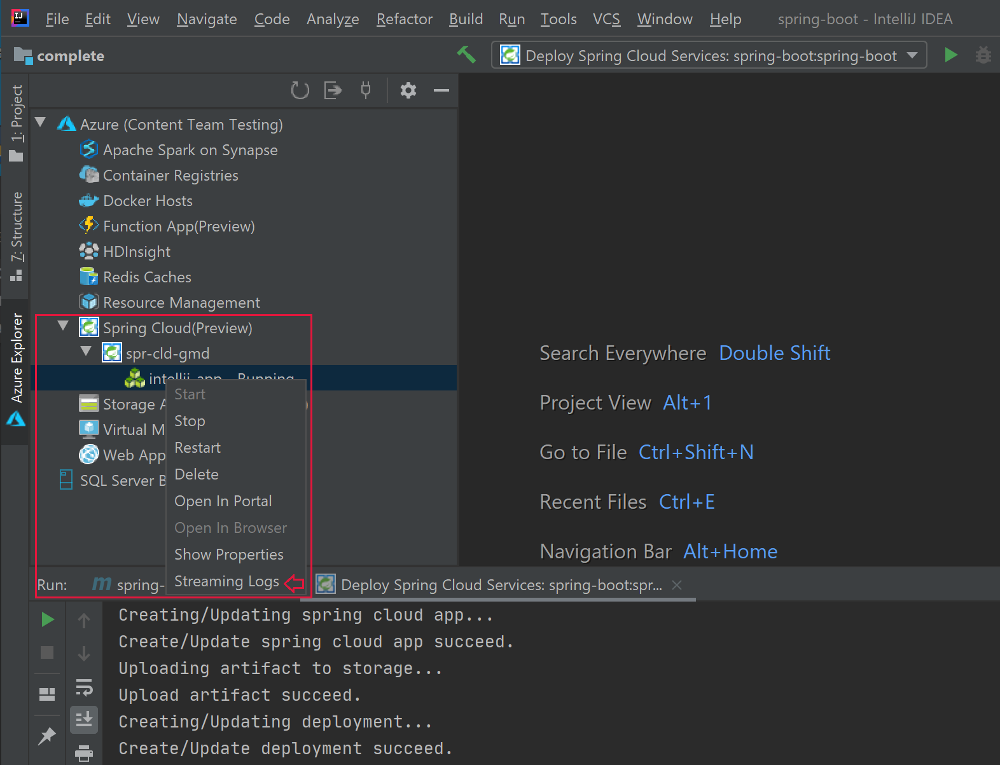
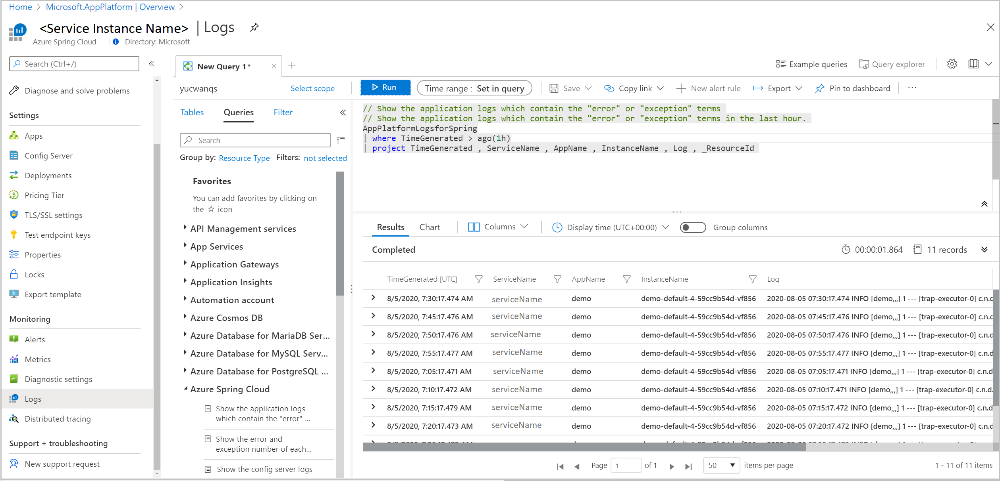

# Quickstart: Deploy your first Azure Spring Cloud application

This quickstart explains how to deploy a simple Azure Spring Cloud microservice application to run on Azure. 

The application code used in this tutorial is a simple app built with Spring Initializr. When you've completed this example, the application will be accessible online and can be managed via the Azure portal.

This quickstart explains how to:

> [!div class="checklist"]
> * Generate a basic Spring Cloud project
> * Provision a service instance
> * Build and deploy the app with a public endpoint
> * Stream logs in real time

## Prerequisites

To complete this quickstart:

* [Install JDK 8](https://docs.microsoft.com/java/azure/jdk/?view=azure-java-stable)
* [Sign up for an Azure subscription](https://azure.microsoft.com/free/)
* (Optional) [Install the Azure CLI version 2.0.67 or higher](https://docs.microsoft.com/cli/azure/install-azure-cli?view=azure-cli-latest) and the Azure Spring Cloud extension with command: `az extension add --name spring-cloud`
* (Optional) [Install the Azure Toolkit for IntelliJ](https://plugins.jetbrains.com/plugin/8053-azure-toolkit-for-intellij/) and [sign-in](https://docs.microsoft.com/azure/developer/java/toolkit-for-intellij/create-hello-world-web-app#installation-and-sign-in)

## Generate a Spring Cloud project

Start with [Spring Initializr](https://start.spring.io/#!type=maven-project&language=java&platformVersion=2.3.3.RELEASE&packaging=jar&jvmVersion=1.8&groupId=com.example&artifactId=hellospring&name=hellospring&description=Demo%20project%20for%20Spring%20Boot&packageName=com.example.hellospring&dependencies=web,cloud-eureka,actuator,cloud-starter-sleuth,cloud-starter-zipkin) to generate a sample project with recommended dependencies for Azure Spring Cloud. The following image shows the Initializr set up for this sample project.
```url
https://start.spring.io/#!type=maven-project&language=java&platformVersion=2.3.3.RELEASE&packaging=jar&jvmVersion=1.8&groupId=com.example&artifactId=hellospring&name=hellospring&description=Demo%20project%20for%20Spring%20Boot&packageName=com.example.hellospring&dependencies=web,cloud-eureka,actuator,cloud-starter-sleuth,cloud-starter-zipkin
```

  

1. Click **Generate** when all the dependencies are set. Download and unpack the package, then add the following dependency to the application `pom.xml` file.

    ```xml
        <dependency>
            <groupId>com.microsoft.azure</groupId>
            <artifactId>spring-cloud-starter-azure-spring-cloud-client</artifactId>
            <version>2.3.0</version>
        </dependency>
    ```

1. Create a web controller for a simple web application by adding `src/main/java/com/example/hellospring/HelloController.java` as follows:

    ```java
    package com.example.hellospring;
    
    import org.springframework.web.bind.annotation.RestController;
    import org.springframework.web.bind.annotation.RequestMapping;
    
    @RestController
    public class HelloController {
    
    	@RequestMapping("/")
    	public String index() {
    		return "Greetings from Azure Spring Cloud!";
    	}
    
    }
    ```
## Provision an instance of Azure Spring Cloud

The following procedure creates an instance of Azure Spring Cloud using the Azure portal.

1. In a new tab, open the [Azure portal](https://ms.portal.azure.com/). 

2. From the top search box, search for *Azure Spring Cloud*.

3. Select *Azure Spring Cloud* from the results.

    

4. On the Azure Spring Cloud page, click **+ Add**.

    

5. Fill out the form on the Azure Spring Cloud **Create** page.  Consider the following guidelines:
    - **Subscription**: Select the subscription you want to be billed for this resource.
    - **Resource group**: Creating new resource groups for new resources is a best practice. This will be used in later steps as **\<resource group name\>**.
    - **Service Details/Name**: Specify the **\<service instance name\>**.  The name must be between 4 and 32 characters long and can contain only lowercase letters, numbers, and hyphens.  The first character of the service name must be a letter and the last character must be either a letter or a number.
    - **Location**: Select the region for your service instance.

    

6. Click **Review and create**.

## Build and deploy the app
    
#### [CLI](#tab/Azure-CLI)
The following procedure builds and deploys the application using the Azure CLI. Execute the following command at the root of the project.

1. Build the project using Maven:

    ```console
    mvn clean package -DskipTests
    ```

1. (If you haven't already installed it) Install the Azure Spring Cloud extension for the Azure CLI:

    ```azurecli
    az extension add --name spring-cloud
    ```
    
1. Create the app with public endpoint assigned:

    ```azurecli
    az spring-cloud app create -n hellospring -s <service instance name> -g <resource group name> --is-public
    ```

1. Deploy the Jar file for the app:

    ```azurecli
    az spring-cloud app deploy -n hellospring -s <service instance name> -g <resource group name> --jar-path target\hellospring-0.0.1-SNAPSHOT.jar
    ```
    
1. It takes a few minutes to finish deploying the application. To confirm that it has deployed, go to the **Apps** blade in the Azure portal. You should see the status of the application.

#### [IntelliJ](#tab/IntelliJ)

The following procedure uses the IntelliJ plug-in for Azure Spring Cloud to deploy the sample app in the IntelliJ IDEA.  

### Import project

1. Open IntelliJ **Welcome** dialog, and select **Import Project** to open the import wizard.
1. Select `hellospring` folder.

    

### Deploy the app
In order to deploy to Azure you must sign in with your Azure account, and choose your subscription.  For sign-in details, see [Installation and sign-in](https://docs.microsoft.com/azure/developer/java/toolkit-for-intellij/create-hello-world-web-app#installation-and-sign-in).

1. Right-click your project in IntelliJ project explorer, and select **Azure** -> **Deploy to Azure Spring Cloud**.

    

1. Accept the name for app in the **Name** field. **Name** refers to the configuration, not app name. Users don't usually need to change it.
1. In the **Artifact** textbox, select *hellospring-0.0.1-SNAPSHOT.jar*.
1. In the **Subscription** textbox, verify your subscription.
1. In the **Spring Cloud** textbox, select the instance of Azure Spring Cloud that you created in [Provision Azure Spring Cloud instance](https://docs.microsoft.com/azure/spring-cloud/spring-cloud-quickstart-provision-service-instance).
1. In the **App:** textbox, select **Create app...**.
1. Enter *hellospring*, then click **OK**.

    

1. Start the deployment by clicking **Run** button at the bottom of the **Deploy Azure Spring Cloud app** dialog. The plug-in will run the command `mvn package` on the `hellospring` app and deploy the jar generated by the `package` command.
---

Once deployment has completed, you can access the app at `https://<service instance name>-hellospring.azuremicroservices.io/`.

  

## Streaming logs in real time

#### [CLI](#tab/Azure-CLI)

Use the following command to get real time logs from the App.

```azurecli
az spring-cloud app logs -n hellospring -s <service instance name> -g <resource group name> --lines 100 -f

```
Logs appear in the results:

[  ](media/spring-cloud-quickstart-java/streaming-logs.png#lightbox)

>[!TIP]
> Use `az spring-cloud app logs -h` to explore more parameters and log stream functionalities.

#### [IntelliJ](#tab/IntelliJ)

1. Select **Azure Explorer**, then **Spring Cloud**.
1. Right-click the running app.
1. Select **Streaming Logs** from the drop-down list.

    

1. Select instance.

    

1. The streaming log will be visible in the output window.

    
---

For advanced logs analytics features, visit **Logs** tab in the menu on [Azure portal](https://portal.azure.com/). Logs here have a latency of a few minutes.

[  ](media/spring-cloud-quickstart-java/logs-analytics.png#lightbox)

## Clean up resources
In the preceding steps, you created Azure resources in a resource group. If you don't expect to need these resources in the future, delete the resource group from portal, or by running the following command in the Cloud Shell:
```azurecli
az group delete --name <your resource group name; for example: hellospring-1558400876966-rg> --yes
```

In this quickstart, you learned how to:

> [!div class="checklist"]
> * Generate a basic Azure Spring Cloud project
> * Provision a service instance
> * Build and deploy the app with a public endpoint
> * Streaming logs in real time
## Next steps
> [!div class="nextstepaction"]
> [Build and Run Microservices](spring-cloud-quickstart-sample-app-introduction.md)

More samples are available on GitHub: [Azure Spring Cloud Samples](https://github.com/Azure-Samples/Azure-Spring-Cloud-Samples/tree/master/service-binding-cosmosdb-sql).
