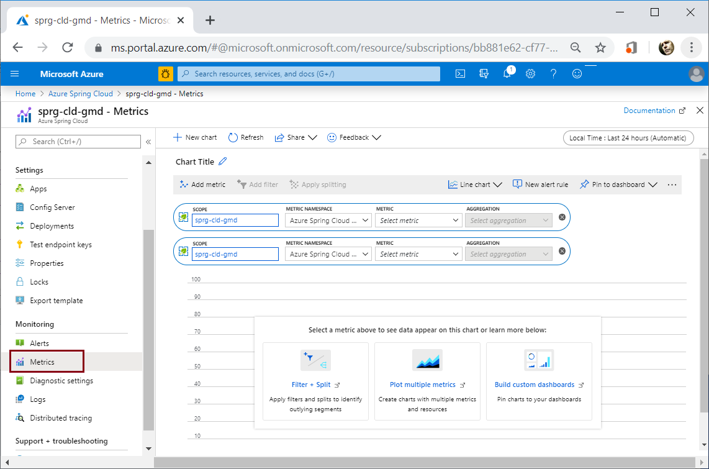

# Tutorial: Monitor Spring Cloud resources using alerts and action groups

Azure Spring Cloud alerts support monitoring resources based on conditions such as available storage, rate of requests, or data usage. An alert sends notification when rates or conditions meet the defined specifications.

There are two steps to set up an alert pipeline: 
1. Set up an Action Group with the actions to be taken when an alert is triggered, such as email, SMS, Runbook, or Webhook. Action Groups can be re-used among different alerts.
2. Set up Alert rules. The rules bind metric patterns with the action groups based on target resource, metric, condition, time aggregation, etc.

## Prerequisites
In addition to the Azure Spring requirements, this tutorial depends on the following resources.

* A deployed Azure Spring Cloud instance.  Follow our [quickstart](spring-cloud-quickstart-launch-app-cli.md) to get started.

* An Azure resource to monitor, for example the database implemented in this article: [How to use Spring Data Apache Cassandra API with Azure Cosmos DB](https://docs.microsoft.com/azure/java/spring-framework/configure-spring-data-apache-cassandra-with-cosmos-db)
 
The following procedures initialize both **Action Group** and **Alert** starting from the **Monitor Overview** page of the Azure portal.

## Set up Action Group

The following procedure initializes an **Action Group**.

1. Navigate to **Monitor - Alerts**, and then select **Alerts** from the left navigation pane.

1. Select **Subscription** and **Resource group**.

1. Select the resource you want to monitor from the drop-down list labeled **Resource**.

1. Select the **Time range**.

 

1. Click **Manage actions** to navigate to the following UI.

1. Click **+ Add action group**.

 

 1. Specify an **Action group name** and **Short name**.

 1. Specify **Subscription** and **Resource group**.

 1. Specify **Action Name**.

 1. Select **Action Type**.

 1. Define the action using the options in the right pane.  This case uses email notification.

 1. Click **OK** in the right action pane.

 1. Click **OK** in the **Add action group** dialog. 

  

## Set up Alert 

The previous steps created an **Action Group** that uses email. You could also use phone notification, webhooks, Azure function, etc. to send notification.  

Next, we will configure an **Alert** to use the **Action Group**.  

From the **Monitor Alerts** page, click **Manage Alert Rules**.

  

1. Select the **Resource** for the alert.

1. Click **+ New alert rule**.

  

1. On the **Create rule** page, specify the **RESOURCE**, **CONDITION**, and **ACTIONS**.  From **ACTIONS** pane select the previously defined **Action Group**.

1. Under **OTHER DETAILS**, Name the alert rule.

1. Click **Create alert rule**.

  

Verify that the new alert rule is enabled.

  

## Next steps
* [SMS Alert Behavior in Action Groups](https://docs.microsoft.com/azure/azure-monitor/platform/alerts-sms-behavior)
* [Tutorial: Using Distributed Tracing with Azure Spring Cloud](https://docs.microsoft.com/azure/spring-cloud/spring-cloud-tutorial-distributed-tracing)