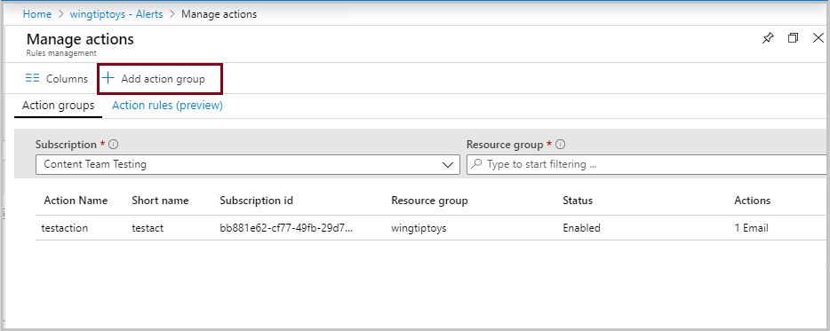

# Tutorial: Monitor Spring Cloud resources using alerts and action groups

Azure Spring Cloud alerts support monitoring resources based on conditions such as available storage and rates of requests or data usage. There are two steps to set up an alert pipeline: 
1. Set up an Action Group with the actions to be taken when an alert is triggered, such as email, SMS, Runbook, or Webhook. Action Groups can be re-used among different alerts.
2. Set up Alert rules. The rules bind metric patterns with the action groups based on target resource, metric, condition, time aggregation, etc.

## Prerequisites
In addition to the Azure Spring requirements, this tutorial depends on the following resources.

* A deployed Azure Spring Cloud instance.  Follow our [quickstart](spring-cloud-quickstart-launch-app-cli.md) to get started.

* An Azure database application, for example see: [How to use Spring Data Apache Cassandra API with Azure Cosmos DB](https://docs.microsoft.com/azure/java/spring-framework/configure-spring-data-apache-cassandra-with-cosmos-db)
 
## Set up action group with alert
The following procedure initializes both **Action Group** and **Alert** starting from the Monitor Overview page of the Azure portal.

1. Navigate to **Monitor - Alerts/Alerts**.

1. Select **Subscription** and **Resource group**.

1. Select the resource you want to monitor from the drop-down list labeled **Resource**.

1. Select the **Time range**.

 

1. Click **Manage actions** to navigate to the following UI.

 

 1. Click **+ Add action group**.

 1. Specify an **Action group name** and **Short name**.

 1. Specify **Subscription** and **Resource group**.

 1. Specify **Action Name**.

 1. Select **Action Type**.

 1. Define the action using the options in the right pane.

 1. Click **OK** in the action pane.

 1. Click **OK** in the **Add action group** dialog. 

  

The previous steps created an action group and sends email or phone notification to the addressee specified.  With the new action group you can configure the alert to use the action group.  From the **Monitor Alerts** page, click **Manage Alert Rules**.

  

1. Select the **Resource** for the alert.

1. Click **+ New alert rule**.

  