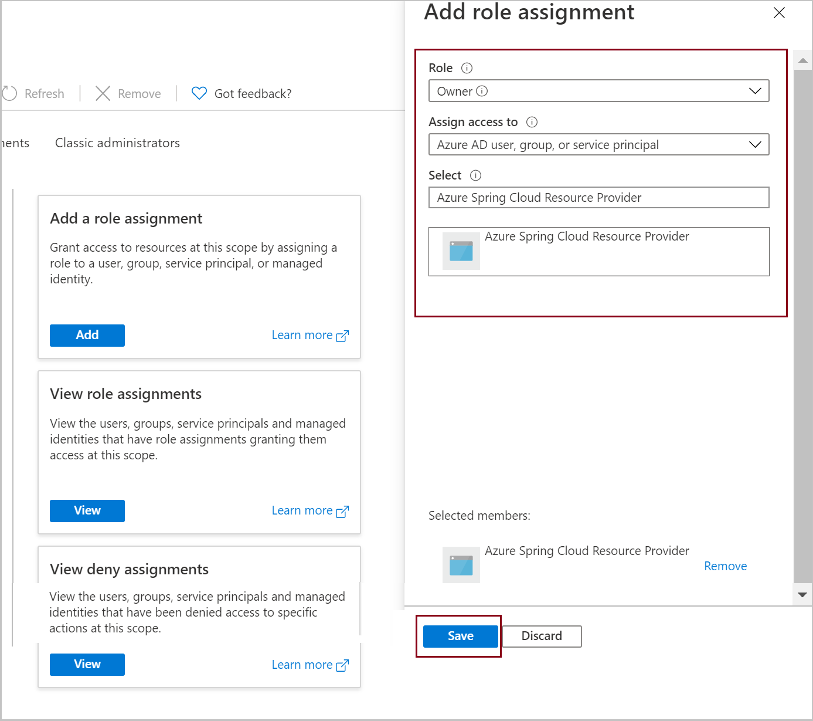
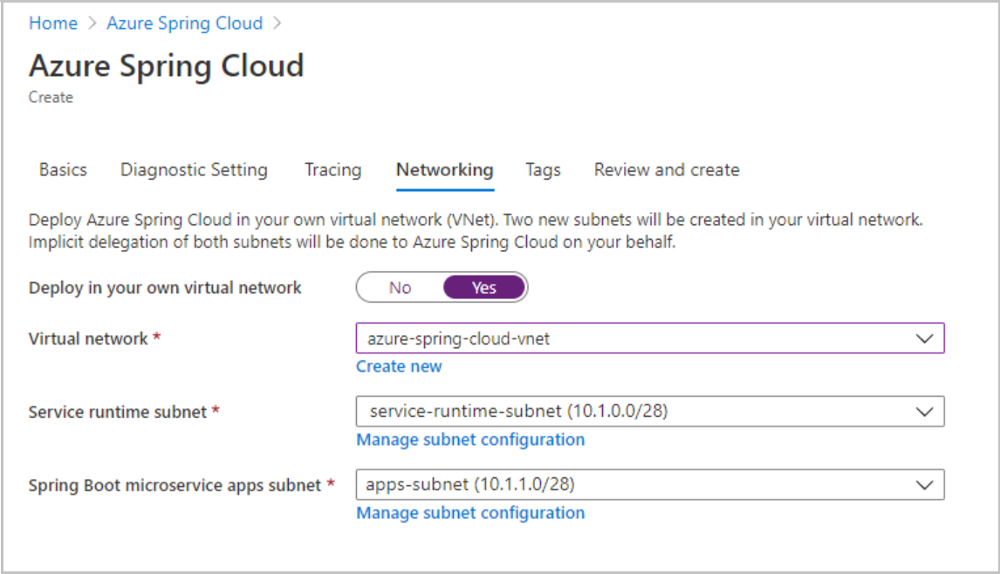
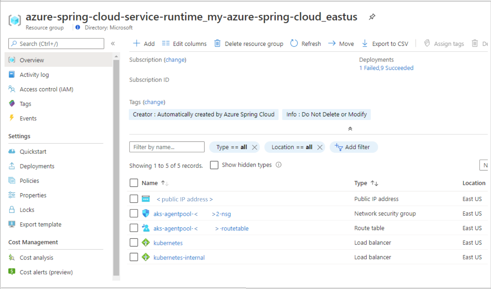
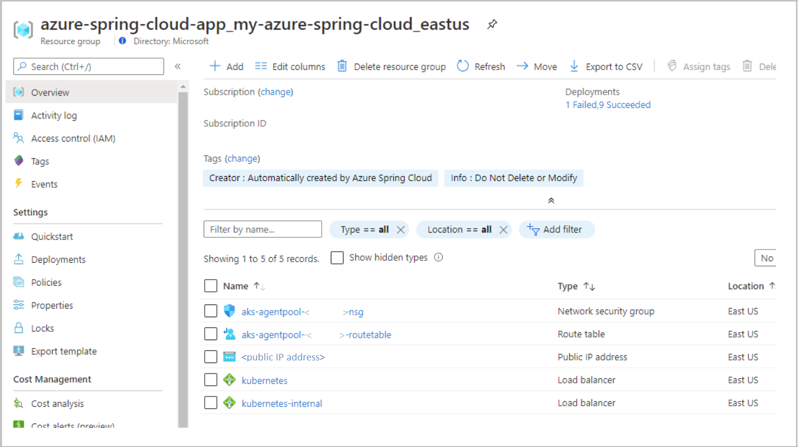
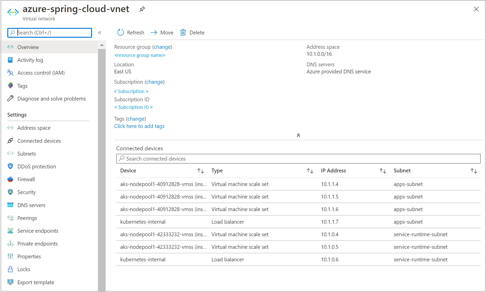

# Tutorial: Deploy Azure Spring Cloud in Azure virtual network (VNet injection)

To customize a network environment, you can deploy Azure Spring Cloud service instance in your virtual network. This is sometimes called VNet injection.  

The deployment enables:

* Isolation of Azure Spring Cloud apps and service runtime from the Internet​ on your corporate network​
* Azure Spring Cloud interaction with systems in ​on-premises data centers ​and/or Azure services in other virtual networks
* Empowerment of customers to control inbound and outbound network communications for Azure Spring Cloud

## Prerequisites
You must register Azure Spring Cloud resource provider `Microsoft.AppPlatform` according to instructions [Register Resource Provider on Azure portal](https://docs.microsoft.com/azure/azure-resource-manager/management/resource-providers-and-types#azure-portal) or by running the following az CLI command:

```azurecli
az provider register --namespace Microsoft.AppPlatform
```
## Virtual network requirements
The virtual network to which you deploy your Azure Spring Cloud service instance must meet the following requirements:

* **Location**: The virtual network must reside in the same location as the Azure Spring Cloud service instance.
* **Subscription**: The virtual network must be in the same subscription as the Azure Spring Cloud service instance.
* **Subnets**: The virtual network must include two subnets dedicated to an Azure Spring Cloud service instance: 
    * One for Service Runtime
    * One for your Spring Boot Microservice Applications. 
    * There is a one-to-one relationship between these subnets and an Azure Spring Cloud service instance. You cannot share multiple service instances across a single subnet. You must use new subnets for each service instances you deploy.
* **Address space**: One CIDR block up to /28 for Service Runtime subnet and another CIDR block up to /24 for Spring Boot Microservice Applications subnet.
* **Route table**: The subnets must not have an existing route table associated.

The following procedures describe setup of the virtual network to contain the instance of Azure Spring Cloud.

## Create a virtual network
If you already have a virtual network to host Azure Spring Cloud service instance, skip step 1, 2 and 3. You can start from step 4 to prepare subnets for the virtual network.

1. From the Azure portal menu, select **Create a resource**. From the Azure Marketplace, select **Networking** > **Virtual network**.

1. In the **Create virtual network** dialog, enter or select the following information:

    |Setting          |Value                                             |
    |-----------------|--------------------------------------------------|
    |Subscription     |Select your subscription.                         |
    |Resource group   |Select your resource group, or create a new one.  |
    |Name             |Enter *azure-spring-cloud-vnet*                   |
    |Location         |Select **East US**                                |

1. Select **Add subnet**, then enter *service-runtime-subnet* for **Subnet name** and 10.1.0.0/24 for **Subnet address range**. Then click **Add**.

1. Select **Add subnet** again, then enter *apps-subnet* for **Subnet name** and 10.1.1.0/24 for **Subnet address range**.  Click **Add**.

1. Click **Review + create**. Leave the rest as defaults and click **Create**.

## Grant service permission to the virtual network

Select the virtual network *azure-spring-cloud-vnet* previously created.

1. Select **Access control (IAM)** from the left navigation pane, then select **Add** > **Add role assignment**.

    

1. In the **Add role assignment** dialog, enter or select the following information:

    |Setting          |Value                                             |
    |-----------------|--------------------------------------------------|
    |Subscription     |Select your subscription.                         |
    |Resource group   |Select your resource group, or create a new one.  |
    |Name             |Enter *azure-spring-cloud-vnet*                   |
    |Location         |Select **East US**                                |


1. Select **Next: IP Addresses**, and enter 10.1.0.0/16 for **IPv4 address space**.

1. Select **Add subnet**, then enter *service-runtime-subnet* for Subnet name and 10.1.0.0/24 for **Subnet address range**.  Click **Add**.

1. Select **Add subnet** again, then enter *apps-subnet* for Subnet name and 10.1.1.0/24 for **Subnet address range**.  Click **Add**.

1. Select **Review + create**. Leave the rest as defaults.  Click **Create**.

## Grant service permission to the virtual network

Select the virtual network *azure-spring-cloud-vnet* you created.

1. Select **Access control (IAM)**, then select **Add > Add role assignment**.

    

2. In **Add role assignment**, enter or select this information:

    |Setting  |Value                                             |
    |---------|--------------------------------------------------|
    |Role     |Select **Owner**                                  |
    |Select   |Enter *Azure Spring Cloud Resource Provider*      |

    Then select *Azure Spring Cloud Resource Provider*, and select **Save**.

    

You can also achieve this by running the following az CLI command

```azurecli
VIRTUAL_NETWORK_RESOURCE_ID=`az network vnet show \
    --name ${NAME_OF_VIRTUAL_NETWORK} \
    --resource-group ${RESOURCE_GROUP_OF_VIRTUAL_NETWORK} \
    --query "id" \
    --output tsv`

az role assignment create \
    --role "Owner" \
    --scope ${VIRTUAL_NETWORK_RESOURCE_ID} \
    --assignee e828g221-a19c-9jd7-b814-fd37c6caf9d2
```

## Deploy Azure Spring Cloud service instance in the virtual network

1. Open the Azure portal using at https://ms.portal.azure.com/?AppPlatformExtension=vnet.

2. From the top search box, search for **Azure Spring Cloud**, and select **Azure Spring Cloud** from the result.

3. On the **Azure Spring Cloud** page, select **+ Add**.

4. Fill out the form on the Azure Spring Cloud **Create** page. Please select the same region as the virtual network.

5. Select **Networking** tab and select the following:

    |Setting                                |Value                                             |
    |---------------------------------------|--------------------------------------------------|
    |Deploy in your own virtual network     |Select **Yes**                                    |
    |Virtual network                        |Select *azure-spring-cloud-vnet*                  |
    |Service runtime subnet                 |Select *service-runtime-subnet*                   |
    |Spring Boot microservice apps subnet   |Select *apps-subnet*                              |

    

6. Click **Review and create**.

7. Verify your specifications, and click **Create**.

    

After the deployment, two additional resource groups will be created in your subscription to host the network resources for the Azure Spring Cloud service instance.

The resource group named as *azure-spring-cloud-service-runtime_{service instance name}_{service instance region}* contains network resources for the Service Runtime of the service instance.

  

The resource group named as *azure-spring-cloud-service-runtime_{service instance name}_{service instance region}* contains network resources for your Spring Boot Microservice Applications of the service instance.

  

Those network resources are connected to your virtual network created above.

  

   > [!Important]
   > The resource groups are fully managed by Azure Spring Cloud service. Please do NOT manually delete or modify any resource inside.

## Limitations

- **Test Endpoint** functionality described in [Verify the staging deployment](https://docs.microsoft.com/azure/spring-cloud/spring-cloud-howto-staging-environment#verify-the-staging-deployment) is not supported for Azure Spring Cloud service instance in your own virtual network.

## Next steps

[Deploy Application to Azure Spring Cloud in your VNet](https://github.com/microsoft/vnet-in-azure-spring-cloud/blob/master/02-deploy-application-to-azure-spring-cloud-in-your-vnet.md)

## See also

- [Troubleshooting Azure Spring Cloud in VNET](https://github.com/microsoft/vnet-in-azure-spring-cloud/blob/master/05-troubleshooting-azure-spring-cloud-in-vnet.md)
- [Customer Responsibilities for Running Azure Spring Cloud in VNET](https://github.com/microsoft/vnet-in-azure-spring-cloud/blob/master/06-customer-responsibilities-for-running-azure-spring-cloud-in-vnet.md)