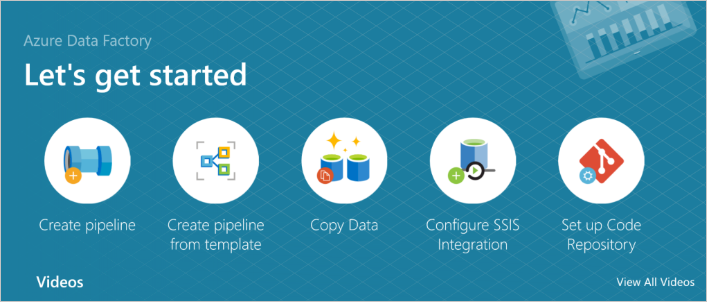
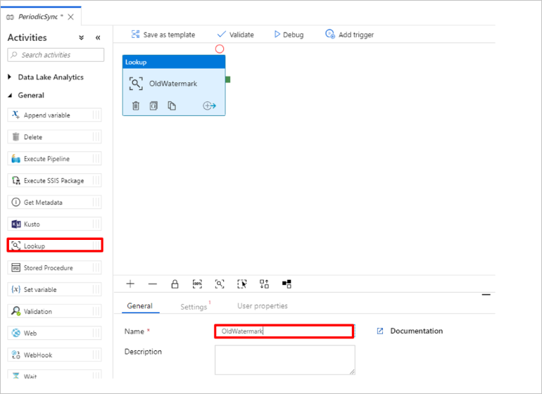
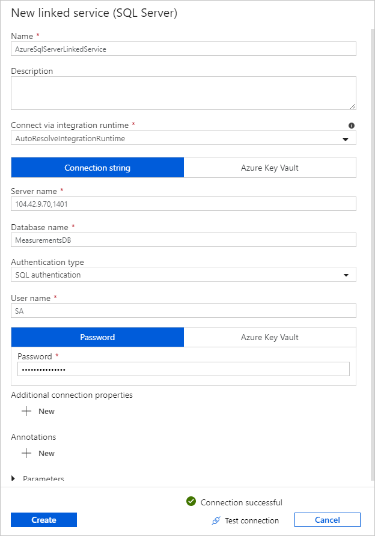

# Tutorial: Sync data from SQL Database Edge to Azure Blob storage by using Azure Data Factory

In this tutorial, you'll use Azure Data Factory to incrementally sync data to Azure Blob storage from a table in an instance of Azure SQL Database Edge.

## Before you begin

If you haven't already created a database or table in your Azure SQL Database Edge deployment, use one of these methods to create one:

* Use [SQL Server Management Studio](/sql/ssms/download-sql-server-management-studio-ssms/) or [Azure Data Studio](/sql/azure-data-studio/download/) to connect to SQL Database Edge and run a SQL script to create the database and table.
* Create a SQL database and table by using [SQLCMD](/sql/tools/sqlcmd-utility/) by directly connecting to the SQL Database Edge module. For more information, see [Connect to the Database Engine by using sqlcmd](/sql/ssms/scripting/sqlcmd-connect-to-the-database-engine/).
* Use SQLPackage.exe to deploy a DAC package file to the SQL Database Edge container. You can automate this process by specifying the SqlPackage file URI as part of the module's desired properties configuration. You can also directly use the SqlPackage.exe client tool to deploy a DAC package to SQL Database Edge.

    For information about how to download SqlPackage.exe, see [Download and install sqlpackage](/sql/tools/sqlpackage-download/). Following are some sample commands for SqlPackage.exe. See the SqlPackage.exe documentation for more information.

    **Create a DAC package**

    ```cmd
    sqlpackage /Action:Extract /SourceConnectionString:"Data Source=<Server_Name>,<port>;Initial Catalog=<DB_name>;User ID=<user>;Password=<password>" /TargetFile:<dacpac_file_name>
    ```

    **Apply a DAC package**

    ```cmd
    sqlpackage /Action:Publish /Sourcefile:<dacpac_file_name> /TargetServerName:<Server_Name>,<port> /TargetDatabaseName:<DB_Name> /TargetUser:<user> /TargetPassword:<password>
    ```

## Create a SQL table and procedure to store and update the watermark levels

A watermark table is used to store the last timestamp up to which data has already been synchronized with Azure Storage. A Transact-SQL (T-SQL) stored procedure is used to update the watermark table after every sync.

Run these commands on the SQL Database Edge instance:

```sql
    Create table [dbo].[watermarktable]
    (
    TableName varchar(255),
    WatermarkValue datetime,
    )
    GO

    CREATE PROCEDURE usp_write_watermark @timestamp datetime, @TableName varchar(50)  
    AS  
    BEGIN
    UPDATE [dbo].[watermarktable]
    SET [WatermarkValue] = @timestamp WHERE [TableName] = @TableName
    END
    Go
```

## Create a Data Factory pipeline

In this section, you'll create an Azure Data Factory pipeline to sync data to Azure Blob storage from a table in Azure SQL Database Edge.

### Create a data factory by using the Data Factory UI

Create a data factory by following the instructions in [this tutorial](../data-factory/quickstart-create-data-factory-portal.md#create-a-data-factory).

### Create a Data Factory pipeline

1. On the **Let's get started** page of the Data Factory UI, select **Create pipeline**.

    

2. On the **General** page of the **Properties** window for the pipeline, enter **PeriodicSync** for the name.

3. Add the Lookup activity to get the old watermark value. In the **Activities** pane, expand **General** and drag the **Lookup** activity to the pipeline designer surface. Change the name of the activity to **OldWatermark**.

    

4. Switch to the **Settings** tab and select **New** for **Source Dataset**. You'll now create a dataset to represent data in the watermark table. This table contains the old watermark that was used in the previous copy operation.

5. In the **New Dataset** window, select **Azure SQL Server**, and then select **Continue**.  

6. In the **Set properties** window for the dataset, under **Name**, enter **WatermarkDataset**.

7. For **Linked Service**, select **New**, and then complete these steps:

    1. Under **Name**, enter **SQLDBEdgeLinkedService**.

    2. Under **Server name**, enter your SQL Database Edge server details.

    3. Select your **Database name** from the list.

    4. Enter your **User name** and **Password**.

    5. To test the connection to the SQL Database Edge instance, select **Test connection**.

    6. Select **Create**.

    

    7. Select **OK**.

8. On the **Settings** tab, select **Edit**.

9. On the **Connection** tab, select **[dbo].[watermarktable]** for **Table**. If you want to preview data in the table, select **Preview data**.

10. Switch to the pipeline editor by selecting the pipeline tab at the top or by selecting the name of the pipeline in the tree view on the left. In the properties window for the Lookup activity, confirm that **WatermarkDataset** is selected in the **Source dataset** list.

11. In the **Activities** pane, expand **General** and drag another **Lookup** activity to the pipeline designer surface. Set the name to **NewWatermark** on the **General** tab of the properties window. This Lookup activity gets the new watermark value from the table that contains the source data so it can be copied to the destination.

12. In the properties window for the second Lookup activity, switch to the **Settings** tab and select **New** to create a dataset to point to the source table that contains the new watermark value.

13. In the **New Dataset** window, select **SQL Database Edge instance**, and then select **Continue**.

    1. In the **Set properties** window, under **Name**, enter **SourceDataset**. Under **Linked service**, select **SQLDBEdgeLinkedService**.

    2. Under **Table**, select the table that you want to synchronize. You can also specify a query for this dataset, as described later in this tutorial. The query takes precedence over the table you specify in this step.

    3. Select **OK**.

14. Switch to the pipeline editor by selecting the pipeline tab at the top or by selecting the name of the pipeline in the tree view on the left. In the properties window for the Lookup activity, confirm that **SourceDataset** is selected in the **Source dataset** list.

15. Select **Query** under **Use query**. Update the table name in the following query and then enter the query. You are selecting only the maximum value of `timestamp` from the table. Be sure to select **First row only**.

    ```sql
    select MAX(timestamp) as NewWatermarkvalue from [TableName]
    ```

    

16. In the **Activities** pane, expand **Move & Transform** and drag the **Copy** activity from the **Activities** pane to the designer surface. Set the name of the activity to **IncrementalCopy**.

17. Connect both Lookup activities to the Copy activity by dragging the green button attached to the Lookup activities to the Copy activity. Release the mouse button when you see the border color of the Copy activity change to blue.

18. Select the Copy activity and confirm that you see the properties for the activity in the **Properties** window.

19. Switch to the **Source** tab in the **Properties** window and complete these steps:

    1. In the **Source dataset** box, select **SourceDataset**.

    2. Under **Use query**, select **Query**.

    3. Enter the SQL query in the **Query** box. Here's a sample query:

    ```sql
    select * from TemperatureSensor where timestamp > '@{activity('OldWaterMark').output.firstRow.WatermarkValue}' and timestamp <= '@{activity('NewWaterMark').output.firstRow.NewWatermarkvalue}'
    ```

20. On the **Sink** tab, select **New** under **Sink Dataset**.

21. In this tutorial, the sink data store is an Azure Blob storage data store. Select **Azure Blob storage**, and then select **Continue** in the **New Dataset** window.

22. In the **Select Format** window, select the format of your data, and then select **Continue**.

23. In the **Set Properties** window, under **Name**, enter **SinkDataset**. Under **Linked service**, select **New**. You'll now create a connection (a linked service) to your Azure Blob storage.

24. In the **New Linked Service (Azure Blob storage)** window, complete these steps:

    1. In the **Name** box, enter **AzureStorageLinkedService**.

    2. Under **Storage account name**, select the Azure Storage Account for your Azure subscription.

    3. Test the connection and then select **Finish**.

25. In the **Set Properties** window, confirm that **AzureStorageLinkedService** is selected under **Linked service**. Select **Create** and **OK**.

26. On **Sink** tab, select **Edit**.

27. Go to the **Connection** tab of SinkDataset and complete these steps:

    1. Under **File path**, enter *asdedatasync/incrementalcopy*, where *adftutorial* is the blob container name and *incrementalcopy* is the folder name. Create the container if it doesn't exist, or set it to the name of an existing one. Azure Data Factory automatically creates the output folder *incrementalcopy* if it does not exist. You can also use the **Browse** button for the **File path** to navigate to a folder in a blob container.

    2. For the **File** part of the **File path** field, select **Add dynamic content [Alt+P]**, and then *enter @CONCAT('Incremental-', pipeline().RunId, '.txt')* in the opened window. Then select **Finish**. The file name is dynamically generated by using the expression. Each pipeline run has a unique ID. The Copy activity uses the run ID to generate the file name.

28. Switch to the **pipeline** editor by selecting the pipeline tab at the top or by selecting the name of the pipeline in the tree view on the left.

29. In the **Activities** toolbox, expand **General**, and drag-drop the **Stored Procedure** activity from the **Activities** toolbox to the pipeline designer surface. **Connect** the green (Success) output of the **Copy** activity to the **Stored Procedure** activity.

30. Select **Stored Procedure Activity** in the pipeline designer, change its name to *SPtoUpdateWatermarkActivity*.

31. Switch to the **SQL Account** tab, and select *SQLDBEdgeLinkedService* for **Linked service**.

32. Switch to the **Stored Procedure** tab, and do the following steps:

    1. For **Stored procedure name**, select *[dbo].[usp_write_watermark]*.

    2. To specify values for the stored procedure parameters, select Import parameter, and enter following values for the parameters:

    |Name|Type|Value|
    |-----|----|-----|
    |LastModifiedtime|DateTime|@{activity('NewWaterMark').output.firstRow.NewWatermarkvalue}|
    |TableName|String|@{activity('OldWaterMark').output.firstRow.TableName}|

33. To validate the pipeline settings, select **Validate** on the toolbar. Confirm that there are no validation errors. To close **the Pipeline Validation Report** window, select **>>**.

34. Publish entities (linked services, datasets, and pipelines) to the Azure Data Factory service by selecting the **Publish All** button. Wait until you see a message that the publishing succeeded.

## Trigger a Pipeline on schedule

1. On the pipeline toolbar select **Add Trigger**, then select **New/Edit**, select **+ New**.

2. Name your trigger with *HourlySync*, choose **Type** as Schedule, and set **Recurrence** to every 1 hour.

3. Select **OK**.

4. Select **Publish All**.

5. Select **Trigger Now**.

6. Switch to the **Monitor** tab on the left. You can see the status of the pipeline run triggered by the manual trigger. Select **Refresh** button to refresh the list.

## Next steps

The Azure Data Factory pipeline in this tutorial copies data from a table on the SQL Database Edge instance to a location in Azure Blob storage at an hourly frequency. To learn about using Data Factory in more scenarios, go through these [tutorials](../data-factory/tutorial-copy-data-portal.md).
