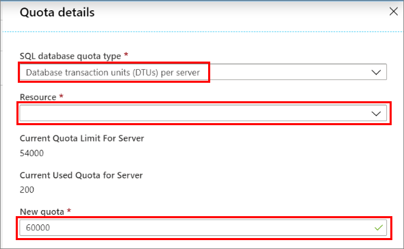
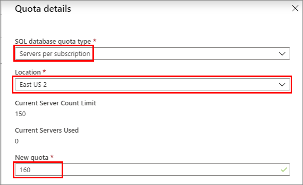
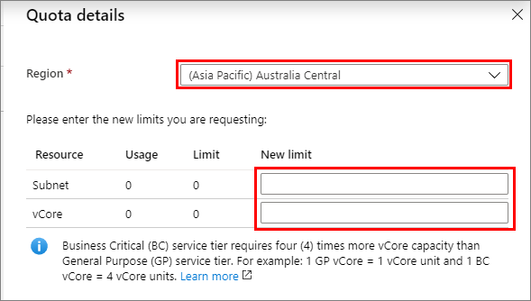

# Request quota increases for Azure SQL Database

This article explains how to request a quota increase for Azure SQL Database for single databases, servers, and managed instances. It also explains how to enable subscription access to a region.

##  Create a new support request

Use the following steps to create a new support request from the Azure portal for SQL Database.

1. On  the [Azure portal](https://portal.azure.com) menu, select **Help + support**.

   

1. In **Help + support**, select **New support request**.

    

1. For **Issue type**, select **Service and subscription limits (quotas)**.

   

1. For **Subscription**, select the subscription whose quota you want to increase.

   

1. For **Quota type**, select one of the following quota types:

   - **SQL Database** for single database and elastic pool quotas.
   - **SQL Database Managed Instance** for managed instances.

   Then select **Next: Solutions >>**.

   

1. In the **Details** window, select **Provide details** to enter additional information.

   

Clicking **Provide details** displays the **Quota details** window that allows you to add additional information. The following sections describe the different options for **SQL Database** and **SQL Database Managed Instance** quota types.

##  SQL Database quota types

The following sections describe three quota increase options for the **SQL Database** quota types:

- Database transaction units (DTUs) per server
- Servers per subscription
- Enable subscription access to a region

### Database transaction units (DTUs) per server

Use the following steps to request an increase in the DTUs per server.

1. Select the **Database transaction units (DTUs) per server** quota type.

1. In the **Resource** list, select the resource to target.

1. In the **New quota** field, enter the new DTU limit that you are requesting.

   

For more information, see [Resource limits for single databases using the DTU purchasing model](sql-database-dtu-resource-limits-single-databases.md) and [Resources limits for elastic pools using the DTU purchasing model](sql-database-dtu-resource-limits-elastic-pools.md).

### Servers per subscription

Use the following steps to request an increase in the number of servers per subscription.

1. Select the **Servers per subscription** quota type.

1. In the **Location** list, select the Azure region to use. The quota is per subscription in each region.

1. In the **New quota** field, enter your request for the maximum number of servers in that region.

   

For more information, see [SQL Database resource limits and resource governance](sql-database-resource-limits-database-server.md).

###  Enable subscription access to a region

Some offer types are not available in every region. You may see an error such as the following:

`This location is not available for subscription`

If your subscription needs access in a particular region, please use the **Other quota request** option to request access. In your request, specify the offering and SKU details that you want to enable for the region. To explore the offering and SKU options, see [Azure SQL Database pricing](https://azure.microsoft.com/pricing/details/sql-database/single/).

##  Managed instance quota type

For the **SQL Managed Instance** quota type, use the following steps:

1. In the **Region** list, select the Azure region to target.

1. Enter the new limits you are requesting for **Subnet** and **vCore**.

   

For more information, see [Overview Azure SQL Database managed instance resource limits](sql-database-managed-instance-resource-limits.md).

## Submit your request

The final step is to fill in the remaining details of your SQL Database quota request. Then select **Next: Review + create>>**, and after reviewing the request details, click **Create** to submit the request.

## Next steps

After you submit your request, it will be reviewed. You will be contacted with an answer based on the information you provided in the form.

For more information about other Azure limits, see [Azure subscription and service limits, quotas, and constraints](../azure-resource-manager/management/azure-subscription-service-limits.md).
