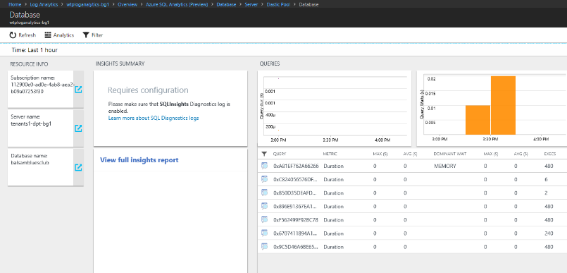
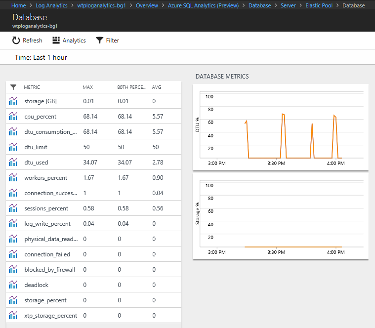
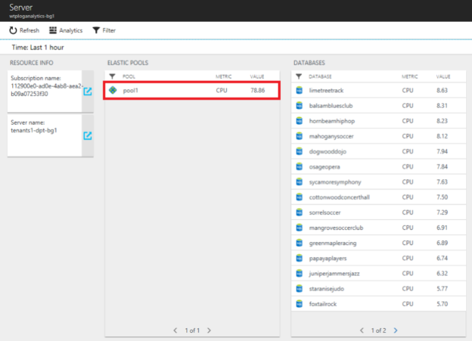
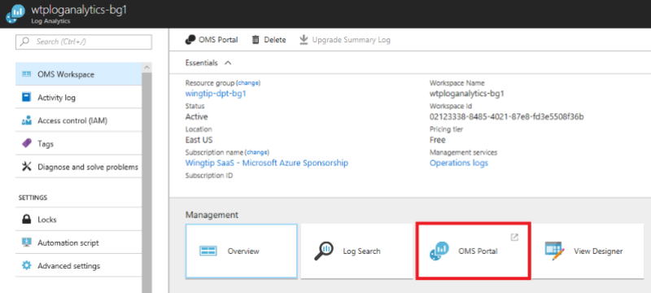

# Set up and use Log Analytics (OMS) with a multi-tenant Azure SQL Database SaaS app

In this tutorial, you set up and use *Log Analytics ([OMS](https://www.microsoft.com/cloud-platform/operations-management-suite))* for monitoring elastic pools and databases. This tutorial builds on the [Performance Monitoring and Management tutorial](saas-dbpertenant-performance-monitoring.md). It shows how to use *Log Analytics* to augment the monitoring and alerting provided in the Azure portal. Log Analytics is suitable for monitoring and alerting at scale because it supports hundreds of pools and hundreds of thousands of databases. Log Analytics provides a single monitoring solution, which can integrate monitoring of different applications and Azure services, across multiple Azure subscriptions.

In this tutorial you learn how to:

> [!div class="checklist"]
> * Install and configure Log Analytics (OMS)
> * Use Log Analytics to monitor pools and databases

To complete this tutorial, make sure the following prerequisites are completed:

* The Wingtip Tickets SaaS Database Per Tenant app is deployed. To deploy in less than five minutes, see [Deploy and explore the Wingtip Tickets SaaS Database Per Tenant application](saas-dbpertenant-get-started-deploy.md)
* Azure PowerShell is installed. For details, see [Getting started with Azure PowerShell](https://docs.microsoft.com/powershell/azure/get-started-azureps)

See the [Performance Monitoring and Management tutorial](saas-dbpertenant-performance-monitoring.md) for a discussion of the SaaS scenarios and patterns, and how they affect the requirements on a monitoring solution.

## Monitoring and managing performance with Log Analytics (OMS)

For SQL Database, monitoring and alerting is available on databases and pools. This built-in monitoring and alerting is resource-specific and convenient for small numbers of resources, but is less well suited to monitoring large installations or for providing a unified view across different resources and subscriptions.

For high-volume scenarios, Log Analytics can be used for monitoring and alerting. Log Analytics is a separate Azure service that enables analytics over  diagnostic logs and telemetry gathered in a workspace, which can collect logs and telemetry from many services. Log Analytics provides a built-in query language and data visualization tools allowing operational data analytics and visualization. The SQL Analytics solution provides several pre-defined elastic pool and database monitoring and alerting views and queries. OMS also provides a custom view designer.

Log Analytics workspaces and analytics solutions can be opened both in the Azure portal and in OMS. The Azure portal is the newer access point but may be behind the OMS portal in some areas.

### Create performance diagnostic data by simulating a workload on your tenants 

1. In the **PowerShell ISE**, open *..\\WingtipTicketsSaaS-MultiTenantDb-master\\Learning Modules\\Performance Monitoring and Management\\**Demo-PerformanceMonitoringAndManagement.ps1***. Keep this script open as you may want to run several of the load generation scenarios during this tutorial.
1. If you have not done so already, provision a batch of tenants to provide a more interesting monitoring context. This will take a few minutes:
   1. Set **$DemoScenario = 1, Provision a batch of tenants**
   1. To run the script and deploy an additional 17 tenants, press **F5**.  

1. Now start the load generator to run a simulated load on all the tenants.  
    1. Set **$DemoScenario = 2, Generate normal intensity load (approx. 40 DTU)**.
    1. To run the script, press **F5**.

## Get the Wingtip Tickets SaaS Database Per Tenant application scripts

The Wingtip Tickets SaaS Multi-tenant Database scripts and application source code are available in the [WingtipTicketsSaaS-DbPerTenant](https://github.com/Microsoft/WingtipTicketsSaaS-DbPerTenant) GitHub repo. Check out the [general guidance](saas-tenancy-wingtip-app-guidance-tips.md) for steps to download and unblock the Wingtip Tickets PowerShell scripts.

## Installing and configuring Log Analytics and the Azure SQL Analytics solution

Log Analytics is a separate service that needs to be configured. Log Analytics collects log data, telemetry, and metrics in a log analytics workspace. A log analytics workspace is a resource, just like other resources in Azure, and must be created. While the workspace doesn’t need to be created in the same resource group as the application(s) it is monitoring, this often makes the most sense. For the Wingtip Tickets app, this ensures the workspace will be deleted with the application when you delete the one resource group.

1. In the **PowerShell ISE**, open *..\\WingtipTicketsSaaS-MultiTenantDb-master\\Learning Modules\\Performance Monitoring and Management\\Log Analytics\\**Demo-LogAnalytics.ps1***.
1. To run the script, press **F5**.

At this point, you should be able open Log Analytics in the Azure portal (or the OMS portal). It takes a few minutes for telemetry to be collected in the Log Analytics workspace and to become visible. The longer you leave the system gathering diagnostic data the more interesting the experience is. Now's a good time to grab a beverage - just make sure the load generator is still running!

## Use Log Analytics and the SQL Analytics solution to monitor pools and databases

In this exercise, open Log Analytics and the OMS portal to look at the telemetry being gathered for the databases and pools.

1. Browse to the [Azure portal](https://portal.azure.com) and open Log Analytics by clicking More services, then search for Log Analytics:

   

1. Select the workspace named *wtploganalytics-&lt;USER&gt;*.

1. Select **Overview** to open the Log Analytics solution in the Azure portal.
   

    > [!IMPORTANT]
    > It may take a couple of minutes before the solution is active. Be patient!

1. Click on the Azure SQL Analytics tile to open it.

    

    

1. The views in the solution blade scroll sideways, with their own inner scroll bar at the bottom (refresh the blade if needed).

1. Explore the summary page by clicking on the tiles or on an individual database to open a drill-down explorer.

1. Change the filter setting to modify the time range - for this tutorial pick *Last 1 hour*

    

1. Select a single database to explore query usage and metrics for that database.

    

1. Scroll the analytics page to the right to see usage metrics.
 
     

1. Scroll the analytics page to the left and click on the server tile in the Resource Info list. This will open a page showing the pools and databases on the server. 

     

 
     

1. On the server page that opens that shows the pools and databases on the server, click on the pool.  On the pool page that opens, scroll to the right to see the pool metrics.  

     

1. Back on the Log Analytics workspace blade, select OMS Portal to open the workspace there.

    

In the OMS portal, you can explore the log and metric data in the workspace further.  

The monitoring and alerting in Log Analytics and OMS is based on queries over the data in the workspace, unlike the alerting on each resource blade, which is resource-specific. Thus, you can define a single alert that looks over all databases, rather than defining one per database. Or write an alert that uses a composite query over multiple resource types. Queries are only limited by the data available in the workspace.

For more information on using OMS to query and set alerts see, [Working with alert rules in Log Analytics](https://docs.microsoft.com/en-us/azure/log-analytics/log-analytics-alerts-creating).

Log Analytics for SQL Database is charged for based on the data volume in the workspace. In this tutorial, you created a Free workspace, which is limited to 500MB per day. Once that limit is reached data is no longer added to the workspace.

## Next steps

In this tutorial you learned how to:

> [!div class="checklist"]
> * Install and configure Log Analytics (OMS)
> * Use Log Analytics to monitor pools and databases

[Tenant analytics tutorial](saas-dbpertenant-log-analytics.md)

## Additional resources

* [Additional tutorials that build upon the initial Wingtip Tickets SaaS Database Per Tenant application deployment](saas-dbpertenant-wingtip-app-overview.md#sql-database-wingtip-saas-tutorials)
* [Azure Log Analytics](../log-analytics/log-analytics-azure-sql.md)
* [OMS](https://blogs.technet.microsoft.com/msoms/2017/02/21/azure-sql-analytics-solution-public-preview/)
