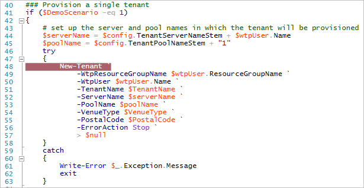
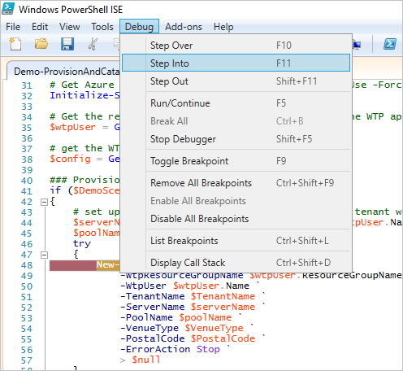
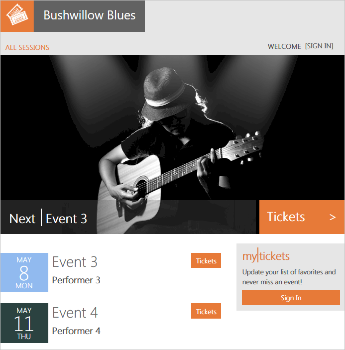
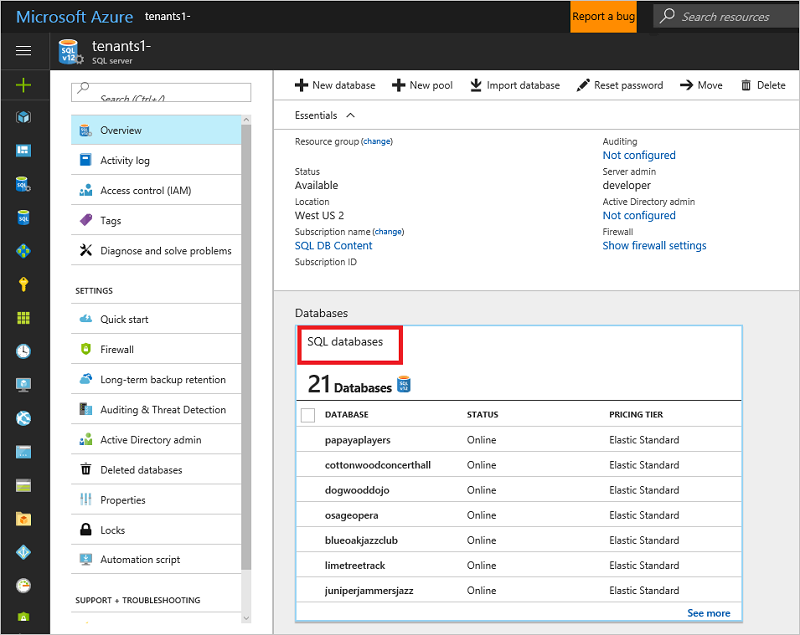

# Learn how to provision new tenants and register them in the catalog

In this tutorial, you learn about the provision and catalog SaaS patterns, and how they are implemented in the Wingtip Tickets SaaS Database per Tenant application. You create and initialize new tenant databases, and register them in the application’s tenant catalog. The catalog is a database that maintains the mapping between the SaaS application's many tenants and their data. The catalog plays an important role directing application and management requests to the correct database.  

In this tutorial, you learn how to:

> [!div class="checklist"]

> * Provision a single new tenant, including stepping through how this is implemented
> * Provision a batch of additional tenants

To complete this tutorial, make sure the following prerequisites are completed:

* The Wingtip Tickets SaaS Database per Tenant app is deployed. To deploy in less than five minutes, see [Deploy and explore the Wingtip Tickets SaaS Database per Tenant application](saas-dbpertenant-get-started-deploy.md)
* Azure PowerShell is installed. For details, see [Getting started with Azure PowerShell](https://docs.microsoft.com/powershell/azure/get-started-azureps)

## Introduction to the SaaS Catalog pattern

In a database-backed multi-tenant SaaS application, it's important to know where information for each tenant is stored. In the SaaS catalog pattern, a catalog database is used to hold the mapping between each tenant and the database in which their data is stored. The Wingtip Tickets SaaS Database per tenant app uses a single tenant per database model, but the basic pattern of storing tenant-to-database mapping in a catalog applies whenever tenant data is distributed across multiple databases, whether a multi-tenant or single-tenant database is used.

Each tenant is assigned a key that identifies them in the catalog and which is mapped to the location of the appropriate database. In the Wingtip Tickets SaaS app, the key is formed from a hash of the tenant’s name. This allows the tenant name portion of the application URL to be used to construct the key. Other tenant key schemes could be used.  

The catalog allows the name or location of the database to be changed with minimal impact on the application.  In a multi-tenant database model, this also accommodates ‘moving’ a tenant between databases.  The catalog can also be used to indicate whether a tenant or database is offline for maintenance or other actions. This is explored in the [restore single tenant tutorial](saas-dbpertenant-restore-single-tenant.md).

In addition, the catalog, which is in effect a management database for a SaaS application, can store additional tenant or database metadata, such as the tier or edition of a database, schema version, service plan, or SLAs offered to tenants, and other info that enables application management, customer support, or devops processes.  

Beyond the SaaS application, the catalog can enable database tools.  In the Wingtip Tickets SaaS Database per Tenant sample, the catalog is used to enable cross-tenant query, explored in the [ad hoc analytics tutorial](saas-tenancy-adhoc-analytics.md). Cross-database job management is explored in the [schema management](saas-tenancy-schema-management.md) and [tenant analytics](saas-tenancy-tenant-analytics.md) tutorials. 

In the Wingtip Tickets SaaS samples, the catalog is implemented using the Shard Management features of the [Elastic Database Client Library (EDCL)](sql-database-elastic-database-client-library.md). The EDCL is available in Java and .Net Framework. The EDCL enables an application to create, manage, and use a database-backed shard map. A shard map contains a list of shards (databases) and the mapping between keys (tenants) and shards.  EDCL functions can be used from applications or PowerShell scripts during tenant provisioning to create the entries in the shard map, and from applications to efficiently connect to the correct database. EDCL caches connection information to minimize the traffic to the catalog database and speed up the application.  

> [!IMPORTANT]
> The mapping data is accessible in the catalog database, but *don't edit it*! Edit mapping data using Elastic Database Client Library APIs only. Directly manipulating the mapping data risks corrupting the catalog and is not supported.

## Introduction to the SaaS Provisioning pattern

When onboarding a new tenant in a SaaS application that uses a single-tenant database model a new tenant database must be provisioned.  It must be created in the appropriate location and service tier, initialized with appropriate schema and reference data, and then registered in the catalog under the appropriate tenant key.  

Different approaches can be used to database provisioning, which could include executing SQL scripts, deploying a bacpac, or copying a template database.  

The provisioning approach you use must be comprehended in your overall schema management strategy, which must ensure that new databases are provisioned with the latest schema.  This is explored in the [schema management tutorial](saas-tenancy-schema-management.md).  

The Wingtip Tickets SaaS Database per Tenant app provisions new tenants by copying a template database named _basetenantdb_, deployed on the catalog server.  Provisioning could be integrated into the application as part of a sign-up experience, and/or supported offline using scripts. This tutorial  explores provisioning using PowerShell. The provisioning scripts copy the basetenantdb database to create a new tenant database in an elastic pool, then initialize it with tenant-specific info and register it in the catalog shard map.  In Wingtip Tickets SaaS Database Per tenant app, tenant databases are given names based on the tenant name, but this is not a critical part of the pattern – the use of the catalog allows any name to be assigned to tenant databases.+ 

## Get the Wingtip application scripts

The Wingtip SaaS scripts and application source code are available in the [WingtipTicketsSaaS-DbPerTenant](https://github.com/Microsoft/WingtipTicketsSaaS-DbPerTenant) GitHub repo. [Steps to download the Wingtip Tickets SaaS scripts](saas-dbpertenant-wingtip-app-guidance-tips.md#download-and-unblock-the-wingtip-saas-scripts).

## Provision and catalog detailed walkthrough

To understand how the Wingtip application implements new tenant provisioning, add a breakpoint and step through the workflow while provisioning a tenant:

1. In _PowerShell ISE_, open ...\\Learning Modules\\ProvisionAndCatalog\\_Demo-ProvisionAndCatalog.ps1_ and set the following parameters:
   * **$TenantName** = the name of the new venue (for example, *Bushwillow Blues*).
   * **$VenueType** = one of the pre-defined venue types: *blues*, classicalmusic, dance, jazz, judo, motorracing, multipurpose, opera, rockmusic, soccer.
   * **$DemoScenario** = **1**, to *Provision a single tenant*.

1. Add a breakpoint by putting your cursor anywhere on line 48, the line that says: *New-Tenant `*, and press **F9**.

   

1. To run the script press **F5**.

1. After the script execution stops at the breakpoint, press **F11** to step into the code.

   

Trace the script's execution using the **Debug** menu options - **F10** and **F11** to step over or into the called functions. For more information about debugging PowerShell scripts, see [Tips on working with and debugging PowerShell scripts](https://msdn.microsoft.com/powershell/scripting/core-powershell/ise/how-to-debug-scripts-in-windows-powershell-ise).

The following are not steps to explicitly follow, but an explanation of the workflow you step through while debugging the script:

1. **Import the SubscriptionManagement.psm1** module that contains functions for signing in to Azure and selecting the Azure subscription you are working with.
1. **Import the CatalogAndDatabaseManagement.psm1** module that provides a catalog and tenant-level abstraction over the [Shard Management](sql-database-elastic-scale-shard-map-management.md) functions. This is an important module that encapsulates much of the catalog pattern and is worth exploring.
1. **Get configuration details**. Step into Get-Configuration (with F11) and see how the app config is specified. Resource names and other app-specific values are defined here, but do not change any of these values until you are familiar with the scripts.
1. **Get the catalog object**. Step into Get-Catalog which composes and returns a catalog object that is used in the higher-level script.  This function uses Shard Management functions that are imported from **AzureShardManagement.psm1**. The catalog object is composed of the following:
   * $catalogServerFullyQualifiedName is constructed using the standard stem plus your User name: _catalog-\<user\>.database.windows.net_.
   * $catalogDatabaseName is retrieved from the config: *tenantcatalog*.
   * $shardMapManager object is initialized from the catalog database.
   * $shardMap object is initialized from the *tenantcatalog* shard map in the catalog database.
   A catalog object is composed and returned, and used in the higher-level script.
1. **Calculate the new tenant key**. A hash function is used to create the tenant key from the tenant name.
1. **Check if the tenant key already exists**. The catalog is checked to ensure the key is available.
1. **The tenant database is provisioned with New-TenantDatabase.** Use **F11** to step in and see how the database is provisioned using an [Azure Resource Manager template](../azure-resource-manager/resource-manager-template-walkthrough.md).

    The database name is constructed from the tenant name to make it clear which shard belongs to which tenant. (Other strategies for database naming could easily be used.)
    A Resource Manager template is used to create a tenant database by copying a template database (baseTenantDB) on the catalog server. An alternative approach could be to create an empty database and then initialize it by importing a bacpac, or to execute an initialization script from a well-known location.  

    The Resource Manager template is in the …\Learning Modules\Common\ folder: *tenantdatabasecopytemplate.json*

1. After the tenant database is created, it is then further **initialized with the venue (tenant) name and the venue type**. Other initialization could also be done here.

1. The **tenant database is registered in the catalog** with *Add-TenantDatabaseToCatalog* using the tenant key. Use **F11** to step into the details:

    * The catalog database is added to the shard map (the list of known databases).
    * The mapping that links the key value to the shard is created.
    * Additional meta data about the tenant (the venue's name) is added to the Tenants table in the catalog.  The Tenants table is not part of the ShardManagement schema and is not installed by the EDCL.  This table illustrates how the Catalog database can be extended to support additional application-specific data.   

After provisioning completes, execution returns to the original *Demo-ProvisionAndCatalog* script, which opens the **Events** page for the new tenant in the browser:

   

## Provision a batch of tenants

This exercise provisions a batch of 17 tenants. It’s recommended you provision this batch of tenants before starting other Wingtip Tickets SaaS Database per Tenant tutorials, so there's more than just a few databases to work with.

1. In the *PowerShell ISE*, open ...\\Learning Modules\\ProvisionAndCatalog\\*Demo-ProvisionAndCatalog.ps1* and change the *$DemoScenario* parameter to 3:
   * **$DemoScenario** = **3**, to *Provision a batch of tenants*.
1. Press **F5** to run the script.

The script deploys a batch of additional tenants. It uses an [Azure Resource Manager template](../azure-resource-manager/resource-manager-template-walkthrough.md) that controls the batch and then delegates provisioning of each database to a linked template. Using templates in this way allows Azure Resource Manager to broker the provisioning process for your script. Templates provision databases in parallel where it can, and handles retries if needed, optimizing the overall process. The script is idempotent so if it fails or stops for any reason, run it again.

### Verify the batch of tenants successfully deployed

* In the [Azure portal](https://portal.azure.com), browse to your list of servers and open the *tenants1* server. Click **SQL databases** and verify the batch of 17 additional databases are now in the list:

   

## Other provisioning patterns

Other provisioning patterns not included in this tutorial include:

**Pre-provisioning databases.** The pre-provisioning pattern exploits the fact that databases in an elastic pool do not add extra cost. Billing is for the elastic pool, not the databases, and idle databases consume no resources. By pre-provisioning databases in a pool and allocating them when needed, tenant onboarding time can be reduced significantly. The number of databases pre-provisioned can be adjusted as needed to keep a buffer suitable for the anticipated provisioning rate.

**Auto-provisioning.** In the auto-provisioning pattern, a provisioning service provisions servers, pools, and databases automatically as needed – including pre-provisioning databases in elastic pools if desired. And if databases are de-commissioned and deleted, gaps in elastic pools can be filled by the provisioning service. Such a service could be simple or complex – for example, handling provisioning across multiple geographies, and could set up geo-replication for disaster recovery. With the auto-provisioning pattern, a client application or script submits a provisioning request to a queue to be processed by the provisioning service, and then polls the service to determine completion. If pre-provisioning is used, requests would be handled quickly, with the service provisioning a replacement database in the background.

## Next steps

In this tutorial you learned how to:

> [!div class="checklist"]

> * Provision a single new tenant
> * Provision a batch of additional tenants
> * Step into the details of provisioning tenants, and registering them into the catalog

Try the [Performance monitoring tutorial](saas-dbpertenant-performance-monitoring.md).

## Additional Resources

* Additional [tutorials that build upon the Wingtip Tickets SaaS Database per Tenant application](saas-dbpertenant-wingtip-app-overview.md#sql-database-wingtip-saas-tutorials)
* [Elastic database client library](sql-database-elastic-database-client-library.md)
* [How to Debug Scripts in Windows PowerShell ISE](https://msdn.microsoft.com/powershell/scripting/core-powershell/ise/how-to-debug-scripts-in-windows-powershell-ise)
