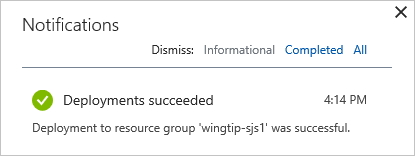
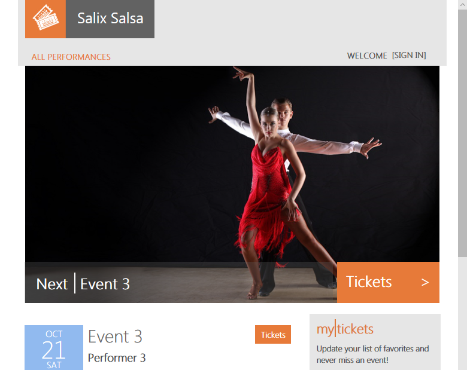
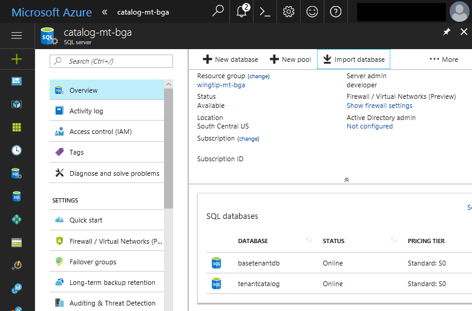
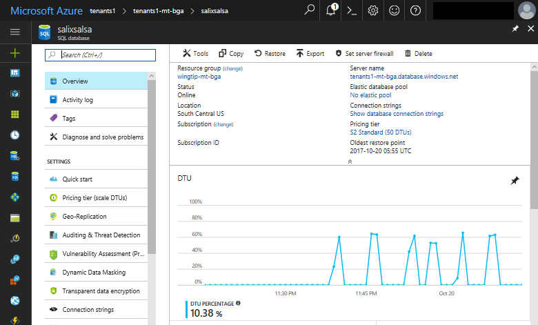

# Deploy and explore a sharded multi-tenant application that uses Azure SQL Database

In this tutorial, you deploy and explore a sample SaaS multi-tenant database application that is named Wingtip Tickets. The Wingtip app is designed to showcase features of Azure SQL Database that simplify the implementation of SaaS scenarios.

This implementation of Wingtips uses a sharded multi-tenant database pattern. The sharding is by tenant identifier. Tenant data is distributed to particular database according to the tenant identifier values. No matter how many tenants any given database contains, all databases are multi-tenant in the sense that the table schemas include a tenant identifier. 

This database pattern allows you to store one or more tenants in each shard or database. You can optimize for lowest cost by having each database be shared by multiple tenants. Or you can optimize for isolation by having each database store only one tenant. Your optimization choice can be made independently for each specific tenant. Your choice can be made when the tenant is first stored, or you can change your mind later. The application is designed to work well either way.

#### App deploys quickly

The deployment section that follows provides the **Deploy to Azure** button. When the button is pressed, the Wingtip app is fully deployed a five minutes later. The Wingtip app runs in the Azure cloud and uses Azure SQL Database. Wingtip is deployed to your Azure subscription. You have full access to work with the individual application components.

The application is deployed with data for three sample tenants. The tenants are stored together in one multi-tenant database.

Anyone can download the C# and PowerShell source code for Wingtip Tickets from [our Github repository][link-github-wingtip-multitenantdb-55g].

#### Learn in this tutorial

> [!div class="checklist"]

> - How to deploy the Wingtip SaaS application.
> - Where to get the application source code, and management scripts.
> - About the servers and databases that make up the app.
> - How tenants are mapped to their data with the *catalog*.
> - How to provision a new tenant.
> - How to monitor tenant activity in the app.

A series of related tutorials is available that build upon this initial deployment. The tutorials explore a range of SaaS design and management patterns. When you work through the tutorials, you are encouraged to step through the provided scripts to see how the different SaaS patterns are implemented.

## Prerequisites

To complete this tutorial, make sure the following prerequisites are completed:

- The latest Azure PowerShell is installed. For details, see [Getting started with Azure PowerShell][link-azure-get-started-powershell-41q].

## Deploy the Wingtip Tickets app

1. Click the following **Deploy to Azure** button.
    - It opens the Azure portal with the Wingtip Tickets SaaS deployment template. The template requires two parameter values: a name for a new resource group, and a 'user' value that distinguishes this deployment from other deployments of the app. The next step provides details for setting these parameter values.
        - Be sure to note the exact values you use, because you will need them later for a configuration file.

    [![Button for Deploy to Azure.][image-deploy-to-azure-blue-48d]][link-aka-ms-deploywtp-mtapp-52k]

2. Enter required parameter values for the deployment.

    > [!IMPORTANT]
    > Some authentication, and the server firewall settings, are intentionally insecure to facilitate the demonstration. Choose **Create a new resource group**, and do not use existing resource groups, servers, or pools. Do not use this application, or any resources it creates, for production. Delete this resource group when you are finished with the application to stop related billing.

    It is best to use only lowercase letters, numbers, and hyphens in your resource names.

    - For **Resource group** - Select **Create new**, and then provide a **Name** for the resource group (case sensitive).
        - We recommend that all letters in your resource group name be lowercase.
        - We recommend that you append a dash, followed by your initials, followed by a digit: for example, *wingtip-af1*.
        - Select a **Location** from the drop-down list.
    - For **User** - We recommend that you choose a short **User** value, such as your initials plus a digit: for example, *af1*.

3. **Deploy the application**.

    - Click to agree to the terms and conditions.
    - Click **Purchase**.

4. Monitor deployment status by clicking **Notifications**, which is the bell icon to the right of the search box. Deploying the Wingtip app takes approximately five minutes.

   

## Download and unblock the management scripts

While the application is deploying, download the application source code and management scripts.

> [!IMPORTANT]
> Executable contents (scripts, dlls) may be blocked by Windows when zip files are downloaded from an external source and extracted. When extracting the scripts from a zip file, use the following steps to unblock the .zip file before extracting. By unblocking the .zip file you ensure the scripts are allowed to run.

1. Browse to [the WingtipTicketsSaaS-MultiTenantDb github repo](https://github.com/Microsoft/WingtipTicketsSaaS-MultiTenantDb).
2. Click **Clone or download**.
3. Click **Download ZIP** and save the file.
4. Right-click the **WingtipTicketsSaaS-MultiTenantDb-master.zip** file and select **Properties**.
5. On the **General** tab, select **Unblock**, and click **Apply**.
6. Click **OK**.
7. Extract the files.

The scripts are located in the *..\\WingtipTicketsSaaS-MultiTenantDb-master\\Learning Modules\\* folder.

## Update the configuration file for this deployment

Before running any scripts, set the *resource group* and *user* values in **UserConfig.psm1**. Set these variables to the same values you set during deployment.

1. Open ...\\Learning Modules\\*UserConfig.psm1* in the *PowerShell ISE*
2. Update *ResourceGroupName* and *Name* with the specific values for your deployment (on lines 10 and 11 only).
3. Save the changes.

The values set in this file are used by all the scripts so it is important they are accurate. If you redeploy the app, ensure you choose a different resource group and user value. Then update the UserConfig with the new values.

## Run the application

The app showcases venues, such as concert halls, jazz clubs, sports clubs, that host events. Venues register as customers (or tenants) of the Wingtip platform, for an easy way to list events and sell tickets. Each venue gets a personalized web app to manage and list their events and sell tickets, independent and isolated from other tenants. Under the covers, each tenant's data is stored by default in a sharded multi-tenant database.

A central **Events Hub** provides a list of links to the tenants in your specific deployment.

1. Open the *Events Hub* in your web browser:
    - http://events.wingtip-mt.&lt;USER&gt;.trafficmanager.net &nbsp; *(Replace with your deployment's user value.)*

    

2. Click **Fabrikam Jazz Club** in the *Events Hub*.

   

To control the distribution of incoming requests, the app uses [Azure Traffic Manager](../traffic-manager/traffic-manager-overview.md). The events pages, which are tenant-specific, include the tenant name in the URL. The URLs also include your specific User value and follow this format:

- http://events.wingtip-mt.&lt;USER&gt;.trafficmanager.net/*fabrikamjazzclub*
 
The events app parses the tenant name from the URL and hashes it to create a key to access a catalog using [shard map management](sql-database-elastic-scale-shard-map-management.md). The catalog maps the key to the tenant's database location. The **Events Hub** lists all the tenants that are registered in the catalog. The **Events Hub** uses extended metadata in the catalog to retrieve the tenant's name associated with each mapping to construct the URLs.

In a production environment, you would typically create a CNAME DNS record to [point a company internet domain](../traffic-manager/traffic-manager-point-internet-domain.md) to the traffic manager profile.

## Start generating load on the tenant databases

Now that the app is deployed, let's put it to work! The *Demo-LoadGenerator* PowerShell script starts a workload running for each tenant. The real-world load on many SaaS apps is typically sporadic and unpredictable. To simulate this type of load, the generator produces a load distributed across all tenants. The load includes randomized bursts on each tenant occurring at randomized intervals. It takes several minutes for the load pattern to emerge, so it's best to let the generator run for at least three or four minutes before monitoring the load.

1. In the *PowerShell ISE*, open the ...\\Learning Modules\\Utilities\\*Demo-LoadGenerator.ps1* script.
2. Press **F5** to run the script and start the load generator (leave the default parameter values for now).

> [!IMPORTANT]
> The *Demo-LoadGenerator.ps1* script opens another PowerShell session where the load generator runs. The load generator runs in this session as a foreground task that invokes background load-generation jobs, one for each tenant.

After the foreground task starts, it remains in a job-invoking state. The task starts additional background jobs for any new tenants that are subsequently provisioned.

Closing the PowerShell session stops all jobs.

You might want to restart the load generator session to use different parameter values. If so, close the PowerShell generation session, and then rerun the *Demo-LoadGenerator.ps1*.

## Provision a new tenant into the sharded database

The initial deployment includes three sample tenants in the *Tenants1* database. Let's create another tenant to see how this impacts the deployed application. In this step, you quickly create a new tenant.

1. Open ...\\Learning Modules\Provision and Catalog\\*Demo-ProvisionTenants.ps1* in the *PowerShell ISE*.
2. Press **F5** to run the script (leave the default values for now).

   > [!NOTE]
   > Many Wingtip Tickets SaaS scripts use *$PSScriptRoot* to allow the navigation of folders, or to invoke other scripts, or to import modules. This variable is evaluated only when the script is executed as a whole by pressing **F5**.  Highlighting and running a selection (**F8**) can result in errors, so press **F5** when running scripts.

The new Red Maple Racing tenant is added to the *Tenants1* database and registered in the catalog. The new tenant's ticket-selling *Events* site opens in your browser:

Refresh the *Events Hub* and the new tenant now appears in the list.

## Provision a new tenant in its own database

The sharded multi-tenant model allows you to choose whether to provision a new tenant in a database that contains other tenants, or to provision the tenant in a database of its own. A tenant in its own benefits from having its data isolated from the data of other tenants. The isolation enables you to manage the performance of that tenant independently of other tenants. Also, it is easier to restore the data to an earlier time for the isolated tenant. You might choose to put free-trial or regular customers in a multi-tenant database, and premium customers in individual databases. If you create lots of databases that each contain only one tenant, you can manage them all collectively in an elastic pool to optimize resource costs.  

Now we provision another tenant, this time in its own database.

1. In ...\\Learning Modules\\Provision and Catalog\*Demo-ProvisionTenants.ps1*, modify *$TenantName* to **Salix Salsa**,  *$VenueType* to **dance** and *$Scenario* to **2**.

2. Press **F5** to run the script again.
    - This F5 press provisions the new tenant in a separate database. The database and the tenant are registered in the catalog. Then the browser opens to the Events page of the tenant.

   

   - Scroll to the bottom of the page. There in the banner you see the database name in which the tenant data is stored.

3. Refresh the Events Hub and the two new tenants now appears in the list.

## Explore the servers and tenant databases

Now we look at some of the resources that were deployed:

1. In the [Azure portal](http://portal.azure.com), browse to the list of resource groups. Open the resource group you created when you deployed the application.

   

2. Click **catalog-mt&lt;USER&gt;** server. The catalog server contains two databases named *tenantcatalog* and *basetenantdb*. The *basetenantdb* database is an empty template database. It is copied to create a new tenant database, whether used for many tenants or just one tenant.

   

3. Go back to the resource group and select the *tenants1-mt* server that holds the tenant databases.
    - The tenants1 database is a multi-tenant database in which the original three tenants, plus the first tenant you added, are stored. It is configured as a 50 DTU Standard database.
    - The **salixsalsa** database holds the Salix Salsa dance venue as its only tenant. It is configured as a Standard edition database with 50 DTUs by default.

   

## Monitor the performance of the database

If the load generator has been running for several minutes, enough telemetry is available to start looking at some of the database monitoring capabilities built into the portal.

1. Browse to the **tenants1-mt&lt;USER&gt;** server, and click **tenants1** to view resource utilization for the database that has four tenants in it. Each tenant is subject to a sporadic heavy load from the load generator:

   

   The DTU utilization chart nicely illustrates how a multi-tenant database can support an unpredictable workload across many tenants. In this case, the load generator is applying a sporadic load of roughly 30 DTUs to each tenant. This load equates to 60% utilization of a 50 DTU database. Peaks that exceed 60% are the result of load being applied to more than one tenant at the same time.

2. Browse to the **tenants1-mt&lt;USER&gt;** server, and click the **salixsalsa** database to view the resource utilization on this database that contains only one tenant.

   

The load generator is applying a similar load to each tenant, regardless of which database each tenant is in. With only one tenant in the **salixsalsa** database, you can see that the database could sustain a much higher load than the database with several tenants. 

> [!NOTE]
> The loads created by the load generator are for illustration only.  The resources allocated to multi-tenant and single-tenant databases, and the numbers of tenants you can host in a multi-tenant database, depend on the actual workload patterns in your application.

## Next steps

In this tutorial you learned:

> [!div class="checklist"]

> - How to deploy the Wingtip Tickets SaaS Multi-tenant Database application
> - About the servers, and databases that make up the app
> - Tenants are mapped to their data with the *catalog*
> - How to provision new tenants, into a multi-tenant database and single-tenant database.
> - How to view pool utilization to monitor tenant activity
> - How to delete sample resources to stop related billing

Now try the [Provision and catalog tutorial](sql-database-saas-tutorial-provision-and-catalog.md).

## Additional resources

- To learn about multi-tenant SaaS applications, see [*Design patterns for multi-tenant SaaS applications*](https://docs.microsoft.com/azure/sql-database/sql-database-design-patterns-multi-tenancy-saas-applications)

<!--  Link references.

A [series of related tutorials] is available that build upon this initial deployment.
[link-wtp-overivew-jumpto-saas-tutorials-97j]: saas-multitenantdb-wingtip-app-overview.md#sql-database-wingtip-saas-tutorials

-->

[link-aka-ms-deploywtp-mtapp-52k]: http://aka.ms/deploywtp-mtapp

[link-azure-get-started-powershell-41q]: https://docs.microsoft.com/powershell/azure/get-started-azureps

[link-github-wingtip-multitenantdb-55g]: https://github.com/Microsoft/WingtipTicketsSaaS-MultiTenantDB/

<!--  Image references.

[image-deploy-to-azure-blue-48d]: http://aka.ms/deploywtp-mtapp "Button for Deploy to Azure."

-->

[image-deploy-to-azure-blue-48d]: media/saas-multitenantdb-get-started-deploy/deploy.png

