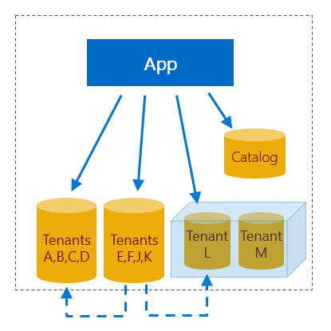
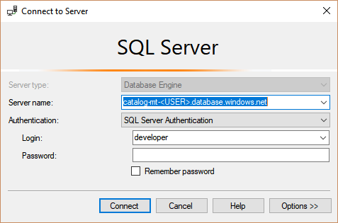

# Provision and catalog new tenants in a SaaS application using a multi-tenant SQL database

In this tutorial, you learn about patterns for provisioning and cataloging tenants when working with a sharded multi-tenant database model. 

A multi-tenant schema allows data from multiple tenants to be stored in a single database. To support large numbers of tenants, tenant data is distributed across multiple shards, or databases. The data for any one tenant is always fully contained in a single database.  A catalog is used to hold the mapping of tenants to databases.   

You can also choose to populate some databases with only a single tenant. Databases that hold multiple tenants favor a lower cost per tenant at the expense of tenant isolation.  Databases that hold only a single tenant favor isolation over cost.  Databases with multiple tenants and single tenants can be mixed in a single SaaS application to optimize cost or isolation for each tenant. Tenants can be given their own database when provisioned or can be moved to their own database later.

   

## Tenant catalog pattern

If tenant data is distributed across multiple databases, it's important to know where each tenant's data is stored. A catalog database holds the mapping between a tenant and the database that stores its data.

Each tenant is identified by a key in the catalog. In the Wingtip Tickets SaaS apps, the tenant key is formed from a hash of the tenant’s name. This allows the application to extract the tenant name from a web page URL and use this to connect to the appropriate database. Other tenant key schemes can also be used.

Using a catalog allows the name or location of a tenant database to be changed after provisioning without disrupting the application.  In a multi-tenant database model, this accommodates moving a tenant between databases.  The catalog can also be used to indicate to an application whether a tenant is offline for maintenance or other actions.

The catalog can be extended to store additional tenant or database metadata, such as the tier or edition of a database, database schema version, tenant name and service plan or SLA, and other information to enable application management, customer support, or devops processes.  

The catalog can also be used to enable cross-tenant reporting, schema management, and data extract for analytics purposes. 

### Elastic Database Client Library 
In the Wingtip Tickets SaaS apps, the catalog is implemented in the *tenantcatalog* database using the Shard Management features of the [Elastic Database Client Library (EDCL)](sql-database-elastic-database-client-library.md). The library enables an application to create, manage, and use a database-backed 'shard map'. A shard map contains a list of shards (databases) and the mapping between keys (tenants) and shards.  EDCL functions can be used from applications or PowerShell scripts during tenant provisioning to create the entries in the shard map, and later, to connect to the correct database. The library caches connection information to minimize the traffic on the catalog database and speed up connection. 

> [!IMPORTANT]
> The mapping data is accessible in the catalog database, but *don't edit it*! Edit mapping data using Elastic Database Client Library APIs only. Directly manipulating the mapping data risks corrupting the catalog and is not supported.

## Tenant provisioning pattern

When provisioning a new tenant in the sharded multi-tenant database model, it must first be determined if the tenant is to be provisioned into a shared database or given its own database. If a shared database, it must be determined if there is space in an existing database or a new database is needed. If a new database is needed, it must be provisioned in the appropriate location and service tier, initialized with appropriate schema and reference data, and then registered in the catalog. Finally, the tenant mapping can be added to reference the appropriate shard.

Database provisioning can be achieved by executing SQL scripts, deploying a bacpac, or copying a template database. The Wingtip Tickets SaaS applications copy a template database to create new tenant databases.

The database provisioning approach must be comprehended in the overall schema management strategy, which needs to ensure that new databases are provisioned with the latest schema.  This is explored further in the [schema management tutorial](saas-tenancy-schema-management.md).  

The tenant provisioning scripts in this tutorial include both provisioning a tenant into an existing multi-tenant database, and creating a new tenant database. Tenant data is then initialized and then registered in the catalog shard map. In the sample app, databases containing a single tenant are given names based on the tenant name. Databases that contain multiple tenants are given a generic _tenantsN_ name while the databases with only a single-tenant are given the tenant's name. The specific naming conventions used in the sample are not a critical part of the pattern, as the use of a catalog allows any name to be assigned to the database.  

## Provision and catalog tutorial

In this tutorial, you learn how to:

> [!div class="checklist"]

> * Provision a tenant into a multi-tenant database
> * Provision a tenant into a single-tenant database
> * Provision a batch of tenants into both multi-tenant and single-tenant databases
> * Register a database and tenant mapping in a catalog

To complete this tutorial, make sure the following prerequisites are completed:

* The Wingtip Tickets SaaS Multi-tenant Database app is deployed. To deploy in less than five minutes, see [Deploy and explore the Wingtip Tickets SaaS Multi-tenant Database application](saas-multitenantdb-get-started-deploy.md)
* Azure PowerShell is installed. For details, see [Getting started with Azure PowerShell](https://docs.microsoft.com/powershell/azure/get-started-azureps)

## Get the Wingtip Tickets management scripts

The management scripts and application source code are available in the [WingtipTicketsSaaS-MultiTenantDB](https://github.com/Microsoft/WingtipTicketsSaaS-MultiTenantDB) GitHub repo. <!--See [Steps to download the Wingtip SaaS scripts](saas-tenancy-wingtip-app-guidance-tips.md#download-and-unblock-the-wingtip-saas-scripts).-->

## Provision tenant walkthrough #1

To understand how the Wingtip Tickets application implements new tenant provisioning with a multi-tenant database, add a breakpoint and step through the workflow while provisioning a tenant in a shared database with other tenants:

1. In the _PowerShell ISE_, open ...\\Learning Modules\\ProvisionTenants\\_Demo-ProvisionTenants.ps1_ and set the following parameters:
   * **$TenantName** = **Bushwillow Blues**, the name of a new venue.
   * **$VenueType** = **blues**, one of the pre-defined venue types: blues, classicalmusic, dance, jazz, judo, motorracing, multipurpose, opera, rockmusic, soccer (lower case, no spaces).
   * **$DemoScenario** = **1**, to *Provision a tenant in a shared database with other tenants*.

1. Add a breakpoint by putting your cursor anywhere on line 38, the line that says: *New-Tenant `*, and press **F9**.

   

1. To run the script press **F5**.

1. After the script execution stops at the breakpoint, press **F11** to step into the code.

   

Trace the script's execution using the **Debug** menu options - **F10** and **F11** to step over or into the called functions. For more information about debugging PowerShell scripts, see [Tips on working with and debugging PowerShell scripts](https://msdn.microsoft.com/powershell/scripting/core-powershell/ise/how-to-debug-scripts-in-windows-powershell-ise).

The following are key elements of the workflow you step through while tracing the script:

* **Calculate the new tenant key**. A hash function is used to create the tenant key from the tenant name.
* **Check if the tenant key already exists**. The catalog is checked to ensure the key has not already been registered.
* **Initialize tenant in the default tenant database**. The tenant database is updated to add the new tenant information.  
* **Register tenant in the catalog** The mapping between the new tenant key and the existing tenants1 database is added to the catalog. 
* **Tenant Name is added to the catalog**. The venue name is added to the Tenants table in the catalog.  This shows how the Catalog database can be extended to support additional application-specific data.
* **Open Events page for the new tenant**. The *Bushwillow Blues* Events page is opened in the browser:

   

## Provision tenant walkthrough #2

Now walkthrough the process when creating a tenant in its own database:

1. Still in ...\\Learning Modules\\ProvisionTenants\\_Demo-ProvisionTenants.ps1_ set the following parameters:
   * **$TenantName** = **Sequoia Soccer**, the name of a new venue.
   * **$VenueType** = **soccer**, one of the pre-defined venue types: blues, classicalmusic, dance, jazz, judo, motorracing, multipurpose, opera, rockmusic, soccer (lower case, no spaces).
   * **$DemoScenario** = **2**, to *Provision a tenant into its own database*.

1. Add a new breakpoint by putting your cursor anywhere on line 57, the line that says: *&&nbsp;$PSScriptRoot\New-TenantAndDatabase `*, and press **F9**.

   

1. Press **F5** to run the script.

1. After the script execution stops at the breakpoint, press **F11** to step into the code.  Use **F10** and **F11** to step over and step into functions to trace the execution.

The following are key elements of the workflow you step through while tracing the script:

* **Calculate the new tenant key**. A hash function is used to create the tenant key from the tenant name.
* **Check if the tenant key already exists**. The catalog is checked to ensure the key has not already been registered.
* **Create a new tenant database**. The database is created by copying the *basetenantdb* database using a Resource Manager template.  The database name is based on the tenant's name.
* **Add database to catalog**. The tenant database is registered as a shard in the catalog.
* **Initialize tenant in the default tenant database**. The tenant database is updated to add the new tenant information.  
* **Register tenant in the catalog** The mapping between the new tenant key and the *sequoiasoccer* database is added to the catalog.
* **Tenant Name is added to the catalog**. The venue name is added to the Tenants table in the catalog.
* **Open Events page for the new tenant**. The *Sequoia Soccer* Events page is opened in the browser:

   

## Provision a batch of tenants

This exercise quickly  provisions a batch of 17 tenants. It’s recommended you provision this batch of tenants before starting other Wingtip Tickets tutorials, so there's more than just a few databases to work with.

1. In the *PowerShell ISE*, open ...\\Learning Modules\\ProvisionTenants\\*Demo-ProvisionTenants.ps1*  and change the *$DemoScenario* parameter to 3:
   * **$DemoScenario** = **4**, to *Provision a batch of tenants into a shared database*.
1. Press **F5** and run the script.

### Verify the deployed set of tenants 
At this stage you have a mix of tenants deployed into a shared database and tenants deployed into their own databases. The Azure portal can be used to inspect the databases created. In the [Azure portal](https://portal.azure.com), open the **tenants1-mt-\<USER\>** server by browsing to the list of SQL servers.  The **SQL databases** list should include the shared **tenants1** database and the databases for the tenants that are in their own database:

   

While the Azure portal shows the tenant databases, it let's you see the tenants inside the shared database. The full list of tenants can be seen in the Wingtip Tickets Events hub page.   

* Open the Events Hub page in the browser (http:events.wingtip-mt.\<USER\>.trafficmanager.net)  

The full list of tenants and their corresponding database is available in the catalog. A SQL view is provided in the tenantcatalog database that joins the tenant name stored in the Tenants table to database name in the Shard Management tables. This view nicely demonstrates the value of extending the metadata stored in the catalog.

* In *SQL Server Management Studio (SSMS)* connect to the tenants server at **catalog-mt.\<USER\>.database.windows.net**, with Login: **developer**, Password: **P@ssword1**

    

* In the *Object Explorer*, browse to the views in the *tenantcatalog* database.
* Right click on *ExtendedTenants* and choose **Select Top 1000 Rows** and note the mapping between tenant name and database for the different tenants.

    
      
## Other provisioning patterns

Other provisioning patterns not included in this tutorial include:

**Pre-provisioning databases in elastic pools.** The pre-provisioning pattern exploits the fact that databases in an elastic pool do not add extra cost. Billing is for the elastic pool, not the databases, and idle databases consume no resources. By pre-provisioning databases in a pool and allocating them when needed, the time taken to onboard tenants into their own database can be reduced significantly. The number of databases pre-provisioned could be adjusted as needed to keep a buffer suitable for the anticipated provisioning rate.

**Auto-provisioning.** In the auto-provisioning pattern, a dedicated provisioning service is used to provision servers, pools, and databases automatically as needed – including pre-provisioning databases in elastic pools if desired. And if databases are de-commissioned and deleted, gaps in elastic pools can be filled by the provisioning service as desired. Such a service could be simple or complex – for example, handling provisioning across multiple geographies, and could set up geo-replication for disaster recovery. With the auto-provisioning pattern, a client application or script would submit a provisioning request to a queue to be processed by a provisioning service, and would then poll to determine completion. If pre-provisioning is used, requests would be handled quickly, with the service managing provisioning of a replacement database running in the background.

## Next steps

In this tutorial you learned how to:

> [!div class="checklist"]

> * Provision a single new tenant
> * Provision a batch of additional tenants
> * Step into the details of provisioning tenants, and registering them into the catalog

Try the [Performance monitoring tutorial](saas-multitenantdb-performance-monitoring.md).

## Additional resources

<!--* Additional [tutorials that build upon the Wingtip SaaS application](saas-dbpertenant-wingtip-app-overview.md#sql-database-wingtip-saas-tutorials)-->
* [Elastic database client library](sql-database-elastic-database-client-library.md)
* [How to Debug Scripts in Windows PowerShell ISE](https://msdn.microsoft.com/powershell/scripting/core-powershell/ise/how-to-debug-scripts-in-windows-powershell-ise)
