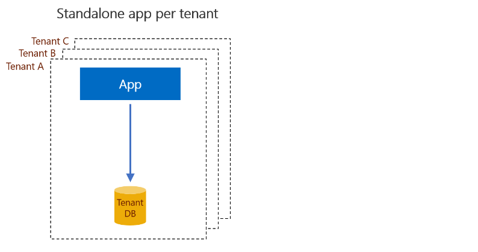
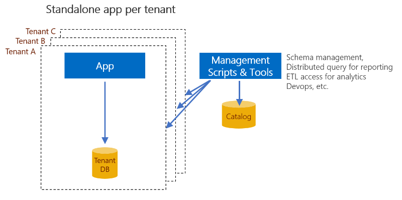
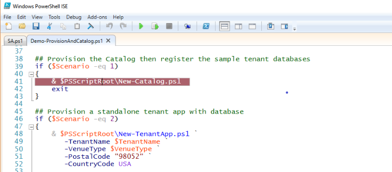
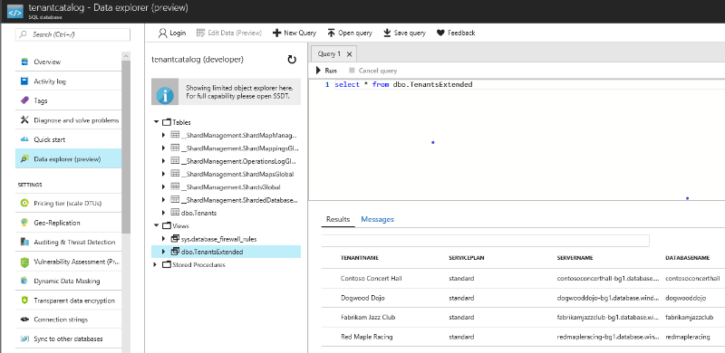
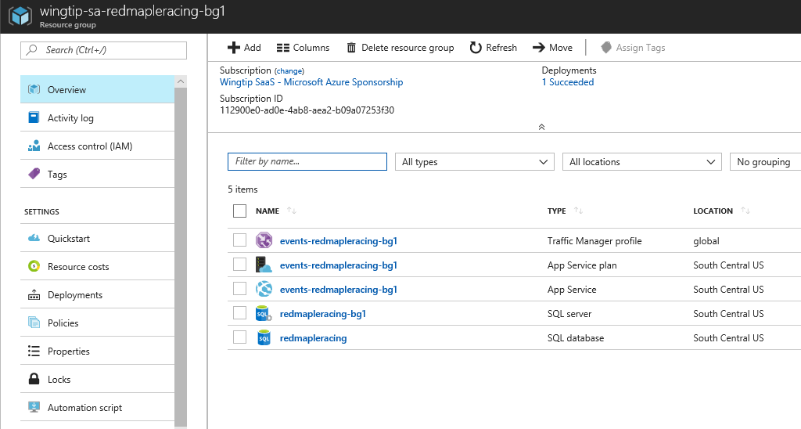

# Provision and catalog new tenants using the  application per tenant SaaS pattern

This article covers the provisioning and cataloging of new tenants using the standalone app per tenant pattern for multi-tenant SaaS applications.
This article has two major parts:
* Conceptual discussion of provisioning and cataloging new tenants
* A tutorial that highlights sample PowerShell code that accomplishes the provisioning and cataloging
    * The tutorial uses the Wingtip Tickets sample SaaS application, adapted to the standalone app per tenant pattern.

## Application per tenant pattern
The standalone app per tenant pattern is one of several patterns for multi-tenant SaaS applications.  In this pattern, a standalone app is provisioned for each tenant. The application comprises application level components and a SQL database.  Each tenant's app can be deployed in the vendor’s subscription, or Azure offers a [managed applications program](https://docs.microsoft.com/en-us/azure/managed-applications/overview) in which an app can be deployed in a tenant’s subscription and managed by the vendor on the tenant’s behalf. 

   

When deploying an application for a tenant, the app and database are provisioned in a new resource group created for the tenant.  This isolates all application resources and allows them to be managed independently.  Within each resource group, each application instance is configured to access its corresponding database directly.  This contrasts with other patterns that use a catalog to broker connections between the app and the database.  And as there is no resource sharing, each tenant database must be provisioned with sufficient resources to handle its peak load. This pattern tends to be used for SaaS applications with fewer tenants, where there is a strong emphasis on tenant isolation and less emphasis on resource costs.  

## Using a tenant catalog with the application per tenant pattern
While each tenant’s app and database are fully isolated, various management and analytics scenarios may operate across tenants.  For example, applying a schema change for a new release of the application requires changes to the schema of each tenant database. Reporting and analytics scenarios may also require access to all the tenant databases regardless of where they are deployed.

   

The tenant catalog holds a mapping between a tenant identifier and a tenant database, allowing an identifier to be resolved to the server and database name of the corresponding tenant’s database.  In the Wingtip SaaS app, the tenant identifier is computed as a hash of the tenant name, but other schemes could be used.  In the standalone app pattern, while the catalog isn’t needed by the application to manage connections, the catalog can still be used to to scope actions to the set of tenant databases. For example, Elastic Query can use the catalog to determine the set of databases across which queries are  distributed for cross-tenant reporting.

## Elastic Database Client Library
In the Wingtip sample application, the catalog is implemented by the shard management features of the Elastic Database Client Library (EDCL) and stored in the *tenantcatalog* database. The library enables an application to create, manage, and use a shard map that is stored in a database. A shard map cross-references a tenant key with the shard (database) in which that tenant’s data is stored.  EDCL functions manage a global shard map stored in tables in the tenantcatalog database and a local shard map stored in each shard.

During tenant provisioning, EDCL functions can be called from applications or PowerShell scripts to create and manage the entries in the shard map. Later, EDCL functions can be used to retrieve the set of shards or connect to the correct database for given tenant key. 
    
> [!IMPORTANT] 
> Do not edit the data in the catalog database or the local shard map in the tenant databases through direct access! Direct updates are not supported due to the high risk of data corruption. Instead, edit the mapping data by using EDCL APIs only.

## Tenant provisioning 
Each tenant requires a new Azure resource group, which must be created before resources can be provisioned within it. Once the resource group has been created, an Azure resource management template can then be used to deploy the application components and the database and configure the database connection. To initialize the database schema the template can also import a bacpac.  Alternatively, the database can be created as a copy of a ‘template’ database maintained for this purpose.  Once the database schema has been initialized the database can be further updated with initial venue data and registered in the catalog.

## Tutorial

In this tutorial you learn how to:
* Provision a catalog
* Register the tenant databases deployed earlier in the catalog
* Provision an additional tenant and register it in the catalog

An Azure resource manager template is used to deploy and configure the application, create the tenant database, and then import a bacpac file to initialize it. Note that the import request may be queued for several minutes before it is actioned.

At the end of this tutorial you will have a catalog database and a series of  tenants applications with their databases registered in the catalog.

## Prerequisites
To complete this tutorial, make sure the following prerequisites are completed: 
* Azure PowerShell is installed. For details, see [Getting started with Azure PowerShell](https://docs.microsoft.com/powershell/azure/get-started-azureps)
* The three sample tenant apps are deployed. To deploy these apps in less than five minutes, see [Deploy and explore the Wingtip Tickets SaaS Standalone Application pattern](https://docs.microsoft.com/en-us/azure/sql-database/saas-standaloneapp-get-started-deploy).

## Provision the Catalog
In this task you learn how to provision the catalog used to register all the tenant databases. You will: 
* **Deploy the catalog database** using an Azure resource management template. The database is initialized by importing a bacpac file.  
* **Register the sample tenant apps** that you deployed earlier.  Each tenant is registered using a key constructed from a hash of the tenant name.  The tenant name is also stored in an extension table in the catalog. 
1. In PowerShell ISE, open *...\Learning Modules\UserConfig.psm* and update the **\<user\>** value on line 10 to the value you used when deploying the three sample applications.  **Save the file.**	
1. In PowerShell ISE, open *...\Learning Modules\ProvisionTenants\Demo-ProvisionAndCatalog.ps1* and on line 14, set **$Scenario = 1**, Deploy the tenant catalog and register the pre-defined tenants

1. Add a breakpoint in the script by putting your cursor anywhere on line 41 that says, `& $PSScriptRoot\New-Catalog.ps1`, and then press **F9**.

    

1. Run the script by pressing **F5**. 
1.	After script execution stops at the breakpoint, press **F11** to step into the New-Catalog.ps1 script.
1.	Trace the script's execution using the Debug menu options, F10 and F11, to step over or into called functions.
    *	For more information about debugging PowerShell scripts, see [Tips on working with and debugging PowerShell scripts](https://msdn.microsoft.com/powershell/scripting/core-powershell/ise/how-to-debug-scripts-in-windows-powershell-ise).

Once the script completes the catalog will have been created and populated with a shard map that maps tenant keys to their corresponsing server and database locations. 

Now take a look at the resources you created.

1. Open the [Azure portal](https://portal.azure.com/) and browse the resource groups and open the **wingtip-sa-catalog-\<user\>** resource group and note the catalog server and database that have been created.
1. Open the database blade in the portal and select *Data explorer* from the left hand menu.  Click the Login command and then enter the Password, 'P@ssword1'.

1. Explore the schema of the tenantcatalog.  
   * The objects in the `__ShardManagement` schema are all provided by the Elastic Database Client Library.
   * The `Tenants` table and `TenantsExtended` view are extensions added in the sample that demonstrate how you can extend the catalog to provide additional value.
1. Run the query select * from          

   

      * As an alternative to using the Data Explorer you can connect to the database from SQL Server Management Studio.
      * Note that you should not edit data directly in the catalog but always use the shard management APIs. 

## Provision a new tenant application

In this task you learn how to provision a single tenant application. You will:  
* **Create a new resource group** for the tenant. 
* **Provision the application and database** into the new resource group using an Azure resource management template.  This includes initializing the database with common schema and reference data by importing a bacpac file. 
* **Initialize the database with basic tenant information**. This includes specifying the venue type, which determines the photograph used as the background on its events web site. 
* **Register the database in the catalog database**. 

1. In PowerShell ISE, open *...\Learning Modules\ProvisionTenants\Demo-ProvisionAndCatalog.ps1* and on line 14, set **$Scenario = 2**, Deploy the tenant catalog and register the pre-defined tenants

1. Add a breakpoint in the script by putting your cursor anywhere on line 49 that says, `& $PSScriptRoot\New-TenantApp.ps1`, and then press **F9**.
1. Run the script by pressing **F5**. 
1.	After script execution stops at the breakpoint, press **F11** to step into the New-Catalog.ps1 script.
1.	Trace the script's execution using the Debug menu options, F10 and F11, to step over or into called functions.

Once the tenant has been provisioned the new tenant' events web site is opened.

   

You can then inspect the new resources created in the Azure portal 

   

## Additional resources

- To learn about multi-tenant SaaS applications, see [Design patterns for multi-tenant SaaS applications](saas-tenancy-app-design-patterns.md).

## Next steps

In this tutorial you learned:

> [!div class="checklist"]
> * How to deploy the Wingtip Tickets SaaS Standalone Application.
> * About the servers and databases that make up the app.
> * How to delete sample resources to stop related billing.

## Delete resource groups to stop billing ##

When you have finished exploring the sample, delete all the resource groups you created to stop the associated billing.