# Cross-tenant analytics using extracted data

In this tutorial, you walk through an end-to-end analytics scenario. The scenario demonstrates how analytics over tenant data can empower software vendors to make smart decisions. Using data extracted from each tenant database, you use analytics to gain insights into tenant behavior, including their use of the sample Wingtip Tickets SaaS application. This scenario involves three steps: 

1.	**Extract data** from each tenant database into an analytics store, in this case, a SQL Data Warehouse.
2.	**Optimize the extracted data** for analytics processing.
3.	Use **Business Intelligence** tools to draw out useful insights, which can guide decision making. 

In this tutorial you learn how to:

> [!div class="checklist"]
> - Create the tenant analytics store for loading.
> - Use Azure Data Factory (ADF) to extract data from each tenant database into the analytics data warehouse.
> - Optimize the extracted data (reorganize into a star-schema).
> -	Query the analytics data warehouse.
> -	Use Power BI for data visualization to highlight trends in tenant data and make recommendation for improvements.


## Analytics over extracted tenant data

SaaS applications hold a potentially vast amount of tenant data in the cloud. This data can provide a rich source of insights about the operation and usage of your application, and  the behavior of your tenants. These insights can guide feature development, usability improvements, and other investments in the apps and platform.

Accessing the data for all tenants is simple when all the data is in just one multi-tenant database. But access is more complex when distributed at scale across thousands of databases. One way to tame the complexity is to extract the data to an analytics database or a data warehouse for query.

This tutorial presents an end-to-end analytics scenario for the Wingtip Tickets application. First, [Azure Data Factory (ADF)](../data-factory/introduction.md) is used as the orchestration tool to extract tickets sales and related data from each tenant database. This data is loaded into staging tables in an analytics store. The analytics store could either be an SQL Database or a SQL Data Warehouse. This tutorial uses [SQL Data Warehouse](https://docs.microsoft.com/en-us/azure/sql-data-warehouse/sql-data-warehouse-overview-what-is) as the analytics store.

Next, the extracted data is transformed and loaded into a set of [star-schema](https://www.wikipedia.org/wiki/Star_schema) tables. The tables consist of a central fact table plus related dimension tables:

- The central fact table in the star-schema contains ticket data.
- The dimension tables contain data about venues, events, customers, and purchase dates.

Together the central and dimension tables enable efficient analytical processing. The star-schema used in this tutorial is displayed in the following image:
 
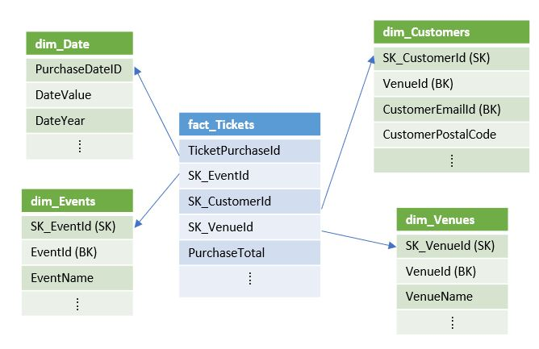

Finally, the star-schema tables are queried. Query results are displayed visually using Power BI to highlight insights into tenant behavior and their use of the application. With this star-schema, you run queries that expose:

- Who is buying tickets and from which venue.
- Patterns and trends in the sale of tickets.
- The relative popularity of each venue.

This tutorial provides basic examples of insights that can be gleaned from the Wingtip Tickets data. Understanding how each venue uses the service might cause the Wingtip Tickets vendor to think about different service plans targeted at more or less active venues, for example. 

## Setup

### Prerequisites

To complete this tutorial, make sure the following prerequisites are met:

- The Wingtip Tickets SaaS Database Per Tenant application is deployed. To deploy in less than five minutes, see [Deploy and explore the Wingtip SaaS application](saas-dbpertenant-get-started-deploy.md)
- The Wingtip Tickets SaaS Database Per Tenant scripts and application [source code](https://github.com/Microsoft/WingtipTicketsSaaS-DbPerTenant/) are downloaded from GitHub. See download instructions. Be sure to *unblock the zip file* before extracting its contents.
- Power BI Desktop is installed. [Download Power BI Desktop](https://powerbi.microsoft.com/downloads/)
- The batch of additional tenants has been provisioned, see the [**Provision tenants tutorial**](saas-dbpertenant-provision-and-catalog.md).

### Create data for the demo

This tutorial explores analytics over ticket sales data. In this step, you generate ticket data for all the tenants. In a later step, this data is extracted for analysis. _Ensure you provisioned the batch of tenants_ (as described earlier) so that you have enough data to expose a range of different ticket purchasing patterns.

1. In PowerShell ISE, open *…\Learning Modules\Operational Analytics\Tenant Analytics DW\Demo-TenantAnalyticsDW.ps1*, and set the following value:
    - **$DemoScenario** = **1** Purchase tickets for events at all venues
2. Press **F5** to run the script and create ticket purchasing history for all the venues. With 20 tenants, the script generates tens of thousands of tickets and may take 10 minutes minutes or more.

### Deploy SQL Data Warehouse, Data Factory, and Blob Storage 
In the Wingtip Tickets app, the tenants' transactional data is distributed over many databases. Azure Data Factory (ADF) is used to orchestrate the Extract, Load, and Transform (ELT) of this data into the data warehouse. To load data into SQL Data Warehouse most efficiently, ADF extracts data into intermediate blob files and then use [PolyBase](https://docs.microsoft.com/en-us/azure/sql-data-warehouse/design-elt-data-loading) to load the data into the data warehouse.   

In the following steps, you deploy multiple Azure resources: a SQL Data Warehouse (analytics store) called **tenantanalytics**, a blob storage called **wingtipstaging<username>**, and a data factory called **dbtodwload-<username>**. You also populate these resources with predefined objects used later in the tutorial.
1. In PowerShell ISE, open *…\Learning Modules\Operational Analytics\Tenant Analytics DW\Demo-TenantAnalyticsDW.ps1*  and set the following value:
    - **$DemoScenario** = **2** Deploy tenant analytics data warehouse, blob storage, and data factory
1. Press **F5** to run the demo script (that calls the *Deploy-TenantAnalyticsDW.ps1* script) which creates the resources. 

In this step, you deploy the additional resources used in the tutorial: a SQL Data Warehouse called _tenantanalytics_, an Azure Data Factory called _dbtodwload-<username>_, and an Azure storage account called _wingtipstaging<username>_. The storage account is used to temporarily hold extracted data files as blobs before they are loaded into the data warehouse. This step also deploys the data warehouse schema and defines the ADF pipelines that orchestrate the ELT process.
1. In PowerShell ISE, open *…\Learning Modules\Operational Analytics\Tenant Analytics DW\Demo-TenantAnalyticsDW.ps1* and set:
    - **$DemoScenario** = **2** Deploy tenant analytics data warehouse, blob storage, and data factory 
1. Press **F5** to run the demo script and deploy the Azure resources. 

Now review the Azure resources you deployed:
#### Tenant databases and analytics store
Use [SQL Server Management Studio (SSMS)](https://docs.microsoft.com/sql/ssms/download-sql-server-management-studio-ssms) to connect to **tenants1-dpt-&lt;user&gt;** and **catalog-dpt-&lt;user&gt;** servers. Replace &lt;user&gt; with the value used when you deployed the app. Use Login = *developer* and Password = *P@ssword1*. See the [introductory tutorial](saas-dbpertenant-wingtip-app-overview.md) for more guidance.

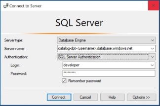

In the Object Explorer:

1. Expand the *tenants1-dpt-&lt;user&gt;* server.
1. Expand the Databases node, and see the list of tenant databases.
1. Expand the *catalog-dpt-&lt;user&gt;* server.
1. Verify that you see the analytics store containing the following objects:
    1. Tables **raw_Tickets**, **raw_Customers**, **raw_Events** and **raw_Venues** hold raw extracted data from the tenant databases.
    1. The star-schema tables are **fact_Tickets**, **dim_Customers**, **dim_Venues**, **dim_Events**, and **dim_Dates**.
    1. The stored procedure, **sp_transformExtractedData** is used to  transform the data and load it into the star-schema tables.

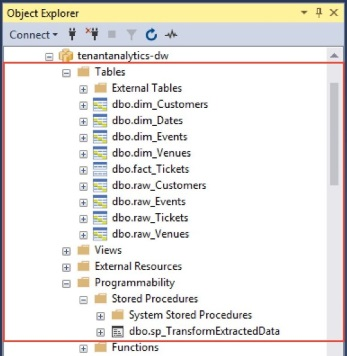

#### Blob storage
1. In [Azure Portal](https://ms.portal.azure.com), navigate to the resource group that you used for deploying the application. Verify that a storage account called **wingtipstaging<username>** has been added.

  

1. Click **wingtipstaging<username>** storage account to explore it's objects.
1. In the [Azure Portal](https://ms.portal.azure.com), navigate to the resource group that you used for deploying the application. Verify that a storage account called **wingtipstaging<username>** has been added.
  

1. Click **wingtipstaging<username>** storage account to explore its objects.
1. Click **Blobs** tile
1. Click the container **configfile**
1. Verify that **configfile** contains a JSON file called **TableConfig.json**. This file contains the source and destination table names, column names, and tracker column name.

#### Azure Data Factory (ADF)
1. In [Azure Portal](https://ms.portal.azure.com) in the resource group, verify that an Azure Data Factory called **dbtodwload-<username>** has been added. 

1. In the [Azure Portal](https://ms.portal.azure.com) in the resource group, verify that an Azure Data Factory called _dbtodwload-<username>_ has been added. 


 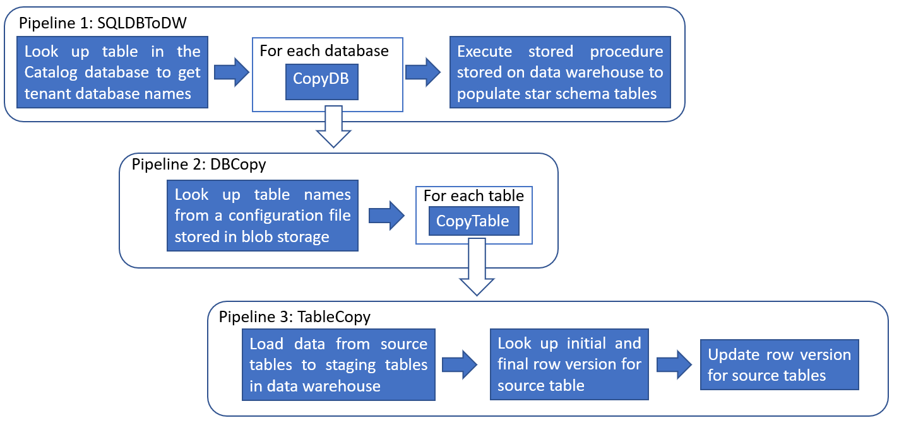

This section explores the data factory created. 
Follow the steps below to launch the data factory:
1. In portal, click the data factory called **dbtodwload-<username>**.
2. Click **Author & Monitor** tile to launch Data Factory UI application in a separate tab. 

Follow the steps below to launch the data factory:
1. In the portal, click the data factory called **dbtodwload-<username>**.
2. Click **Author & Monitor** tile to launch the Data Factory designer in a separate tab. 

## Extract, Load, and Transform data
Azure Data Factory is used for orchestrating extraction, loading, and transformation of data. In this tutorial, you extract data from four different SQL views from each of the tenant databases: **rawTickets**, **rawCustomers**, **rawEvents, and **rawVenues**. These views include  venue Id, so you can discriminate data from each venue in the data warehouse. The data is loaded into corresponding staging tables in the data warehouse: **raw_Tickets**, **raw_customers**, **raw_Events** and **raw_Venue**. A stored procedure then transforms the raw data and populates the star-schema tables: **fact_Tickets**, **dim_Customers**, **dim_Venues**, **dim_Events**, and **dim_Dates**.

In the previous section, you deployed and initialized the necessary Azure resources, including the data factory. The deployed data factory includes the pipelines, datasets, linked services, etc., required to extract, load, and transform the tenant data. Let's explore these objects further and then trigger the pipeline to move data from tenant databases to the data warehouse.

### Data factory pipeline overview
This section explores the objects created in the data factory. The following figure describes the overall workflow of the ADF pipeline used in this tutorial. If you prefer to explore the pipeline later and see the results first, skip to the next section **Trigger the pipeline run**.


In the overview page, switch to **Author** tab on the left panel and observe that there are three [pipelines](https://docs.microsoft.com/en-us/azure/data-factory/concepts-pipelines-activities) and three [datasets](https://docs.microsoft.com/en-us/azure/data-factory/concepts-datasets-linked-services) created.
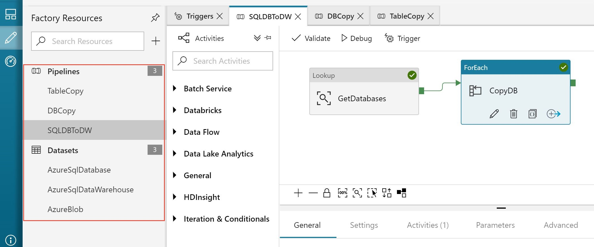

The three nested pipelines are: SQLDBToDW, DBCopy, and TableCopy.

**Pipeline 1 - SQLDBToDW** looks up the names of the tenant databases stored in the Catalog database (table name: [__ShardManagement].[ShardsGlobal]) and for each tenant database executes the **DBCopy** pipeline. Upon completion, the provided **sp_TransformExtractedData** stored procedure schema, is executed. This stored procedure transforms the loaded data in the staging tables and populates the star-schema tables.

**Pipeline 2 - DBCopy** looks up the names of the source tables and columns from a configuration file stored in blob storage.  The **TableCopy** pipeline is then run for each of the four tables: TicketFacts, CustomerFacts, EventFacts, and VenueFacts. **[Foreach](https://docs.microsoft.com/en-us/azure/data-factory/control-flow-for-each-activity)** activity executes in parallel for all 20 databases. ADF allows a maximum of 20 loop iterations to be run in parallel. Consider creating multiple pipelines for more databases.    

**Pipeline 3 - TableCopy** uses row version numbers in SQL Database (_rowversion_) to identify rows that have been changed or updated. This activity looks up the start and the end row version for extracting rows from the source tables. The **CopyTracker** table stored in each tenant database tracks the last row extracted from each source table in each run. New or changed rows are copied to the corresponding staging tables in the data warehouse: **raw_Tickets**, **raw_Customers**, **raw_Venues**, and **raw_Events**. Finally the last row version is saved in the **CopyTracker** table to be used as the initial row version for the next extraction. 

There are also three parameterized linked services that link the data factory to the source SQL Databases, the target SQL Data Warehouse, and the intermediate Blob storage. In the **Author** tab, click on **Connections** to explore the linked services created as shown in the following image:

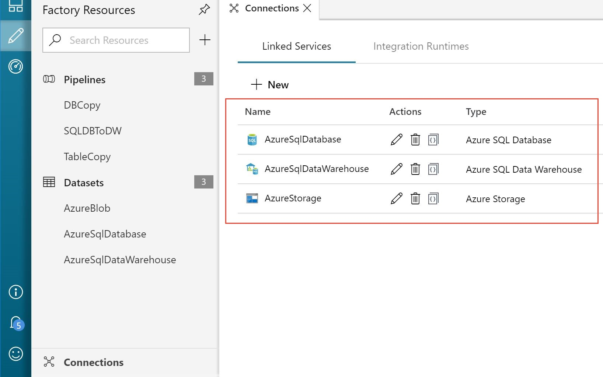

Corresponding to the three linked services, there are three datasets that refer to the data you use in the pipeline activities as inputs or outputs. Explore each of the datasets to observe connections and parameters used. _AzureBlob_ points to the configuration file containing source and target tables and columns, as well as the tracker column in each source.
  
### Data warehouse pattern overview
SQL Data Warehouse is used as the analytics store to perform SQL-based aggregation on the tenant data. In this sample PolyBase is used to load data into the SQL Data warehouse. Raw data is loaded into staging tables in the data warehouse containing an identity column to keep track of data that is transformed and loaded into the star-schema tables. The following image shows the loading pattern:
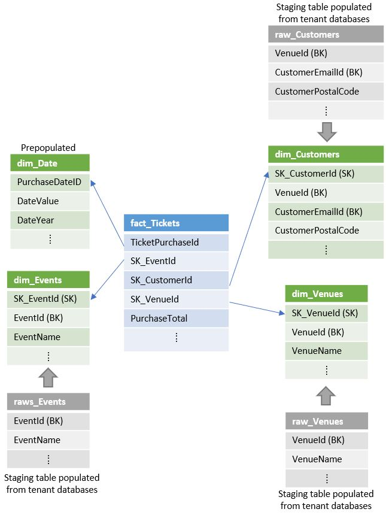

Slowly Changing Dimension (SCD) type 1 is used in this pattern. Moreover, Surrogate key is defined in the dimension tables using an identity column. As a best practice, date dimension table is pre-populated to save time. For the rest of the dimension tables, CTAS statement is used to create a temporary table containing the existing modified and non-modified rows along with the surrogate keys. Next, the new rows are inserted into the table. For easy roll-back, the existing dimension table is renamed as the old dimension table and the temporary table becomes the new dimension table. Before each run, the old dimension table is replaced with the new dimension table.

SQL Data Warehouse is used as the analytics store to perform SQL-based aggregation on the tenant data. In this sample PolyBase is used to load data into the SQL Data warehouse.  Raw data is loaded into staging tables that have an identity column to keep track of rows that have been transformed into the star-schema tables.

Slowly Changing Dimension (SCD) type 1 dimension tables are used in this example. Each dimension has a surrogate key defined using an identity column. As a best practice, the date dimension table is pre-populated to save time. For the other dimension tables, a CREATE TABLE AS SELECT... (CTAS) statement is used to create a temporary table containing the existing modified and non-modified rows along with the surrogate keys. This is done with IDENTITY_INSERT=ON. New rows are then inserted into the table with IDENTITY_INSERT=OFF. For easy roll-back, the existing dimension table is renamed and the temporary table is renamed to become the new dimension table. Before each run, the old dimension table is deleted.

Dimension tables are loaded before the fact table. This sequencing ensures that for each arriving fact, all referenced dimensions already exist. As the facts are loaded, the business key for each corresponding dimension is matched and the corresponding surrogate keys are added to each fact.

The final step of the transform deletes the staging data ready for the next execution of the pipeline.
   
### Trigger the pipeline run
Follow the steps below to run the complete extract, load, and transform pipeline for all the tenant databases:
1. In the **Author** tab of the ADF user interface, select **SQLDBToDW** pipeline from the left pane.
1. Click **Trigger** and from the pulled down menu click **Trigger Now**. This action runs the pipeline immediately. In a production scenario, you would define a timetable for running the pipeline to refresh the data periodically.
  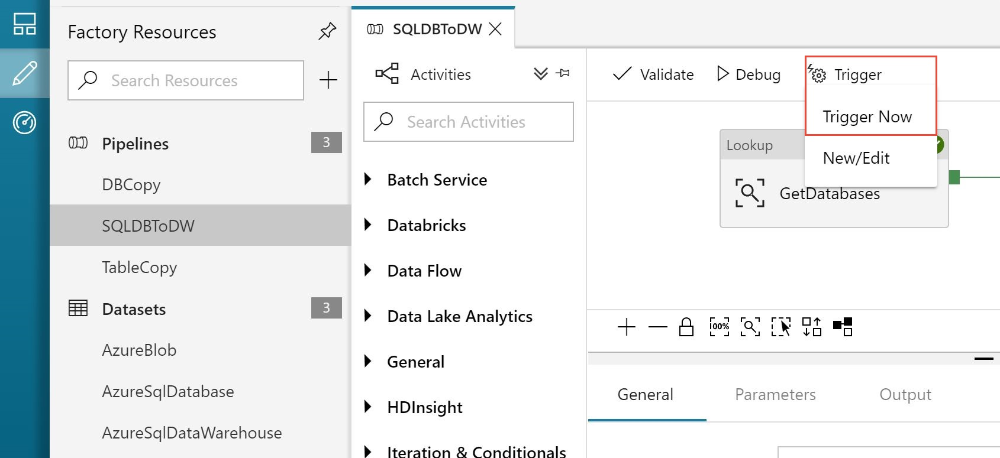
1. On **Pipeline Run** page, click **Finish**.
 
### Monitor the pipeline run
1. In the ADF user interface, switch to the **Monitor** tab from the left pane.
1. Click **Refresh** until SQLDBToDW pipeline's status is **Succeeded**.
  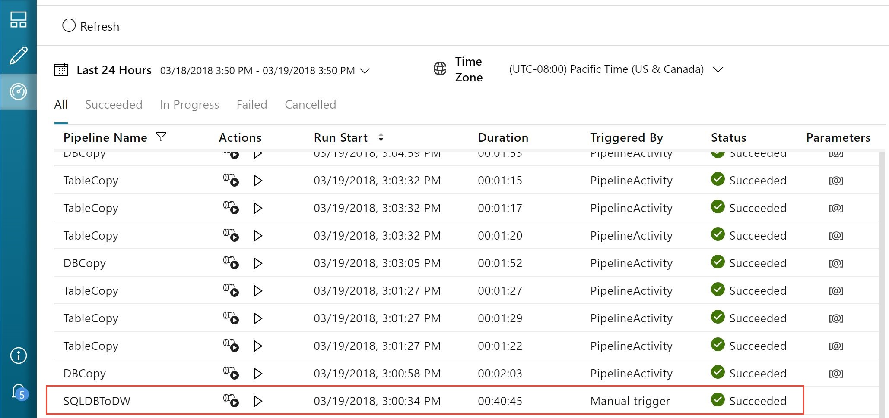
1. Connect to the data warehouse with SSMS and query the star-schema tables to verify that data was loaded in these tables.

Once the pipeline has completed, the fact table holds ticket sales data for all venues and the dimension tables are populated with the corresponding venues, events, and customers.

## Data Exploration

### Visualize tenant data

The data in the star-schema provides all the ticket sales data needed for your analysis. Visualizing data graphically makes it easier to see trends in large data sets. In this section, you use **Power BI** to manipulate and visualize the tenant data in the data warehouse.

Use the following steps to connect to Power BI, and to import the views you created earlier:

1. Launch Power BI desktop.
2. From the Home ribbon, select **Get Data**, and select **More…** from the menu.
3. In the **Get Data** window, select **Azure SQL Database**.
4. In the database login window, enter your server name (catalog-dpt-&lt;User&gt;.database.windows.net). Select **Import** for **Data Connectivity Mode**, and then click **OK**. 

    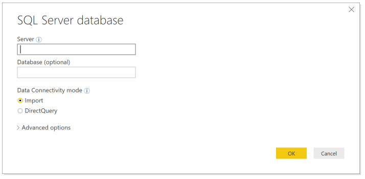

5. Select **Database** in the left pane, then enter user name = *developer*, and enter password = *P@ssword1*. Click **Connect**.  

    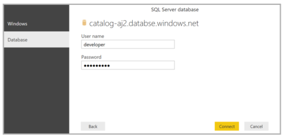

6. In the **Navigator** pane, under the analytics database, select the star-schema tables: **fact_Tickets**, **dim_Events**, **dim_Venues**, **dim_Customers** and **dim_Dates**. Then select **Load**. 

Congratulations! You successfully loaded the data into Power BI. Now explore interesting visualizations to gain insights into your tenants. Let's walk through how analytics can provide some data-driven recommendations to the Wingtip Tickets business team. The recommendations can help to optimize the business model and customer experience.

Start by analyzing ticket sales data to see the variation in usage across the venues. Select the options shown in Power BI to plot a bar chart of the total number of tickets sold by each venue. (Due to random variation in the ticket generator, your results may be different.)
 
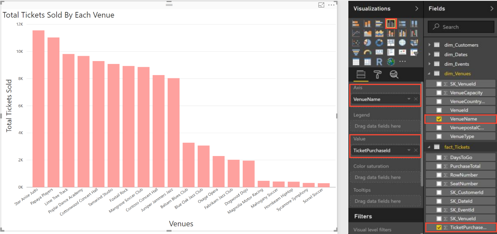

The preceding plot confirms that the number of tickets sold by each venue varies. Venues that sell more tickets are using your service more heavily than venues that sell fewer tickets. There may be an opportunity here to tailor resource allocation according to different tenant needs.

You can further analyze the data to see how ticket sales vary over time. Select the options shown in the following image in Power BI to plot the total number of tickets sold each day for a period of 60 days.
 
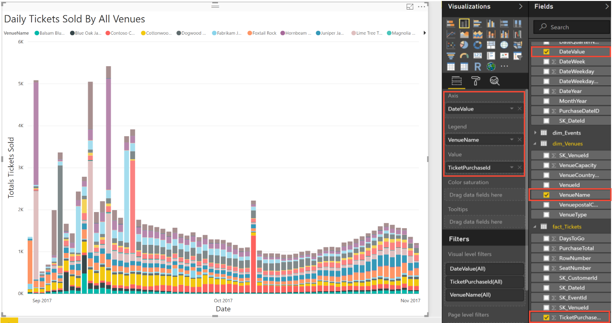

The preceding chart shows that ticket sales spike for some venues. These spikes reinforce the idea that some venues might be consuming system resources disproportionately. So far there is no obvious pattern in when the spikes occur.

Next let's investigate the significance of these peak sale days. When do these peaks occur after tickets go on sale? To plot tickets sold per day, select the options shown in the following image in Power BI.

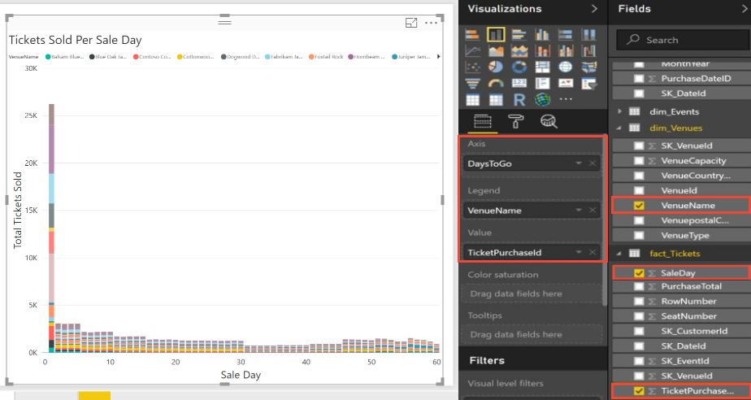

This plot shows that some venues sell large numbers of tickets on the first day of sale. As soon as tickets go on sale at these venues, there seems to be a mad rush. This burst of activity by a few venues might impact the service for other tenants.

You can drill into the data again to see if this mad rush is true for all events hosted by these venues. In previous plots, you saw that Contoso Concert Hall sells many tickets, and that Contoso also has a spike in ticket sales on certain days. Play around with Power BI options to plot cumulative ticket sales for Contoso Concert Hall, focusing on sale trends for each of its events. Do all events follow the same sale pattern? Try to produce a plot like the one below.

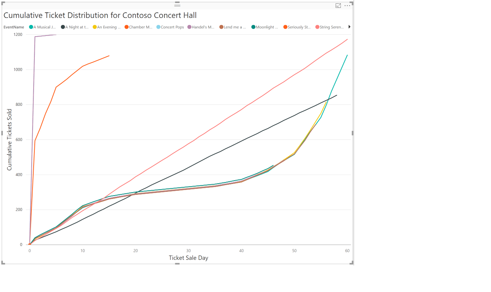

This plot of cumulative ticket sales over time for Contoso Concert Hall for each event shows that the mad rush does not happen for all events. Play around with the filter options to explore sale trends for other venues.

The insights into ticket selling patterns might lead Wingtip Tickets to optimize their business model. Instead of charging all tenants equally, perhaps Wingtip should introduce service tiers with different performance levels. Larger venues that need to sell more tickets per day could be offered a higher tier with a higher service level agreement (SLA). Those venues could have their databases placed in pool with higher per-database resource limits. Each service tier could have an hourly sales allocation, with additional fees charged for exceeding the allocation. Larger venues that have periodic bursts of sales would benefit from the higher tiers, and Wingtip Tickets can monetize their service more efficiently.

Meanwhile, some Wingtip Tickets customers complain that they struggle to sell enough tickets to justify the service cost. Perhaps in these insights there is an opportunity to boost ticket sales for underperforming venues. Higher sales would increase the perceived value of the service. Right click fact_Tickets and select **New measure**. Enter the following expression for the new measure called **AverageTicketsSold**:

```
AverageTicketsSold = DIVIDE(DIVIDE(COUNTROWS(fact_Tickets),DISTINCT(dim_Venues[VenueCapacity]))*100, COUNTROWS(dim_Events))
```

Select the following visualization options to plot the percentage tickets sold by each venue to determine their relative success.

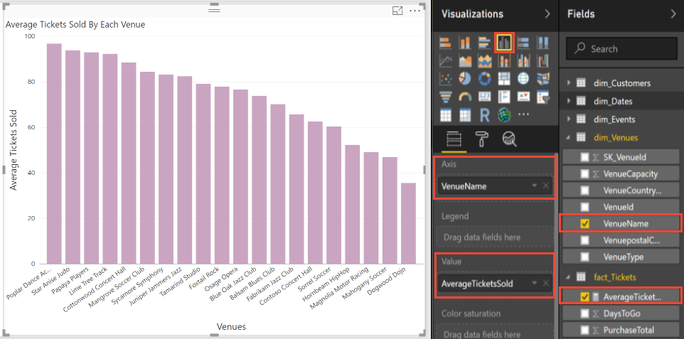

The plot above shows that even though most venues sell more than 80% of their tickets, some are struggling to fill more than half their seats. Play around with the Values Well to select maximum or minimum percentage of tickets sold for each venue.

## Embedding analytics in your apps 
This tutorial has focused on cross-tenant analytics used to improve the software vendor's understanding of their tenants. Analytics can also provide insights to the _tenants_, to help them manage their business more effectively  themselves. 

In the Wingtip Tickets example, you earlier discovered that ticket sales tend to follow predictable patterns. This insight might be used to help underperforming venues boost ticket sales. Perhaps there is an opportunity to employ machine learning techniques to predict ticket sales for events. The effects of price changes could also be modeled, to allow the impact of offering discounts to be predicted. Power BI Embedded could be integrated into an event management application to visualize predicted sales, including the impact of discounts on total seats sold and revenue on low-selling events. With Power BI Embedded, you can even integrate actually applying the discount to the ticket prices, right in the graphical experience.


## Next steps

In this tutorial, you learned how to:

> [!div class="checklist"]
> - Deploy a SQL Data Warehouse populated with a star schema for tenant analytics 
> - Use Azure Data Factory to:
>   * Extract data from tenant databases
>   * Load it into staging tables with PolyBase
>   * Use a stored procedure to transform new and changed data into the star schema 
> -	Query a data warehouse 
> -	Use Power BI to visualize trends in data across all the tenants 

Congratulations!

## Additional resources

- Additional [tutorials that build upon the Wingtip SaaS application](saas-dbpertenant-wingtip-app-overview.md#sql-database-wingtip-saas-tutorials).
