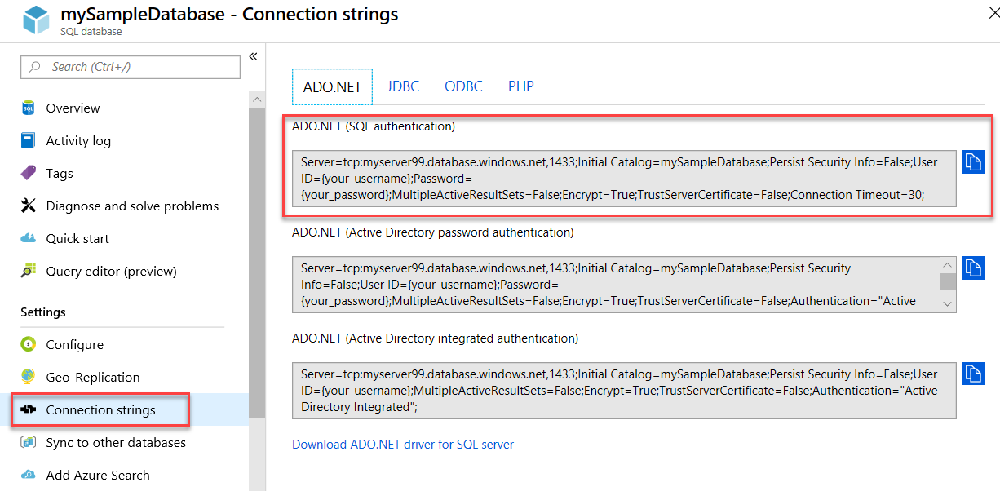

# Quickstart: Use .NET Core (C#) to query an Azure SQL database

This quickstart demonstrates how to use [.NET Core](https://www.microsoft.com/net/) and C# code to connect to an Azure SQL database and run a Transact-SQL statement to query data.

## Prerequisites

For this tutorial, you need:

[!INCLUDE [prerequisites-create-db](../../includes/sql-database-connect-query-prerequisites-create-db-includes.md)]

- A [server-level firewall rule](sql-database-get-started-portal-firewall.md) for your computer's public IP address.

- [.NET Core for your operating system](https://www.microsoft.com/net/core) installed. 

> [!NOTE]
> This quickstart uses the mySampleDatabase database. If you want to use a different database, you will need
> to change the database references and modify the `SELECT` query in the C# code.


## Get SQL server connection information

[!INCLUDE [prerequisites-server-connection-info](../../includes/sql-database-connect-query-prerequisites-server-connection-info-includes.md)]

#### Get ADO.NET connection information (optional)

1. Navigate to the **mySampleDatabase** page and, under **Settings**, select **Connection strings**.

2. Review the complete **ADO.NET** connection string.

    

3. Copy the **ADO.NET** connection string if you intend to use it (optional).
  
## Create a new .NET Core project

1. Open a command prompt and create a folder named **sqltest**. Navigate to this folder and run the following command.

    ```cmd
    dotnet new console
    ```
    This creates new console app project files including an initial C# code file (**Program.cs**), an XML configuration file **sqltest.csproj**) and needed binaries.

2. In a text editor, open **sqltest.csproj** and paste the following XML between the **<Project>** tags. This adds `System.Data.SqlClient` as a dependency.

    ```xml
    <ItemGroup>
        <PackageReference Include="System.Data.SqlClient" Version="4.6.0" />
    </ItemGroup>
    ```

## Insert code to query SQL database

1. In a text editor, open **Program.cs**.

2. Replace the contents with the following code and add the appropriate values for your server, database, user, and password.

> [!NOTE]
> To use an ADO.NET connection string, replace the 4 lines in the code
> setting the server, database, user, and password with the line below. In
> the string, set your user name and password.
>
>    `builder.ConnectionString="<your_ado_net_connection_string>";`

```csharp
using System;
using System.Data.SqlClient;
using System.Text;

namespace sqltest
{
    class Program
    {
        static void Main(string[] args)
        {
            try 
            { 
                SqlConnectionStringBuilder builder = new SqlConnectionStringBuilder();

                builder.DataSource = "<your_server.database.windows.net>"; 
                builder.UserID = "<your_username>";            
                builder.Password = "<your_password>";     
                builder.InitialCatalog = "<your_database>";
         
                using (SqlConnection connection = new SqlConnection(builder.ConnectionString))
                {
                    Console.WriteLine("\nQuery data example:");
                    Console.WriteLine("=========================================\n");
                    
                    connection.Open();       
                    StringBuilder sb = new StringBuilder();
                    sb.Append("SELECT TOP 20 pc.Name as CategoryName, p.name as ProductName ");
                    sb.Append("FROM [SalesLT].[ProductCategory] pc ");
                    sb.Append("JOIN [SalesLT].[Product] p ");
                    sb.Append("ON pc.productcategoryid = p.productcategoryid;");
                    String sql = sb.ToString();

                    using (SqlCommand command = new SqlCommand(sql, connection))
                    {
                        using (SqlDataReader reader = command.ExecuteReader())
                        {
                            while (reader.Read())
                            {
                                Console.WriteLine("{0} {1}", reader.GetString(0), reader.GetString(1));
                            }
                        }
                    }                    
                }
            }
            catch (SqlException e)
            {
                Console.WriteLine(e.ToString());
            }
            Console.WriteLine("\nDone. Press enter.");
            Console.ReadLine(); 
        }
    }
}
```

## Run the code

1. At the prompt, run the following commands.

   ```cmd
   dotnet restore
   dotnet run
   ```

2. Verify that the top 20 rows are returned.

   ```text
   Query data example:
   =========================================

   Road Frames HL Road Frame - Black, 58
   Road Frames HL Road Frame - Red, 58
   Helmets Sport-100 Helmet, Red
   Helmets Sport-100 Helmet, Black
   Socks Mountain Bike Socks, M
   Socks Mountain Bike Socks, L
   Helmets Sport-100 Helmet, Blue
   Caps AWC Logo Cap
   Jerseys Long-Sleeve Logo Jersey, S
   Jerseys Long-Sleeve Logo Jersey, M
   Jerseys Long-Sleeve Logo Jersey, L
   Jerseys Long-Sleeve Logo Jersey, XL
   Road Frames HL Road Frame - Red, 62
   Road Frames HL Road Frame - Red, 44
   Road Frames HL Road Frame - Red, 48
   Road Frames HL Road Frame - Red, 52
   Road Frames HL Road Frame - Red, 56
   Road Frames LL Road Frame - Black, 58
   Road Frames LL Road Frame - Black, 60
   Road Frames LL Road Frame - Black, 62

   Done. Press enter.
   ```
3. Press **Enter** to close the application window.

## Next steps

- [Getting started with .NET Core on Windows/Linux/macOS using the command line](/dotnet/core/tutorials/using-with-xplat-cli).
- Learn how to [connect and query an Azure SQL database using the .NET Framework and Visual Studio](sql-database-connect-query-dotnet-visual-studio.md).  
- Learn how to [Design your first Azure SQL database using SSMS](sql-database-design-first-database.md) or [ Design an Azure SQL database and connect with C# and ADO.NET](sql-database-design-first-database-csharp.md).
- For more information about .NET, see [.NET documentation](https://docs.microsoft.com/dotnet/).
