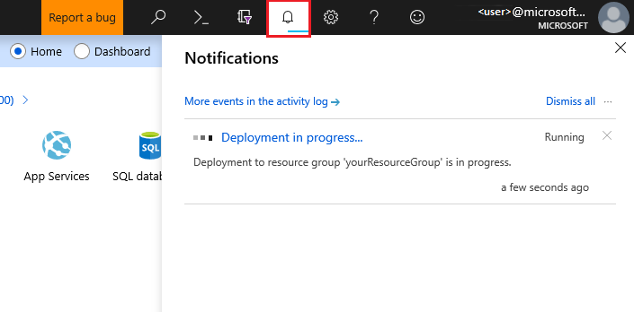
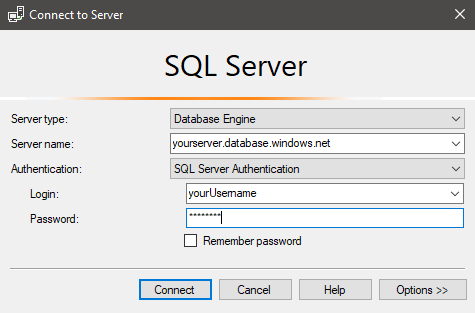
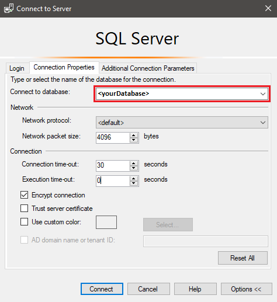
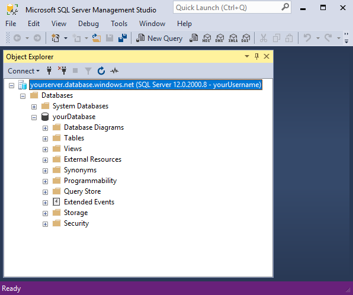

# Tutorial: Design your first Azure SQL database using SSMS

Azure SQL database is a relational database-as-a-service (DBaaS) in the Microsoft Cloud (Azure). In this tutorial, you learn how to use the Azure portal and [SQL Server Management Studio](https://msdn.microsoft.com/library/ms174173.aspx) (SSMS) to:

> [!div class="checklist"]
> * Create a database in the Azure portal*
> * Set up a server-level firewall rule in the Azure portal
> * Connect to the database with SSMS
> * Create tables with SSMS
> * Bulk load data with BCP
> * Query data with SSMS

*If you don't have an Azure subscription, [create a free account](https://azure.microsoft.com/free/) before you begin.

> [!NOTE]
> For the purpose of this tutorial, we are using the [DTU-based purchasing model](sql-database-service-tiers-dtu.md), but you do have the option of choosing the [vCore-based purchasing model](sql-database-service-tiers-vcore.md).

## Prerequisites

To complete this tutorial, make sure you've installed:

- [SQL Server Management Studio](https://msdn.microsoft.com/library/ms174173.aspx) (latest version)
- [BCP and SQLCMD](https://www.microsoft.com/download/details.aspx?id=36433) (latest version)

## Sign in to the Azure portal

Sign in to the [Azure portal](https://portal.azure.com/).

## Create a blank database

An Azure SQL database is created with a defined set of [compute and storage resources](sql-database-service-tiers-dtu.md). The database is created within an [Azure resource group](../azure-resource-manager/resource-group-overview.md) and in an [Azure SQL database logical server](sql-database-features.md).

Follow these steps to create a blank SQL database.

1. Click **Create a resource** in the upper left-hand corner of the Azure portal.

1. On the **New** page, select **Databases** in the Azure Marketplace section, and then click **SQL Database** in the **Featured** section.

   

   1. Fill out the **SQL Database** form with the following information, as shown on the preceding image:

      | Setting       | Suggested value | Description |
      | ------------ | ------------------ | ------------------------------------------------- |
      | **Database name** | *yourDatabase* | For valid database names, see [Database identifiers](/sql/relational-databases/databases/database-identifiers). |
      | **Subscription** | *yourSubscription*  | For details about your subscriptions, see [Subscriptions](https://account.windowsazure.com/Subscriptions). |
      | **Resource group** | *yourResourceGroup* | For valid resource group names, see [Naming rules and restrictions](/azure/architecture/best-practices/naming-conventions). |
      | **Select source** | Blank database | Specifies that a blank database should be created. |

   1. Click **Server** to use an existing server or create and configure a new server for your database. Either select the server or click **Create a new server** and fill out the **New server** form with the following information:

      | Setting       | Suggested value | Description |
      | ------------ | ------------------ | ------------------------------------------------- |
      | **Server name** | Any globally unique name | For valid server names, see [Naming rules and restrictions](/azure/architecture/best-practices/naming-conventions). |
      | **Server admin login** | Any valid name | For valid login names, see [Database identifiers](/sql/relational-databases/databases/database-identifiers). |
      | **Password** | Any valid password | Your password must have at least eight characters and must use characters from three of the following categories: upper case characters, lower case characters, numbers, and non-alphanumeric characters. |
      | **Location** | Any valid location | For information about regions, see [Azure Regions](https://azure.microsoft.com/regions/). |

      

      Click **Select**.

   1. Click **Pricing tier** to specify the service tier, the number of DTUs or vCores, and the amount of storage. You may explore the options for the number of DTUs/vCores and storage that is available to you for each service tier. By default, the **Standard** [DTU-based purchasing model](sql-database-service-tiers-dtu.md) is selected, but you do have the option of choosing the [vCore-based purchasing model](sql-database-service-tiers-vcore.md).

      > [!IMPORTANT]
      > More than 1 TB of storage in the Premium tier is currently available in all regions except the following: UK North, West Central US, UK South2, China East, USDoDCentral, Germany Central, USDoDEast, US Gov Southwest, US Gov South Central, Germany Northeast, China North, US Gov East. In other regions, the storage max in the Premium tier is limited to 1 TB. See [P11-P15 Current Limitations]( sql-database-dtu-resource-limits-single-databases.md#single-database-limitations-of-p11-and-p15-when-the-maximum-size-greater-than-1-tb).

      After selecting the service tier, the number of DTUs, and the amount of storage, click **Apply**.

   1. Enter a **Collation** for the blank database (for this tutorial, use the default value). For more information about collations, see [Collations](/sql/t-sql/statements/collations)

1. Now that you've completed the **SQL Database** form, click **Create** to provision the database. This step may take a few minutes.

1. On the toolbar, click **Notifications** to monitor the deployment process.

     

## Create a firewall rule

The SQL database service creates a firewall at the server-level. The firewall prevents external applications and tools from connecting to the server and any databases on the server. To enable external connectivity to your database, you must first add a rule for your IP address to the firewall. Follow these steps to create a [SQL database server-level firewall rule](sql-database-firewall-configure.md).

> [!NOTE]
> SQL database communicates over port 1433. If you are trying to connect from within a corporate network, outbound traffic over port 1433 may not be allowed by your network's firewall. If so, you cannot connect to your Azure SQL Database server unless your administrator opens port 1433.

1. After the deployment completes, click **SQL databases** from the left-hand menu and then click *yourDatabase* on the **SQL databases** page. The overview page for your database opens, showing you the fully qualified **Server name** (such as *yourserver.database.windows.net*) and provides options for further configuration.

1. Copy this fully qualified server name for use to connect to your server and databases from SQL Server Management Studio.

   

1. Click **Set server firewall** on the toolbar. The **Firewall settings** page for the SQL database server opens.

   

   1. Click **Add client IP** on the toolbar to add your current IP address to a new firewall rule. A firewall rule can open port 1433 for a single IP address or a range of IP addresses.

   1. Click **Save**. A server-level firewall rule is created for your current IP address opening port 1433 on the logical server.

   1. Click **OK** and then close the **Firewall settings** page.

Your IP address can now pass through the firewall. You can now connect to the SQL database server and its databases using SQL Server Management Studio or another tool of your choice. Be sure to use the server admin account you created previously.

> [!IMPORTANT]
> By default, access through the SQL database firewall is enabled for all Azure services. Click **OFF** on this page to disable for all Azure services.

## Connect to the database

Use [SQL Server Management Studio](/sql/ssms/sql-server-management-studio-ssms) to establish a connection to your Azure SQL database server.

1. Open SQL Server Management Studio.

1. In the **Connect to Server** dialog box, enter the following information:

   | Setting       | Suggested value | Description |
   | ------------ | ------------------ | ------------------------------------------------- |
   | **Server type** | Database engine | This value is required. |
   | **Server name** | The fully qualified server name | For example, *yourserver.database.windows.net*. |
   | **Authentication** | SQL Server Authentication | SQL Authentication is the only authentication type that we've configured in this tutorial. |
   | **Login** | The server admin account | The account that you specified when you created the server. |
   | **Password** | The password for your server admin account | The password that you specified when you created the server. |

   

   1. Click **Options** in the **Connect to server** dialog box. In the **Connect to database** section, enter *yourDatabase* to connect to this database.

        

   1. Click **Connect**. The **Object Explorer** window opens in SSMS.

1. In **Object Explorer**, expand **Databases** and then expand *yourDatabase* to view the objects in the sample database.

     

## Create tables in the database

Create a database schema with four tables that model a student management system for universities using [Transact-SQL](/sql/t-sql/language-reference):

- Person
- Course
- Student
- Credit

The following diagram shows how these tables are related to each other. Some of these tables reference columns in other tables. For example, the *Student* table references the *PersonId* column of the *Person* table. Study the diagram to understand how the tables in this tutorial are related to one another. For an in-depth look at how to create effective database tables, see [Create effective database tables](https://msdn.microsoft.com/library/cc505842.aspx). For information about choosing data types, see [Data types](/sql/t-sql/data-types/data-types-transact-sql).

> [!NOTE]
> You can also use the [table designer in SQL Server Management Studio](/sql/ssms/visual-db-tools/design-database-diagrams-visual-database-tools) to create and design your tables.


1. In **Object Explorer**, right-click *yourDatabase* and select **New Query**. A blank query window opens that is connected to your database.

1. In the query window, execute the following query to create four tables in your database:

   ```sql
   -- Create Person table
   CREATE TABLE Person
   (
       PersonId INT IDENTITY PRIMARY KEY,
       FirstName NVARCHAR(128) NOT NULL,
       MiddelInitial NVARCHAR(10),
       LastName NVARCHAR(128) NOT NULL,
       DateOfBirth DATE NOT NULL
   )

   -- Create Student table
   CREATE TABLE Student
   (
       StudentId INT IDENTITY PRIMARY KEY,
       PersonId INT REFERENCES Person (PersonId),
       Email NVARCHAR(256)
   )

   -- Create Course table
   CREATE TABLE Course
   (
       CourseId INT IDENTITY PRIMARY KEY,
       Name NVARCHAR(50) NOT NULL,
       Teacher NVARCHAR(256) NOT NULL
   )

   -- Create Credit table
   CREATE TABLE Credit
   (
       StudentId INT REFERENCES Student (StudentId),
       CourseId INT REFERENCES Course (CourseId),
       Grade DECIMAL(5,2) CHECK (Grade <= 100.00),
       Attempt TINYINT,
       CONSTRAINT [UQ_studentgrades] UNIQUE CLUSTERED
       (
           StudentId, CourseId, Grade, Attempt
       )
   )
   ```

   

1. Expand the **Tables** node under *yourDatabase* in the **Object Explorer** to see the tables you created.

   

## Load data into the tables

1. Create a folder called *sampleData* in your Downloads folder to store sample data for your database.

1. Right-click the following links and save them into the *sampleData* folder.

   - [SampleCourseData](https://sqldbtutorial.blob.core.windows.net/tutorials/SampleCourseData)
   - [SamplePersonData](https://sqldbtutorial.blob.core.windows.net/tutorials/SamplePersonData)
   - [SampleStudentData](https://sqldbtutorial.blob.core.windows.net/tutorials/SampleStudentData)
   - [SampleCreditData](https://sqldbtutorial.blob.core.windows.net/tutorials/SampleCreditData)

1. Open a command prompt window and navigate to the *sampleData* folder.

1. Execute the following commands to insert sample data into the tables replacing the values for *server*, *database*, *username*, and *password* with the values for your environment.
  
   ```cmd
   bcp Course in SampleCourseData -S <server>.database.windows.net -d <database> -U <username> -P <password> -q -c -t ","
   bcp Person in SamplePersonData -S <server>.database.windows.net -d <database> -U <username> -P <password> -q -c -t ","
   bcp Student in SampleStudentData -S <server>.database.windows.net -d <database> -U <username> -P <password> -q -c -t ","
   bcp Credit in SampleCreditData -S <server>.database.windows.net -d <database> -U <username> -P <password> -q -c -t ","
   ```

You have now loaded sample data into the tables you created earlier.

## Query data

Execute the following queries to retrieve information from the database tables. See [Write SQL queries](https://technet.microsoft.com/library/bb264565.aspx) to learn more about writing SQL queries. The first query joins all four tables to find the students taught by 'Dominick Pope' who have a grade higher than 75%. The second query joins all four tables and finds the courses in which 'Noe Coleman' has ever enrolled.

1. In a SQL Server Management Studio query window, execute the following query:

   ```sql
   -- Find the students taught by Dominick Pope who have a grade higher than 75%
   SELECT  person.FirstName, person.LastName, course.Name, credit.Grade
   FROM  Person AS person
       INNER JOIN Student AS student ON person.PersonId = student.PersonId
       INNER JOIN Credit AS credit ON student.StudentId = credit.StudentId
       INNER JOIN Course AS course ON credit.CourseId = course.courseId
   WHERE course.Teacher = 'Dominick Pope'
       AND Grade > 75
   ```

1. In a query window, execute following query:

   ```sql
   -- Find all the courses in which Noe Coleman has ever enrolled
   SELECT  course.Name, course.Teacher, credit.Grade
   FROM  Course AS course
       INNER JOIN Credit AS credit ON credit.CourseId = course.CourseId
       INNER JOIN Student AS student ON student.StudentId = credit.StudentId
       INNER JOIN Person AS person ON person.PersonId = student.PersonId
   WHERE person.FirstName = 'Noe'
       AND person.LastName = 'Coleman'
   ```

## Next steps

In this tutorial, you learned many basic database tasks. You learned how to:

> [!div class="checklist"]
> * Create a database
> * Set up a firewall rule
> * Connect to the database with [SQL Server Management Studio](https://msdn.microsoft.com/library/ms174173.aspx) (SSMS)
> * Create tables
> * Bulk load data
> * Query that data

Advance to the next tutorial to learn about designing a database using Visual Studio and C#.

> [!div class="nextstepaction"]
> [Design an Azure SQL database and connect with C# and ADO.NET](sql-database-design-first-database-csharp.md)
