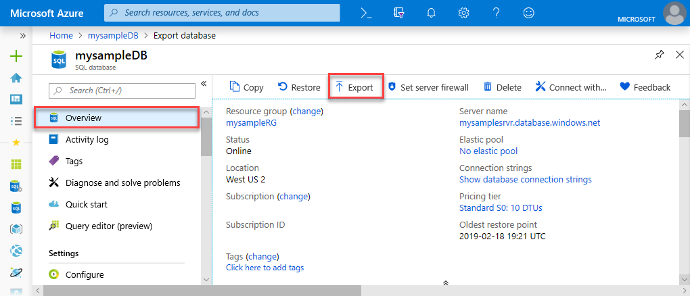
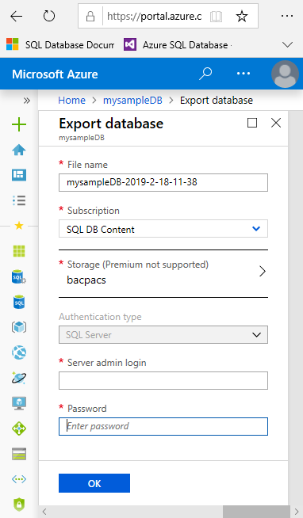

# Export to a BACPAC file - Azure SQL Database & SQL Managed Instance

When you need to export a database for archiving or for moving to another platform, you can export the database schema and data to a [BACPAC](https://msdn.microsoft.com/library/ee210546.aspx#Anchor_4) file. A BACPAC file is a ZIP file with an extension of BACPAC containing the metadata and data from a SQL Server database. A BACPAC file can be stored in Azure Blob storage or in local storage in an on-premises location and later imported back into Azure SQL Database, Azure SQL Managed Instance, or a SQL Server on-premises installation.

## Considerations

- For an export to be transactionally consistent, you must ensure either that no write activity is occurring during the export, or that you are exporting from a [transactionally consistent copy](sql-database-copy.md) of your database.
- If you are exporting to blob storage, the maximum size of a BACPAC file is 200 GB. To archive a larger BACPAC file, export to local storage.
- Exporting a BACPAC file to Azure premium storage using the methods discussed in this article is not supported.
- Storage behind a firewall is currently not supported.
- If the export operation exceeds 20 hours, it may be canceled. To increase performance during export, you can:

  - Temporarily increase your compute size.
  - Cease all read and write activity during the export.
  - Use a [clustered index](https://msdn.microsoft.com/library/ms190457.aspx) with non-null values on all large tables. Without clustered indexes, an export may fail if it takes longer than 6-12 hours. This is because the export service needs to complete a table scan to try to export entire table. A good way to determine if your tables are optimized for export is to run **DBCC SHOW_STATISTICS** and make sure that the *RANGE_HI_KEY* is not null and its value has good distribution. For details, see [DBCC SHOW_STATISTICS](https://msdn.microsoft.com/library/ms174384.aspx).

> [!NOTE]
> BACPACs are not intended to be used for backup and restore operations. Azure automatically creates backups for every user database. For details, see [business continuity overview](sql-database-business-continuity.md) and [SQL Database backups](sql-database-automated-backups.md).

## Azure portal

Exporting a BACPAC of a database from an [Azure SQL Managed Instance](sql-database-managed-instance.md) using the Azure Portal is not currently supported. Use SQL Server Management Studio or SQLPackage instead.

> [!NOTE]
> Machines processing import/export requests submitted through the Azure portal or PowerShell need to store the BACPAC file as well as temporary files generated by the Data-Tier Application Framework (DacFX). The disk space required varies significantly among databases with the same size and can require disk space up to 3 times the size of the database. Machines running the import/export request only have  450GB local disk space. As a result, some requests may fail with the error `There is not enough space on the disk`. In this case, the workaround is to run sqlpackage.exe on a machine with enough local disk space. We encourage using [SqlPackage](#export-to-a-bacpac-file-using-the-sqlpackage-utility) to import/export databases larger than 150GB to avoid this issue.

1. To export a database using the [Azure portal](https://portal.azure.com), open the page for your database and click **Export** on the toolbar.

   

2. Specify the BACPAC filename, select an existing Azure storage account and container for the export, and then provide the appropriate credentials for access to the source database. A SQL **Server admin login** is needed here even if you are the Azure admin, as being an Azure admin does not equate to having SQL Server admin permissions.

    

3. Click **OK**.

4. To monitor the progress of the export operation, open the page for the SQL Database server containing the database being exported. Under to **Settings** and then click **Import/Export history**.

   

## SQLPackage utility

To export a SQL database using the [SqlPackage](https://docs.microsoft.com/sql/tools/sqlpackage) command-line utility, see [Export parameters and properties](https://docs.microsoft.com/sql/tools/sqlpackage#export-parameters-and-properties). The SQLPackage utility ships with the latest versions of [SQL Server Management Studio](https://msdn.microsoft.com/library/mt238290.aspx) and [SQL Server Data Tools for Visual Studio](https://msdn.microsoft.com/library/mt204009.aspx), or you can download the latest version of [SqlPackage](https://www.microsoft.com/download/details.aspx?id=53876) directly from the Microsoft download center.

We recommend the use of the SQLPackage utility for scale and performance in most production environments. For a SQL Server Customer Advisory Team blog about migrating using BACPAC files, see [Migrating from SQL Server to Azure SQL Database using BACPAC Files](https://blogs.msdn.microsoft.com/sqlcat/20../../migrating-from-sql-server-to-azure-sql-database-using-bacpac-files/).

This example shows how to export a database using SqlPackage.exe with Active Directory Universal Authentication:

```cmd
SqlPackage.exe /a:Export /tf:testExport.bacpac /scs:"Data Source=apptestserver.database.windows.net;Initial Catalog=MyDB;" /ua:True /tid:"apptest.onmicrosoft.com"
```

##  SQL Server Management Studio (SSMS)

The newest versions of SQL Server Management Studio provides a wizard to export an Azure SQL Database or SQL Managed Instance database to a BACPAC file. See the [Export a Data-tier Application](https://docs.microsoft.com/sql/relational-databases/data-tier-applications/export-a-data-tier-application).

## PowerShell

> [!NOTE]
> [Azure SQL Managed Instance](sql-database-managed-instance.md) does not currently support exporting a database to a BACPAC file using Azure PowerShell. To export a managed instance into a BACPAC file, use SQL Server Management Studio or SQLPackage.

Use the [New-AzSqlDatabaseExport](/powershell/module/az.sql/new-azsqldatabaseexport) cmdlet to submit an export database request to the Azure SQL Database service. Depending on the size of your database, the export operation may take some time to complete.

```powershell
$exportRequest = New-AzSqlDatabaseExport -ResourceGroupName $ResourceGroupName -ServerName $ServerName `
  -DatabaseName $DatabaseName -StorageKeytype $StorageKeytype -StorageKey $StorageKey -StorageUri $BacpacUri `
  -AdministratorLogin $creds.UserName -AdministratorLoginPassword $creds.Password
```

To check the status of the export request, use the [Get-AzSqlDatabaseImportExportStatus](/powershell/module/az.sql/get-azsqldatabaseimportexportstatus) cmdlet. Running this immediately after the request usually returns **Status: InProgress**. When you see **Status: Succeeded** the export is complete.

```powershell
$exportStatus = Get-AzSqlDatabaseImportExportStatus -OperationStatusLink $exportRequest.OperationStatusLink
[Console]::Write("Exporting")
while ($exportStatus.Status -eq "InProgress")
{
    Start-Sleep -s 10
    $exportStatus = Get-AzSqlDatabaseImportExportStatus -OperationStatusLink $exportRequest.OperationStatusLink
    [Console]::Write(".")
}
[Console]::WriteLine("")
$exportStatus
```

## Next steps

- To learn about long-term backup retention of a single databases and pooled databases as an alternative to exported a database for archive purposes, see [Long-term backup retention](sql-database-long-term-retention.md). You can use SQL Agent jobs to schedule [copy-only database backups](https://docs.microsoft.com/sql/relational-databases/backup-restore/copy-only-backups-sql-server) as an alternative to long-term backup retention.
- For a SQL Server Customer Advisory Team blog about migrating using BACPAC files, see [Migrating from SQL Server to Azure SQL Database using BACPAC Files](https://blogs.msdn.microsoft.com/sqlcat/2016/10/20/migrating-from-sql-server-to-azure-sql-database-using-bacpac-files/).
- To learn about importing a BACPAC to a SQL Server database, see [Import a BACPAC to a SQL Server database](https://msdn.microsoft.com/library/hh710052.aspx).
- To learn about exporting a BACPAC from a SQL Server database, see [Export a Data-tier Application](https://docs.microsoft.com/sql/relational-databases/data-tier-applications/export-a-data-tier-application)
- To learn about using the Data Migration Service to migrate a database, see [Migrate SQL Server to Azure SQL Database offline using DMS](../dms/tutorial-sql-server-to-azure-sql.md).
- If you are exporting from SQL Server as a prelude to migration to Azure SQL Database, see [Migrate a SQL Server database to Azure SQL Database](sql-database-single-database-migrate.md).
- To learn how to manage and share storage keys and shared access signatures securely, see [Azure Storage Security Guide](https://docs.microsoft.com/azure/storage/common/storage-security-guide).
