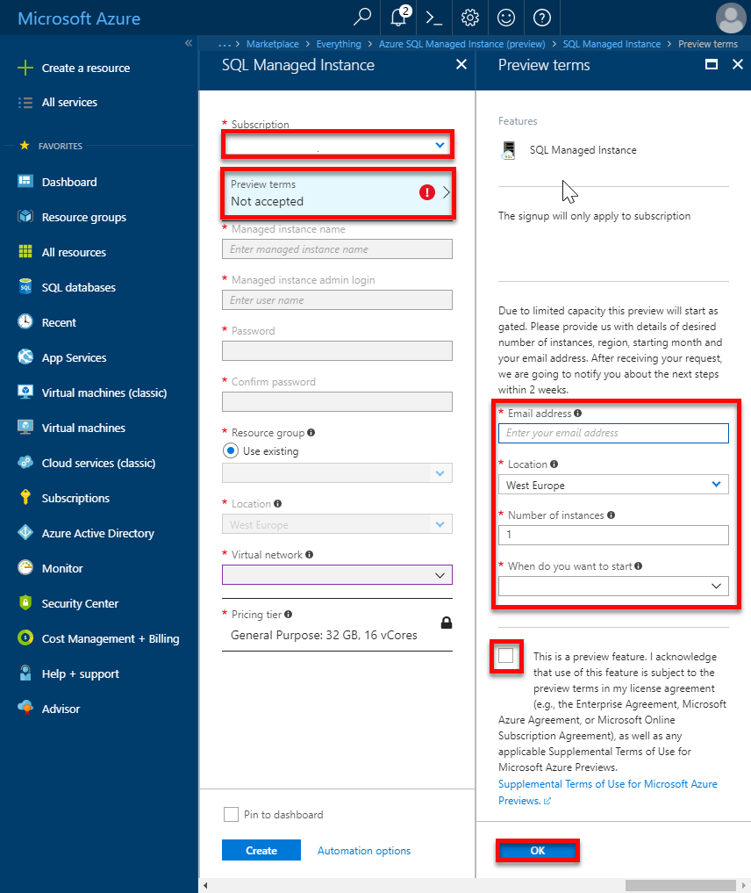
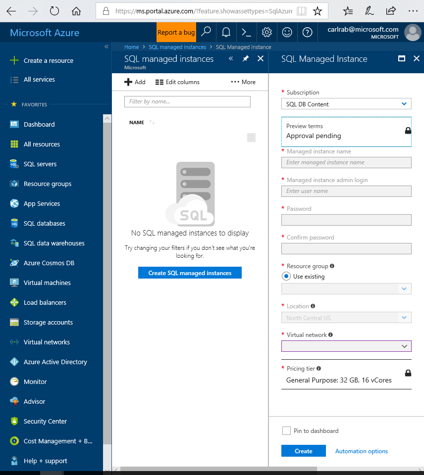
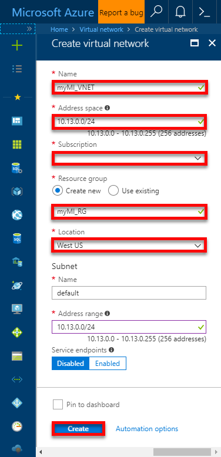
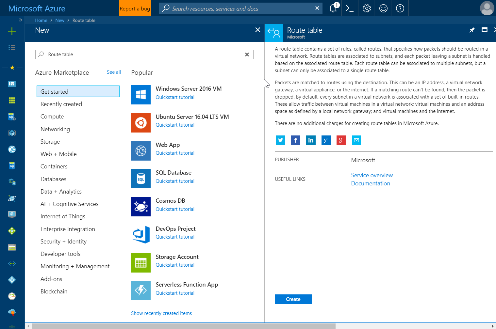
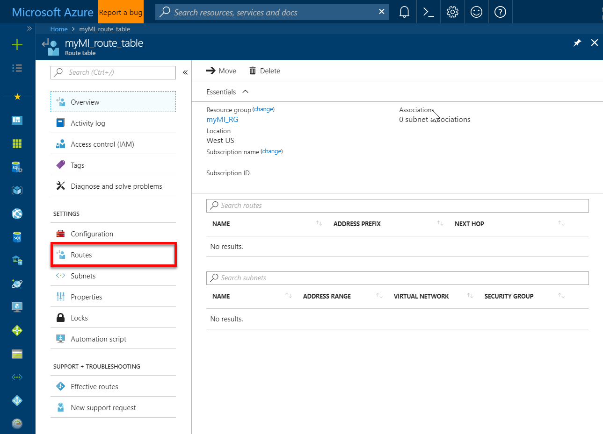
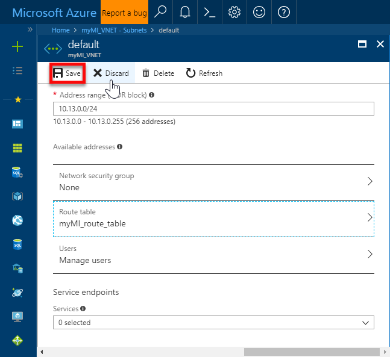
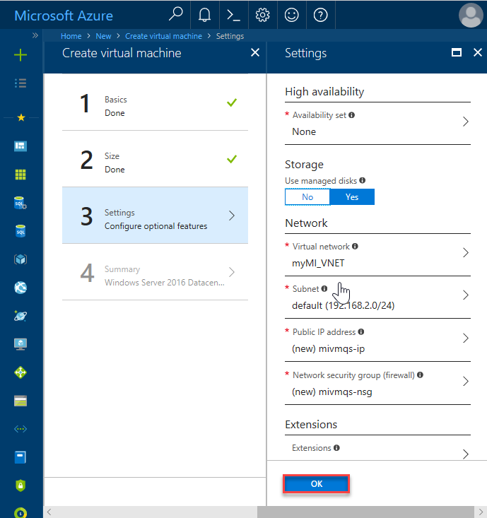
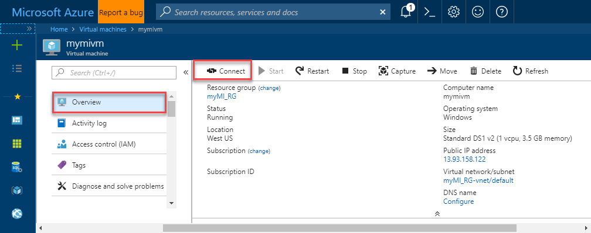

# Create an Azure SQL Database Managed Instance in the Azure portal

This quick start tutorial walks through creating an Azure SQL Database Managed Instance using the Azure portal in a dedicated subnet of a virtual network (VNET), connecting to the Managed Instance using SQL Server Management Studio on a virtual machine in the same VNET, and then restoring a backup of the Wide World Importers database into the Managed Instance.

If you don't have an Azure subscription, create a [free](https://azure.microsoft.com/free/) account before you begin.

## Log in to the Azure portal

Log in to the [Azure portal](https://portal.azure.com/).

## Whitelist your subscription

Managed Instance is being released initially as a limited public preview that requires your subscription to be whitelisted. If your subscription is not already whitelisted, use the following steps to be offered and accept preview terms and send a request for whitelisting.

1. Click **Create a resource** in the upper left-hand corner of the Azure portal.
2. Locate **Managed Instance** and then select **Azure SQL Database Managed Instance (preview)**.
3. Click **Create**.

   

3. Select your subscription, click **Preview terms**, and then provide the requested information.

   

5. Click **OK** when completed.

   

> [!NOTE]
> While awaiting preview approval, you can continue and complete the next few sections of this quickstart tutorial.

## Configure a virtual network (VNET)

The following steps show you how to create a new [Azure Resource Manager (ARM)](../azure-resource-manager/resource-manager-deployment-model.md) virtual network (VNET) for use by your Managed Instance.

1. Click **Create a resource** in the upper left-hand corner of the Azure portal.
2. Locate and then click **Virtual Network**, verify the **Resource Manager** is selected as the deployment mode, and then click **Create**.

   

3. Fill out the virtual network form with the requested information, using the information in the following table.

   | Setting| Suggested value | Description |
   | ------ | --------------- | ----------- |
   |**Name**|Any valid name|For valid virtual network names, see [Naming rules and restrictions](https://docs.microsoft.com/azure/architecture/best-practices/naming-conventions).|
   |**Address space**|Any valid address range, such as 10.2.0.0/24|The virtual network's address name in CIDR notation.|
   |**Subscription**|Your subscription|For details about your subscriptions, see [Subscriptions](https://account.windowsazure.com/Subscriptions).|
   |**Resource Group**|Any valid resource group (new or existing)|For valid resource group names, see [Naming rules and restrictions](https://docs.microsoft.com/azure/architecture/best-practices/naming-conventions).|
   |**Location**|Any valid location| For information about regions, see [Azure Regions](https://azure.microsoft.com/regions/).|
   |**Subnet name**|Any valid subnet name|or valid virtual network names, see [Naming rules and restrictions](https://docs.microsoft.com/azure/architecture/best-practices/naming-conventions).|
   |**Subnet address range**|Any valid subnet address|The subnet's address range in CIDR notation. It must be contained by the address space of the virtual network|
   |**Service endpoints**|Disabled|Enable one or more service endpoints for this subnet|
   ||||

   

4. Click **Create**.

## Create new route table and set route table on Managed Instance subnet

The following steps show you how to create a 0.0.0.0/0 Next Hop Internet route and apply it to the Managed Instance subnet.

1. Click **Create a resource** in the upper left-hand corner of the Azure portal.
2. Locate and then click **Route table**, and then click **Create** on the Route table page. 

   

3. Fill out the route table form with the requested information, using the information in the following table.

   | Setting| Suggested value | Description |
   | ------ | --------------- | ----------- |
   |**Name**|Any valid name|For valid route table names, see [Naming rules and restrictions](https://docs.microsoft.com/azure/architecture/best-practices/naming-conventions).|
   |**Subscription**|Your subscription|For details about your subscriptions, see [Subscriptions](https://account.windowsazure.com/Subscriptions).|
   |**Resource Group**|Select the resource group you created in the previous procedure|For valid resource group names, see [Naming rules and restrictions](https://docs.microsoft.com/azure/architecture/best-practices/naming-conventions).|
   |**Location**|Select the location you specified in the previous procedure| For information about regions, see [Azure Regions](https://azure.microsoft.com/regions/).|
   |**Disable BCP route propogation**|Disabled||
   ||||

   

4. Click **Create**.
5. After the route table has been created, open the newly created route table.

   

6. Click **Routes** and then click **Add**.

7.  Add 0.0.0.0/0 Next Hop Internet route as the **only** route, using the information in the following table.

   | Setting| Suggested value | Description |
   | ------ | --------------- | ----------- |
   |**Route name**|Any valid name|For valid route names, see [Naming rules and restrictions](https://docs.microsoft.com/azure/architecture/best-practices/naming-conventions).|
   |**Address prefix**|0.0.0.0/0|The destination IP address in CIDR notation that this route applies to.|
   |**Next hop type**|Internet|The next hop handles the matching packets for this route|
   |||

   

8. Click **OK**.
9. To set this route table on the subnet where Managed Instance is to be deployed, open the virtual network that you created earlier.
10. Click **Subnets** and then click the subnet that you created earlier.

   

11. Click **Route table** and then select the **myMI_route_table**.

   

12. Click **Save**

   

## Create a Managed Instance

## Create a virtual machine in the same VNET but different subnet

Create this virtual machine using the virtual network created earlier. Later in this tutorial, you create a Managed Instance in this same virtual network and connect to it using SQL Server Management Studio.

1. Click **Create a resource** in the upper left-hand corner of the Azure portal.
2. Select **Compute**, and then select **Windows Server 2016 Datacenter**. 
3. Fill out the virtual machine table form with the requested information, using the information in the following table and screenshot.

   | Setting| Suggested value | Description |
   | ------ | --------------- | ----------- |
   |**Name**|Any valid name|For valid virtual machine names, see [Naming rules and restrictions](https://docs.microsoft.com/azure/architecture/best-practices/naming-conventions).|
    **VM disk type**|SSD|SSDs provide the best balance between price and performance.|   
   |**User name**|Any valid user name|For valid user names, see [Naming rules and restrictions](https://docs.microsoft.com/azure/architecture/best-practices/naming-conventions).| 
   |**Password**||Any valid password|The password must be at least 12 characters long and meet the [defined complexity requirements](faq.md#what-are-the-password-requirements-when-creating-a-vm).| 
   |**Subscription**|Your subscription|For details about your subscriptions, see [Subscriptions](https://account.windowsazure.com/Subscriptions).|
   |**Resource Group**|The resource group that you created earlier|For valid resource group names, see [Naming rules and restrictions](https://docs.microsoft.com/azure/architecture/best-practices/naming-conventions).|
   |**Location**|The location that you previously selected|For information about regions, see [Azure Regions](https://azure.microsoft.com/regions/).|
   |**Already have a Windows license**|No|If you own Windows licenses with active Software Assurance (SA), use Azure Hybrid Benefit to save compute cost|
   ||||

   

3. Click **OK**.
4. Select a size for the VM. To see more sizes, select **View all** or change the **Supported disk type** filter. 

      

5. Click **Select**.
6. Under **Settings**, keep the defaults. 

      

7. Click **OK**.
8. On the summary page, review the offer detaials and then click **Create** to start the virtual machine deployment.
 
## Connect to virtual machine

Create a remote desktop connection to the virtual machine.

1. After deployment completes, go to the virtual machine resource.

      

2. Click the **Connect** button on the virtual machine properties. A Remote Desktop Protocol file (.rdp file) is created and downloaded.
3. To connect to your VM, open the downloaded RDP file. If prompted, click **Connect**. On a Mac, you need an RDP client such as this [Remote Desktop Client](https://itunes.apple.com/us/app/microsoft-remote-desktop/id715768417?mt=12) from the Mac App Store.

4. Enter the user name and password you specified when creating the virtual machine, then click **Ok**.

5. You may receive a certificate warning during the sign-in process. Click **Yes** or **Continue** to proceed with the connection.

## Install SSMS and connect to the Managed Instance

## Download Wide World Importers backup file and restore to Managed Instance.

## Next steps

