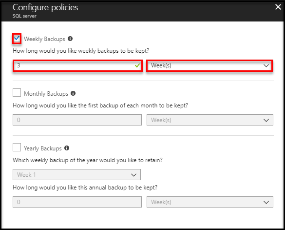
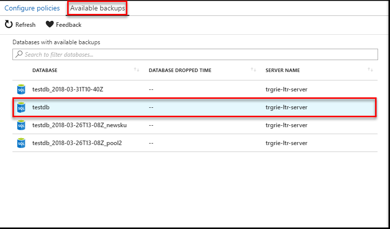
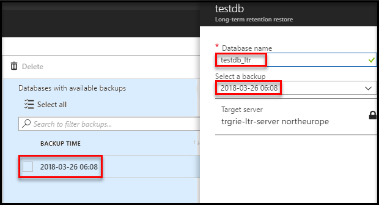

# Configure and restore backups from Azure SQL Database long-term backup retention using Azure SQL storage

You can configure Azure SQL database with a [long-term backup retention](sql-database-long-term-retention.md) policy (LTR) to automatically retain backups in Azure blob storage for up to 10 years. You can then recover a database using these backups using the Azure portal or PowerShell.

> [!NOTE]
> As part of the initial release of the preview of this feature in October 2016, backups were stored in the Azure Services Recovery Service vault. This update removes this dependency, but for backward compatibility the original API is supported until May 31, 2018. If you need to interact with backups in the Azure Services Recovery vault, see [Long-term backup retention using Azure Services Recovery Service vault](sql-database-long-term-backup-retention-configure-vault.md). 

## Use the Azure portal to configure long-term retention policies and restore backups

The following sections show you how to use the Azure portal to configure the long-term retention, view backups in long-term retention, and restore backup from long-term retention.

### Configure long-term retention policies

You can configure SQL Database to [retain automated backups](sql-database-long-term-retention.md) for a period longer than the retention period for your service tier. 

1. In the Azure portal, select your SQL server and then click **Long-term backup retention**.

   

2. On the **Configure policies** tab, select the database on which you want to set or modify long-term backup retention policies.

   

3. In the **Configure policies** pane, select if want to retain weekly, monthly or yearly backups and specify the retention period for each. 

   

4. When complete, click **Apply**.

### View backups and restore from a backup using Azure portal

View the backups that are retained for a specific database with a LTR policy, and restore from those backups. 

1. In the Azure portal, select your SQL server and then click **Long-term backup retention**.

   

2. On the **Available backups** tab, select the database for which you want to see available backups.

   

3. In the **Available backups** pane, review the available backups. 

   

4. Select the backup from which you want to restore, and then specify the new database name.

   

5. Click **OK** to restore your database from the backup in Azure SQL storage to the new database.

6. On the toolbar, click the notification icon to view the status of the restore job.

   

5. When the restore job is completed, open the **SQL databases** page to view the newly restored database.

> [!NOTE]
> From here, you can connect to the restored database using SQL Server Management Studio to perform needed tasks, such as to [extract a bit of data from the restored database to copy into the existing database or to delete the existing database and rename the restored database to the existing database name](sql-database-recovery-using-backups.md#point-in-time-restore).
>

## Use PowerShell to configure long-term retention policies and restore backups

The following sections show you how to use PowerShell to configure the long-term backup retention, view backups in Azure SQL storage, and restore from a backup in Azure SQL storage.

### Create an LTR policy

```powershell
# Get the SQL server 
# $subId = “{subscription-id}”
# $serverName = “{server-name}”
# $resourceGroup = “{resource-group-name}” 
# $dbName = ”{database-name}”

Login-AzureRmAccount
Select-AzureRmSubscription -SubscriptionId $subId

# get the server
$server = Get-AzureRmSqlServer -ServerName $serverName -ResourceGroupName $resourceGroup

# create LTR policy with WeeklyRetention = 12 weeks. MonthlyRetention and YearlyRetention = 0 by default.
Set-AzureRmSqlDatabaseBackupLongTermRetentionPolicy -ServerName $serverName -DatabaseName $dbName -ResourceGroupName $resourceGroup -WeeklyRetention P12W 

# create LTR policy with WeeklyRetention = 12 weeks, YearlyRetetion = 5 years and WeekOfYear = 16 (week of April 15). MonthlyRetention = 0 by default.
Set-AzureRmSqlDatabaseBackupLongTermRetentionPolicy -ServerName $serverName -DatabaseName $dbName -ResourceGroupName $resourceGroup -WeeklyRetention P12W -YearlyRetention P5Y -WeekOfYear 16
```

### View LTR policies
This example shows how to list the LTR policies within a server

```powershell
# Get all LTR policies within a server
$ltrPolicies = Get-AzureRmSqlDatabase -ResourceGroupName Default-SQL-WestCentralUS -ServerName trgrie-ltr-server | Get-AzureRmSqlDatabaseLongTermRetentionPolicy -Current 

# Get the LTR policy of a specific database 
$ltrPolicies = Get-AzureRmSqlDatabaseBackupLongTermRetentionPolicy -ServerName $serverName -DatabaseName $dbName  -ResourceGroupName $resourceGroup -Current
```
### Clear an LTR policy
This example shows how to clear an LTR policy from a database

```powershell
Set-AzureRmSqlDatabaseBackupLongTermRetentionPolicy -ServerName $serverName -DatabaseName $dbName -ResourceGroupName $resourceGroup -RemovePolicy
```

### View LTR backups

This example shows how to list the LTR backups within a server. 

```powershell
# Get the list of all LTR backups in a specific Azure region 
# The backups are grouped by the logical database id.
# Within each group they are ordered by the timestamp, the earliest
# backup first.  
$ltrBackups = Get-AzureRmSqlDatabaseLongTermRetentionBackup -LocationName $server.Location 

# Get the list of LTR backups from the Azure region under 
# the named server. 
$ltrBackups = Get-AzureRmSqlDatabaseLongTermRetentionBackup -LocationName $server.Location -ServerName $serverName

# Get the LTR backups for a specific database from the Azure region under the named server 
$ltrBackups = Get-AzureRmSqlDatabaseLongTermRetentionBackup -LocationName $server.Location -ServerName $serverName -DatabaseName $dbName

# List LTR backups only from live databases (you have option to choose All/Live/Deleted)
$ltrBackups = Get-AzureRmSqlDatabaseLongTermRetentionBackup -LocationName $server.Location -DatabaseState Live

# Only list the latest LTR backup for each database 
$ltrBackups = Get-AzureRmSqlDatabaseLongTermRetentionBackup -LocationName $server.Location -ServerName $serverName -OnlyLatestPerDatabase
```

### Delete LTR backups

This example shows how to delete an LTR backup from the list of backups.

```powershell
# remove the earliest backup 
$ltrBackup = $ltrBackups[0]
Remove-AzureRmSqlDatabaseLongTermRetentionBackup -ResourceId $ltrBackup.ResourceId
```

### Restore from LTR backups
This example shows how to restore from an LTR backup. Note, this interface did not change but the resource id parameter now requires the LTR backup resource id. 

```powershell
# Restore LTR backup as an S3 database
Restore-AzureRmSqlDatabase -FromLongTermRetentionBackup -ResourceId $ltrBackup.ResourceId -ServerName $serverName -ResourceGroupName $resourceGroup -TargetDatabaseName $dbName -ServiceObjectiveName S3
```

> [!NOTE]
> From here, you can connect to the restored database using SQL Server Management Studio to perform needed tasks, such as to extract a bit of data from the restored database to copy into the existing database or to delete the existing database and rename the restored database to the existing database name. See [point in time restore](sql-database-recovery-using-backups.md#point-in-time-restore).

## Next steps

- To learn about service-generated automatic backups, see [automatic backups](sql-database-automated-backups.md)
- To learn about long-term backup retention, see [long-term backup retention](sql-database-long-term-retention.md)
