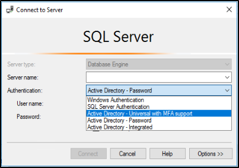
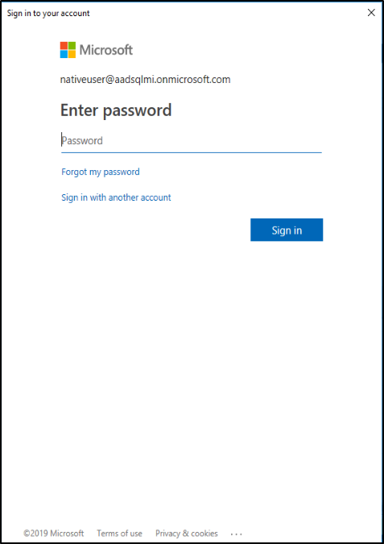
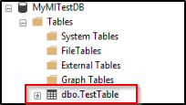
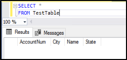

# Tutorial: Managed Instance security in Azure SQL Database using Azure AD logins

Azure SQL Database Managed Instance provides nearly all security features that the latest SQL Server on-premises (Enterprise Edition) Database Engine has:

- Limiting access in an isolated environment
- Use authentication mechanisms that require identity (Azure AD, SQL Authentication)
- Use authorization with role-based memberships and permissions
- Enable security features

In this tutorial, you learn how to:

> [!div class="checklist"]
> - Create an Azure Active Directory (AD) login for Managed Instances
> - Grant permissions to Azure AD logins in Managed Instances
> - Create Azure AD users from Azure AD logins
> - Assign permissions to Azure AD users and managed database security
> - Use impersonation with Azure AD users
> - Use cross-database queries with Azure AD users
> - Learn about security features, such as threat protection, auditing, data masking, and encryption

> [!NOTE]
> Azure AD logins for SQL Database Managed Instance is in **public preview**.

To learn more, see the [Azure SQL Database Managed Instance overview](sql-database-managed-instance-index.yml) and [capabilities](sql-database-managed-instance.md) articles.

## Prerequisites

To complete the tutorial, make sure you have the following prerequisites:

- [SQL Server Management Studio](/sql/ssms/download-sql-server-management-studio-ssms) (SSMS)
- An Azure SQL Database Managed Instance
    - Follow this article: [Quickstart: Create an Azure SQL Database Managed Instance](sql-database-managed-instance-get-started.md)
- Able to access your Azure SQL Database Managed Instance and [provisioned an Azure AD administrator for the Managed Instance](sql-database-aad-authentication-configure.md#provision-an-azure-active-directory-administrator-for-your-managed-instance). To learn more, see:
    - [Connect your application to Azure SQL Database Managed Instance](sql-database-managed-instance-connect-app.md) 
    - [Azure SQL Database Managed Instance Connectivity Architecture](sql-database-managed-instance-connectivity-architecture.md)
    - [Configure and manage Azure Active Directory authentication with SQL](sql-database-aad-authentication-configure.md)

## Limiting access to your Managed Instance

Managed Instances can only be accessed through a private IP address. There are no service endpoints that are available to connect to a Managed Instance from outside the Managed Instance network. Much like an isolated SQL Server on-premise environment, applications or users need access to the Managed Instance Network (VNet) before a connection can be established. For more information, see the following article, [Connect your application to Azure SQL Database Managed Instance](sql-database-managed-instance-connect-app.md).

> [!NOTE] 
> Since Managed Instances can only be accessed inside of its VNET, [SQL Database firewall rules](sql-database-firewall-configure.md) do not apply. Managed Instances has its own [built-in firewall](sql-database-managed-instance-management-endpoint-verify-built-in-firewall.md).

## Create an Azure AD login for a Managed Instance using SSMS

The first Azure AD login must be created by the standard SQL Server account (non-azure AD) that is a `sysadmin`. See the following articles for examples of connecting to your Managed Instance:

- [Quickstart: Configure Azure VM to connect to an Azure SQL Database Managed Instance](sql-database-managed-instance-configure-vm.md)
- [Quickstart: Configure a point-to-site connection to an Azure SQL Database Managed Instance from on-premises](sql-database-managed-instance-configure-p2s.md)

> [!IMPORTANT]
> The Azure AD admin used to setup the Managed Instance cannot be used to create an Azure AD login within the Managed Instance. You must create the first Azure AD login using a SQL Server account that is a `sysadmin`. This is a temporary limitation that will be removed once Azure AD logins become GA. You will see the following error if you try to use an Azure AD admin account to create the login: `Msg 15247, Level 16, State 1, Line 1 User does not have permission to perform this action.`

1. Log into your Managed Instance using a standard SQL Server account (non-azure AD) that is a `sysadmin`, using [SQL Server Management Studio](sql-database-managed-instance-configure-p2s.md#use-ssms-to-connect-to-the-managed-instance).

2. In **Object Explorer**, right-click the server and choose **New Query**.

3. In the query window, use the following syntax to create a login for a local Azure AD account:

    ```sql
    USE master
    GO
    CREATE LOGIN login_name FROM EXTERNAL PROVIDER
    GO
    ```

    This example creates a login for the account nativeuser@aadsqlmi.onmicrosoft.com.

    ```sql
    USE master
    GO
    CREATE LOGIN [nativeuser@aadsqlmi.onmicrosoft.com] FROM EXTERNAL PROVIDER
    GO
    ```

4. On the toolbar, select **Execute** to create the login.

5. Check the newly added login, by executing the following T-SQL command:

    ```sql
    SELECT *  
    FROM sys.server_principals;  
    GO
    ```

    

For more information, see [CREATE LOGIN](/sql/t-sql/statements/create-login-transact-sql?view=azuresqldb-mi-current).

## Granting permissions to allow the creation of Managed Instance logins

To create other Azure AD logins, SQL Server roles or permissions must be granted to the principal (SQL or Azure AD).

### SQL authentication

- If the login is a SQL Principal, only logins that are part of the `sysadmin` role can use the create command to create logins for an Azure AD account.

### Azure AD authentication

- To allow the newly created Azure AD login the ability to create other logins for other Azure AD users, groups, or applications, grant the login `sysadmin` or `securityadmin` server role. 
- At a minimum, **ALTER ANY LOGIN** permission must be granted to the Azure AD login to create other Azure AD logins. 
- By default, the standard permission granted to newly created Azure AD logins in master is: **CONNECT SQL** and **VIEW ANY DATABASE**.
- The `sysadmin` server role can be granted to many Azure AD logins within a Managed Instance.

To add the login to the `sysadmin` server role:

1. Log into the Managed Instance again, or use the existing connection with the SQL Principal that is a `sysadmin`.

1. In **Object Explorer**, right-click the server and choose **New Query**.

1. Grant the Azure AD login the `sysadmin` server role by using the following T-SQL syntax:

    ```sql
    ALTER SERVER ROLE sysadmin ADD MEMBER login_name
    GO
    ```

    The following example grants the `sysadmin` server role to the login nativeuser@aadsqlmi.onmicrosoft.com

    ```sql
    ALTER SERVER ROLE sysadmin ADD MEMBER [nativeuser@aadsqlmi.onmicrosoft.com]
    GO
    ```

## Create additional Azure AD logins using SSMS

Once the Azure AD login has been created, and provided with `sysadmin` privileges, that login can create additional logins using the **FROM EXTERNAL PROVIDER** clause with **CREATE LOGIN**.

1. Connect to the Managed Instance server with the Azure AD login, using SQL Server Management Studio. Enter your Managed Instance server name. For Authentication in SSMS, there are three options to choose from when logging in with an Azure AD account:

    - Active Directory - Universal with MFA support
    - Active Directory - Password
    - Active Directory - Integrated </br>

    

    For more information, see the following article: [Universal Authentication with SQL Database and SQL Data Warehouse (SSMS support for MFA)](sql-database-ssms-mfa-authentication.md)

1. Select **Active Directory - Universal with MFA support**. This brings up a Multi-Factor Authentication (MFA) login window. Sign in with your Azure AD password.

    

1. In SSMS **Object Explorer**, right-click the server and choose **New Query**.
1. In the query window, use the following syntax to create a login for another Azure AD account:

    ```sql
    USE master
    GO
    CREATE LOGIN login_name FROM EXTERNAL PROVIDER
    GO
    ```

    This example creates a login for the Azure AD user bob@aadsqlmi.net, whose domain aadsqlmi.net is federated with the Azure AD aadsqlmi.onmicrosoft.com.

    Execute the following T-SQL command. Federated Azure AD accounts are the Managed Instance replacements for on-premise Windows logins and users.

    ```sql
    USE master
    GO
    CREATE LOGIN [bob@aadsqlmi.net] FROM EXTERNAL PROVIDER
    GO
    ```

1. Create a database in the Managed Instance using the [CREATE DATABASE](/sql/t-sql/statements/create-database-transact-sql?view=azuresqldb-mi-current) syntax. This database will be used to test user logins in the next section.
    1. In **Object Explorer**, right-click the server and choose **New Query**.
    1. In the query window, use the following syntax to create a database named **MyMITestDB**.

        ```sql
        CREATE DATABASE MyMITestDB;
        GO
        ```

1. Create a Managed Instance login for a group in Azure AD. The group will need to exist in Azure AD before you can add the login to Managed Instance. See [Create a basic group and add members using Azure Active Directory](../active-directory/fundamentals/active-directory-groups-create-azure-portal.md). Create a group _mygroup_ and add members to this group.

1. Open a new query window in SQL Server Management Studio.

    This example assumes there exist a group called _mygroup_ in the Azure AD. Execute the following command:

    ```sql
    USE master
    GO
    CREATE LOGIN [mygroup] FROM EXTERNAL PROVIDER
    GO
    ```

1. As a test, log into the Managed Instance with the newly created login or group. Open a new connection to the Managed Instance, and use the new login when authenticating.
1. In **Object Explorer**, right-click the server and choose **New Query** for the new connection.
1. Check server permissions for the newly created Azure AD login by executing the following command:

    ```sql
    SELECT * FROM sys.fn_my_permissions (NULL, 'DATABASE')
    GO
    ```

> [!NOTE]
> Azure AD guest users are supported for Managed Instance logins, only when added as part of an Azure AD Group. An Azure AD guest user is an account that is invited to the Azure AD that the Managed Instance belongs to, from another Azure AD. For example, joe@contoso.com (Azure AD Account) or steve@outlook.com (MSA Account) can be added to a group in the Azure AD aadsqlmi. Once the users are added to a group, a login can be created in the Managed Instance **master** database for the group using the **CREATE LOGIN** syntax. Guest users who are members of this group can connect to the Managed Instance using their current logins (For example, joe@contoso.com or steve@outlook.com).

## Create an Azure AD user from the Azure AD login and give permissions

Authorization to individual databases works much in the same way in Managed Instance as it does with SQL Server on-premise. A user can be created from an existing login in a database, and be provided with permissions on that database, or added to a database role.

Now that we've created a database called **MyMITestDB**, and a login that only has default permissions, the next step is to create a user from that login. At the moment, the login can connect to the Managed Instance, and see all the databases, but can't interact with the databases. If you sign in with the Azure AD account that has the default permissions, and try to expand the newly created database, you'll see the following error:


For more information on granting database permissions, see [Getting Started with Database Engine Permissions](/sql/relational-databases/security/authentication-access/getting-started-with-database-engine-permissions).

### Create an Azure AD user and create a sample table

1. Log into your Managed Instance using a `sysadmin` account using SQL Server Management Studio.
1. In **Object Explorer**, right-click the server and choose **New Query**.
1. In the query window, use the following syntax to create an Azure AD user from an Azure AD login:

    ```sql
    USE <Database Name> -- provide your database name
    GO
    CREATE USER user_name FROM LOGIN login_name
    GO
    ```

    The following example creates a user bob@aadsqlmi.net from the login bob@aadsqlmi.net:

    ```sql
    USE MyMITestDB
    GO
    CREATE USER [bob@aadsqlmi.net] FROM LOGIN [bob@aadsqlmi.net]
    GO
    ```

1. It's also supported to create an Azure AD user from an Azure AD login that is a group.

    The following example creates a login for the Azure AD group _mygroup_ that  exists in your Azure AD.

    ```sql
    USE MyMITestDB
    GO
    CREATE USER [mygroup] FROM LOGIN [mygroup]
    GO
    ```

    All users that belong to **mygroup** can access the **MyMITestDB** database.

    > [!IMPORTANT]
    > When creating a **USER** from an Azure AD login, specify the user_name as the same login_name from **LOGIN**.

    For more information, see [CREATE USER](/sql/t-sql/statements/create-user-transact-sql?view=azuresqldb-mi-current).

1. In a new query window, create a test table using the following T-SQL command:

    ```sql
    USE MyMITestDB
    GO
    CREATE TABLE TestTable
    (
    AccountNum varchar(10),
    City varchar(255),
    Name varchar(255),
    State varchar(2)
    );
    ```

1. Create a connection in SSMS with the user that was created. You'll notice that you cannot see the table **TestTable** that was created by the `sysadmin` earlier. We need to provide the user with permissions to read data from the database.

1. You can check the current permission the user has by executing the following command:

    ```sql
    SELECT * FROM sys.fn_my_permissions('MyMITestDB','DATABASE')
    GO
    ```

### Add users to database-level roles

For the user to see data in the database, we can provide [database-level roles](/sql/relational-databases/security/authentication-access/database-level-role) to the user.

1. Log into your Managed Instance using a `sysadmin` account using SQL Server Management Studio.

1. In **Object Explorer**, right-click the server and choose **New Query**.

1. Grant the Azure AD user the `db_datareader` database role by using the following T-SQL syntax:

    ```sql
    Use <Database Name> -- provide your database name
    ALTER ROLE db_datareader ADD MEMBER user_name
    GO
    ```

    The following example provides the user bob@aadsqlmi.net and the group _mygroup_ with `db_datareader` permissions on the **MyMITestDB** database:

    ```sql
    USE MyMITestDB
    GO
    ALTER ROLE db_datareader ADD MEMBER [bob@aadsqlmi.net]
    GO
    ALTER ROLE db_datareader ADD MEMBER [mygroup]
    GO
    ```

1. Check the Azure AD user that was created in the database exist by executing the following command:

    ```sql
    SELECT * FROM sys.database_principals
    GO
    ```

1. Create a new connection to the Managed Instance with the user that has been added to the `db_datareader` role.
1. Expand the database in **Object Explorer** to see the table.

    

1. Open a new query window and execute the following SELECT statement:

    ```sql
    SELECT *
    FROM TestTable
    ```

    Are you able to see data from the table? You should see the columns being returned.

    

## Impersonating Azure AD server-level principals (logins)

Managed Instance supports the impersonation of Azure AD server-level principals (logins).

### Test impersonation

1. Log into your Managed Instance using a `sysadmin` account using SQL Server Management Studio.

1. In **Object Explorer**, right-click the server and choose **New Query**.

1. In the query window, use the following command to create a new stored procedure:

    ```sql
    USE MyMITestDB
    GO  
    CREATE PROCEDURE dbo.usp_Demo  
    WITH EXECUTE AS 'bob@aadsqlmi.net'  
    AS  
    SELECT user_name();  
    GO
    ```

1. Use the following command to see that the user you're impersonating when executing the stored procedure is **bob@aadsqlmi.net**.

    ```sql
    Exec dbo.usp_Demo
    ```

1. Test impersonation by using the EXECUTE AS LOGIN statement:

    ```sql
    EXECUTE AS LOGIN = 'bob@aadsqlmi.net'
    GO
    SELECT SUSER_SNAME()
    REVERT
    GO
    ```

> [!NOTE]
> Only the SQL server-level principals (logins) that are part of the `sysadmin` role can execute the following operations targeting Azure AD principals: 
> - EXECUTE AS USER
> - EXECUTE AS LOGIN

## Using cross-database queries in Managed Instances

Cross-database queries are supported for Azure AD accounts with Azure AD logins. To test a cross-database query with an Azure AD group, we need to create another database and table. You can skip creating another database and table if one already exist.

1. Log into your Managed Instance using a `sysadmin` account using SQL Server Management Studio.
1. In **Object Explorer**, right-click the server and choose **New Query**.
1. In the query window, use the following command to create a database named **MyMITestDB2** and table named **TestTable2**:

    ```sql
    CREATE DATABASE MyMITestDB2;
    GO
    USE MyMITestDB2
    GO
    CREATE TABLE TestTable2
    (
    EmpId varchar(10),
    FirstName varchar(255),
    LastName varchar(255),
    Status varchar(10)
    );
    ```

1. In a new query window, execute the following command to create the user _mygroup_ in the new database **MyMITestDB2**, and grant SELECT permissions on that database to _mygroup_:

    ```sql
    USE MyMITestDB2
    GO
    CREATE USER [mygroup] FROM LOGIN [mygroup]
    GO
    GRANT SELECT TO [mygroup]
    GO
    ```

1. Sign into the Managed Instance using SQL Server Management Studio as a member of the Azure AD group _mygroup_. Open a new query window and execute the cross-database SELECT statement:

    ```sql
    USE MyMITestDB
    SELECT * FROM MyMITestDB2..TestTable2
    GO
    ```

    You should see the table results from **TestTable2**.

## Additional scenarios supported for Azure AD logins (public preview) 

- SQL Agent management and job executions are supported for Azure AD logins.
- Database backup and restore operations can be executed by Azure AD logins.
- [Auditing](sql-database-managed-instance-auditing.md) of all statements related to Azure AD logins and authentication events.
- Dedicated administrator connection for Azure AD logins that are members of the `sysadmin` server-role.
- Azure AD logins are supported with using the [sqlcmd Utility](/sql/tools/sqlcmd-utility) and [SQL Server Management Studio](/sql/ssms/download-sql-server-management-studio-ssms) tool.
- Logon triggers are supported for logon events coming from Azure AD logins.
- Service Broker and DB mail can be setup using Azure AD logins.


## Next steps

### Enable security features

See the following [Managed Instance capabilities security features](sql-database-managed-instance.md#azure-sql-database-security-features) article for a comprehensive list of ways to secure your database. The following security features are discussed:

- [Managed Instance auditing](sql-database-managed-instance-auditing.md) 
- [Always Encrypted](/sql/relational-databases/security/encryption/always-encrypted-database-engine)
- [Threat Detection](sql-database-managed-instance-threat-detection.md) 
- [Dynamic data masking](/sql/relational-databases/security/dynamic-data-masking)
- [Row-level security](/sql/relational-databases/security/row-level-security) 
- [Transparent data encryption (TDE)](https://docs.microsoft.com/sql/relational-databases/security/encryption/transparent-data-encryption-azure-sql)

### Managed Instance capabilities

For a complete overview of an Azure SQL Database Managed Instance capabilities, see:

> [!div class="nextstepaction"]
> [Managed instance capabilities](sql-database-managed-instance.md)