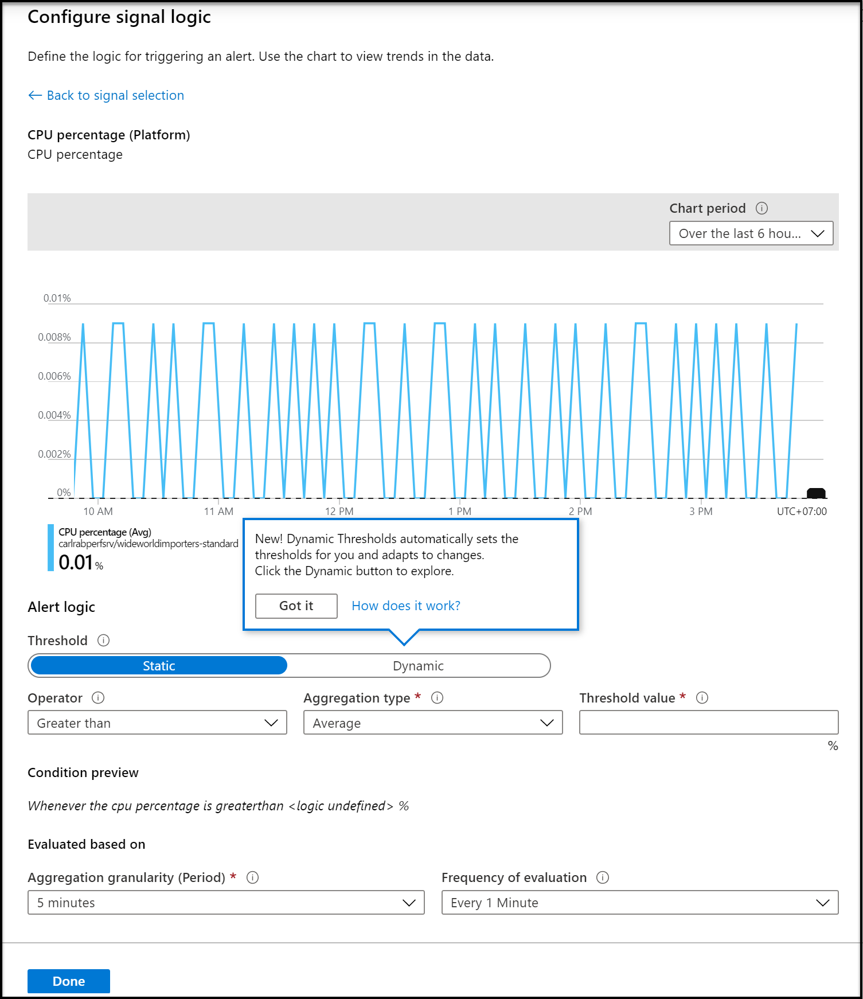

# Create alerts for Azure SQL Managed Instance using the Azure portal

## Overview

This article shows you how to set up alerts for databases in Azure SQL Managed Instance Database using the Azure portal. Alerts can send you an email, call a web hook, execute Azure Function, call an external ITSM compatible ticketing system, call you on the phone or send a text message when when some metric (for example instance storage size or CPU usage) reaches a predefined threshold. This article also provides best practices for setting alert periods.

You can receive an alert based on monitoring metrics for, or events on, your Azure services.

* **Metric values** - The alert triggers when the value of a specified metric crosses a threshold you assign in either direction. That is, it triggers both when the condition is first met and then afterwards when that condition is no longer being met.

You can configure an alert to do the following when it triggers:

* Send email notifications to the service administrator and co-administrators
* Send email to additional emails that you specify.
* Call a phone number with voice prompt
* Send text message to a phone number
* Call a webhook
* Call Azure Function
* Call an external ticketing ITSM compatible system

> [!NOTE]
> Please note that metrics alerting is available for the entire managed instance resource. Metrics for individual databases are not availble.

The following metrics you can alert on are available for SQL managed instance:

| metric | description |
| Average CPU percentage | Average percentage (0-100%) of CPU utilization in selected time period. |
| IO bytes read | IO bytes read in the selected time period. |
| IO bytes written | IO bytes written in the selected time period. |
| IO requests count | Count of IO requests in the selected time period. |
| Storage space reserved | Current max. storage space reserved for the managed instance. Changes with resource scaling operation. |
| Storage space used | Storage space used in the selected period. Changes with storage consumption by databases and the instance. |
| Virtual core count | vCores provisioned for the managed instance. Changes with resource scaling operation. |

You can configure and get information about alert rules using the following interfaces:

* [Azure portal](../monitoring-and-diagnostics/insights-alerts-portal.md)
* [PowerShell](../azure-monitor/platform/alerts-classic-portal.md)
* [command-line interface (CLI)](../azure-monitor/platform/alerts-classic-portal.md)
* [Azure Monitor REST API](https://msdn.microsoft.com/library/azure/dn931945.aspx)

## Create an alert rule on a metric with the Azure portal

1. In the [portal](https://portal.azure.com/), locate SQL managed instance resource you are interested in monitoring and select it.

2. Select **Metrics** in the Monitoring section. The text and icon may vary slightly for different resources.  

   
  
3. Select the **metrics** from one of the available you wish to alert on (in the screenshot example of Storage space used is shown).

4. Select aggregation period - average, minimum or maximum reached in the given time period (Avg, Min or Max). 

5. Select **New alert rule**

6. In the **Condition** section, select **Add**.
   
   
7. In the **Configure signal logic** page, select a signal.
   
6. After selecting a signal, such as **CPU percentage**, the **Configure signal logic** page appears.
   
7. On this page, configure that threshold type, operator, aggregation type, threshold value, aggregation granularity, and frequency of evaluation. Then click **Done**.
8. On the **Create rule**, select an existing **Action group** or create a new group. An action group enables you to define the action to be taken when an alert condition occurs.
  

9. Define a name for the rule, provide an optional description, choose a severity level for the rule, choose whether to enable the rule upon rule creation, and then click **Create rule alert** to create the metric rule alert.

Within 10 minutes, the alert is active and triggers as previously described.

## Next steps

* Learn more about [configuring webhooks in alerts](../azure-monitor/platform/alerts-webhooks.md).
