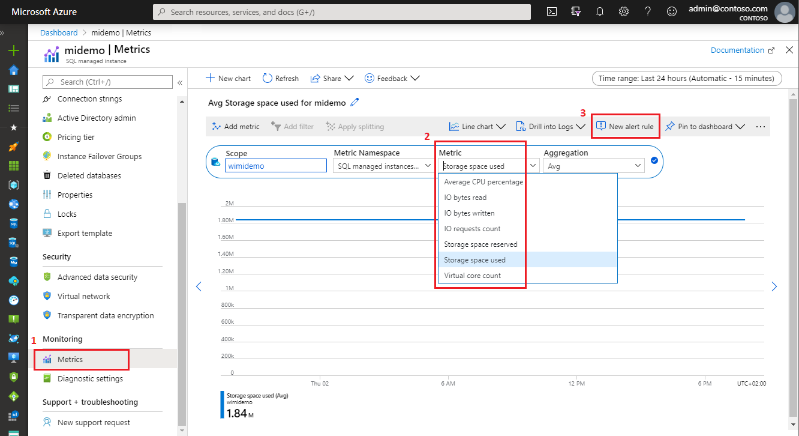
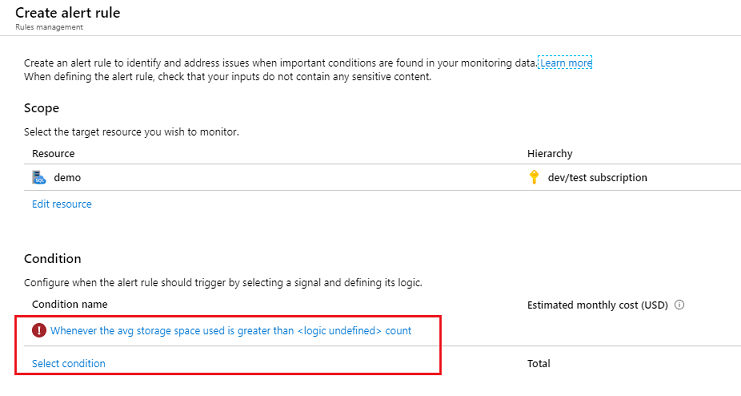
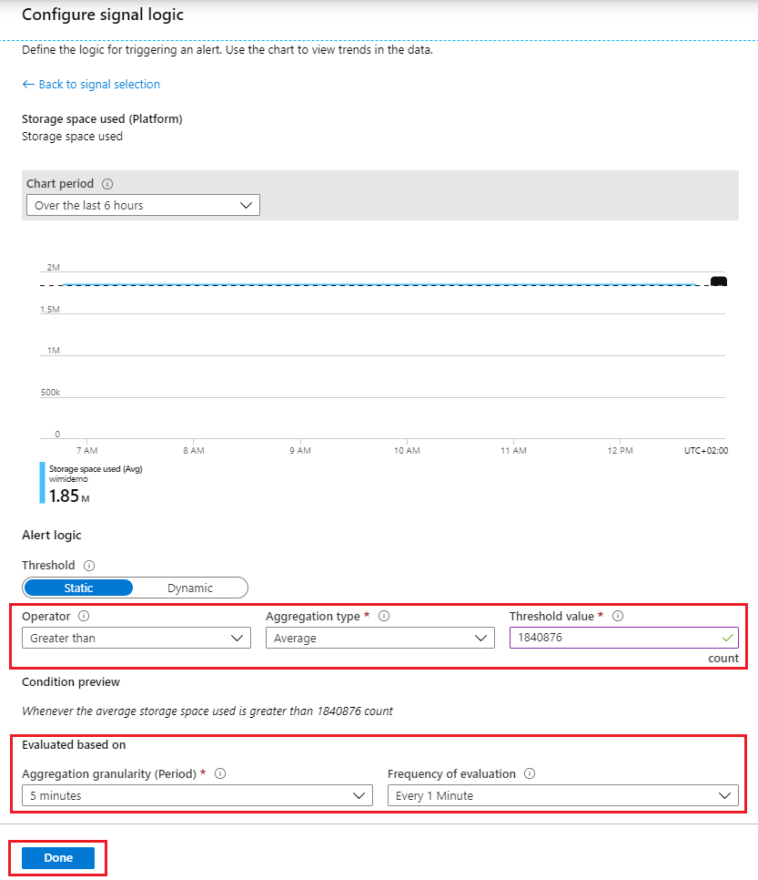
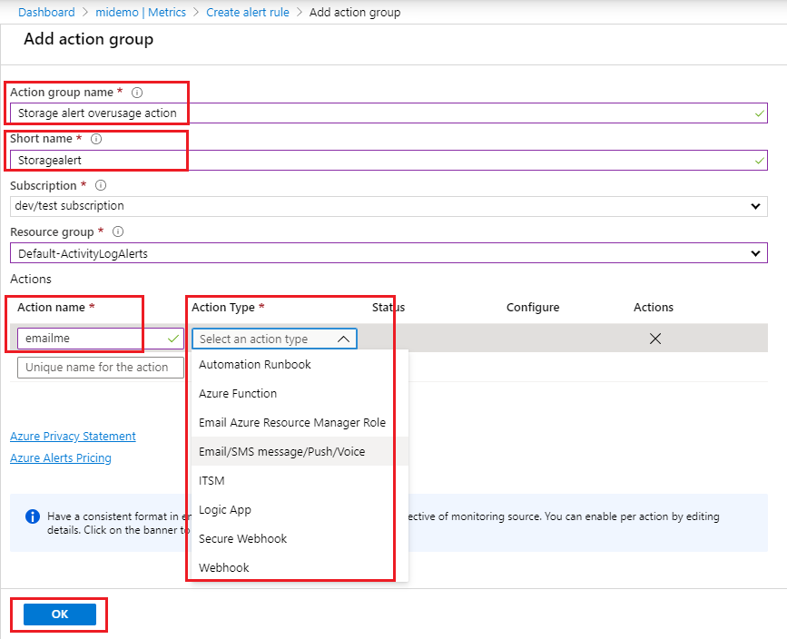
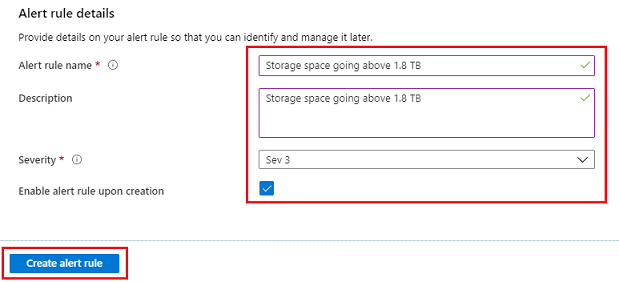
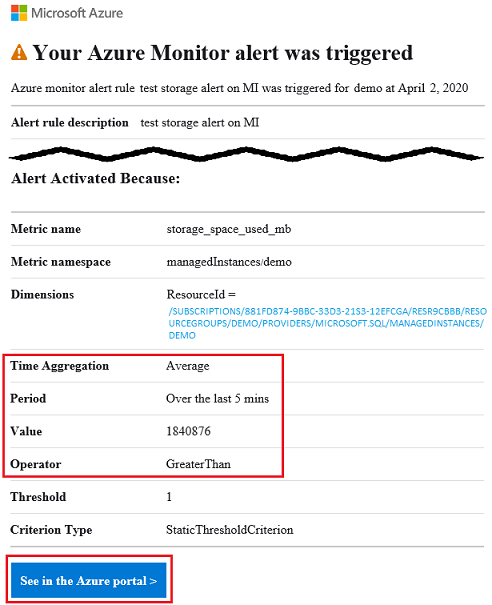
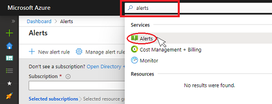
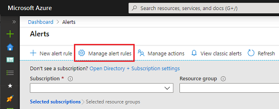

# Create alerts for Azure SQL Managed Instance using the Azure portal

## Overview

This article shows you how to set up alerts for databases in Azure SQL Managed Instance Database using the Azure portal. Alerts can send you an email, call a web hook, execute Azure Function, runbook, call an external ITSM compatible ticketing system, call you on the phone or send a text message when some metric, such is for example instance storage size, or CPU usage, reaches a predefined threshold. This article also provides best practices for setting alert periods.

You can receive an alert based on monitoring metrics for, or events on, your Azure services.

* **Metric values** - The alert triggers when the value of a specified metric crosses a threshold you assign in either direction. That is, it triggers both when the condition is first met and then afterwards when that condition is no longer being met.

You can configure an alert to do the following when it triggers:

* Send email notifications to the service administrator and coadministrators
* Send email to additional emails that you specify.
* Call a phone number with voice prompt
* Send text message to a phone number
* Call a webhook
* Call Azure Function
* Call Azure runbook
* Call an external ticketing ITSM compatible system

You can configure and get information about alert rules using the following interfaces:

* [Azure portal](../monitoring-and-diagnostics/insights-alerts-portal.md)
* [PowerShell](../azure-monitor/platform/alerts-classic-portal.md)
* [Command-Line Interface (CLI)](../azure-monitor/platform/alerts-classic-portal.md)
* [Azure Monitor REST API](https://msdn.microsoft.com/library/azure/dn931945.aspx)

## Alerting metrics available for managed instance

> [!IMPORTANT]
> Alerting metrics are available for managed instance only. Alerting metrics for individual databases in managed instance are not available. 
> Database diagnostics telemetry is on the other hand available in the form of [diagnostics logs](sql-database-metrics-diag-logging.md#diagnostic-telemetry-for-export-for-azure-sql-database). Alerts on diagnostics logs can be setup from within [SQL Analytics solution](../azure-monitor/insights/azure-sql.md) product using [log alert scripts](../azure-monitor/insights/azure-sql.md#creating-alerts-for-managed-instances) for managed instance.

The following managed instance metrics are available for alerting configuration:

| Metric | Description | Unit of measure \ possible values |
| :--------- | --------------------- | ----------- |
| Average CPU percentage | Average percentage of CPU utilization in selected time period. | 0-100 (percent) |
| IO bytes read | IO bytes read in the selected time period. | Bytes |
| IO bytes written | IO bytes written in the selected time period. | Bytes |
| IO requests count | Count of IO requests in the selected time period. | Numerical |
| Storage space reserved | Current max. storage space reserved for the managed instance. Changes with resource scaling operation. | MB (Megabytes) |
| Storage space used | Storage space used in the selected period. Changes with storage consumption by databases and the instance. | MB (Megabytes) |
| Virtual core count | vCores provisioned for the managed instance. Changes with resource scaling operation. | 4-80 (vCores) |

## Create an alert rule on a metric with the Azure portal

1. In Azure [portal](https://portal.azure.com/), locate SQL managed instance you are interested in monitoring, and select it.

2. Select **Metrics** menu item in the Monitoring section.

   
  
3. On the drop-down menu, select one of the metrics you wish to set up your alert on (Storage space used is shown in the example).

4. Select aggregation period - average, minimum, or maximum reached in the given time period (Avg, Min, or Max). 

5. Select **New alert rule**

6. In the Create alert rule pane click on **Condition name** (Storage space used is shown in the example)

   

7. On the Configure signal logic pane, define Operator, Aggregation type, and Threshold value

   * Operator type options are greater than, equal and less than (the threshold value)
   * Aggregation type options are min, max or average (in the aggregation granularity period)
   * Threshold value is the alert value which will be evaluated based on the operator and aggregation criteria
   
   
   
   In the example shown in the screenshot, value of 1840876 MB is used representing a threshold value of 1.8 TB. As the operator in the example is set to greater than, the alert will be created if the storage space consumption on the managed instance goes over 1.8 TB. Note that the threshold value for storage space metrics must be expressed in MB.

8. Set the evaluation period - aggregation granularity in minutes and frequency of evaluation. The frequency of evaluation will denote time the alerting system will periodically check if the threshold condition has been met.

9. Select action group. Action group pane will show up through which you will be able to select an existing, or create a new action. This action defines that will happen upon triggering an alert (for example, sending email, calling you on the phone, executing a webhook, Azure function, or a runbook, for example).

   

   * To create new action group, select **+Create action group**

      
   
   * Define how do you want to be alerted: Enter action group name, short name, action name and select Action Type. The Action Type defines if you will be notified via email, text message, voice call, or if perhaps webhook, Azure function, runbook will be executed, or ITSM ticket will be created in your compatible system.

      

10. Fill in the alert rule details for your records, select the severity type.

      

   * Complete creating the alert rule by clicking on **Create alert rule** button.

New alert rule will become active within a few minutes and will be triggered based on your settings.

## Verifying alerts

> [!NOTE]
> To supress noisy alerts, see [Supression of alerts using action rules](../azure-monitor/platform/alerts-action-rules.md#suppression-of-alerts).

Upon setting up an alerting rule, verify that you are satisfied with the alerting trigger and its frequency. For the example shown on this page for setting up an alert on storage space used, if your alerting option was email, you might receive email such is the one shown below.

   

The email shows the alert name, details of the threshold and why the alert was triggered helping you to verify and troubleshoot your alert. You can use **See in Azure portal** button to view alert received via email in Azure portal. 

## View, suspend, activate, modify and delete existing alert rules

> [!NOTE]
> Existing alerts need to be managed from Alerts menu from Azure portal dashboard. Existing alerts cannot be modified from Managed Instance resource blade.

To view, suspend, activate, modify and delete existing alerts:

1. Search for Alerts using Azure portal search. Click on Alerts.

   

   Alternatively, you could also click on Alerts on the Azure navigation bar, if you have it configured.

2. On the Alerts pane, select Manage alert rules.

   

   List of existing alerts will show up. Select an individual existing alert rule to manage it. Existing active rules can be modified and tuned to your preference. Active rules can also be suspended without being deleted. 

## Next steps

* Learn about Azure Monitor alerting system, see [Overview of alerts in Microsoft Azure](../azure-monitor/platform/alerts-overview.md)
* Learn more about metric alerts, see [Understand how metric alerts work in Azure Monitor](../azure-monitor/platform/alerts-metric-overview.md)
* Learn about configuring a webhook in alerts, see [Call a webhook with a classic metric alert](../azure-monitor/platform/alerts-webhooks.md)
* Learn about configuring and managing alerts using PowerShell, see [Action rules](https://docs.microsoft.com/powershell/module/az.monitor/add-azmetricalertrulev2)
* Learn about configuring and managing alerts using API, see [Azure Monitor REST API reference](https://docs.microsoft.com/rest/api/monitor/) 
