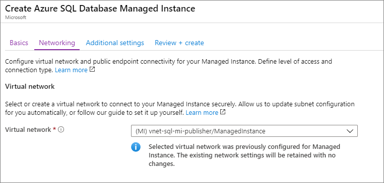
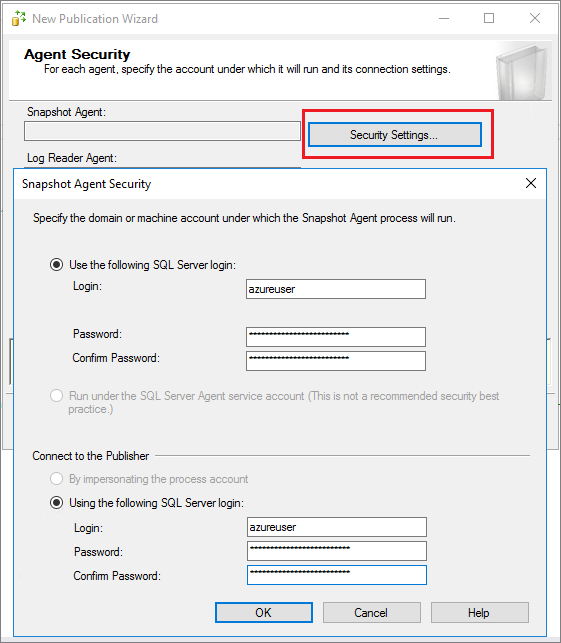

# Tutorial: Configure transactional replication between two managed instances and SQL Server


In this tutorial, you learn how to:

> [!div class="checklist"]
> - Configure a Managed Instance as a replication Publisher. 
> - Configure a Managed Instance as a replication Distributor. 
> - Configure a SQL Server as a subscriber. 

This tutorial is intended for an experienced audience and assumes that the user is familiar with deploying and connecting to both managed instances, and SQL Server VMs within Azure. As such, certain steps in this tutorial are glossed over. 

To learn more, see the [Azure SQL Database managed instance overview](sql-database-managed-instance-index.yml), [capabilities](sql-database-managed-instance.md), and [SQL Transactional Replication](sql-database-managed-instance-transactional-replication.md) articles.

## Prerequisites

To complete the tutorial, make sure you have the following prerequisites:

- An [Azure subscription](https://azure.microsoft.com/en-us/free/). 
- Experience with deploying two managed instances within the same virtual network, and a SQL Server VM in Azure. 
- The latest version of [Azure Powershell](/powershell/azure/install-az-ps?view=azps-1.7.0).
- An [Azure File share](../storage/files/storage-how-to-create-file-share.md). The name `replshare` is used in this tutorial. 

## 1 - Create the resource group
Use the following PowerShell code snippet to create a new resource group:

```powershell
# set variables
$ResourceGroupName = "SQLMI-Repl"
$Location = "East US 2"

# Create a new resource group
New-AzResourceGroup -Name  $ResourceGroupName -Location $Location
```

## 2 - Create two managed instances
Create two managed instances within this new resource group using the [Azure portal](https://portal.azure.com). 

- The name of the publisher managed instance should be: `sql-mi-publisher` (along with a few characters for randomization) and the name of the virtual network should be `vnet-sql-mi-publisher`.
- The name of the distributor managed instance should be: `sql-mi-distributor` (along with a few characters for randomization) and it should be _in the same virtual network as the publisher managed instance_.

   

For more information about creating a managed instance, see [Create a managed instance in the portal](sql-database-managed-instance-get-started.md)

  > [!NOTE]
  > For the sake of simplicity, and because it is the most common configuration, this tutorial suggests placing the distributor managed instance within the same virtual network as the publisher. However, it's possible to create the distributor in a separate virtual network. To do so, you will need to configure VPN peering between the virtual networks of the publisher and distributor, and then configure VPN peering between the virtual networks of the distributor and subscriber. 

## 3 - Create a SQL Server VM
Create a SQL Server virtual machine using the [Azure portal](https://portal.azure.com). The SQL Server virtual machine should have the following characteristics:

- Name: `sql-vm-sub`
- Image: SQL Server 2016 or greater
- Resource group: the same as the managed instance
- Location: the same as the managed instance
- Virtual network: `sql-vm-sub-vnet` 

For more information about deploying a SQL Server VM to Azure, see [Quickstart: Create SQL Server VM](../virtual-machines/windows/sql/quickstart-sql-vm-create-portal.md)

## 4 - Configure VPN peering
Configure VPN peering to enable communication between the virtual network of the two managed instances, and the virtual network of the SQL Server VM. To do so, use the following PowerShell code snippet:

```powershell-interactive
# Set variables
$SubscriptionId = '<SubscriptionID>'
$resourceGroup = 'SQLMI-Repl'
$pubvNet = 'vnet-sql-mi-publisher'
$subvNet = 'sql-vm-sub-vnet'
$pubsubName = 'Pub-to-Sub-Peering'
$subpubName = 'Sub-to-Pub-Peering'

$virtualNetwork1 = Get-AzVirtualNetwork `
  -ResourceGroupName $resourceGroup `
  -Name $pubvNet 

 $virtualNetwork2 = Get-AzVirtualNetwork `
  -ResourceGroupName $resourceGroup `
  -Name $subvNet  

# Configure VPN peering from publisher to subscriber
Add-AzVirtualNetworkPeering `
  -Name $pubsubName `
  -VirtualNetwork $virtualNetwork1 `
  -RemoteVirtualNetworkId $virtualNetwork2.Id

# Configure VPN peering from subscriber to publisher
Add-AzVirtualNetworkPeering `
  -Name $subpubName `
  -VirtualNetwork $virtualNetwork2 `
  -RemoteVirtualNetworkId $virtualNetwork1.Id

# Check status of peering on the publisher vNet; should say connected
Get-AzVirtualNetworkPeering `
 -ResourceGroupName $resourceGroup `
 -VirtualNetworkName $pubvNet `
 | Select PeeringState

# Check status of peering on the subscriber vNet; should say connected
Get-AzVirtualNetworkPeering `
 -ResourceGroupName $resourceGroup `
 -VirtualNetworkName $subvNet `
 | Select PeeringState

```

Once VPN peering is established, test connectivity by launching SQL Server Management Studio (SSMS) on your SQL Server VM and connecting to both managed instances. For more information on connecting to a managed instance using SSMS, see [Use SSMS to connect to the MI](sql-database-managed-instance-configure-p2s#use-ssms-to-connect-to-the-managed-instance). 


## 7 - Create a database
Create a new database on the publisher MI. To do so, do the following:

1. Launch SQL Server Management Studio (SSMS) on your SQL Server VM. 
1. Connect to the `sql-mi-publisher` managed instance. 
1. Open a **New Query** window and execute the following T-SQL query to create the database:

```sql
-- Create the databases
USE [master]
GO

-- Drop database if it exists
IF EXISTS (SELECT *FROM sys.sysdatabases WHERE name = 'ReplTutorial')
BEGIN
    DROP DATABASE ReplTutorial
END
GO

-- Create new database
CREATE DATABASE [ReplTutorial]
GO


-- Create table
USE [ReplTutorial]
GO
CREATE TABLE ReplTest (
	ID INT NOT NULL PRIMARY KEY,
	c1 VARCHAR(100) NOT NULL,
	dt1 DATETIME NOT NULL DEFAULT getdate()
)
GO

-- Populate table with data
USE [ReplTutorial]
GO

INSERT INTO ReplTest (ID, c1) VALUES (6, 'pub')
INSERT INTO ReplTest (ID, c1) VALUES (2, 'pub')
INSERT INTO ReplTest (ID, c1) VALUES (3, 'pub')
INSERT INTO ReplTest (ID, c1) VALUES (4, 'pub')
INSERT INTO ReplTest (ID, c1) VALUES (5, 'pub')
GO
SELECT * FROM ReplTest
GO
```

## 6 - Configure distribution 
Once connectivity is established and you have a sample database, you can configure distribution on your `sql-mi-distributor` managed instance. To do so, follow these steps:

1. Launch SQL Server Management Studio (SSMS) on your SQL Server VM. 
1. Connect to the `sql-mi-distributor` managed instance. 
1. Open a **New Query** window and run the following Transact-SQL code to configure distribution on the distribution managed instance: 

    ```sql
    Use MASTER
    EXEC sys.sp_adddistributor @distributor=@@SERVERNAME, @password = '<distributor_admin_password>'; 
    EXEC sys.sp_adddistributiondb @database = 'distribution';
    ```

1. Run the following Transact-SQL code to register the publisher at the distributor. :

```sql
```

1. Connect to the `sql-mi-publisher` managed instance. 
1. Open a **New Query** window and run the following Transact-SQL code to register the distributor at the publisher: 

```sql
Use MASTER
EXEC sys.sp_adddistributor @distributor = 'sql-mi-distributor.b6bf57.database.windows.net', @password = '<distributor_admin_password>' 
```


## 7 - Create the publication
Once distribution has been configured, you can now create the publisher. To do so, follow these steps: 

1. Launch SQL Server Management Studio (SSMS) on your SQL Server VM. 
1. Connect to the `sql-mi-publisher` managed instance. 


1. In **Object Explorer**, expand the **Replication** node and right-click the **Local Publication** folder. Select **New Publication...**. 
1. Select **Next** to move past the welcome page. 
1. On the **Distributor** page, select the option to **Use the following server as the Distributor**. Select **Add...**. Connect to your distributor instance, `sql-mi-distributor`. Select **Next**. 

   

1. On the **Administrative Password** page, supply the password that you manually configured when you configured distribution (on the **Distributor password** page). Select **Next**. 
1. On the **Publication Database** page, select the `ReplTutorial` database you created previously. Select **Next**. 
1. On the **Publication type** page, select **Transactional publication**. Select **Next**. 
1. On the **Articles** page, check the box next to **Tables**. Select **Next**. 
1. On the **Filter Table Rows** page, select **Next** without adding any filters. 
1. On the **Snapshot Agent** page, check the box next to **Create snapshot immediately and keep the snapshot available to initialize subscriptions**. Select **Next**. 
1. On the **Agent Security** page, select **Security Settings..**. Choose to **Run under the SQL Server Agent service account** and **Use the following SQL Server login**. Provide credentials to connect to the Publisher. Select **OK** to close the **Snapshot Agent Security** page. Select **Next**. 

   

1. On the **Wizard Actions** page, choose to **Create the publication** and (optionally) choose to **Generate a script file with steps to create the publication** if you want to save this script for later. 
1. On the **Complete the Wizard** page, name your publication `ReplTest` and select **Next** to create your publication. 
1. Once your publication has been created, refresh the **Replication** node in **Object explorer** to see your new publication. 
1. Select **Next** to move past the Welcome page
1. 

## 8 - Create the subscription 

Once the publication has been created, you can create the subscription. To do so, follow these steps: 

1. Launch SQL Server Management Studio (SSMS) on your SQL Server VM. 
1. Connect to the `sql-mi-publisher` managed instance. 
1. In **Object Explorer**, expand the **Replication** node, and then expand the **Local PUblications** node. 
1. Right-click on your publication `ReplTest` and select **New Subscriptions...**. 
1. 


1. Launch SQL Server Management Studio (SSMS) on your SQL Server VM. 
1. Connect to your subscriber VM `sql-vm-sub`. 


## Clean up resources

```powershell
# Set the variables
$ResourceGroupName = "SQLMI-Repl"

# Remove the resource2 group
Remove-AzResourceGroup -Name $ResourceGroupName

```

## Next steps

### Enable security features

See the following [managed instance capabilities security features](sql-database-managed-instance.md#azure-sql-database-security-features) article for a comprehensive list of ways to secure your database. The following security features are discussed:

- [Managed instance auditing](sql-database-managed-instance-auditing.md) 
- [Always encrypted](/sql/relational-databases/security/encryption/always-encrypted-database-engine)
- [Threat detection](sql-database-managed-instance-threat-detection.md) 
- [Dynamic data masking](/sql/relational-databases/security/dynamic-data-masking)
- [Row-level security](/sql/relational-databases/security/row-level-security) 
- [Transparent data encryption (TDE)](https://docs.microsoft.com/sql/relational-databases/security/encryption/transparent-data-encryption-azure-sql)

### Managed instance capabilities

For a complete overview of a managed instance capabilities, see:

> [!div class="nextstepaction"]
> [Managed instance capabilities](sql-database-managed-instance.md)
