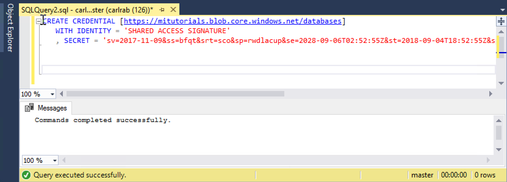

# Quickstart: Restore a database backup to an Azure SQL Database Managed Instance

In this quickstart, you'll use SQL Server Management Studio (SSMS) to restore a database (the Wide World Importers - Standard backup file) from Azure blob storage into an Azure SQL Database [Managed Instance](https://docs.microsoft.com/azure/sql-database/sql-database-managed-instance). 

 [!VIDEO https://www.youtube.com/embed/RxWYojo_Y3Q]

[!NOTE]
* For more information on migrating using the Azure Database Migration Service (DMS), see [Managed Instance migration using DMS](../dms/tutorial-sql-server-to-managed-instance.md). 
* For more information on various migration methods, see [SQL Server instance migration to Azure SQL Database Managed Instance](sql-database-managed-instance-migrate.md).

## Prerequisites

This quickstart:
- Uses resources from the [Create a Managed Instance](sql-database-managed-instance-get-started.md) quickstart.
- Requires your computer have the latest [SQL Server Management Studio](https://docs.microsoft.com/sql/ssms/sql-server-management-studio-ssms) installed.
- Requires using SSMS to connect to your Managed Instance. See these quickstarts on how to connect:
  * [Connect to an Azure SQL Database Managed Instance from an Azure VM](sql-database-managed-instance-configure-vm.md)
  * [Connect to an Azure SQL Database Managed Instance from on-premises using a Point-to-Site connection](sql-database-managed-instance-configure-p2s.md).


> [!NOTE]
> For more information about backing up and restoring a SQL Server database using Azure blob storage and a [Shared Access Signature (SAS) key](https://docs.microsoft.com/azure/storage/common/storage-dotnet-shared-access-signature-part-1), see [SQL Server Backup to URL](sql-database-managed-instance-get-started-restore.md).

## Restore database from a backup file

In SSMS, follow these steps to restore the Wide World Importers database to your Managed Instance. The database backup file is stored in a pre-configured Azure blob storage account.

1. Open SMSS and connect to your Managed Instance.

2. From the left-hand menu, right-click your Managed Instance and select **New Query** to open a new query window.

3. Run this SQL script that uses a pre-configured storage account and SAS key to [create a credential](https://docs.microsoft.com/sql/t-sql/statements/create-credential-transact-sql?view=sql-server-2017) in your Managed Instance.

   ```sql
   CREATE CREDENTIAL [https://mitutorials.blob.core.windows.net/databases] 
   WITH IDENTITY = 'SHARED ACCESS SIGNATURE'
   , SECRET = 'sv=2017-11-09&ss=bfqt&srt=sco&sp=rwdlacup&se=2028-09-06T02:52:55Z&st=2018-09-04T18:52:55Z&spr=https&sig=WOTiM%2FS4GVF%2FEEs9DGQR9Im0W%2BwndxW2CQ7%2B5fHd7Is%3D' 
   ```

    

  
3. Run this script that uses a [container](https://azure.microsoft.com/services/container-instances/) URL to get a backup file list.

   ```sql
   RESTORE FILELISTONLY FROM URL = 
      'https://mitutorials.blob.core.windows.net/databases/WideWorldImporters-Standard.bak'
   ```

    

4. Run this script to restore the Wide World Importers database.

   ```sql
   RESTORE DATABASE [Wide World Importers] FROM URL =
     'https://mitutorials.blob.core.windows.net/databases/WideWorldImporters-Standard.bak'
   ```

    

5. Run this script to track your restore's status.

   ```sql
   SELECT session_id as SPID, command, a.text AS Query, start_time, percent_complete
      , dateadd(second,estimated_completion_time/1000, getdate()) as estimated_completion_time 
   FROM sys.dm_exec_requests r 
   CROSS APPLY sys.dm_exec_sql_text(r.sql_handle) a 
   WHERE r.command in ('BACKUP DATABASE','RESTORE DATABASE')
   ```

6. When the restore completes, view it in Object Explorer. 

## Next steps

- For troubleshooting backup to URL, see [SQL Server Backup to URL Best Practices and Troubleshooting](https://docs.microsoft.com/sql/relational-databases/backup-restore/sql-server-backup-to-url-best-practices-and-troubleshooting).
- For an overview of app connection options, see [Connect your applications to Managed Instance](sql-database-managed-instance-connect-app.md).
- To query using your favorite tools or languages, see [connect and query](sql-database-connect-query.md).
