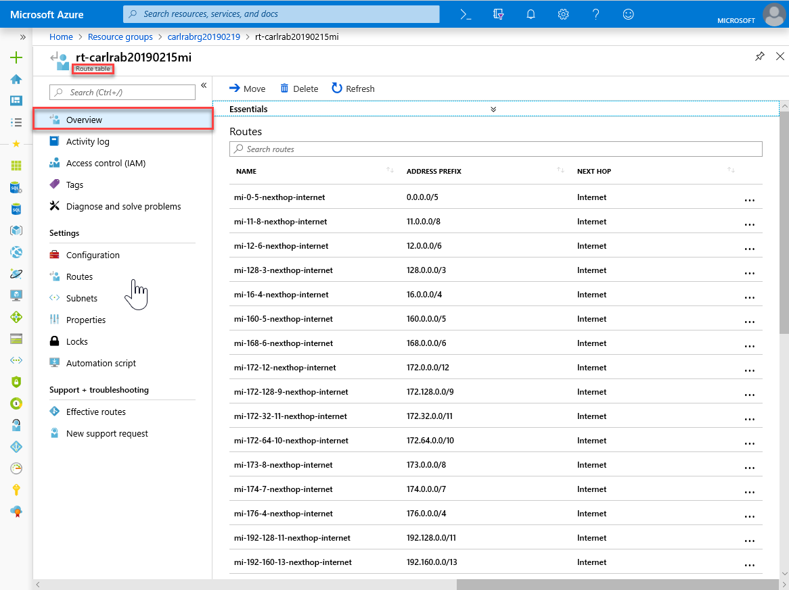
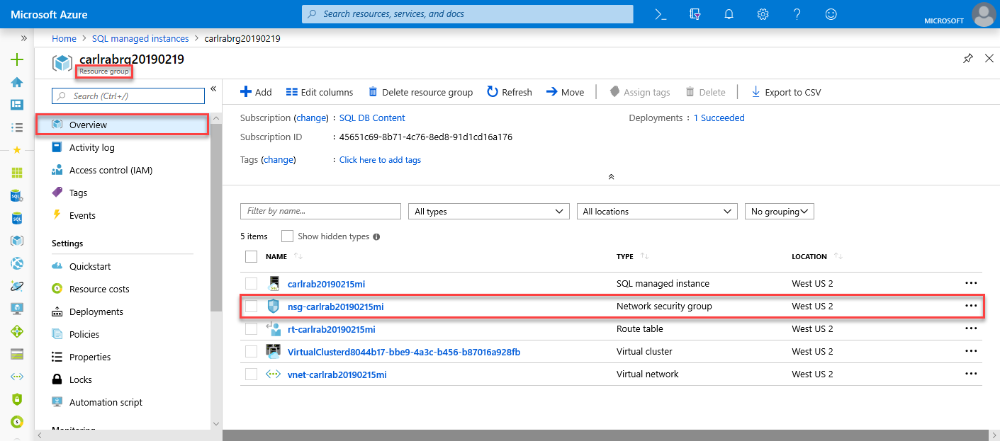

# Quickstart: Create an Azure SQL Database managed instance

This quickstart walks you through how to create an Azure SQL Database [managed instance](sql-database-managed-instance.md) in the Azure portal.

> [!IMPORTANT]
> For limitations, see [Supported regions](sql-database-managed-instance-resource-limits.md#supported-regions) and [Supported subscription types](sql-database-managed-instance-resource-limits.md#supported-subscription-types).

## Sign in to the Azure portal

If you don't have an Azure subscription, [create a free account](https://azure.microsoft.com/free/).

Sign in to the [Azure portal](https://portal.azure.com/).

## Create a managed instance

The following steps show you how to create a managed instance.

1. Select **Azure SQL** in the left-hand menu of the Azure portal. If Azure SQL is not in the list, select **All services**, then type *Azure SQL* in the search box.
2. Select **+Add** to open the **Select SQL deployment option** page. You can view additional information about Azure SQL Database managed instance by selecting **Show details** on the **Managed instances** tile.
3. Select **Create**:

   

4. Fill out the **Create SQL Database Managed Instance** provisioning form by filling out information required at the Basic tab. Use Networking, and Advanced settings to configure additional settings.

### Basic tab

5. Fill out mandatory information required at Basic tab using the table below. This is a minimum set of information to provision a managed instance.

   

   | Setting| Suggested value | Description |
   | ------ | --------------- | ----------- |
   | **Subscription** | Your subscription. | A subscription that gives you permission to create new resources. |
   | **Resource group** | A new or existing resource group.|For valid resource group names, see [Naming rules and restrictions](https://docs.microsoft.com/azure/architecture/best-practices/naming-conventions).|
   | **Managed instance name** | Any valid name.|For valid names, see [Naming rules and restrictions](https://docs.microsoft.com/azure/architecture/best-practices/naming-conventions).|
   | **Region** |The region in which you want to create the managed instance.|For information about regions, see [Azure regions](https://azure.microsoft.com/regions/).|
| **Managed instance admin login** | Any valid username. | For valid names, see [Naming rules and restrictions](https://docs.microsoft.com/azure/architecture/best-practices/naming-conventions). Don't use "serveradmin" because that's a reserved server-level role.|
   | **Password** | Any valid password.| The password must be at least 16 characters long and meet the [defined complexity requirements](../virtual-machines/windows/faq.md#what-are-the-password-requirements-when-creating-a-vm).|

- Select **Configure Managed Instance** to size compute and storage resources and to review the pricing tier options.
- Use the sliders or text boxes to specify the amount of storage and the number of virtual cores.
- When you're finished, select **Apply** to save your selection. 

   

   You can click on **Review + create** to review selected options before creating managed instance, or you can custom configure networking by clicking on **Next : Networking**.

 ### Networking tab

6. Fill out optional information at Networking tab using the table below. In case this information is omitted, default settings will be applied.

   

   | Setting| Suggested value | Description |
   | ------ | --------------- | ----------- |
   | **Virtual network** | Select either **Create new virtual network** or a valid virtual network and subnet.| If a network or subnet is unavailable, it must be [modified to satisfy the network requirements](sql-database-managed-instance-configure-vnet-subnet.md) before you select it as a target for the new managed instance. For information about the requirements for configuring the network environment for a managed instance, see [Configure a virtual network for a managed instance](sql-database-managed-instance-connectivity-architecture.md). |
   | **Connection type** | Choose between a Proxy and a Redirect connection type.|For more information about connection types, see [Azure SQL Database connection policy](sql-database-connectivity-architecture.md#connection-policy).|
   | **Public endpoint**  | Select this option to enable public endpoint | For managed instance to be accessible through the public data endpoint, **Enable** public endpoint needs to be selected. | 
   | **Allow access from** (in case Public endpoint is set to enabled) | Select one of the options: <ul> <li>**Azure services**</li> <li>**Internet**</li> <li>**No access**</li></ul>   |Portal experience enables configuring security group with public endpoint.     Based on your scenario, select one of the following options:   <ul> <li>Azure services - recommended when connecting from Power BI or other multi-tenant service. </li> <li> Internet - use for test purposes when you want to quickly spin up a managed instance. It’s not recommended for use in production environments. </li> <li> No access - this option creates a deny security rule. You’ll need to modify this rule to make managed instance accessible through public endpoint. </li> </ul>   For more information on public endpoint security, see [using Azure SQL Database managed instance securely with public endpoint](sql-database-managed-instance-public-endpoint-securely.md).|

   - You can click on **Review + create** to review selected options before creating managed instance, or you can custom configure additional settings by clicking on **Next : Additional settings**.

### Additional settings tab

7. Fill out optional information at Additional tab using the table below. In case this information is omitted, default settings will be applied.

   

   | Setting| Suggested value | Description |
   | ------ | --------------- | ----------- |
   | **Collation** | The collation that you want to use for your managed instance.|If you migrate databases from SQL Server, check the source collation by using `SELECT SERVERPROPERTY(N'Collation')` and use that value. For information about collations, see [Set or change the server collation](https://docs.microsoft.com/sql/relational-databases/collations/set-or-change-the-server-collation).|   
   | **Time zone** | The time zone to be observed by your managed instance.|For more information, see [Time zones](sql-database-managed-instance-timezone.md).|
   | **Use as failover secondary** | To use the managed instance as an instance failover group secondary, select Yes. |
   | **Primary managed instance** (in case Use as failover secondary is set to Yes) | Chose the primary managed instance (needs to already exists) with whom managed instance you are creating will joined in the same DNS zone. This is a pre-condition step to enable failover group configuration post-creation. For details see [Tutorial: Add a SQL Database managed instance to a failover group](sql-database-managed-instance-failover-group-tutorial.md). |

### Review + create tab

   8. Click on **Review + create** tab to review selected options before creating managed instance.

   

   9. Click on **Create** to start provisioning managed instance.

> [!IMPORTANT]
> Deploying managed instance is a long running operation. Deployment of the first instance in the subnet typically takes much longer than deploying into a subnet with existing managed instances. For average provisioning times, see [Managed instance management operations](sql-database-managed-instance.md#managed-instance-management-operations).

### Monitor deployment progress

10. Select **Notifications** icon to view the status of the deployment.

    

11. Select **Deployment in progress** on the notification to open the managed instance window to further monitor the deployment progress. 

> [!TIP]
> In case that you've closed your web browser or have navigated away from the deployment progress screen, follow these steps to locate the deployment progress screen:
> 1. Open the resource group (entered on the Basic tab) in Azure portal to which you are deploying managed instance
> 2. Select Deployments
> 3. Select managed instance deployment operation in progress

## Review resources and retrieve your fully qualified server name

After the deployment is successful, review the resources that were created and retrieve the fully qualified server name for use in later quickstarts.

1. Open the resource group for your managed instance. View its resources that were created for you in the [create a managed instance](#create-a-managed-instance) quickstart.

   

2. Select the route table to review the user-defined route (UDR) table that was created for you.

   

3. In the route table, review the entries to route traffic from and within the managed instance virtual network. If you create or configure your route table manually, you must be sure to create these entries in the route table.

   

4. Return to the resource group, and select the network security group to review the security rules.

   

5. Review the inbound and outbound security rules. If you have configured public endpoints for your managed instance, see the article [Configure public endpoint](sql-database-managed-instance-public-endpoint-configure.md#allow-public-endpoint-traffic-on-the-network-security-group) for more information.

   

6. Return to the resource group, and select your managed instance.

   

7. On the **Overview** tab, locate the **Host** property. Copy the fully qualified host address for the managed instance for use in the next quickstart.

   

   The name is similar to **your_machine_name.a1b2c3d4e5f6.database.windows.net**.

## Next steps

- To learn about how to connect to a managed instance:
  - For an overview of the connection options for applications, see [Connect your applications to a managed instance](sql-database-managed-instance-connect-app.md).
  - For a quickstart that shows how to connect to a managed instance from an Azure virtual machine, see [Configure an Azure virtual machine connection](sql-database-managed-instance-configure-vm.md).
  - For a quickstart that shows how to connect to a managed instance from an on-premises client computer by using a point-to-site connection, see [Configure a point-to-site connection](sql-database-managed-instance-configure-p2s.md).
- To restore an existing SQL Server database from on-premises to a managed instance: 
    - Use the [Azure Database Migration Service (DMS) for migration](../dms/tutorial-sql-server-to-managed-instance.md) to restore from a database backup file. 
    - Use the [T-SQL RESTORE command](sql-database-managed-instance-get-started-restore.md) to restore from a database backup file.
- For advanced monitoring of managed instance database performance with built-in troubleshooting intelligence, see [Monitor Azure SQL Database by using Azure SQL Analytics](../azure-monitor/insights/azure-sql.md).
