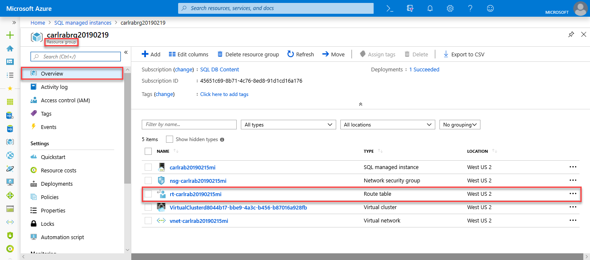
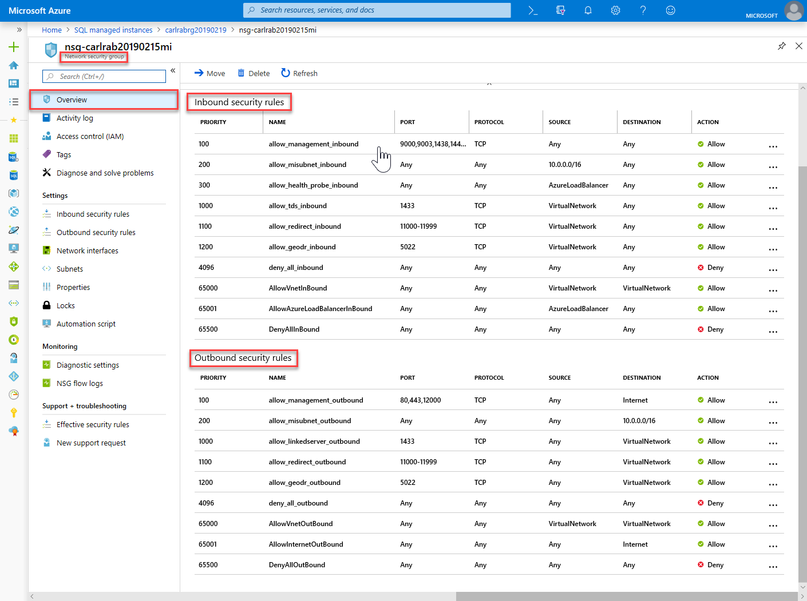

# Quickstart: Create an Azure SQL Managed Instance

This quickstart teaches you to create an [Azure SQL Managed Instance](sql-database-managed-instance.md) in the Azure portal.

> [!IMPORTANT]
> For limitations, see [Supported regions](sql-database-managed-instance-resource-limits.md#supported-regions) and [Supported subscription types](sql-database-managed-instance-resource-limits.md#supported-subscription-types).

## Create SQL Managed Instance

To create an Azure SQL Manged Instance, follow these steps: 

### Sign in to Azure portal

If you don't have an Azure subscription, [create a free account](https://azure.microsoft.com/free/).

1. Sign in to [Azure portal](https://portal.azure.com/).
1. Select **Azure SQL** on the left menu of Azure portal. If **Azure SQL** is not in the list, select **All services**, and then enter **Azure SQL** in the search box.
1. Select **+Add** to open the **Select SQL deployment option** page. You can view additional information about an Azure SQL Managed Instance by selecting **Show details** on the **SQL Managed instance** tile.
1. Select **Create**.

   

4. Use the tabs on the **Create Azure SQL Managed Instance** provisioning form to add required and optional information. The following sections describe these tabs.

### Basics tab

- Fill out mandatory information required on the **Basics** tab. This is a minimum set of information required to provision a SQL Managed Instance.

   

   Use the table below as a reference for information required at this tab.

   | Setting| Suggested value | Description |
   | ------ | --------------- | ----------- |
   | **Subscription** | Your subscription. | A subscription that gives you permission to create new resources. |
   | **Resource group** | A new or existing resource group.|For valid resource group names, see [Naming rules and restrictions](/azure/architecture/best-practices/resource-naming).|
   | **Managed instance name** | Any valid name.|For valid names, see [Naming rules and restrictions](/azure/architecture/best-practices/resource-naming).|
   | **Region** |The region in which you want to create the SQL Managed Instance.|For information about regions, see [Azure regions](https://azure.microsoft.com/regions/).|
   | **Managed instance admin login** | Any valid username. | For valid names, see [Naming rules and restrictions](/azure/architecture/best-practices/resource-naming). Don't use "serveradmin" because that's a reserved server-level role.|
   | **Password** | Any valid password.| The password must be at least 16 characters long and meet the [defined complexity requirements](../virtual-machines/windows/faq.md#what-are-the-password-requirements-when-creating-a-vm).|

- Select **Configure Managed Instance** to size compute and storage resources and to review the pricing tiers. Use the sliders or text boxes to specify the amount of storage and the number of virtual cores. When you're finished, select **Apply** to save your selection. 

   

- To review your choices before you create a SQL Managed Instance, you can select **Review + create**. Or, configure networking options by selecting **Next: Networking**.

### Networking tab

- Fill out optional information on the **Networking** tab. If you omit this information, the portal will apply default settings.

   

   Use the table below as a reference for information required at this tab.

   | Setting| Suggested value | Description |
   | ------ | --------------- | ----------- |
   | **Virtual network** | Select either **Create new virtual network** or a valid virtual network and subnet.| If a network or subnet is unavailable, it must be [modified to satisfy the network requirements](sql-database-managed-instance-configure-vnet-subnet.md) before you select it as a target for the new SQL Managed Instance. For information about the requirements for configuring the network environment for a SQL Managed Instance, see [Configure a virtual network for a SQL Managed Instance](sql-database-managed-instance-connectivity-architecture.md). |
   | **Connection type** | Choose between a proxy and a redirect connection type.|For more information about connection types, see [Azure SQL Database connection policy](sql-database-connectivity-architecture.md#connection-policy).|
   | **Public endpoint**  | Select **Enable**. | For a SQL Managed Instance to be accessible through the public data endpoint, you need to enable this option. | 
   | **Allow access from** (if **Public endpoint** is enabled) | Select one of the options.   |The portal experience enables configuring a security group with a public endpoint.     Based on your scenario, select one of the following options:   <ul> <li>**Azure services**: We recommend this option when you're connecting from Power BI or another multitenant service. </li> <li> **Internet**: Use for test purposes when you want to quickly spin up a SQL Managed Instance. We don't recommend it for production environments. </li> <li> **No access**: This option creates a **Deny** security rule. Modify this rule to make a SQL Managed Instance accessible through a public endpoint. </li> </ul>   For more information on public endpoint security, see [Using an Azure SQL Database SQL Managed Instance securely with a public endpoint](sql-database-managed-instance-public-endpoint-securely.md).|

- Select **Review + create** to review your choices before you create a SQL Managed Instance. Or, configure more custom settings by selecting **Next: Additional settings**.

### Additional settings

- Fill out optional information on the **Additional settings** tab. If you omit this information, the portal will apply default settings.

   

   Use the table below as a reference for information required at this tab.

   | Setting| Suggested value | Description |
   | ------ | --------------- | ----------- |
   | **Collation** | Choose the collation that you want to use for your SQL Managed Instance. If you migrate databases from SQL Server, check the source collation by using `SELECT SERVERPROPERTY(N'Collation')` and use that value.| For information about collations, see [Set or change the server collation](https://docs.microsoft.com/sql/relational-databases/collations/set-or-change-the-server-collation).|   
   | **Time zone** | Select the time zone that your SQL Managed Instance will observe.|For more information, see [Time zones](sql-database-managed-instance-timezone.md).|
   | **Use as failover secondary** | Select **Yes**. | Enable this option to use the SQL Managed Instance as a failover group secondary.|
   | **Primary SQL Managed Instance** (if **Use as failover secondary** is set to **Yes**) | Choose an existing primary SQL Managed Instance that will be joined in the same DNS zone with the SQL Managed Instance you're creating. | This step will enable post-creation configuration of the failover group. For more information, see [Tutorial: Add a SQL Database SQL Managed Instance to a failover group](sql-database-managed-instance-failover-group-tutorial.md).|

## Review + create

1. Select **Review + create** tab to review your choices before you create the SQL Managed Instance.

   

1. Select **Create** to start provisioning the SQL Managed Instance.

> [!IMPORTANT]
> Deploying a SQL Managed Instance is a long-running operation. Deployment of the first instance in the subnet typically takes much longer than deploying into a subnet with existing SQL Managed Instances. For average provisioning times, see [SQL Managed Instance management operations](sql-database-managed-instance.md#managed-instance-management-operations).

## Monitor deployment progress

1. Select the **Notifications** icon to view the status of the deployment.

   

1. Select **Deployment in progress** in the notification to open the SQL Managed Instance window and further monitor the deployment progress. 

> [!TIP]
> If you closed your web browser or moved away from the deployment progress screen, follow these steps to locate the deployment progress screen:
> 1. In Azure portal, open the resource group (on the **Basics** tab) to which you're deploying a SQL Managed Instance.
> 2. Select **Deployments**.
> 3. Select the SQL Managed Instance deployment operation in progress.

> [!IMPORTANT]
> In order to be able to get the status of SQL Managed Instance creation, you need to have **read permissions** over the resource group. If you don't have this permission or revoke it while SQL Managed Instance is in creation process, this can cause SQL Managed Instance not to be visible in list of resource group deployments.
>

## View resources created

Upon successful deployment of SQL Managed Instance, to view resources created:

1. Open the resource group for your SQL Managed Instance. 

   

## View and fine-tune network settings

To optionally fine-tune networking settings, inspect the following:

1. Select the route table to review the user-defined route (UDR) that was created for you.

   

2. In the route table, review the entries to route traffic from and within the SQL Managed Instance's virtual network. If you create or configure your route table manually, ensure to create these entries in the SQL Managed Instance route table.

   

3. Return to the resource group, and select the network security group.

   

4. Review the inbound and outbound security rules. 

   

> [!IMPORTANT]
> If you have configured a public endpoint for your SQL Managed Instance, you need to open ports to allow network traffic allowing connections to SQL Managed Instance from the public Internet, see [Configure a public endpoint for SQL Managed Instance](sql-database-managed-instance-public-endpoint-configure.md#allow-public-endpoint-traffic-on-the-network-security-group) for more information.
>

## Retrieve connection details to SQL Managed Instance

To connect to SQL Managed Instance, follow these steps to retrieve host name and fully qualified domain name (FQDN):

1. Return to the resource group and select your SQL Managed Instance.

   

2. On the **Overview** tab, locate the **Host** property. Copy the host name for the SQL Managed Instance for use in the next quickstart.

   

   The value copied represents a fully qualified domain name (FQDN) that can be used to connect to SQL Managed Instance. It is similar to the following address example: *your_host_name.a1b2c3d4e5f6.database.windows.net*.

## Next steps

To learn about how to connect to a SQL Managed Instance:
- For an overview of the connection options for applications, see [Connect your applications to a SQL Managed Instance](sql-database-managed-instance-connect-app.md).
- For a quickstart that shows how to connect to a SQL Managed Instance from an Azure virtual machine, see [Configure an Azure virtual machine connection](sql-database-managed-instance-configure-vm.md).
- For a quickstart that shows how to connect to a SQL Managed Instance from an on-premises client computer by using a point-to-site connection, see [Configure a point-to-site connection](sql-database-managed-instance-configure-p2s.md).

To restore an existing SQL Server database from on-premises to a SQL Managed Instance: 
- Use the [Azure Database Migration Service for migration](../dms/tutorial-sql-server-to-managed-instance.md) to restore from a database backup file. 
- Use the [T-SQL RESTORE command](sql-database-managed-instance-get-started-restore.md) to restore from a database backup file.

For advanced monitoring of SQL Managed Instance database performance with built-in troubleshooting intelligence, see [Monitor Azure SQL Managed Instance by using Azure SQL Analytics](../azure-monitor/insights/azure-sql.md).
