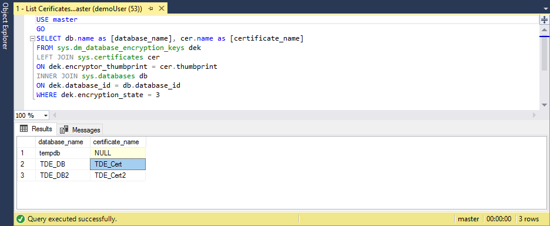
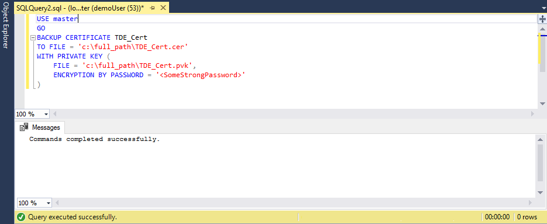

# Migrate certificate of TDE protected database to Azure SQL Database Managed Instance

When migrating a database protected by [Transparent Data Encryption](https://docs.microsoft.com/sql/relational-databases/security/encryption/transparent-data-encryption) to Azure SQL Database Managed Instance using native restore option, the corresponding certificate from the on-premises or IaaS SQL Server needs to be migrated before database restore. This article walks you through the process of manual migration of the certificate to Azure SQL Database Managed Instance:

> [!div class="checklist"]
> * Export certificate to a Personal Information Exchange (.pfx) file
> * Extract certificate from file to base-64 string
> * Upload it using PowerShell cmdlet

For an alternative option using fully managed service for seamless migration of both TDE protected database and corresponding certificate, see [How to migrate your on-premises database to Managed Instance using Azure Database Migration Service](../dms/tutorial-sql-server-to-managed-instance.md).

> [!IMPORTANT]
> Transparent Data Encryption for Azure SQL Database Managed Instance works in service-managed mode. Migrated certificate is used for restore of the TDE protected database only. Soon after restore is done, the migrated certificate gets replaced by a different, system-managed certificate.

## Prerequisites

[!INCLUDE [updated-for-az](../../includes/updated-for-az.md)]

> [!IMPORTANT]
> The PowerShell Azure Resource Manager module is still supported by Azure SQL Database, but all future development is for the Az.Sql module. For these cmdlets, see [AzureRM.Sql](https://docs.microsoft.com/powershell/module/AzureRM.Sql/). The arguments for the commands in the Az module and in the AzureRm modules are substantially identical.

To complete the steps in this article, you need the following prerequisites:

- [Pvk2Pfx](https://docs.microsoft.com/windows-hardware/drivers/devtest/pvk2pfx) command-line tool installed on the on-premises server or other computer with access to the certificate exported as a file. Pvk2Pfx tool is part of the [Enterprise Windows Driver Kit](https://docs.microsoft.com/windows-hardware/drivers/download-the-wdk), a standalone self-contained command-line environment.
- [Windows PowerShell](https://docs.microsoft.com/powershell/scripting/setup/installing-windows-powershell) version 5.0 or higher installed.
- Azure PowerShell module [installed and updated](https://docs.microsoft.com/powershell/azure/install-az-ps).
- [Az.Sql module](https://www.powershellgallery.com/packages/Az.Sql).

Run the following commands in PowerShell to install/update the PowerShell module:

```powershell
Install-Module -Name Az.Sql
Update-Module -Name Az.Sql
```

## Export TDE certificate to a Personal Information Exchange (.pfx) file

The certificate can be exported directly from the source SQL Server, or from the certificate store if being kept there.

### Export certificate from the source SQL Server

Use the following steps to export certificate with SQL Server Management Studio and convert it into pfx format. Generic names *TDE_Cert* and *full_path* are being used for certificate and file names and paths through the steps. They should be replaced with the actual names.

1. In SSMS, open a new query window and connect to the source SQL Server.
2. Use the following script to list TDE protected databases and get the name of the certificate protecting encryption of the database to be migrated:

   ```sql
   USE master
   GO
   SELECT db.name as [database_name], cer.name as [certificate_name]
   FROM sys.dm_database_encryption_keys dek
   LEFT JOIN sys.certificates cer
   ON dek.encryptor_thumbprint = cer.thumbprint
   INNER JOIN sys.databases db
   ON dek.database_id = db.database_id
   WHERE dek.encryption_state = 3
   ```

   

3. Execute the following script to export the certificate to a pair of files (.cer and .pvk), keeping the public and private key information:

   ```sql
   USE master
   GO
   BACKUP CERTIFICATE TDE_Cert
   TO FILE = 'c:\full_path\TDE_Cert.cer'
   WITH PRIVATE KEY (
     FILE = 'c:\full_path\TDE_Cert.pvk',
     ENCRYPTION BY PASSWORD = '<SomeStrongPassword>'
   )
   ```

   

4. Use PowerShell console to copy certificate information from a pair of newly created files to a Personal Information Exchange (.pfx) file, using Pvk2Pfx tool:

   ```cmd
   .\pvk2pfx -pvk c:/full_path/TDE_Cert.pvk  -pi "<SomeStrongPassword>" -spc c:/full_path/TDE_Cert.cer -pfx c:/full_path/TDE_Cert.pfx
   ```

### Export certificate from certificate store

If certificate is kept in SQL Server’s local machine certificate store, it can be exported using the following steps:

1. Open PowerShell console and execute the following command to open Certificates snap-in of Microsoft Management Console:

   ```cmd
   certlm
   ```

2. In the Certificates MMC snap-in expand the path Personal -> Certificates to see the list of certificates

3. Right click certificate and click Export…

4. Follow the wizard to export certificate and private key to a Personal Information Exchange format

## Upload certificate to Azure SQL Database Managed Instance using Azure PowerShell cmdlet

1. Start with preparation steps in PowerShell:

   ```powershell
   # Import the module into the PowerShell session
   Import-Module Az
   # Connect to Azure with an interactive dialog for sign-in
   Connect-AzAccount
   # List subscriptions available and copy id of the subscription target Managed Instance belongs to
   Get-AzSubscription
   # Set subscription for the session (replace Guid_Subscription_Id with actual subscription id)
   Select-AzSubscription Guid_Subscription_Id
   ```

2. Once all preparation steps are done, run the following commands to upload base-64 encoded certificate to the target Managed Instance:

   ```powershell
   $fileContentBytes = Get-Content 'C:/full_path/TDE_Cert.pfx' -Encoding Byte
   $base64EncodedCert = [System.Convert]::ToBase64String($fileContentBytes)
   $securePrivateBlob = $base64EncodedCert  | ConvertTo-SecureString -AsPlainText -Force
   $password = "SomeStrongPassword"
   $securePassword = $password | ConvertTo-SecureString -AsPlainText -Force
   Add-AzSqlManagedInstanceTransparentDataEncryptionCertificate -ResourceGroupName "<resourceGroupName>" `
       -ManagedInstanceName "<managedInstanceName>" -PrivateBlob $securePrivateBlob -Password $securePassword
   ```

The certificate is now available to the specified Managed Instance and backup of corresponding TDE protected database can be restored successfully.

## Next steps

In this article, you learned how to migrate certificate protecting encryption key of database with Transparent Data Encryption, from the on-premises or IaaS SQL Server to Azure SQL Database Managed Instance.

See [Restore a database backup to an Azure SQL Database Managed Instance](sql-database-managed-instance-get-started-restore.md) to learn how to restore a database backup to an Azure SQL Database Managed Instance.
